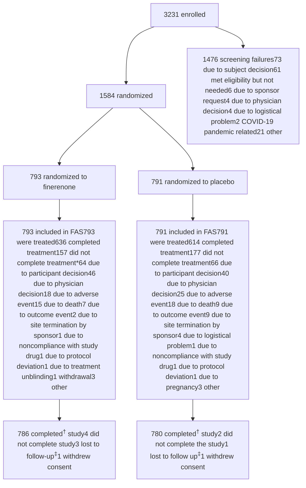

# Supplementary Appendix

Supplement to: Heerspink HJL, Neuen BL, Agarwal R, et al. Finerenone in persons with chronic kidney disease without diabetes. N Engl J Med 2026;395:533-45. DOI: 10.1056/NEJMoa2604625

This appendix has been provided by the authors to give readers additional information about the work.

Finerenone in Chronic Kidney Disease without Diabetes

# Table of Contents

**Investigators by Country and Region** 3

**FIND-CKD Committees** 11
- Steering Committee 11
- Data Monitoring Committee 11
- Collaborators 11

**Supplementary Methods** 13
- Central Laboratory Assessment 13
- Primary Estimand 13
- Alternative Estimand 14
- Main Analytical Approach 14
- Multiple Testing Procedure 15
- Handling of Missing Data 16
- Sensitivity Analyses for the Primary Endpoint 16
- Analysis of eGFR Slopes Using Other eGFR Equations 17

**Supplementary Figures** 19
- Figure S1. CONSORT Diagram 19
- Figure S2. Primary Outcome by Prespecified Subgroups 21
- Figure S3. Annual Change in eGFR Chronic Slope in Prespecified Subgroups 22
- Figure S4. eGFR Slopes Using Different eGFR Equations 23
- Figure S5. Efficacy for Components of the First Composite Secondary Outcome\* 25
- Figure S6. Change from Baseline in uACR 26
- Figure S7. Change from Baseline in Serum Potassium 27
- Figure S8. Change from Baseline in Systolic Blood Pressure 28
- Figure S9. Change from Baseline in Diastolic Blood Pressure 29

**Supplementary Tables** 30
- Table S1. Inclusion and Exclusion Criteria 30
- Table S2. Medications of Interest: Ongoing at Baseline and Concomitant 31
- Table S3. Representativeness of the Trial 32
- Table S4. Alternative Estimand – Shared-Parameter Model – Hypothetical Strategy for Death, Chronic Dialysis, Kidney Transplantation (Full Analysis Set) 34
- Table S5. Number of Participants with Missing eGFR Data During Follow-up 35

<page_number>1</page_number>

Finerenone in Chronic Kidney Disease without Diabetes

Table S6. Impact of Missing eGFR Values Through Imputation with On-treatment Indicators on the Primary Outcome\* (Sensitivity Analysis† in the Full Analysis Set) 36

Table S7. Tipping Point Analysis for the Missing eGFR Values on the Primary Outcome\* (Sensitivity Analysis† in the Full Analysis Set) 37

Table S8. Adverse Events by Primary System Organ Class (Safety Analysis Set) 39

**References** 40

<page_number>

2
</page_number>

Finerenone in Chronic Kidney Disease without Diabetes

# Investigators by Country and Region

**National lead investigator coordinator:** Panteleimon (Pantelis) Sarafidis

**Argentina:** Rafael Maldonado (national lead), Paola Aguerre, Paula Arenas, Mariano Arriola, Claudia Emilce Baccaro, Maria Bevilacqua, Julio Bittar, Dafne Brodschi, Julia Caceres, Gina Campestri, Maria Cecilia Cantero, Santiago Cardona, Florencia Casan, Evelin Cassini, Gustavo Catalano, Mariano Chahin, Natalia Cluigt, Ana Florencia Comes, Pamela Delgado, Maria Paula Dionisi, Silvina Dominguez, Rocio Fernandez, Elizabeth Gelersztein, Sandra Giacometti, Diego Andres Mohr Gosparini, Fernando Pedro Guerlloy, Fernando Halac, Miguel Angel Hominal, Cecilia Igarzabal, Veronica Lacoste, Micaela Leis, Pablo Martinez, Virginia Rama, Lucia Rodriguez, Silvia Rodriguez, Luciana Rovegno, Benjamin Saenz, Maria Victoria Sobredo, Matias Suarez, Patricia Varela, Guido Villalobo, Sernia Virginia, Diego Waserman, Daniela Magali Zaccaro, Javier Zaidman

**Australia:** David Packham (national lead), Sunil Badve, Melissa Cheetham, Jenny Chen, Kathryn Ducharlet, Dov Degen, Yusuf Eqbal, Adam Flavell, Celine Foote, Nicholas Gray, Carmel Hawley, Peter Hollett, Jane Holt, Louis Huang, Nicole Isbel, Dev Jegatheesan, Rathika Krishnasamy, Christina Lai, Cathie Lane, Darren Lee, Kumaradevan Mahadevan, George Mangos, Euan Noble, Eugenia Pedagogos, Mona Razavian, Angus Ritchie, Matthew Roberts, Kate Robson, Shaundeep Sen, Amanda Wang, Jane Waugh, Muh Geot Wong, Lucy Wynter

**Belgium:** Marijn Speeckaert (national lead), Bert Bammens, Kathleen Claes, Marc Decupere, Katrien De Vusser, Bernard Dubois, Peter Doubel, Pieter Evenepoel, Michel Jadoul, Francois Jouret, Laura Labriola, Laura Labriola, Bart Maes, Thomas Malfait, Gert Meeus, Bjorn Meijers, Maarten Naesens, Olivier Schockaert, Wim Van Biesen, Amaryllis Van Craenenbroeck, Elliott Van Regemorter, An Vanacker, Liesbeth Viaene

**Bulgaria:** Svetla Stamova (national lead), Gencho Arabadzhiev, Lachezar Atanasov, Stela Bilcheva, Christo Dimitrov, Irena Dimitrova, Ivan Georgiev, Ivan Gerchev, Lyubomir Hristov, Veselin Hristozov, Stefan Ilchev, Georgi Ivanov, Yordanka Ivanova, Boyka Ivanova-Terzieva, Kostadin Kichukov, Neli Koleva, Georgi Lichev, Ginka Marinova-Racheva, Georgi Mazhdrakov, Ismed Mehmedov, Lora Nikolova, Iliev Rumen, Plamen Pelov, Rositsa Petrova, Blagovest Stoimenov, Galina Stoyanova, Velina Stoyanova, Vladislava Todorova, Vasil Tsenov, Albena Vasileva, Daniela Vasileva, Liliya Vasileva-Boyadzhieva, Tsvetelina Vutova, Tundzhay Yuztyurk, Vladimir Zhelev

**China:** Xiangmei Chen (national lead), Yelixiati Adelibieke, Jianxiang Bai, Weijing Bian, Kedan Cai, Yuan Cai, Jingyuan Cao, Lingxiong Chai, Suolinge Chahan, Xuejing Chang, Hong Cheng, Jinxiu Cheng, Bo Chen, Chaosheng Chen, Cheng Chen, Jia Chen, Lianhua Chen, Long Chen, Menghua Chen, Qingping Chen, Qinkai Chen, Ruixue Chen, Weidong Chen, Xing Chen, Xinghua Chen, Yihua Chen, Caixia Cui, Shuang Cui, Yingchun Cui, Xiaokai Ding, Xiaoqiang Ding, Junwu Dong, Liping Dong, Xiangnan Dong, Juan Du, Xingguo Du, Weifeng Fan, Ming Fang, Xiaonan Feng, Yingzhou Geng, Wenyu Gong, Yingli Gu, Yuzhen Guan, Liming Guo, Ling Guo, Qiaoyan Guo, Tingting Guo, Ziwei Guo, Sailaiajimu Guzailinuer, Dapeng Hao, Yaning Hao, Qin He, Weiming He, Xiaoquan He, Yani He, Xianghua Hou, Haiyun Hu, Jijia Hu, Ping Hu, Weiping Hu, Yanping Hu, Chengwen Huang, Qianyin Huang, Shengling Huang,

<page_number>

3
</page_number>

Finerenone in Chronic Kidney Disease without Diabetes

Wenjing Huang, Gengru Jiang, Chonggao Jia, Yonghong JIan, Li Jin, Bing Li, Hua Li, Jianfei Li, Jiefeng Li, Jing Li, Li Li, Lu Li, Minxia Li, Peilin Li, Peng Li, Qing Li, Shenheng Li, Wei Li, Wenge Li, Yinan Li, Youqi Li, Yuehong Li, Zengyan Li, Hongqing Liang, Wei Liang, Yaojun Liang, Hongli Lin, Kexuan Lin, Yongqiang Lin, Bicheng Liu, Chunxiao Liu, Cuilan Liu, Dan Liu, Fang Liu, Fanna Liu, Feng Liu, Guangyi Liu, Hongyan Liu, Hua Liu, Lei Liu, Longhui Liu, Qiong Liu, Shengjun Liu, Siyi Liu, Yu Liu, Zhifen Liu, Gang Long, Haibo Long, Yinhua Long, Bingpeng Lu, Wanhong Lu, Xuehong Lu, Congwei Luo, Ping Luo, Qun Luo, Xia Lv, Yinqiu Lv, Xue Ma, Xiaoyan Meng, Li Ni, Lin Ning, Dan Niu, Jianying Niu, Xing Pan, Yan Pan, Fenfen Peng, Chunmei Qin, Haiao Qin, Wenxian Qiu, Weidong Ren, Zhilong Ren, Zhakeer Rexidan, Weifeng Shang, Sinan Shao, Shujun Shi, Xuan Shi, Yanling Shi, Yongjun Shi, Baolin Su, Bofeng Su, Ke Su, Wenxue Sun, Xuejuan Sun, Yanbei Sun, Shuifu Tang, Xun Tang, Yingqian Tang, Yufeng Tang, Yuyan Tang, Qianru Tao, Ming Tian, Haitao Tu, Yan Tu, Jingfang Wan, Baoan Wang, Caili Wang, Dao Wang, Deguang Wang, Fang Wang, Fengmei Wang, Fengyun Wang, Hong Wang, Jialin Wang, Jianqin Wang, Kaiyue Wang, Lailiang Wang, Linlin Wang, Rui Wang, Ruifeng Wang, Shuyun Wang, Xiaoling Wang, Xuerong Wang, Ya Wang, Ying Wang, Yu Wang, Zengsi Wang, Zhigang Wang, Honglan Wei, Xiansen Wei, Zhifeng Wei, Zhongping Wei, Chaoqing Wu, Guangfu Wu, Guanmin Wu, Min Wu, Qing Wu, Shukun Wu, Xueping Wu, Yang Wu, Yuou Xia, Qijing Xian, Xiaoyan Xiao, Fei Xiong, Li Xiang, Boyang Xu, Feng Xu, Huiying Xu, Jia Xu, Junfu Xu, Lingcang Xu, Qianqian Xu, Xudong Xu, Yan Xu, Xiaotong Xie, Bing Yan, Jin Yan, Rui Yan, Aicheng Yang, Dingping Yang, Jie Yang, Min Yang, Xiangdong Yang, Yan Yang, Yansong Yang, Qi Yao, Nan Ye, Xiaohan You, Chuanqi Yu, Jinbo Yu, Manshu Yu, Tianyu Yu, Xiaoyang Yu, Ying Yu, Yi Yu, Jun Yuan, Li Zeng, Rong Zeng, Chong Zhang, En Zhang, Han Zhang, Huidi Zhang, Ji Zhang, Jianna Zhang, Jiong Zhang, Jingjing Zhang, Jun Zhang, Li Zhang, Mengyu Zhang, Min Zhang, Xiaobo Zhang, Xiaoyan Zhang, Yanmin Zhang, Jing Zhao, Yuancheng Zhao, Zhirui Zhao, Le Zheng, Min Zheng, Qingfa Zheng, Ying Zheng, Yu Zhong, Fangfang Zhou, Hua Zhou, Weidong Zhou, Xiaoling Zhou, Yan Zhou, Haoshen Zhu, Ya Zhuge, Li Zhuo, Chunbo Zou, Guming Zou, Jun Zou, Yun Zou, Yurong Zou

**Czech Republic:** Martin Prazny (national lead), Petr Bucek, Karolina Chadimova, Petra Divacka, Lucie Fantova, Marika Goluchova, Lucie Hornova, Martin Lukac, Maria Majernikova, Jiri Matuska, Helena Mrlianova, Jitka Pecirkova, Jitka Rehorova, Jan Senitko, Jan Skrha, Sarka Svobodova, Svetlana Vankova, Marek Weiss, Jan Wirth

**Denmark:** Mads Hornum (national lead), Jesper Bech, Iain Bressendorf, Peter Clausen, Stine Louise Høyer Finsen, Sabina Chaudhary Hauge, Ditte Hansen, Gitte Rye Hinrichs, Claus Bogh Juhl, Dea Kofod, Morten Lindhardt, Ebba Elisabeth Mannheimer, Frank Holden Mose, Line Aaes Mortensen, Karin Brochner Ostergaard, Ida Maria Hjelm Soerensen, Marie Abildgaard Tolstrup

**Greece:** Evangelos Papachristou (national lead), Atalla Alexandros, Maria-Eleni Alexandrou, Dimitrios Apostolakis, Karmen Armetzioiou, Gerasimos Bamichas, Christos Bantis, Marianna Bakou, Ioannis Boletis, Margarita Bora, Adamantia Bratsiakou, Aglaia Chalkia, Kleio Eleftheria Dermitzaki, Chrysostomos Dimitriadis, Eleni Drosataki, Anila Duni, Melani Erotokritou, Stylianos Fragkidis, Michael Garoufis, Panagiotis Giamalis, Dimitrios Goumenos, Chariklia Gouva, Athanasia Kapota, Achillefs Karras, Georgios Alexandros Kavvadias, Theodora Kouloukourgiotou, Parthena Kyriklidou, Anna Loli, Aikaterini Lysitska, Ioannis Mallioras, Eleni Manou, Smaragdi Marinaki, Efstathios Mitsopoulos, Anna Mountzourogeorgou, Alexandra

<page_number>

4
</page_number>

Finerenone in Chronic Kidney Disease without Diabetes

Ntemka, Evangelia Ntounousi, Dorothea Papadopoulou, Aikaterini Papagianni, Michalis Papapanagiotou, Marios Papasotiriou, Stella Paschou, Panagiotis Pateinakis, Ioannis Petrakis, Dimitrios Petras, Panteleimon (Pantelis) Sarafidis, Chrysanthi Skalioti, Maria Smyrli, Georgios Spanos, Maria Stangou, Konstantinos Stylianou, Maria Panagiota Theodorakopoulou, Ioanna Theodorou, Maria Triantafyllidou, Ioannis Tsouchnikas, Kalliopi Vallianou, Efstathios Xagas

**Hong Kong:** Sydney Chi Wai Tang (regional lead), Anthony Ting Pong Chan, Gary Chi Wang Chan, Au Cheuk, Samuel Ka Shun Fung, Lorraine Pui Yuen Kwan, Kit Ming Lee, William Lee, Victor Li, Davina Ngoi Wah Lie, Sing Leung Lui, Jack Kit Chung Ng, Cheuk Chun Szeto, Arthur Ho Cheung Tang, Hon Lok Tang, Jeffrey Tsun Wai Wu, Jessica Man Ka Yeung

**Hungary:** Laszlo Kovacs (national lead), Gabriella Bencze, Hocine Boulellou, Dora Csaplaros, Szilvia Csitneki, Paula Endredy, Robert Kirschner, Tibor Kovacs, Aniko Nemeth, Tamas Szelestei, Tamas Szalay, Istvan Wittmann, Peter Zilahi, Zsolt Zilahi

**India:** Sanjay Agarwal (national lead), Susanne Nicholas (diversity lead), Nagesh Aghor, Alan Almeida, Venkatesh Arumugam, Subbiah Arunkumar, Gagan Deep Chhabra, Ayan Dey, Kunal Gandhi, Natarajan Gopalakrishnan, Noble Gracious, Avinash Ignatius, Saurabh Khiste, Dinesh Khullar, Aparna Kodre, VR Krishnakumar, Tanuj Moses Lamech, Siddharth Mavani, Atanu Pal, Rajendra Pandey, Sakthirajan Ramanathan, Manisha Sahay, Rakesh Sahay, Patil Sandesh, Mayank Shah, Rakesh Shinde, Rasika Sirsat, Devika SL, Bagchi Soumita, Jadhav Swapnil, Dineshkumar Thanigachalam, Akshay V

**Israel:** Benaya Rozen-Zvi (national lead), Nabil Abu-Amer, Wafiq Amon, Ashraf Badran, Daphna Bar-Nur, Anna Basok, Orit Kliuk-Ben Bassat, Illia Beberashvili, Pazit Beckerman, Sydney Ben Chetrit, Keren Cohen-Hagai, Naomi Ben Dor, Ray Biton, Gil Chernin, Ismail El Sayed, Evgeny Farber, Raed Gantus, Anam Hanut, Michael Hausmann, Yosef Haviv, Yuval Horwich, George Jeiris, Ze'ev Katzir, Raisa Kazarsky, Yael Kenig, Irina Kenis, Avital Angel Korman, Etty (Esther) Kruzel-Davila, Olga Lesya Kukuy, Larissa Lebedev, Adi Leiba, Ronen Levi-Varadi, Nomy Levin-Iaina, Anna Mikhlin, Sharon Mini-Goldberger, Valeria Morduhovich, Naomi Nacasch, Chen Oren, Husman Qasim, Ilan Rahmani Tzvi Ran, Vladimir Rapoport, Michal Raz, Irena Rubinchik, Marina Sapojnikov, Tomer Scheib, Doron Schwartz, Mahran Shalaata, Pavel Sheinberg, Marina Tchircov, Olga Vdovich, Marina Vorobiov, Alexander Wechsler, Yoram Yagil, Teuta Zeitun

**Italy:** Roberto Minutolo (national lead), Valeria Aiello, Tino Paolo Ambrosino, Rocco Baccaro, Graziana Battini, Giada Bigatti, Francesca Giovanna Boni, Serena Bruno, Irene Capelli, Gianni Cappelli, Francesca Maria Ida Carminati, Roberto Cimino, Irene Colombini, Francesco Cosa, Eleonora Cristini, Erica Daina, Marco Delsante, Gabriele Donati, Ciro Esposito, Vittoria Esposito, Enrico Fiaccadori, Annachiara Ferrari, Aldo Franculli, Stefania Giberti, Barbara Gidaro, Ilaria Ida Giordano, Giuseppe Grandaliano, Maria Cristina Gregorini, Carlo Maria Guastoni, Francesca Guglielmi, Aneliya Parvanova Ilieva, Gaetano La Manna, Sarah Lerario, Maria Elena Liberti, Raul Mancini, Antonio Marino, Carlo Minicucci, Benedetta Morda, Niccolo Morisi, Elisa Olivo, Chiara Paccagnella, Maria Chiara Pacchiarini, Andrea Palladini, Rodolfo Fernando Rivera, Laura Rimoldi, Gennaro Santorelli, Renato Savino, Roberta Scarmignan, Anna Scrivo, Giuseppe Sileno, Enrico Tinti, Matias Trillini, Anna Vella

<page_number>

5
</page_number>

Finerenone in Chronic Kidney Disease without Diabetes

**Japan:** Masaomi Nangaku (national lead), Eriko Abe, Keisuke Abe, Kenichiro Abe, Masanori Abe, Taisei Abe, Shohei Adachi, Shinji Ako, Hiroaki Amano, Morimasa Amemiya, Daiki Aomura, Kunii Ayana, Kengo Azushima, Kenji Baba, Seishiro Baba, Ayako Ban, Yuki Beppu, Kyoji Chiba, Rieko China, Ichikawa Daisuke, Masayuki Ebihara, Yu Eto, Fumika Fujii, Mako Fujii, Naohiko Fujii, Tetsuro Fujii, Yusuke Fujii, Miho Fujimura, Kiichiro Fujisaki, Mikoto Fujishiro, Masako Fujita, Yoshiro Fujita, Masafumi Fukagawa, Kei Fukami, Yusuke Fukao, Daichi Fukaya, Yoshinobu Fuke, Hiromitsu Fukuda, Natsuki Fukuda, Shungo Fukuda, Yuriko Fukuda, Kanako Fukuhara, Yuichiro Fukuhara, Kento Fukumitsu, Akihiro Fukuoka, Rika Furuta, Fumihiko Furuya, Tomohito Gohda, Kento Goto, Shunsuke Goto, Ryota Haga, Junichiro Hagita, Takayuki Hamano, Satoshi Hamanoue, Tomoya Hamashoji, Akinori Hara, Kenji Harada, Makoto Harada, Koji Hashimoto, Takuto Hayakawa, Masato Hayashi, Seiichiro Hemmi, Yuji Hidaka, Fujii Hideki, Nishida Hidenori, Nishida Hidenori, Rieko Higashide, Shinichi Higuchi, Toshiyuki Hirai, Akira Hirano, Sae Hirata, Hitomi Hirose, Tatsuki Hirose, Hiroto Hiyamuta, Ryoko Honda, Keisuke Horikoshi, Shu Horikoshi, Taro Hoshino, Fumitaka Ihara, Hiroki Ikai, Eri Ikeda, Megumi Ikeda, Yoichiro Ikeda, Kaho Ikeshita, Atsuhiro Imono, Kou Imoto, Motoki Inoue, Natsumi Inoue, Tsutomu Inoue, Keita Inui, Shinichiro Irie, Kohei Ishiga, Tomomi Ishihara, Masao Ishii, Masao Ishii, Toshihisa Ishii, Masanori Ishizaka, Toshinori Ishizuka, Rina Isohata, Akiko Itano, Seiji Itano, Daisuke Ito, Kenji Ito, Sadatoshi Ito, Yuki Ito, Yuto Ito, Ryohei Iwabuchi, Tsukasa Iwakura, Tamio Iwamoto, Keita Iwasaki, Masako Iwasaki, Yasunori Iwata, Manabu Kado, Hiroyuki Kadoya, Eriko Kajimoto, Mayuri Kambayashi, Yuji Kamijo, Ayaka Kamio, Daisuke Kanai, Genta Kanai, Hidetoshi Kanai, Tomohiko Kanaoka, Takayuki Kanbe, Eiichiro Kanda, Hidetoshi Kaneoka, Takuya Kanno, Yoshihiko Kanno, Chika Kano, Rika Kasahara, Rina Kasai, Naoki Kashihara, Naoki Kashihara, Takahisa Kasugai, Arisa Kato, Miku Kato, Kyogo Kawada, Yuki Kawai, Masato Kawakami, Keiko Kawasaki, Takaaki Kawata, Okamoto Kazuhiro, Kengo Kidokoro, Masao Kihara, Satoru Kimura, Shunta Kimura, Yuta Kimura, Sho Kinguchi, Seiji Kishi, Yukari Kishima, Kiyoki Kitagawa, Maki Kitai, Shinji Kitajima, Shunsuke Kitamura, Hiroki Kobayashi, Midori Kobayashi, Ryu Kobayashi, Taiga Kobayashi, Takashi Kobayashi, Tatsuya Kobayashi, Hirokazu Koda, Tatsumi Kodama, Kaori Kohatsu, Shigehisa Koide, Gakuou Koizumi, Masahiro Koizumi, Maiko Kokubu, Waka Kokuryo, Hirotaka Komaba, Shiro Komiya, Megumi Kondo, Tatsuo Kondo, Makiko Konishi, Keiji Kono, Takeo Koshida, Hitoshi Kotake, Yoshiaki Kozaki, Motoyasu Kurahashi, Fumiko Kuwahara, Mingfeng Lee, Yoshitaka Maeda, Masayuki Maiguma, Murakoshi Maki, Yuichiro Makita, Yuko Makita, Yamamoto Marumi, Takashi Maruyama, Akihiro Masaki, Kosuke Masutani, Daisuke Matsui, Masaru Matsui, Noriaki Matsui, Hidenobu Matsumoto, Keiichiro Matsumoto, Hana Matsuoka, Hiroki Matsuoka, Yuki Matsuura, Imari Mimura, Taichiro Minami, Tomomi Minamisawa, Taro Misaki, Soichiro Misegawa, Yoei Miyabe, Taro Miyagawa, Kanyu Miyamoto, Yoshitaka Miyaoka, Hitoshi Miyasato, Takanori Miyazaki, Rinsaku Miyazawa, Masashi Mizuno, Masashi Mizuno, Masato Mizuta, Anri Mori, Daisuke Mori, Katsuo Mori, Rieko Morita, Ryutaro Morita, Takahito Moriyama, Yukari Murai, Miho Murashima, Yusuke Murata, Takanori Muta, Masahiro Muto, Yuna Muto, Miho Nagai, Yoshiro Nagano, Ai Nagasawa, Fumika Nagase, Koya Nagase, Ai Nagashima, Hajime Nagasu, Katsuyuki Nagatoya, Masahiro Nakagaki, Saeko Nakagawa, Shiori Nakagawa, Yosuke Nakagawa, Yusuke Nakamata, Megumi Nakamura, Yoshihiro Nakamura, Yuki Nakamura, Yutaka Nakano, Satsuki Nakashita, Junichiro Nakata, Izaya Nakaya, Maiko Nakayama, Yuki Nakayama, Ayaka Nambu, Yuta Namiki, Yuki Naruse, Hiroko Nawata, Masuyuki Nawata, Yoshihito Nihei, Takayuki Nimura, Hiroshi Nishi, Shinichi Nishi, Marina Nishikawa, Takahiko Nobuoka, Ayumi Noda, Keita Noda, Hiroki Nomi, Ayumu Nomizu, Akihiro Nomura, Naohiro Nosho, Arisa Nozaki, Shintaro Ochiai, Aiko Oda, Riku Oda, Tomomi Ogasa, Akihiro Ogawa, Hidetaka Oguma, Hisayuki Ogura, Yoshitatsu Ohara, Atsuki Ohashi,

<page_number>

6
</page_number>

Finerenone in Chronic Kidney Disease without Diabetes

Kohji Ohki, Kohei Ohori, Hirokazu Okada, Eimei Okamoto, Hirofumi Okamoto, Kazuhiro Okamura, Masahiro Okamura, Nozomi Okamura, Go Okanishi, Jun Okita, Kie Okoshi, Ayako Okuno, Minamo Ono, Sumihisa Ono, Kiyomi Osako, Keiichi Osano, Jin Oshikawa, Megumi Oshima, Tadashi Oshita, Jun Ota, Yoshito Otomo, Tomoyuki Otsuka, Junji Oyama, Shingo Ozaki, Moe Ozawa, Toshikazu Ozeki, Kitaoka Reo, Tetsuro Rikihisa, Mizuho Saeki, Midori Saito, Rina Saito, Suguru Saito, Takahiro Saito, Sanae Saka, Norihiko Sakai, Kazuo Sakamoto, Tsutomu Sakurada, Sho Sasaki, Tamaki Sasaki, Yasunori Sasaki, Yuya Sasatsuki, Junichi Sato, Koichi Sato, Koji Sato, Yoshiki Sato, Yuichi Sato, Yuichiro Sawada, Shoji Sawaki, Yumika Seki, Yugo Shibagaki, Maki Shibata, Motoko Shimada, Yuji Shimada, Sho Shimamoto, Norisuke Shimamura, Hideaki Shimizu, Mao Shimizu, Masatoshi Shimizu, Miho Shimizu, Yoshitaka Shimizu, Sayuri Shirai, Yoshida Shun, Keisuke Soeda, Jun Soma, Wataru Sone, Yusuke Sonezaki, Mari Sotozawa, Hiroshi Suga, Mai Sugahara, Ayaka Sugimachi, Michihisa Sugita, Yusuke Sumitani, Hiroshi Suwa, Yumi Suwa, Hitoshi Suzuki, Satoshi Suzuki, Yusuke Suzuki, Kazuhiro Tada, Yuka Tadanawa, Genri Tagami, Takashi Taguchi, Miyuki Takagi, Hisatsugu Takahara, Kazuya Takahashi, Koji Takahashi, Jun Takami, Hiroyuki Takashima, Taisuke Takatsuka, Yuri Takeda, Miyoshi Takeuchi, Riku Takeuchi, Masaaki Takizawa, Naoho Takizawa, Shinjiro Tamai, Yoshihiko Tamayama, Koichi Tamura, Misumi Tamura, Yasuhisa Tamura, Shin Tanaka, Shohei Tanaka, Tetsuhiro Tanaka, Yuki Tanaka, Yohei Taniguchi, Haruna Tanoue, Kosuke Tansho, Rie Tatsugawa, Ryoma Tatsumoto, Ritsukou Tei, Yumi Tobari, Masayoshi Toda, Takayuki Toda, Maho Tokuchi, Saori Tomita, Tatsuya Tomonari, Koji Tomori, Kano Toshiki, Tomoyuki Toya, Yoshiyuki Toya, Tadashi Toyama, Mariko Toyoda, Kazuki Toyota, Koki Tsubota, Shunichiro Tsukamoto, Hideo Tsushima, Kohei Uchimura, Eiko Ueda, Seiji Ueda, Shun Ueda, Reina Umeno, Yukako Umezawa, Shingo Urate, Masafumi Wada, Takashi Wada, Takehiko Wada, Yoshihisa Wada, Hiromichi Wakui, Naoko Waseda, Mizuki Watada, Kentaro Watanabe, Shiika Watanabe, Tsuyoshi Watanabe, Yuki Watanabe, Yusuke Watanabe, Haruka Yabuta, Aiko Yamada, Koshi Yamada, Shigehiro Yamada, Yosuke Yamada, Kosuke Yamaka, Eriko Yamamoto, Koichiro Yamamoto, Mari Yamamoto, Masako Yamamoto, Toshiya Yamamoto, Yuta Yamamura, Takahiro Yamanaka, Masatomo Yamane, Satoshi Yamane, Ayaka Yamanishi, Yu Yamanouchi, Atsushi Yamauchi, Ryo Yasuhara, Tetsuhiko Yasuno, Masahiko Yazawa, Masakazu Yoda, Yuki Yokoyama, Sayoko Yonemoto, Hiroki Yoshida, Yoshinori Yoshida, Shiori Yoshimura, Masabumi Yoshino, Yuri Yoshitake, Takahiro Yuasa, Jun Yuto

**Malaysia:** Wan Ahmad Hafiz Wan Md Adnan (national lead), Nur Nadzifah Hanim Zainal Abidin, Mohd Kamil Ahmad, Nuzaimin Hadafi Ahmad, Norzawati Ali, Wan Ahmad Syahril Rozli Wan Ali, Kavitha Appava, Azrini Abdul Aziz, Alia Zubaidah Bahtar, Sunita Bavanandam, Chee Eng Chan, Meng Lee Chang, Chang Chuan Chew, Chia Ling Chew, Chee Loong Chong, Sarah Qian Rou Choo, WenJet Choong, Loo Han Chuan, Sun Quan Ee, Fareeza Hawani Muhamad Fawzi, Zher Lin Go, Subasni Govindan, Siti Hafizah Mohammad Ismail, Muhamad Ali Sk Abdul Kader, Huan Yean Kang, Nurnadiah Kamarudin, Sujesthra Rao Krishnamurthy, Kesavathy Krishnan, Aik Kheng Lee, Kai Quan Lee, Li Yuan Lee, Sue Ann Lee, Yee Yan Lee, Kah Weng Liew, Xue Meng Lim, Chek Loong Loh, Yik Kian Looi, Jer Ming Low, Doo Yee Mah, Sadanah Aqashiah Datuk Mazlan, Wan Hazlina Wan Mohamad, Tze Jian Ng, Fariz Safhan Mohamad Nor, Hidayatil Alimi Keya Nordin, Nurul Zaynah Nordin, Sharifah Nursamihah Syed Abd Rahman, Sridhar Ramanaidu, Hajar Ahmad Rosdi, Ahmad Akashah Mohamed Shariff, Siew Wai Shuit, Nur Shahadah Abdul Shukor, Devamalar Simatherai, Anandprakash Sivapirakasam, Chan Hoong Song, Chyi Shyang Tan, Esther Zhao Zhi Tan, Min Hui Tan, Nee Hooi Tan, Meng Kang Tee, Kah Mean Thong, Kung Ung Tiong, Jeevika Vinathan, Mohamad

<page_number>

7
</page_number>

Finerenone in Chronic Kidney Disease without Diabetes

Zaimi Abdul Wahab, Chun Mun Wong, Eddie Fook Sem Wong, Hin Seng Wong, Joon Mun Wong, Albert Hing (Wong), Rosnawati Yahya, Suryati Yakob, Joel Guan Hui Yap, Seow Yeing Yee, Kig Tsuew Yong, Muslihah Zainon, Wan Mohd Khairul Wan Zainudin

**Mexico:** Alfredo Chew Wong (national lead), Stephanie Giselle Montoya Azpeitia, Edmundo Alfredo Bayram, Carlos Chavez del Bosque, Rosa Luna Ceballos, Yesica Lozano Gonzalez, Alejandra Gutierrez, Georgina Llamas Guitierrez, Marcos Jaime Lara, Gilmer Alfredo Ruvalcaba Lopez, Marilyn Gonzalez Maldonado, Lila Gonzalez Morgado, Cutzi Nirvana Vidales Moctezuma, Juan Nava, Elizabeth Pacheco, Sandro Fabricio Avila Pardo, Jorge Echeverri Rico, Luis Gerardo González Salas, Alejandro Cornejo Sanchez, Sergio Irizar Santana, Thamara Tellez, Jorge Valente, Mariana Contreras Varela

**Portugal:** Rita Birne (national lead), Ana Alves, Rui Barata, Sara Barreto, Patricia Branco, Andreia Carnevale, Fernando Teixeira e Costa, Joana Silva Costa, Juliana Damas, Diogo Domingos, Rachele Escoli, Sara Fernandes, Anibal Ferreira, Francisco Ferrer, Cátia Figueiredo, Ana Rita Martins, Catarina Marouco, Carla Nicolau, Fernando Nolasco, Tiago Pereira, Gonçalo Pimenta, Filipa Rodrigues, Maria Roxo, Joana Silva, Maria Pilar Simoes, Helena Vidal

**Russia:** Vladimir Dobronravov (national lead), Tatyana Abissova, Natalia Antropenko, Mikhail Batiushin, Olga Blagoveschenskaya, Nikolay Bondarenko, Natalia Bronovitskaya, Elena Chernyavskaya, Maria Danilova, Tatyana Elenskaya, Sergey Eshmakov, Andrey Ezhov, Olga Filatova, Natalia Glotova, Anna Karunnaya, Denis Kilin, Anastasiya Kupyanskaya, Olga Kuznetsova, Lyudmila Kvitkova, Ekaterina Levitskaya, Natalia Odintsova, Marina Orlova, Leonid Pimenov, Aleksandra Razina, Tatyana Rodionova, Tatiana Savelieva, Irina Shashneva, Anna Solovieva, Elena Streltsova, Natalia Tagintseva, Maksim Vasiliev, Nastasya Yur, Igor Zadvorny, Elena Zhdanova

**Singapore:** See Cheng Yeo (national lead), Gek Cher Chan, Horng Ruey Chua, Yan Ting Chua, Yi Da, Loke Ealing, John Hsu, Zheng Xi Kog, Jia Liang Kwek, Eunice Shi Min Lim, Allen Liu, Irene Mok, Clara Ngoh, Xi Yan Ooi, Stella Xiao Jun Poh, Hersharan Kaur Sran, Sufi Muhummad Suhail, Ngiap Chuan Tan, Jimmy Teo, Wanting Weng, Cindy Wong, Emmett Wong

**South Korea:** JungNam An, Tae Hyun Ban, JinJoo Cha, Ajin Cho, Bum-Soon Choi, Dae Eun Choi, SangHun Eum, Young Rok Ham, Byoung-Geun Han, Kum Hyun Han, Sang Youb Han, Seung Seok Han, Hyuk Huh, Hye Ryoun Jang, Jun Seok Jeon, Hye Yun Jeong, Chan-Young Jung, Su Woong Jung, Young Sun Kang, YounKyung Kee, Byung Soo Kim, Da Won Kim, Do Hyoung Kim, HyungWoo Kim, Jaeseok Kim, JwaKyung Kim, SungGyun Kim, Tae Gyoung Kim, Yang Gyun Kim, Yeong Hoon Kim, Yong Chul Kim, Yunmi Kim, Hajeong Lee, HyungSeok Lee, Jangwook Lee, Jeonghwan Lee, Joo Eun Lee, JungEun Lee, Jung Pyo Lee, Junyoung Lee, Kang Wook Lee, Sang Ho Lee, So Young Lee, YeonHee Lee, Yu Ho Lee, Young Ki Lee, Ju-Young Moon, Ki-Ryang Na, Ji Eun Oh, Hayne Park, Jae-yoon Park, Jung Tak Park, DongHo Shin, Seok Joon Shin, Sungjoon Shin, Christine Silvain, YoungRim Song, Dong-Ho Yang, Jaewon Yang, Hye Eun Yoon, So Jung Youn

**Spain:** María Soler Romero (national lead), Irene Agraz, Enrique Garrigos Almerich, Ana Lorenzo Almorós, Fernanda Arrojo Alonso, Juan Carlos Primo Alvarez, Ines Rama Arias,

<page_number>8</page_number>

Finerenone in Chronic Kidney Disease without Diabetes

Emma Calatayud Aristoy, Maria Azancot, Ariel Tango Barrera, Clara Barrios, , Monica Bolufer, Hanane Bouarich, , Iris Viejo Boyano, Daniel Useros Branas, Cristina Gilabert Brotons, Boris Gonzales Candia, Luis Enrique Pérez Casares, Belen Vizcaino Castillo, Cristina Castro, Genoveva Lopez Castellanos, Lopez Luis Carlos, Elena Gimenez Civera, Josep Maria Cruzado, Beatriz Del Hoyo Cuenda, Luis D'Marco, Francisco Martínez Debén, Sara Nunez Delgado, Ana Peris Domingo, Juliana Bordignon Draibe, Luis Manzano Espinosa, Loreto Fernandez, Maria Peris Fernandez, Francesc Moncho Frances, Florencio Garcia, Sheila Bermejo García, Luis Gerardo d´Marco Gascon, Rocio Gimena, Nayara Panizo Gonzalez, Secundino Cigarrán Guldris, Eduardo Hernandez, Julio Hernandez Jaras, Marc Patricio Liebana, Alberto Cozar Llisto, Pau Llacer, Marina Lopez Martinez, Javier Mancha, Patricia Martinez, Enrique Morales, Jose Julian Segura de la Morena, Eva Márquez Mosquera, Mercedes Gonzalez Moya, Maria Jesus Puchades Montesa, Elena Vivo Orti, Raul Antonio Ruiz Ortega, Anna Oliveras, Xavier Fulladosa Oliveras, Jessy Korina PeñaEsparragoza, Maria Perez, Jonay Pantoja Perez, Pablo Bouza Piñeiro, Esteban Perez Pison, Almudena Juez del Pozo, Veronica Escudero Quesada, Maria Quero Ramos, Natalia Ramos, Juan Carlos Leon Roman, Eva Rodríguez, Jose Gorriz Teruel, Nestor Toapanta, Carmen Ramos Tomas, Marta Contreras Sanchez, Laia Sans, Miguel Hueso Val, Susanna Vázquez

**Taiwan:** Chien-Te Lee (regional lead), Chiz-Tzung Chang, David Ray Chang, Fan-Chi Chang, Ming-Yang Chang, Yun-Lun Chang, Cheng-Han Chao, Chieh-Kai Chan, Chang-Chiang Chen, Cheng-Hsu Chen, Hsi-Hsien Chen, Kuan-Hsing Chen, Te-Chuan Chen, Yi-Ting Chen, Hui-Teng Cheng, Chih-Kang Chiang, Wen-Chih Chiang, Ting-Yu Chiou, Che-Yi Chou, Ping-Fang Chiu, Yen-Ling Chiu, Yao-Peng Hsieh, Hsiang-Hao Hsu, Tao-Min Huang, Cheng-Chieh Hung, Chang-Cheng Jiang, Ju-Ying Jiang, Shu-Woei Ju, Chih-Chin Kao, Huey-Liang Kuo, Chun-Fu Lai, Tai-Shuan Lai, Cheng-Chia Lee, Wen-Chin Lee, Lung-Chih Li, Shih-Yi Lin, Shuei-Liong Lin, Yen-Chung Lin, Yu-Sen Peng, Kai-Hsiang Shu, Chun-Chieh Tsai, Shang-Feng Tsai, I-Kuan Wang, Jie-Sian Wang, Chia-Lin Wu, Chun-Yi Wu, Ming-Ju Wu, Vin-Cent Wu, Chung-Wei Yang, Huang-Yu Yang, Ju-Yeh Yang, Shao-Yu Yang, Ya-Fei Yang, Yu Yang, Wei-Shun Yang, Tung-Min Yu

**United Kingdom:** Kieran McCafferty (national lead), Kate Bramham, Jiehan Chong, Thomas Cornish, Tim Doulton, Christopher Farmer, Siân Griffin, Charles Hall, Arif Khwaja, Ming Leung, James Moriarty, Thomas Pickett, Selva Saminathan, Sapna Shah, Nileshkumar Shah, Adhm Al Shami, Adam Shardlow, Priscilla Smith, Martin Wilkie, Alexa Wonnacott

**United States:** Pablo Pergola (national lead), Utkirbek Abdumomiov, Irfan Agha, Oltjon Albajrami, Mohammed Aldahan, Israa Algantrani, Radica Alicic, Sreedhara Alla, Cristina Almanza, Tareq Al-tuhaifi, Sanjiv Anand, Audrey C Anatalio, Farid Arman, Mohamed Atta, Ahmed Awad, Syed Nabil Babar, Shweta Bansal, Leonora Bantugan, Arnold Barz, Amanda Basford, Jennifer Lynn Bates, Srinivasan Beddhu, Ramin Berenji, Nitin Bhasin, Michael Bien, Terrence Bjordahl, Kimathi Blackwood, Eunice Bortequate, Jamie Bruneau, Nakeydia Bryant, Winifred Bryant, Anita Kaye Buckle, Gina Nicole Buerkle, Anna Burgner, Jose Burgos, Jenna Camacho, Kathryn Campbell, Delaney Castrilla, Iris Castro-Revoredo, Usha Challa, Alex Chang, Emily Chang, Lazaro Cherem, Wen-Yuan Chiang, Jaclyn Chittum, Michel Chonchol, Monzurul Chowdhury, Cynthia Christiano, Cheng Chu, John Clark, Subha Clarke, Sharon Collins, Tammy Conger, Jeffrey Connaire, Roger W. Coomer, Hunter Coore, Paul Crawford, Yeona DaCosta-Auld, Neera Dahl, Monaj Das, Amanda Davis, Yassinia Deleon, Matthew Diamond, John Manllo Dieck, Bradley Dixon, Mirela Dobre, Neville Dossabhoy, David Drew,

<page_number>9</page_number>

Finerenone in Chronic Kidney Disease without Diabetes

Carlos Duran-Martinez, Sadaf Elahi, Victor Espinoza, Eric Fels, Pam Fish, Frederick Fleszler, Natalie Freking, Adam Frome, Claudio Gallego, Philip Garavaglia, Baldemar Garcia, Isabel Garcia, Ray Goshtaseb, Edward Gould, Michael E Grant, Rachel Gromala, Aditi Gupta, Melissa Hall, Sally Howard Ham, Salina Hamby, Ivanna J. Hanna, Stephanie Hanzl, Aaron K Harlacher, Mohamed Hassanein, John Havill, Kendra Hendon, John Herion, German Hernandez, Destini Highsmith, Adam Horeish, Nic Hristea, Irma Leticia Hudson, Tori Hunkapiller, Shahid Hussain, Roulan Abu Hweij, Thaer Idrees, Ruth Indahyung, Lesley Inker, Srinivasa Iskapallim, Jared Jaffe, Diana I Jalal, Aamir Jamal, Daphne Jean-Louis, Chyrese Savaughn Jenkins, Anna Jovanovich, Kartik Kalra, Mohammad Kamgar, Sheru Kansal, Marwan Omar Kaskas, Jessica Kendrick, April Kennedy, Shatha Khaleel, Naseeruddin A. Khan, Eric Kirk, Nelson Kopyt, Wayne Kotzker, Lary Kupor, Matthew P Law, Irene Leal, Brian Lee, Ryan M Lustig, Kristin Lyman, Carol Mack, Gajendra Maharjan, Sergio Trevino Manllo, Roberto Manllo-Karim, Linda Mayerson, Natalie McCall, Ellen McCarthy, Clark McClurkin, Ali Mehdi, Ramon Mendez, Joseph Meouchy, Jill Meyer, Deanna Michaud, Ahmadshah Mirkhel, Mojtaba Moghadam, Deanna Mondero, Robert Moore, Guillermo Morell, Amy Mottl, Jany Moussa, Ronnie K Moussa, Moustafa Moustafa, Michael J Mudry, Rama Nadella, Ojas Naik, Sumithra Naila, Georges Nakhoul, Tareq Nassar, Lavinia Negrea, George Newman, Johnny Nguyen, Niloofar Nobakht, Yoshitsugu Obi, Naima Ogletree, Marilyn Olsen, Kristina Ortiz, Jonathan G. Owen, Amanda Pacheco, Aparna Padiyar, Sagar Panse, Bryan Paredes, Jenna Partola, Benya Paueksakon, Michelle Peevy, Ninfa Nereida Perez, Eric Pierson, Nishigandha Pradhan, Richard Pratley, Linda Preysner, Paul Pronovost, Cheryl Pysher, Michael Quadrini, Rebecca Quillman, Diane Rabideau, Mahboob Rahman, Sina Raissi, Ronald Ralph, Arash Rashidi, Anjay Rastogi, Keyann Reaves, Malia Reed, Matthew Reed, Lanita Reid, Kay Reiner, Shannon Reynolds, Debra Rhodes, Heather Richmond, Syed Arif Ali Rizvi, Abid Rizvi, Amna Rizvi, Derrick Robinson, Jesslyn Roesch, Anna Marie Romo, Bridget P Ross, Dennis Ross, Megha Salani, Mohamad Sandid, Nagaraju Sarabu, Mrinalini Sarkar, Darren Schmidt, Anna Schutt, Tariq Shafi, Levi Short, Khalid Shumburo, Mohammed Sika, Kareen Simpson, Man Kit Michael Siu, McKinley Slayton, Cristy Smith, Mark Smith, Michael Smith, Koushal Solanki, Joseph Soufer, David Speer, John Sperati, Tracy Spinola, Ewanda Swoopes, John Taliercio, Rochelle Tanner, Rosemerry Tasin, Schawana Thaxton, Tina Thethi, George Thomas, Shari Tillman, Maria Clarissa Yasmin Ong Tio, Jonathan Tolins, Jeffrey Turner, Katherine Tuttle, Suneel M. Udani, Kausik Umanath, Guillermo Umpierrez, Amanda Valliant, Javier Vasallo, Ronald Vigo-Vigo, Amy Wagner, Melissa Walsh, Gregory Wang, Daniel Weiner, Catherine Wells, Karen Matulonis Williams, Barbara Williamson, Kathryn Wilt, Christopher Wong, Jennifer Woodward, Phyllis Worthington, Zachary Yablon, Oscar Yee, Andrew Yue, Raja Issa Zabaneh, Syed Zaidi, Jana S. Zbinden

<page_number>10</page_number>

Finerenone in Chronic Kidney Disease without Diabetes

# FIND-CKD Committees

## Steering Committee

Hiddo J.L. Heerspink, Ph.D. (University of New South Wales, Sydney, New South Wales, Australia and University of Groningen, Groningen, the Netherlands), Brendon L. Neuen, M.B., B.S., Ph.D. (University of New South Wales and Royal North Shore Hospital, Sydney, New South Wales, Australia), Rajiv Agarwal, M.D. (Richard L. Roudebush VA Medical Center and Indiana University School of Medicine, Indianapolis, Indiana, USA), David Z.I. Cherney, M.D., Ph.D. (Toronto General Hospital and University of Toronto, Toronto, Ontario, Canada), Carolyn S.P. Lam, M.B., B.S., Ph.D. (National Heart Centre Singapore and Duke-National University of Singapore Medical School, Singapore), Katherine R. Tuttle, M.D. (Providence Inland Northwest Health and University of Washington School of Medicine, Spokane, Washington, USA), Christoph Wanner, M.D. (University of Würzburg, Würzburg, Germany), Vlado Perkovic, M.B., B.S., Ph.D. (University of New South Wales, Sydney, New South Wales, Australia). The authors would also like to acknowledge the late George L. Bakris, esteemed FIND-CKD steering committee member, who passed away in June 2024.

## Data Monitoring Committee

Glenn M. Chertow, M.D., M.P.H. (Stanford University, Stanford, California, USA), Murray Epstein, M.D., F.A.S.N, F.A.C.P. (University of Miami, Miami, Florida, USA), Tim Friede, Ph.D. (University Medical Center Göttingen, Göttingen, Germany), Adeera Levin, M.D., (University of British Colombia and Providence Health Care/St Paul’s Hospital, Vancouver, British Colombia, Canada), Johannes F.E. Mann, M.D. (Friedrich Alexander University of Erlangen-Nürnberg, Erlangen and Nürnberg, Germany and Munich General Hospitals, Munich, Germany).

## Collaborators

American Association for Kidney Patients

J. David Smeijer, M.D., and Niels Jongs, Ph.D., University Medical Center Groningen, Groningen, the Netherlands.

<page_number>11</page_number>

Finerenone in Chronic Kidney Disease without Diabetes

# Sponsor Study Team

**Clinical leads:** Meike Brinker (Germany), Na Li (China)

**Statisticians:** Nicole Rethemeier (Germany), Divan Burger (South Africa), Joerg Pawlitschko (Germany), Katharina Mueller (Germany), Juliana Reis (Spain), Silke Janitza (Germany), James Lay-Flurrie (UK), Patrick Schloemer (Germany), Yoriko De Sanctis (US), Christiane Ahlers (Germany), Silvia Kuhls (Germany), Marta Figueras Balsells (Spain), Charlie Scott (US)

**Statistical analysts:** Aziz Tuemer (Germany), Cosima Klein (Germany), Carola Ellenberger (Germany), Anusha Appana (India), Mayuri Shukla (India), Srikanth Thogari (India), Mahendra Bainaboyina (India), Rajasekhara Annapureddy (India), Natalja Einfuehrer (Germany), Rajesh Neela (India)

**Study physicians:** Paula Vesterinen (Finland), Marina Yael Finkelsztein (Spain), Min Chen (Germany), Jayme Augusto (Brazil), Candelaria Serrano Redonnet (Spain), Cintia Yamaguti (Brazil)

**Safety physicians:** Frank Czekalla (Germany), Jeyaraj Sundaram (Germany), Andrea Horvat-Broecker (Germany)

**Study coordinators:** David Goldsbury (UK), Jean Disney (Ireland), Nicki Beakhouse (UK), Magdalena Kusiak (Poland), Norma Richardson (Norway), Dirk Alta (Netherlands), Tuire Sadeoja (Finland), Jiayin Chen (Singapore), Laurence West (UK), Stefania Collamati (Italy)

**Data managers:** Martin Gregory (UK), Madelaine Lombard (South Africa), Xiayin Zhao (China), Jacobus Buytendach (Germany)

<page_number>

12
</page_number>

Finerenone in Chronic Kidney Disease without Diabetes

# Supplementary Methods

## Central Laboratory Assessment

Central laboratory assessments were used for calculation of the primary and all other eGFR-based outcomes, and for the calculation of potassium cutoffs (>5.5 and >6.0 mmol/L). In addition, potassium and eGFR were assessed at local laboratories for dosing decisions at each visit. Urine analysis, including urinary albumin-to-creatinine ratio (uACR) and urine protein/creatinine ratio (uPCR), were exclusively measured in a central laboratory during the trial.

## Primary Estimand

The attributes of the primary efficacy estimand were as follows:

<table>
  <thead>
    <tr>
        <th colspan="2">Attributes for the primary estimand</th>
    </tr>
  </thead>
  <tbody>
    <tr>
        <td>Population</td>
        <td>Patients with CKD without diabetes*</td>
    </tr>
    <tr>
        <td>Treatment</td>
        <td>All participants received blinded study intervention (finerenone 10 mg/20 mg or placebo) once daily on top of individually tolerated maximum labeled doses of either an ACEI or an ARB</td>
    </tr>
    <tr>
        <td>Variable</td>
        <td>eGFR values over time collected every 1 to 4 months during the planned treatment period</td>
    </tr>
    <tr>
        <td>Intercurrent events</td>
        <td>The 3 most important intercurrent events to consider were: * Death† * Starting chronic dialysis or receiving a kidney transplant# * Premature treatment discontinuation/extended interruption of treatment†</td>
    </tr>
    <tr>
        <td>Population-level summary</td>
        <td>Total eGFR slope from baseline to 32 months comparing the finerenone treatment group with the placebo group as estimated from a random coefficient two-slope linear spline mixed-effects model</td>
    </tr>
  </tbody>
</table>

\* Further defined in the inclusion and exclusion criteria.

† Handled using a composite strategy. For all scheduled visits after the occurrence of the intercurrent event up to the planned end of treatment, ‘failure values’ for eGFR were assumed for participants who experienced these ICEs. For further details, see Handling of Missing Data.

† Treatment policy strategy was applied: participants continued to be followed up for all planned visits after they discontinued study treatment or had an extended interruption, and any eGFR values collected during these periods were included in the analysis.

ACEi denotes angiotensin-converting enzyme inhibitor, ARB angiotensin-receptor blocker, CKD chronic kidney disease, and eGFR estimated glomerular filtration rate.

<page_number>13</page_number>

Finerenone in Chronic Kidney Disease without Diabetes

## Alternative Estimand

To assess the treatment effect on total eGFR slope at 32 months without any influence of terminal intercurrent events (ICE) death, chronic dialysis and kidney transplantation, an alternative efficacy estimand was pre-specified corresponding to the shared-parameter model proposed by Vonesh et al. (2019).1 This estimand treated these ICEs with a hypothetical strategy, i.e., it estimated the effect if no participant would have experienced death, chronic dialysis or kidney transplantation. The remaining ICE, premature treatment discontinuation/extended interruption of treatment, was also treated with a treatment policy strategy.

Further details on this alternative estimand can be found in Section 5.3.4.1 of the Statistical Analysis Plan Version 3.0.

## Main Analytical Approach

The primary analysis of the primary efficacy variable was performed according to the participants’ randomized intervention and was based on the full analysis set.

The random coefficient two-slope linear spline mixed-effects model behind the population-level summary is presented below.

For clarity, the model specification included only the treatment-specific intercepts and time variables. In contrast to that, the fixed effects for the stratification factors used in the stratified randomization (i.e., baseline SGLT2 inhibitor use [yes, no] and screening UACR [≤ 1000 mg/g vs > 1000 mg/g]) and their interactions with time are not shown in the model formula as their inclusion is straightforward.

As described in Vonesh et al. (2019),1 the two-slope linear spline mixed-effects model was formulated as follows:

$$ Y_{ij} = (\beta_{0c} + \beta_{1c}t_{ij} + \beta_{2c}\text{max}\{t_{ij} - t^*, 0\})(1 - X_i) $$
$$ + (\beta_{0f} + \beta_{1f}t_{ij} + \beta_{2f}\text{max}\{t_{ij} - t^*, 0\})X_i $$
$$ + b_{0i} + b_{1i}t_{ij} + b_{2i}\text{max}\{t_{ij} - t^*, 0\} + \epsilon_{ij}, $$

## Where

*   $Y_{ij}$ denotes the response variable, eGFR, for the $i$th participant on the $j$th occasion,

*   $X_i$ is a treatment group indicator variable with $X_i=0$ if the $i$th participant is randomized to the placebo group and $X_i = 1$ if randomized to the finerenone group,

*   $\boldsymbol{\beta}_k = (\beta_{0k}, \beta_{1k}, \beta_{2k})'$ denotes the vector of regression parameters for placebo ($k = c$) and finerenone ($k = f$),

*   $\epsilon_{ij}$ denote within-participant residuals,

*   $\boldsymbol{b}_i = (b_{0i}, b_{1i}, b_{2i})'$ denotes the vector of between-participant random effects,

*   $t^*$ denotes the change point (knot at 0.2464 years, equivalent to Month 3),

*   $\text{max}\{t_{ij} - t^*, 0\}$ is the truncated line function, and

<page_number>14</page_number>

Finerenone in Chronic Kidney Disease without Diabetes

$t_{ij}$ are the time points (in years) at which eGFR is measured for the $i$th participant across $v_i$ occasions ($j = 1, 2, \dots, v_i$).

Model assumptions:

* The errors ($\epsilon_{ij} | \mathbf{b}_i$) are conditionally independent normally distributed random variables with mean 0 and within-participant variance $\sigma_e^2$

* The participant-specific random effects $\mathbf{b}_i$ are independent multivariate normally distributed with mean vector **0** and a 3×3 covariance matrix $\mathbf{\Omega}_k$, where $\mathbf{\Omega}_k$ denotes an unstructured covariance matrix that varies by treatment $k$.

The interpretations of the regression parameters $\boldsymbol{\beta}_k = (\beta_{0k}, \beta_{1k}, \beta_{2k})'$ in terms of chronic and acute slope for placebo ($k = c$) or finerenone ($k = f$) are as follows:

$\beta_{0k}$ denotes the intercept for treatment group $k$,

$\beta_{1k}$ is the acute slope up to before (excluding) time $t^*$ (the knot at Month 3) for treatment group $k$,

$\beta_{2k}$ is the directional change in slope starting at time $t^*$ (the knot at Month 3) for treatment group $k$, and

$\beta_{1k} + \beta_{2k}$ corresponds to the chronic slope for treatment group $k$.

Finally, under these assumptions, the total slope up to time $t$ describing the rate of change in eGFR from baseline up to a specific time $t > t^*$ is defined for treatment group $k$ as

$$\beta_{3k}(t) = \frac{\{\beta_{1k}t + \beta_{2k}(t - t^*)\}}{t} = \beta_{1k} + \beta_{2k} - \beta_{2k}\left(\frac{t^*}{t}\right).$$

Specifically, this total slope calculation was performed for up to $t = 2.6283$ years (equivalent to 32 months).

The analysis was carried out using maximum likelihood procedures. The model was fitted using the SAS procedure MIXED, with the *containment method* applied to calculate the denominator degrees of freedom for tests of the fixed effects. Linear contrasts were constructed to estimate the acute, chronic, and total eGFR slopes. Estimates of these slopes for both the finerenone and placebo groups were presented along with 95% confidence intervals. For treatment-specific slope estimates, the fixed-effect terms for the stratification factors and their interactions with time were evaluated at a population-average distribution of the randomization strata, using weights proportional to the number of participants in each stratum in the analysis population.

## Multiple Testing Procedure

The primary and the key secondary endpoints were tested under a confirmatory hierarchical testing procedure. If the primary efficacy endpoint achieved the significance level of 0.05, the corresponding null hypothesis would be rejected, and the three remaining key secondary endpoints would be tested according to the pre-specified hierarchical sequence given below. Consequently, confirmatory testing of the second, third, and fourth hypotheses required rejecting each preceding null hypothesis. Each hypothesis was assessed at a two-sided significance level of 0.05 in this setting while maintaining the global type I error rate at 0.05.

<page_number>15</page_number>

Finerenone in Chronic Kidney Disease without Diabetes

The pre-defined hierarchical sequence of endpoints was:

1. Mean rate of change of eGFR from baseline to month 32

2. Time to the composite endpoint of sustained eGFR decline of ≥57%, kidney failure, hospitalization for HF, or CV death

3. Time to the composite endpoint of sustained eGFR decline of ≥57% or kidney failure

4. Time to the composite endpoint of hospitalization for HF, or CV death

The widths of the confidence intervals have not been adjusted for multiplicity and the intervals may not be used in place of hypothesis testing for outcomes other than the primary outcome.

## Handling of Missing Data

Missing data was defined as data not collected as planned for a given estimand according to the protocol, such as non-analyzable samples or missed visits. It was considered that intermittent missing eGFR values (e.g., due to a single missed visit) would not lead to a biased slope estimation and were missing at random. In contrast, for monotone missing data patterns (i.e., missingness due to loss of eGFR follow-up), sensitivity analyses under different assumptions for the missingness mechanism were performed.

Missing data was also differentiated from data not possible to be measured due to the occurrence of intercurrent events. The composite strategy for the following intercurrent events (i) chronic dialysis or kidney transplantation and (ii) death in the main analytical approach for the primary efficacy outcome (total slope at month 32) was implemented with a resampling imputation procedure, using the following prespecified steps: 1) The earliest occurrence of death, chronic dialysis or kidney transplantation was identified for each participant; 2) For eGFR assessments expected under the primary estimate within the planned treatment period and those that occurred after this time point, the analysis value was treated as missing and imputed using multiple imputation; 3) Imputed values were generated by resampling with replacement from an empirical donor pool of clinically unfavorable eGFR values observed in this study, defined using eGFR derived from the 2009 CKD EPI creatinine equation. This involved identifying potential donors as participants with chronic dialysis or kidney transplantation in the full analysis set. For each potential donor, the last available eGFR measurement prior to the onset of chronic dialysis or kidney transplantation (based on either central or local laboratory) was derived. If the value above was 15 mL/min/1.73 m² or less, it was included in the donor pool; otherwise, it was removed. Each missing assessment due to chronic dialysis or kidney transplantation and death, was drawn with replacement from this donor pool; and 4) 50 completed datasets were generated and analyzed using the prespecified primary model, and combined using Rubin’s rules.

## Sensitivity Analyses for the Primary Endpoint

The potential impact of missing eGFR values after loss of eGFR follow-up in FIND-CKD was investigated using multiple imputation based on treatment discontinuation status and a tipping point analysis. This allowed an assessment of the robustness of the results for the primary efficacy estimand with respect to the impact of missing data. This was implemented using SAS procedures `PROC MI` and `PROC MIANALYZE`.

<page_number>

16
</page_number>

Finerenone in Chronic Kidney Disease without Diabetes

## Multiple Imputation with Treatment Discontinuation Indicators

For participants who permanently discontinued study intervention for reasons other than chronic dialysis or kidney transplantation and death, monotone missing eGFR values were imputed using a multiple imputation regression model that conditioned on visit-specific treatment discontinuation indicators.2 A participant was considered to be on treatment through the earliest of the last dose date or the start date of an extended treatment interruption. Intermittent gaps were first imputed using Markov chain Monte Carlo (MCMC) multiple imputation draws assuming a multivariate normal distribution for baseline and post-baseline eGFR, thereby producing a monotone dataset. The MCMC model included the fully observed treatment group and randomization stratification factors as predictors, so these variables informed the draws while not themselves being imputed. The remaining monotone missing values were then imputed with each visit being modeled as a function of treatment group, randomization stratification factors, baseline eGFR, the observed values of earlier visits, and the relevant treatment discontinuation flags; an indicator was only included when at least 10 post-discontinuation observations were available at that visit.

## Tipping Point Analysis

A delta-adjusted pattern imputation method was used for the tipping point analysis under the Missing Not At Random (MNAR) assumption. In the first step, intermittent missing values were imputed using the MCMC methodology. In the second step, it was assumed that the average of the missing outcomes in the finerenone group deviates by a specified magnitude, referred to as delta, from the values predicted by the multiple imputation model. In contrast, the mean in the control group was assumed to be consistent between missing and observed data. Therefore, missing values for each treatment group were imputed based on observed values within their respective groups based on a multiple imputation model, but only imputed values in the finerenone group were adjusted by adding the respective delta to reflect a worsening of outcomes. The approach follows the second variant discussed in Ratitch, O'Kelly, and Tosiello (2013),3 where a delta adjustment is applied at each visit, starting with the first visit with missing data up to the end of the observation period. In addition to using previously delta-adjusted values as predictors, it works under the assumption that study discontinuation is associated with a worsening process that persists throughout the whole time period after study discontinuation. Multiple shifts were applied until the difference between finerenone and placebo was no longer statistically significant (i.e., the null hypothesis of no difference between finerenone and placebo could no longer be rejected). The shift that resulted in failure to reject the null hypothesis defined the tipping point.

## Analysis of eGFR Slopes Using Other eGFR Equations

To account for recent developments in the estimation of GFR excluding race, two alternative race-unadjusted equations for eGFR were used:

1. CKD-EPI 2021 creatinine (based on serum creatinine, age, and sex)

2. CKD-EPI 2021 creatinine-cystatin C (based on serum creatinine, serum cystatin C, age, and gender)4

<page_number>17</page_number>

Finerenone in Chronic Kidney Disease without Diabetes

In addition, the race-adjusted 2012 CKD-EPI creatinine-cystatin C equation (based on serum creatinine, serum cystatin C, age, gender, and race)5 was calculated for comparison.

For Japanese participants, creatinine-only CKD-EPI equations (2009 and 2021) were calibrated by multiplying the results by a correction factor of 0.813.6 CKD-EPI equations based on creatinine plus cystatin C (2012 and 2021) were modified by a factor of 0.908.7

<page_number>

18
</page_number>

Finerenone in Chronic Kidney Disease without Diabetes

# Supplementary Figures

**Figure S1. CONSORT Diagram.**

At month 32, 494 (81%) participants in the finerenone group were treated with a daily 20 mg dose and in the placebo group, 535 (88%) received matching placebo treatment.

\* Two participants in the finerenone group discontinued treatment for more than one reason. FAS denotes full analysis set.

† Participants were considered to have completed the study if there was contact with the participant after the end-of-study notification or if the subject died.

‡ Excluding participants in Russia (n=3 in the finerenone group, n=9 in the placebo group; all completed the month 32 visit), who were administratively discontinued from the study and all

<page_number>

19
</page_number>

Finerenone in Chronic Kidney Disease without Diabetes

electronic systems closed in Q1/25 to comply with company policy; no further follow-up was possible.

<page_number>20</page_number>

Finerenone in Chronic Kidney Disease without Diabetes

# Figure S2. Primary Outcome by Prespecified Subgroups.

<table>
  <thead>
    <tr>
        <th rowspan="2">Outcomes According to Baseline Subgroups</th>
        <th colspan="2">Finerenone</th>
        <th colspan="2">Placebo</th>
        <th rowspan="2">Difference in Slopes (95% CI)</th>
    </tr>
    <tr>
        <th>n</th>
        <th>eGFR Slope</th>
        <th>n</th>
        <th>eGFR Slope</th>
    </tr>
  </thead>
  <tbody>
    <tr>
        <td><strong>Overall</strong></td>
        <td><strong>793</strong></td>
        <td><strong>-3.34</strong></td>
        <td><strong>791</strong></td>
        <td><strong>-4.02</strong></td>
        <td><strong>0.68 (0.32 to 1.05)</strong></td>
    </tr>
    <tr>
        <td colspan="6"><strong>Primary cause of CKD</strong></td>
    </tr>
    <tr>
        <td>Hypertension/ischemic nephropathy</td>
        <td>234</td>
        <td>-3.15</td>
        <td>225</td>
        <td>-3.83</td>
        <td>0.68 (0.00 to 1.36)</td>
    </tr>
    <tr>
        <td>IgA nephropathy</td>
        <td>226</td>
        <td>-3.82</td>
        <td>190</td>
        <td>-4.44</td>
        <td>0.61 (-0.10 to 1.33)</td>
    </tr>
    <tr>
        <td>FSGS</td>
        <td>98</td>
        <td>-3.21</td>
        <td>117</td>
        <td>-4.55</td>
        <td>1.34 (0.35 to 2.34)</td>
    </tr>
    <tr>
        <td>Membranous nephropathy</td>
        <td>47</td>
        <td>-2.51</td>
        <td>43</td>
        <td>-3.87</td>
        <td>1.36 (-0.18 to 2.90)</td>
    </tr>
    <tr>
        <td>MPGN</td>
        <td>8</td>
        <td>-3.97</td>
        <td>18</td>
        <td>-4.27</td>
        <td>0.30 (-2.73 to 3.33)</td>
    </tr>
    <tr>
        <td>Other chronic glomerulonephritis</td>
        <td>67</td>
        <td>-3.43</td>
        <td>89</td>
        <td>-3.49</td>
        <td>0.06 (-1.11 to 1.23)</td>
    </tr>
    <tr>
        <td>Other/unknown</td>
        <td>113</td>
        <td>-3.13</td>
        <td>109</td>
        <td>-3.59</td>
        <td>0.46 (-0.53 to 1.44)</td>
    </tr>
    <tr>
        <td colspan="6"><strong>Age – years</strong></td>
    </tr>
    <tr>
        <td>&lt;65</td>
        <td>565</td>
        <td>-3.43</td>
        <td>568</td>
        <td>-3.99</td>
        <td>0.56 (0.13 to 0.99)</td>
    </tr>
    <tr>
        <td>≥65</td>
        <td>228</td>
        <td>-3.12</td>
        <td>223</td>
        <td>-4.11</td>
        <td>0.99 (0.31 to 1.68)</td>
    </tr>
    <tr>
        <td colspan="6"><strong>Sex</strong></td>
    </tr>
    <tr>
        <td>Male</td>
        <td>518</td>
        <td>-3.35</td>
        <td>531</td>
        <td>-4.08</td>
        <td>0.72 (0.27 to 1.17)</td>
    </tr>
    <tr>
        <td>Female</td>
        <td>275</td>
        <td>-3.32</td>
        <td>260</td>
        <td>-3.92</td>
        <td>0.60 (-0.03 to 1.23)</td>
    </tr>
    <tr>
        <td colspan="6"><strong>Geographic region</strong></td>
    </tr>
    <tr>
        <td>North America</td>
        <td>72</td>
        <td>-2.50</td>
        <td>60</td>
        <td>-3.80</td>
        <td>1.31 (0.01 to 2.61)</td>
    </tr>
    <tr>
        <td>Asia</td>
        <td>435</td>
        <td>-3.51</td>
        <td>409</td>
        <td>-4.05</td>
        <td>0.54 (0.04 to 1.04)</td>
    </tr>
    <tr>
        <td>Europe</td>
        <td>252</td>
        <td>-3.29</td>
        <td>283</td>
        <td>-4.00</td>
        <td>0.71 (0.08 to 1.35)</td>
    </tr>
    <tr>
        <td>Latin America</td>
        <td>34</td>
        <td>-3.18</td>
        <td>39</td>
        <td>-4.20</td>
        <td>1.02 (-0.71 to 2.75)</td>
    </tr>
    <tr>
        <td colspan="6"><strong>Race</strong></td>
    </tr>
    <tr>
        <td>White</td>
        <td>308</td>
        <td>-2.95</td>
        <td>340</td>
        <td>-3.94</td>
        <td>0.99 (0.42 to 1.56)</td>
    </tr>
    <tr>
        <td>Black</td>
        <td>22</td>
        <td>-3.81</td>
        <td>15</td>
        <td>-3.51</td>
        <td>-0.30 (-2.80 to 2.20)</td>
    </tr>
    <tr>
        <td>Asian</td>
        <td>447</td>
        <td>-3.53</td>
        <td>421</td>
        <td>-4.05</td>
        <td>0.53 (0.03 to 1.02)</td>
    </tr>
    <tr>
        <td>Other\*</td>
        <td>16</td>
        <td>-5.01</td>
        <td>15</td>
        <td>-5.69</td>
        <td>0.68 (-2.02 to 3.38)</td>
    </tr>
    <tr>
        <td colspan="6"><strong>Serum potassium – mmol/liter</strong></td>
    </tr>
    <tr>
        <td>≤4.5</td>
        <td>477</td>
        <td>-3.36</td>
        <td>476</td>
        <td>-4.12</td>
        <td>0.76 (0.29 to 1.23)</td>
    </tr>
    <tr>
        <td>4.5</td>
        <td>316</td>
        <td>-3.31</td>
        <td>315</td>
        <td>-3.87</td>
        <td>0.56 (-0.02 to 1.14)</td>
    </tr>
    <tr>
        <td colspan="6"><strong>History of atherosclerotic CVD</strong></td>
    </tr>
    <tr>
        <td>Yes</td>
        <td>90</td>
        <td>-3.20</td>
        <td>105</td>
        <td>-4.03</td>
        <td>0.83 (-0.22 to 1.87)</td>
    </tr>
    <tr>
        <td>No</td>
        <td>703</td>
        <td>-3.36</td>
        <td>686</td>
        <td>-4.02</td>
        <td>0.67 (0.27 to 1.06)</td>
    </tr>
  </tbody>
</table>

-3.5 -2.5 -1.5 -0.5 0.5 1.5 2.5 3.5
← Placebo Better | Finerenone Better →

Subgroup analysis for mean annual rate of change in eGFR from baseline to month 32 (total slope) according to primary cause of CKD, age at baseline, sex, geographic region, race, baseline serum potassium level, and history of atherosclerotic CVD. Analyzed using a two-slope linear spline mixed-effect model. The square represents the estimate of the total slope difference at 32 months; the lower and upper ends of the whiskers indicate the limits of the 95% confidence interval. CIs have not been adjusted for multiplicity.

\* Including American Indian or Alaska native, native Hawaiian or other Pacific islander, not reported or multiple. The multiple-race category included participants who reported belonging to more than one racial group.

CI denotes confidence interval, CKD chronic kidney disease, CVD cardiovascular disease, eGFR estimated glomerular filtration rate, FSGS focal segmental glomerulosclerosis, IgA immunoglobulin A, and MPGN membranoproliferative glomerulonephritis.

<page_number>21</page_number>

Finerenone in Chronic Kidney Disease without Diabetes

# Figure S3. Annual Change in eGFR Chronic Slope in Prespecified Subgroups.

<table>
  <thead>
    <tr>
        <th rowspan="2">Outcomes According to Baseline Subgroups</th>
        <th colspan="2">Finerenone</th>
        <th colspan="2">Placebo</th>
        <th rowspan="2">Difference in Slopes (95% CI)</th>
    </tr>
    <tr>
        <th>n</th>
        <th>Estimated GFR Slope</th>
        <th>n</th>
        <th>Estimated GFR Slope</th>
    </tr>
  </thead>
  <tbody>
    <tr>
        <td><strong>Overall</strong></td>
        <td>793</td>
        <td>-2.86</td>
        <td>791</td>
        <td>-4.10</td>
        <td>1.24 (0.86 to 1.61)</td>
    </tr>
    <tr>
        <td colspan="6">Primary cause of CKD</td>
    </tr>
    <tr>
        <td>Hypertension/ischemic nephropathy</td>
        <td>234</td>
        <td>-2.70</td>
        <td>225</td>
        <td>-3.90</td>
        <td>1.20 (0.50 to 1.90)</td>
    </tr>
    <tr>
        <td>Chronic glomerulonephritis</td>
        <td>446</td>
        <td>-3.01</td>
        <td>457</td>
        <td>-4.24</td>
        <td>1.23 (0.73 to 1.72)</td>
    </tr>
    <tr>
        <td>Other/unknown</td>
        <td>113</td>
        <td>-2.57</td>
        <td>109</td>
        <td>-3.90</td>
        <td>1.33 (0.33 to 2.33)</td>
    </tr>
    <tr>
        <td colspan="6">eGFR – ml/minute/1.73 m²</td>
    </tr>
    <tr>
        <td>&lt;45</td>
        <td>424</td>
        <td>-2.73</td>
        <td>420</td>
        <td>-3.92</td>
        <td>1.18 (0.67 to 1.70)</td>
    </tr>
    <tr>
        <td>45–&lt;60</td>
        <td>207</td>
        <td>-2.90</td>
        <td>216</td>
        <td>-4.44</td>
        <td>1.55 (0.83 to 2.26)</td>
    </tr>
    <tr>
        <td>≥60</td>
        <td>162</td>
        <td>-3.14</td>
        <td>155</td>
        <td>-4.10</td>
        <td>0.96 (0.12 to 1.79)</td>
    </tr>
    <tr>
        <td colspan="6">uACR – mg/g</td>
    </tr>
    <tr>
        <td>≤1000</td>
        <td>491</td>
        <td>-2.28</td>
        <td>491</td>
        <td>-3.41</td>
        <td>1.12 (0.65 to 1.60)</td>
    </tr>
    <tr>
        <td>&gt;1000</td>
        <td>302</td>
        <td>-3.80</td>
        <td>300</td>
        <td>-5.22</td>
        <td>1.43 (0.82 to 2.04)</td>
    </tr>
    <tr>
        <td colspan="6">SGLT2 inhibitor use</td>
    </tr>
    <tr>
        <td>Yes</td>
        <td>135</td>
        <td>-2.78</td>
        <td>135</td>
        <td>-4.21</td>
        <td>1.44 (0.52 to 2.36)</td>
    </tr>
    <tr>
        <td>No</td>
        <td>658</td>
        <td>-2.88</td>
        <td>656</td>
        <td>-4.07</td>
        <td>1.20 (0.79 to 1.61)</td>
    </tr>
  </tbody>
</table>

Subgroup analysis for mean annual rate of change in eGFR from month 3 to end of treatment according to primary cause of CKD, eGFR at baseline, albuminuria at screening, and SGLT2i use at baseline. Calculated with the use of a two-slope linear spline mixed-effect model. The square represents the estimate of the mean annual rate of change in eGFR from month 3 until end of treatment (chronic slope); the lower and upper ends of the whiskers indicate the limits of the 95% CI. CIs have not been adjusted for multiplicity. CI denotes confidence interval, CKD chronic kidney disease, eGFR estimated glomerular filtration rate, SGLT2i sodium–glucose cotransporter 2 inhibitor, and uACR urinary albumin-to-creatinine ratio.

<page_number>22</page_number>

Finerenone in Chronic Kidney Disease without Diabetes

# Figure S4. eGFR Slopes Using Different eGFR Equations

## A CKD-EPI 2021 creatinine (race unadjusted)

<table>
  <thead>
    <tr>
        <th>Category</th>
        <th>Finerenone</th>
        <th>Placebo</th>
        <th>Treatment difference (95% CI)</th>
    </tr>
  </thead>
  <tbody>
    <tr>
        <td>Total (ml/min/1.73 m²/year)</td>
        <td>-3.5</td>
        <td>-4.2</td>
        <td>0.7 (0.3, 1.1)</td>
    </tr>
    <tr>
        <td>Acute* (ml/min/1.73 m²/3 months)</td>
        <td>-2.1</td>
        <td>-0.9</td>
        <td>-1.2 (-1.8, -0.6)</td>
    </tr>
    <tr>
        <td>Chronic (ml/min/1.73 m²/year)</td>
        <td>-3.0</td>
        <td>-4.3</td>
        <td>1.3 (0.9, 1.7)</td>
    </tr>
  </tbody>
</table>

## B CKD-EPI 2021 creatinine-cystatin C (race unadjusted)

<table>
  <thead>
    <tr>
        <th>Category</th>
        <th>Finerenone</th>
        <th>Placebo</th>
        <th>Treatment difference (95% CI)</th>
    </tr>
  </thead>
  <tbody>
    <tr>
        <td>Total (ml/min/1.73 m²/year)</td>
        <td>-3.8</td>
        <td>-4.4</td>
        <td>0.6 (0.3, 1.0)</td>
    </tr>
    <tr>
        <td>Acute* (ml/min/1.73 m²/3 months)</td>
        <td>-2.1</td>
        <td>-1.0</td>
        <td>-1.1 (-1.7, -0.6)</td>
    </tr>
    <tr>
        <td>Chronic (ml/min/1.73 m²/year)</td>
        <td>-3.4</td>
        <td>-4.5</td>
        <td>1.1 (0.8, 1.5)</td>
    </tr>
  </tbody>
</table>

<page_number>

23
</page_number>

Finerenone in Chronic Kidney Disease without Diabetes

## C CKD-EPI 2012 creatinine-cystatin C (race adjusted)

<table>
  <thead>
    <tr>
        <th>Category</th>
        <th>Finerenone</th>
        <th>Placebo</th>
    </tr>
  </thead>
  <tbody>
    <tr>
        <td>Total</td>
        <td>-3.7</td>
        <td>-4.3</td>
    </tr>
    <tr>
        <td>Acute*</td>
        <td>-2.0</td>
        <td>-0.9</td>
    </tr>
    <tr>
        <td>Chronic</td>
        <td>-3.2</td>
        <td>-4.3</td>
    </tr>
  </tbody>
</table>

**Treatment difference:**
- **Total:** 0.6 ml/min/1.73 m²/year (95% CI, 0.3, 0.9)
- **Acute\*:** -1.1 ml/min/1.73 m²/3 months (95% CI, -1.6, -0.6)
- **Chronic:** 1.1 ml/min/1.73 m²/year (95% CI, 0.8, 1.4)

Mean rate of change in eGFR from baseline to month 32 (total slope), from baseline to month 3 (acute slope) and from month 3 until end of treatment (chronic slope) calculated with the use of a two-slope linear spline mixed-effect model. The model included fixed effects for treatment-specific intercept, time from randomization and time difference relative to the change point (month 3); baseline SGLT2 inhibitor use; screening uACR category; and interactions of SGLT2 inhibitor use and uACR with the time components. Random effects are included for the intercept, acute slope, and directional change in slope at the change point. The I bars indicate 95% CI, except where otherwise indicated. CIs have not been adjusted for multiplicity. CI denotes confidence interval, eGFR estimated glomerular filtration rate, SGLT2 sodium–glucose cotransporter 2, and uACR urinary albumin-to-creatinine ratio.

<page_number>24</page_number>

Finerenone in Chronic Kidney Disease without Diabetes

# Figure S5. Efficacy for Components of the First Composite Secondary Outcome*

<table>
  <thead>
    <tr>
        <th rowspan="2">Time to event</th>
        <th colspan="2">Finerenone n=793</th>
        <th colspan="2">Placebo n=791</th>
        <th rowspan="2">Hazard ratio (95% CI)</th>
    </tr>
    <tr>
        <th>n (%)</th>
        <th>n/100 PY</th>
        <th>n (%)</th>
        <th>n/100 PY</th>
    </tr>
  </thead>
  <tbody>
    <tr>
        <td>Composite</td>
        <td>110 (13.9)</td>
        <td>4.7</td>
        <td>134 (16.9)</td>
        <td>5.8</td>
        <td>0.77 (0.60 to 0.99)</td>
    </tr>
    <tr>
        <td>Kidney failure</td>
        <td>95 (12.0)</td>
        <td>4.0</td>
        <td>102 (12.9)</td>
        <td>4.4</td>
        <td>0.88 (0.67 to 1.17)</td>
    </tr>
    <tr>
        <td>Chronic dialysis or kidney transplantation</td>
        <td>40 (5.0)</td>
        <td>1.6</td>
        <td>52 (6.6)</td>
        <td>2.1</td>
        <td>0.76 (0.50 to 1.15)</td>
    </tr>
    <tr>
        <td>Sustained decrease of eGFR &lt;15 mL/min/1.73 m²</td>
        <td>91 (11.5)</td>
        <td>3.9</td>
        <td>97 (12.3)</td>
        <td>4.2</td>
        <td>0.89 (0.67 to 1.18)</td>
    </tr>
    <tr>
        <td>Sustained decrease of eGFR ≥57%</td>
        <td>77 (9.7)</td>
        <td>3.2</td>
        <td>98 (12.4)</td>
        <td>4.2</td>
        <td>0.74 (0.55 to 1.00)</td>
    </tr>
    <tr>
        <td>Hospitalization for heart failure</td>
        <td>8 (1.0)</td>
        <td>0.3</td>
        <td>9 (1.1)</td>
        <td>0.4</td>
        <td>0.97 (0.39 to 2.44)</td>
    </tr>
    <tr>
        <td>CV death</td>
        <td>3 (0.4)</td>
        <td>0.1</td>
        <td>9 (1.1)</td>
        <td>0.4</td>
        <td>0.32 (0.09 to 1.19)</td>
    </tr>
  </tbody>
</table>

0.1        0.3        1.0        4.0
←------------------- | -------------------→
**Finerenone Better**    **Placebo Better**

Component and subcomponent tiers were analyzed as separate time-to-event endpoints with endpoint-specific follow-up: eGFR-based components used the eGFR ascertainment window, whereas dialysis or transplant, hospitalization for heart failure, and CV death used standalone follow-up censored at last contact planned treatment end (while-alive for non-CV death) and were not constrained by the eGFR window; counts and rates are not intended to sum to the composite. CIs have not been adjusted for multiplicity, except for the composite outcome, which was adjusted for multiplicity.

\* Onset of kidney failure, sustained decrease of eGFR ≥57%, hospitalization for heart failure, or CV death.

CI denotes confidence interval, CV cardiovascular, eGFR estimated glomerular filtration rate, and PY patient-years

<page_number>25</page_number>

Finerenone in Chronic Kidney Disease without Diabetes

# Figure S6. Change from Baseline in uACR

<table>
  <thead>
    <tr>
        <th>Month</th>
        <th>Placebo</th>
        <th>Finerenone</th>
    </tr>
  </thead>
  <tbody>
    <tr>
        <td>0</td>
        <td>1</td>
        <td>1</td>
    </tr>
    <tr>
        <td>1</td>
        <td>0.939</td>
        <td>0.762</td>
    </tr>
    <tr>
        <td>3</td>
        <td>0.921</td>
        <td>0.659</td>
    </tr>
    <tr>
        <td>6</td>
        <td>0.909</td>
        <td>0.587</td>
    </tr>
    <tr>
        <td>12</td>
        <td>0.958</td>
        <td>0.582</td>
    </tr>
    <tr>
        <td>24</td>
        <td>0.921</td>
        <td>0.580</td>
    </tr>
  </tbody>
</table>

> Relative decrease in uACR of ≥30% from baseline at month 6
> Odds ratio, 3.99; 95% CI, 3.22 to 4.95

**No. of participants**

<table>
  <thead>
    <tr>
        <th>Treatment</th>
        <th>0</th>
        <th>1</th>
        <th>3</th>
        <th>6</th>
        <th>12</th>
        <th>24</th>
    </tr>
  </thead>
  <tbody>
    <tr>
        <td>Finerenone</td>
        <td>793</td>
        <td>782</td>
        <td>777</td>
        <td>768</td>
        <td>752</td>
        <td>716</td>
    </tr>
    <tr>
        <td>Placebo</td>
        <td>791</td>
        <td>785</td>
        <td>771</td>
        <td>759</td>
        <td>754</td>
        <td>712</td>
    </tr>
  </tbody>
</table>

Effects of finerenone and placebo on uACR from baseline to month 24 (full analysis set). Analyzed using a mixed model for repeated measures with fixed effects for the following factors: treatment group, visit, treatment by visit interaction, baseline SGLT2 inhibitor use, and the interaction between SGLT2 inhibitor use and visit, with the log-transformed baseline uACR value as a covariate and an interaction term between the log-transformed baseline value and visit.

I bars indicate the 95% CI. CIs have not been adjusted for multiplicity.

CI denotes confidence interval, SGLT2 sodium–glucose cotransporter 2, and uACR urinary albumin-to-creatinine ratio.

<page_number>26</page_number>

Finerenone in Chronic Kidney Disease without Diabetes

# Figure S7. Change from Baseline in Serum Potassium

<table>
  <thead>
    <tr>
        <th>Months since randomization</th>
        <th>Finerenone Mean (mmol/L)</th>
        <th>Placebo Mean (mmol/L)</th>
        <th>Finerenone (N)</th>
        <th>Placebo (N)</th>
    </tr>
  </thead>
  <tbody>
    <tr>
        <td>0</td>
        <td>4.5</td>
        <td>4.5</td>
        <td>793</td>
        <td>791</td>
    </tr>
    <tr>
        <td>1</td>
        <td>4.6</td>
        <td>4.5</td>
        <td>773</td>
        <td>773</td>
    </tr>
    <tr>
        <td>3</td>
        <td>4.65</td>
        <td>4.5</td>
        <td>775</td>
        <td>770</td>
    </tr>
    <tr>
        <td>6</td>
        <td>4.68</td>
        <td>4.52</td>
        <td>760</td>
        <td>758</td>
    </tr>
    <tr>
        <td>9</td>
        <td>4.68</td>
        <td>4.53</td>
        <td>755</td>
        <td>755</td>
    </tr>
    <tr>
        <td>12</td>
        <td>4.65</td>
        <td>4.53</td>
        <td>746</td>
        <td>751</td>
    </tr>
    <tr>
        <td>16</td>
        <td>4.66</td>
        <td>4.54</td>
        <td>740</td>
        <td>741</td>
    </tr>
    <tr>
        <td>20</td>
        <td>4.67</td>
        <td>4.55</td>
        <td>734</td>
        <td>735</td>
    </tr>
    <tr>
        <td>24</td>
        <td>4.68</td>
        <td>4.56</td>
        <td>724</td>
        <td>709</td>
    </tr>
    <tr>
        <td>28</td>
        <td>4.67</td>
        <td>4.57</td>
        <td>716</td>
        <td>708</td>
    </tr>
    <tr>
        <td>32</td>
        <td>4.67</td>
        <td>4.57</td>
        <td>720</td>
        <td>717</td>
    </tr>
    <tr>
        <td>36</td>
        <td>4.67</td>
        <td>4.57</td>
        <td>537</td>
        <td>511</td>
    </tr>
    <tr>
        <td>40</td>
        <td>4.68</td>
        <td>4.57</td>
        <td>366</td>
        <td>337</td>
    </tr>
    <tr>
        <td>44</td>
        <td>4.69</td>
        <td>4.55</td>
        <td>195</td>
        <td>178</td>
    </tr>
  </tbody>
</table>

Effects of finerenone and placebo on serum potassium levels from baseline to 44 months in the safety analysis set. Data from on-treatment and off-treatment periods were combined into a single (pooled) category. Visits may have included remapped data from unscheduled or alternative visits. Means and SDs are shown for each visit.

<page_number>27</page_number>

Finerenone in Chronic Kidney Disease without Diabetes

# Figure S8. Change from Baseline in Systolic Blood Pressure

**Mean SBP at baseline:**
**Finerenone: 129.7±13.9**
**Placebo: 129.3±14.2**

<table>
  <thead>
    <tr>
        <th>Months since randomization</th>
        <th>Number of participants: Finerenone</th>
        <th>Number of participants: Placebo</th>
    </tr>
  </thead>
  <tbody>
    <tr>
        <td>0</td>
        <td>793</td>
        <td>791</td>
    </tr>
    <tr>
        <td>1</td>
        <td>784</td>
        <td>783</td>
    </tr>
    <tr>
        <td>3</td>
        <td>777</td>
        <td>777</td>
    </tr>
    <tr>
        <td>6</td>
        <td>768</td>
        <td>766</td>
    </tr>
    <tr>
        <td>9</td>
        <td>763</td>
        <td>764</td>
    </tr>
    <tr>
        <td>12</td>
        <td>754</td>
        <td>761</td>
    </tr>
    <tr>
        <td>16</td>
        <td>747</td>
        <td>747</td>
    </tr>
    <tr>
        <td>20</td>
        <td>739</td>
        <td>737</td>
    </tr>
    <tr>
        <td>24</td>
        <td>730</td>
        <td>731</td>
    </tr>
    <tr>
        <td>28</td>
        <td>722</td>
        <td>719</td>
    </tr>
    <tr>
        <td>32</td>
        <td>675</td>
        <td>672</td>
    </tr>
    <tr>
        <td>36</td>
        <td>495</td>
        <td>469</td>
    </tr>
    <tr>
        <td>40</td>
        <td>310</td>
        <td>283</td>
    </tr>
    <tr>
        <td>44</td>
        <td>151</td>
        <td>133</td>
    </tr>
  </tbody>
</table>

Effects of finerenone and placebo on systolic blood pressure from baseline to 44 months in the safety analysis set. Data from on-treatment and off-treatment periods were combined into a single (pooled) category. Visits may have included remapped data from unscheduled or alternative visits. Means and SDs are shown for each visit.

<page_number>28</page_number>

Finerenone in Chronic Kidney Disease without Diabetes

# Figure S9. Change from Baseline in Diastolic Blood Pressure

<table>
  <thead>
    <tr>
        <th>Months since randomization</th>
        <th>Finerenone</th>
        <th>Placebo</th>
    </tr>
  </thead>
  <tbody>
    <tr>
        <td>0</td>
        <td>80.0</td>
        <td>80.1</td>
    </tr>
    <tr>
        <td>1</td>
        <td>78.0</td>
        <td>80.0</td>
    </tr>
    <tr>
        <td>3</td>
        <td>77.0</td>
        <td>79.5</td>
    </tr>
    <tr>
        <td>6</td>
        <td>78.0</td>
        <td>80.0</td>
    </tr>
    <tr>
        <td>9</td>
        <td>78.5</td>
        <td>80.5</td>
    </tr>
    <tr>
        <td>12</td>
        <td>77.5</td>
        <td>80.5</td>
    </tr>
    <tr>
        <td>16</td>
        <td>78.0</td>
        <td>81.0</td>
    </tr>
    <tr>
        <td>20</td>
        <td>77.5</td>
        <td>81.0</td>
    </tr>
    <tr>
        <td>24</td>
        <td>77.5</td>
        <td>80.0</td>
    </tr>
    <tr>
        <td>28</td>
        <td>78.0</td>
        <td>79.5</td>
    </tr>
    <tr>
        <td>32</td>
        <td>78.0</td>
        <td>80.0</td>
    </tr>
    <tr>
        <td>36</td>
        <td>77.5</td>
        <td>80.0</td>
    </tr>
    <tr>
        <td>40</td>
        <td>76.5</td>
        <td>79.0</td>
    </tr>
    <tr>
        <td>44</td>
        <td>77.5</td>
        <td>80.0</td>
    </tr>
  </tbody>
</table>

**Mean DBP at baseline:**
Finerenone: 80.0±9.2
Placebo: 80.1±10.0

**Number of participants**

<table>
  <thead>
    <tr>
        <th>Group</th>
        <th>0</th>
        <th>1</th>
        <th>3</th>
        <th>6</th>
        <th>9</th>
        <th>12</th>
        <th>16</th>
        <th>20</th>
        <th>24</th>
        <th>28</th>
        <th>32</th>
        <th>36</th>
        <th>40</th>
        <th>44</th>
    </tr>
  </thead>
  <tbody>
    <tr>
        <td>Finerenone</td>
        <td>793</td>
        <td>784</td>
        <td>777</td>
        <td>768</td>
        <td>763</td>
        <td>754</td>
        <td>747</td>
        <td>739</td>
        <td>730</td>
        <td>721</td>
        <td>675</td>
        <td>495</td>
        <td>310</td>
        <td>151</td>
    </tr>
    <tr>
        <td>Placebo</td>
        <td>791</td>
        <td>783</td>
        <td>777</td>
        <td>766</td>
        <td>764</td>
        <td>761</td>
        <td>747</td>
        <td>737</td>
        <td>731</td>
        <td>719</td>
        <td>672</td>
        <td>469</td>
        <td>283</td>
        <td>133</td>
    </tr>
  </tbody>
</table>

Effects of finerenone and placebo on diastolic blood pressure from baseline to 44 months in the safety analysis set. Data from on-treatment and off-treatment periods were combined into a single (pooled) category. Visits may have included remapped data from unscheduled or alternative visits. Means and SDs are shown for each visit.

<page_number>29</page_number>

Finerenone in Chronic Kidney Disease without Diabetes

# Supplementary Tables

## Table S1. Inclusion and Exclusion Criteria.

### Inclusion criteria

* Age ≥18 years

* Chronic kidney disease (eGFR of ≥25 to <60 ml/min/1.73 m² and uACR of ≥200 to <500 mg/g\* OR eGFR ≥25 to <90 ml/min/1.73 m² and uACR of ≥500 to ≤3500 mg/g)

* Stable and maximum tolerated labeled dose of an ACEi or ARB for at least 4 weeks prior to screening

* Serum potassium level ≤4.8 mmol/l

* Negative pregnancy test in females of childbearing potential

* Capable of providing informed consent

### Exclusion criteria

* Type 1 diabetes, type 2 diabetes or HbA1c ≥ 6.5% (48 mmol/mol)

* SBP ≥160 or DBP ≥100 mmHg

* Symptomatic HF with reduced ejection fraction with class 1A indication for MRAs

* uACR > 3500 mg/g at screening

* Autosomal dominant or autosomal recessive polycystic kidney disease

* Lupus nephritis or ANCA-associated vasculitis or any other kidney disease requiring immunosuppressive therapy within 6 months prior to screening

* Acute kidney injury requiring dialysis within 6 months prior to screening

* History of organ transplantation

* CV event† within 3 months prior to screening or elective percutaneous coronary intervention within 1 month prior to screening

* Addison’s disease

* Hepatic insufficiency classified as Child-Pugh C

* Concomitant therapy with other mineralocorticoid receptor antagonists, renin inhibitors, sacubitril/valsartan combination, or potassium-sparing diuretic that cannot be discontinued at least 4 weeks before screening

* Concomitant therapy with both ACEi and ARB if one is not discontinued at least 4 weeks before screening

* Concomitant therapy with potent CYP3A4 inhibitors or moderate and potent inducers (stopped at least 7 days before randomization)

\* Capped at ~10% of the total population to ensure a prespecified ratio for a population at risk of progressive kidney function decline. ACEi denotes angiotensin-converting enzyme inhibitor, ANCA antineutrophilic cytoplasmic autoantibody, ARB angiotensin-receptor blocker, CV cardiovascular, CYP3A4 cytochrome P450,3A4, DBP diastolic blood pressure, eGFR estimated glomerular filtration rate, HbA1c glycated hemoglobin, HF, heart failure, MRA mineralocorticoid receptor antagonist, SBP systolic blood pressure, and uACR urinary albumin-to-creatinine ratio.

† Defined as heart failure decompensation, myocardial infarction, stroke, transient ischemic attack, pulmonary embolism, or elective coronary artery bypass grafting.

<page_number>30</page_number>

Finerenone in Chronic Kidney Disease without Diabetes

**Table S2. Medications of Interest: Ongoing at Baseline and Concomitant.**

<table>
  <thead>
    <tr>
        <th rowspan="3">Medication – no. (%)</th>
        <th colspan="2">Ongoing at baseline*</th>
        <th colspan="2">Concomitant†</th>
    </tr>
    <tr>
        <th>Finerenone</th>
        <th>Placebo</th>
        <th>Finerenone</th>
        <th>Placebo</th>
    </tr>
    <tr>
        <th>(N=793)</th>
        <th>(N=791)</th>
        <th>(N=793)</th>
        <th>(N=791)</th>
    </tr>
  </thead>
  <tbody>
    <tr>
        <td>Diuretics</td>
        <td>142 (17.9)</td>
        <td>148 (18.7)</td>
        <td>235 (29.6)</td>
        <td>272 (34.4)</td>
    </tr>
    <tr>
        <td>β-blocker</td>
        <td>201 (25.3)</td>
        <td>213 (26.9)</td>
        <td>249 (31.4)</td>
        <td>284 (35.9)</td>
    </tr>
    <tr>
        <td>Calcium channel blocker</td>
        <td>398 (50.2)</td>
        <td>415 (52.5)</td>
        <td>465 (58.6)</td>
        <td>520 (65.7)</td>
    </tr>
    <tr>
        <td>Statins</td>
        <td>416 (52.5)</td>
        <td>457 (57.8)</td>
        <td>482 (60.8)</td>
        <td>531 (67.1)</td>
    </tr>
    <tr>
        <td>Platelet aggregation inhibitors (excl heparin)</td>
        <td>154 (19.4)</td>
        <td>156 (19.7)</td>
        <td>202 (25.5)</td>
        <td>209 (26.4)</td>
    </tr>
  </tbody>
</table>

\* Medications that were started before or on the day of randomization and continued for at least one day after randomization.

† Medications taken concomitantly with study intervention within and after the treatment period.

<page_number>31</page_number>

Finerenone in Chronic Kidney Disease without Diabetes

**Table S3. Representativeness of the Trial.**

<table>
  <thead>
    <tr>
        <th colspan="2">Category</th>
    </tr>
  </thead>
  <tbody>
    <tr>
        <td>Disease under investigation</td>
        <td>Chronic kidney disease (CKD)</td>
    </tr>
    <tr>
        <td colspan="2">Special considerations related to:</td>
    </tr>
    <tr>
        <td>Sex and gender</td>
        <td>In 2021, the global prevalence and incidence of CKD was higher among females than males in most age groups.8 However, CKD burden in terms of both mortality rates and disability-adjusted life year was higher in males than females at all ages.8</td>
    </tr>
    <tr>
        <td>Age</td>
        <td>In 2021, global CKD prevalence rates were shown to increase with increasing age, with the highest rates among older adults (≥70 years). Incidence rates peaked between 80 and 84 years of age.8 Both incidence rates and disability-adjusted life years for CKD due to hypertension and glomerulonephritis were highest in adults &gt;70 years of age, followed by those aged 50–69.9</td>
    </tr>
    <tr>
        <td>Race and ethnic group</td>
        <td>Higher risks of kidney disease progression have been reported for Black/African American, Hispanic and Asian individuals compared with White individuals.10</td>
    </tr>
    <tr>
        <td>Geography</td>
        <td>The age-standardized prevalence of CKD was 14.2% globally in 2023. Regions with the highest prevalence include North Africa and the Middle East (18.0%), Central Asia (16.0%), South Asia (15.8%), sub-Saharan Africa (15.6%), Latin America and the Caribbean (15.4%), and high-income areas in the Asia Pacific region (14.2%). Prevalences tended to be lower in the United States (11.7%) and Western Europe (8.5%).11 The highest prevalence of CKD due to hypertension and glomerulonephritis from 1990 to 2021 was seen in middle sociodemographic index regions.12 CKD due to hypertension had the largest incidence increase in East Asia, while glomerulonephritis had the highest incidence increase in South Asia.12 The disease burden in terms of CKD etiology varies globally, with hypertension being the leading cause of death in the United States and Canada, Southeast Asia, and Southern sub-Saharan Africa, while glomerulonephritis is a leading cause in Eastern Europe, Central Latin America, and Central/Eastern sub-Saharan Africa.8</td>
    </tr>
    <tr>
        <td>Overall representativeness of this trial</td>
        <td>The FIND-CKD trial enrolled a geographically diverse population who had CKD without diabetes. The following characteristics were reported by the participants: • Age – reported in years</td>
    </tr>
  </tbody>
</table>

<page_number>32</page_number>

Finerenone in Chronic Kidney Disease without Diabetes

* Sex – options included male, female, unknown or undifferentiated
* Race – all options that applied could be selected: White, Black or African American, Asian, American Indian or Alaska Native, Native Hawaiian or Other Pacific Islander, and Not reported. Within Asian race, participants could select all options that applied from: Asian Indian, Chinese, Japanese, Korean, Thai and other.

There were more male than female participants in this trial (66.2% versus 33.8%) and most had advanced CKD, which may reflect the greater disease burden reported among males globally. The mean age of participants in the trial was 54.7 years, which reflects a middle adulthood population. The proportion of Asian participants was high overall (54.8%), whereas the proportion of Black participants was low (2.3%). The trial included participants from 24 countries worldwide including those in Asia, Europe, Latin America and North America.

The most common CKD etiologies present in the FIND-CKD population at baseline were glomerulonephritis (57.0%) and hypertensive/ischemic nephropathy (29.0%); except for type 2 diabetes, these are the two most common CKD etiologies globally.9 Most participants were receiving treatment with either an angiotensin-converting enzyme inhibitor (27.5%) or an angiotensin-receptor blocker (72.3%) at baseline, while 17.0% were also receiving an SGLT2 inhibitor. These data suggest that the FIND-CKD population is likely to be representative of individuals with CKD without diabetes who have similar characteristics.

The exclusion of participants with symptomatic heart failure with reduced ejection fraction (class 1A indications for steroidal MRAs) may limit the applicability of the findings to broader patient populations.

CKD denotes chronic kidney disease, MRA mineralocorticoid receptor antagonist, and SGLT2 sodium–glucose cotransporter 2.

<page_number>

33
</page_number>

Finerenone in Chronic Kidney Disease without Diabetes

# Table S4. Alternative Estimand – Shared-Parameter Model – Hypothetical Strategy for Death, Chronic Dialysis, or Kidney Transplantation (Full Analysis Set)

<table>
  <thead>
    <tr>
        <th rowspan="2">Parameter</th>
        <th>Finerenone (N=793)</th>
        <th>Placebo (N=791)</th>
        <th colspan="2"> </th>
    </tr>
    <tr>
        <th>Estimated GFR slope (95% CI)</th>
        <th>Estimated GFR slope (95% CI)</th>
        <th>Comparison</th>
        <th>Estimate (95% CI)</th>
    </tr>
  </thead>
  <tbody>
    <tr>
        <td>Total slope at 32 months (mL/min/1.73 m²/year)</td>
        <td>−3.309 (−3.562, −3.055)</td>
        <td>−3.936 (−4.204, −3.668)</td>
        <td>Difference</td>
        <td>0.628 (0.259, 0.996)</td>
    </tr>
    <tr>
        <td colspan="3">Time to death, chronic dialysis or kidney transplantation (finerenone/placebo)</td>
        <td>Hazard ratio</td>
        <td>0.731 (0.390, 1.072)</td>
    </tr>
  </tbody>
</table>

A shared-parameter model including a random-coefficient two-slope linear spline mixed-effects model for the longitudinal data (eGFR) and a piecewise-exponential survival model for the endpoint of time to death or the start of chronic dialysis/kidney transplantation.

Longitudinal submodel fixed effects: treatment-specific intercept, acute slope, delta slope at the change point; baseline SGLT2 inhibitor use; screening uACR category; and respective interactions with time. Random effects: intercept, acute slope, delta slope. Survival submodel includes treatment and random intercept, acute and chronic slope effects.

Longitudinal eGFR data collected up to the time of death or start of chronic dialysis/kidney transplantation were included. If no such intercurrent event occurred, the participant was censored at the planned end of treatment in the survival submodel.

eGFR denotes estimated glomerular filtration rate, SGLT2 sodium–glucose cotransporter 2, and uACR urinary albumin-to-creatinine ratio.

<page_number>34</page_number>

Finerenone in Chronic Kidney Disease without Diabetes

# Table S5. Number of Participants with Missing eGFR Data During Follow-up.

<table>
  <thead>
    <tr>
        <th>Event – no. (%)</th>
        <th>Finerenone N=793</th>
        <th>Placebo N=791</th>
        <th>Total N=1584</th>
    </tr>
  </thead>
  <tbody>
    <tr>
        <td colspan="4">Up to Month 3*</td>
    </tr>
    <tr>
        <td>Chronic dialysis or kidney transplantation</td>
        <td>0</td>
        <td>0</td>
        <td>0</td>
    </tr>
    <tr>
        <td>Death</td>
        <td>0</td>
        <td>0</td>
        <td>0</td>
    </tr>
    <tr>
        <td colspan="4">No chronic dialysis, kidney transplantation or death</td>
    </tr>
    <tr>
        <td>&amp;nbsp;&amp;nbsp;&amp;nbsp;&amp;nbsp;Treatment discontinuation/interruption</td>
        <td>20 (2.5)</td>
        <td>16 (2.0)</td>
        <td>36 (2.3)</td>
    </tr>
    <tr>
        <td>&amp;nbsp;&amp;nbsp;&amp;nbsp;&amp;nbsp;&amp;nbsp;&amp;nbsp;&amp;nbsp;&amp;nbsp;Missing eGFR</td>
        <td>1 (0.1)</td>
        <td>3 (0.4)</td>
        <td>4 (0.3)</td>
    </tr>
    <tr>
        <td>&amp;nbsp;&amp;nbsp;&amp;nbsp;&amp;nbsp;On treatment</td>
        <td>773 (97.5)</td>
        <td>775 (98.0)</td>
        <td>1548 (97.7)</td>
    </tr>
    <tr>
        <td>&amp;nbsp;&amp;nbsp;&amp;nbsp;&amp;nbsp;&amp;nbsp;&amp;nbsp;&amp;nbsp;&amp;nbsp;Missing eGFR</td>
        <td>6 (0.8)</td>
        <td>10 (1.3)</td>
        <td>16 (1.0)</td>
    </tr>
    <tr>
        <td colspan="4">Up to Month 24*</td>
    </tr>
    <tr>
        <td>Chronic dialysis or kidney transplantation</td>
        <td>15 (1.9)</td>
        <td>13 (1.6)</td>
        <td>28 (1.8)</td>
    </tr>
    <tr>
        <td>Death</td>
        <td>8 (1.0)</td>
        <td>13 (1.6)</td>
        <td>21 (1.3)</td>
    </tr>
    <tr>
        <td colspan="4">No chronic dialysis, kidney transplantation or death</td>
    </tr>
    <tr>
        <td>&amp;nbsp;&amp;nbsp;&amp;nbsp;&amp;nbsp;Treatment discontinuation/interruption</td>
        <td>119 (15.0)</td>
        <td>84 (10.6)</td>
        <td>203 (12.8)</td>
    </tr>
    <tr>
        <td>&amp;nbsp;&amp;nbsp;&amp;nbsp;&amp;nbsp;&amp;nbsp;&amp;nbsp;&amp;nbsp;&amp;nbsp;Missing eGFR</td>
        <td>15 (1.9)</td>
        <td>16 (2.0)</td>
        <td>31 (2.0)</td>
    </tr>
    <tr>
        <td>&amp;nbsp;&amp;nbsp;&amp;nbsp;&amp;nbsp;On treatment</td>
        <td>652 (82.2)</td>
        <td>681 (86.1)</td>
        <td>1333 (84.2)</td>
    </tr>
    <tr>
        <td>&amp;nbsp;&amp;nbsp;&amp;nbsp;&amp;nbsp;&amp;nbsp;&amp;nbsp;&amp;nbsp;&amp;nbsp;Missing eGFR</td>
        <td>3 (0.4)</td>
        <td>11 (1.4)</td>
        <td>14 (0.9)</td>
    </tr>
    <tr>
        <td colspan="4">Up to Month 28*</td>
    </tr>
    <tr>
        <td>Chronic dialysis or kidney transplantation</td>
        <td>17 (2.1)</td>
        <td>20 (2.5)</td>
        <td>37 (2.3)</td>
    </tr>
    <tr>
        <td>Death</td>
        <td>9 (1.1)</td>
        <td>17 (2.1)</td>
        <td>26 (1.6)</td>
    </tr>
    <tr>
        <td colspan="4">No chronic dialysis, kidney transplantation or death</td>
    </tr>
    <tr>
        <td>&amp;nbsp;&amp;nbsp;&amp;nbsp;&amp;nbsp;Treatment discontinuation/interruption</td>
        <td>130 (16.4)</td>
        <td>96 (12.1)</td>
        <td>226 (14.3)</td>
    </tr>
    <tr>
        <td>&amp;nbsp;&amp;nbsp;&amp;nbsp;&amp;nbsp;&amp;nbsp;&amp;nbsp;&amp;nbsp;&amp;nbsp;Missing eGFR</td>
        <td>18 (2.3)</td>
        <td>20 (2.5)</td>
        <td>38 (2.4)</td>
    </tr>
    <tr>
        <td>&amp;nbsp;&amp;nbsp;&amp;nbsp;&amp;nbsp;On treatment</td>
        <td>638 (80.5)</td>
        <td>660 (83.4)</td>
        <td>1298 (81.9)</td>
    </tr>
    <tr>
        <td>&amp;nbsp;&amp;nbsp;&amp;nbsp;&amp;nbsp;&amp;nbsp;&amp;nbsp;&amp;nbsp;&amp;nbsp;Missing eGFR</td>
        <td>7 (0.9)</td>
        <td>8 (1.0)</td>
        <td>15 (0.9)</td>
    </tr>
    <tr>
        <td colspan="4">Up to Month 32*</td>
    </tr>
    <tr>
        <td>Chronic dialysis or kidney transplantation</td>
        <td>25 (3.2)</td>
        <td>29 (3.7)</td>
        <td>54 (3.4)</td>
    </tr>
    <tr>
        <td>Death</td>
        <td>12 (1.5)</td>
        <td>19 (2.4)</td>
        <td>31 (2.0)</td>
    </tr>
    <tr>
        <td colspan="4">No chronic dialysis, kidney transplantation or death</td>
    </tr>
    <tr>
        <td>&amp;nbsp;&amp;nbsp;&amp;nbsp;&amp;nbsp;Treatment discontinuation/interruption</td>
        <td>135 (17.0)</td>
        <td>113 (14.3)</td>
        <td>248 (15.7)</td>
    </tr>
    <tr>
        <td>&amp;nbsp;&amp;nbsp;&amp;nbsp;&amp;nbsp;&amp;nbsp;&amp;nbsp;&amp;nbsp;&amp;nbsp;Missing eGFR</td>
        <td>18 (2.3)</td>
        <td>21 (2.7)</td>
        <td>39 (2.5)</td>
    </tr>
    <tr>
        <td>&amp;nbsp;&amp;nbsp;&amp;nbsp;&amp;nbsp;On treatment</td>
        <td>622 (78.4)</td>
        <td>632 (79.9)</td>
        <td>1254 (79.2)</td>
    </tr>
    <tr>
        <td>&amp;nbsp;&amp;nbsp;&amp;nbsp;&amp;nbsp;&amp;nbsp;&amp;nbsp;&amp;nbsp;&amp;nbsp;Missing eGFR</td>
        <td>2 (0.3)</td>
        <td>7 (0.9)</td>
        <td>9 (0.6)</td>
    </tr>
    <tr>
        <td colspan="4">Up to end of treatment*</td>
    </tr>
    <tr>
        <td>Chronic dialysis or transplantation</td>
        <td>37 (4.7)</td>
        <td>51 (6.4)</td>
        <td>88 (5.6)</td>
    </tr>
    <tr>
        <td>Death</td>
        <td>17 (2.1)</td>
        <td>25 (3.2)</td>
        <td>42 (2.7)</td>
    </tr>
    <tr>
        <td>No chronic dialysis, kidney transplantation or death</td>
        <td>159 (20.1)</td>
        <td>151 (19.1)</td>
        <td>310 (19.6)</td>
    </tr>
    <tr>
        <td>&amp;nbsp;&amp;nbsp;&amp;nbsp;&amp;nbsp;Treatment discontinuation/interruption</td>
        <td>25 (3.2)</td>
        <td>37 (4.7)</td>
        <td>62 (3.9)</td>
    </tr>
    <tr>
        <td>&amp;nbsp;&amp;nbsp;&amp;nbsp;&amp;nbsp;&amp;nbsp;&amp;nbsp;&amp;nbsp;&amp;nbsp;Missing eGFR</td>
        <td>25 (3.2)</td>
        <td>37 (4.7)</td>
        <td>62 (3.9)</td>
    </tr>
    <tr>
        <td>&amp;nbsp;&amp;nbsp;&amp;nbsp;&amp;nbsp;On treatment</td>
        <td>581 (73.3)</td>
        <td>567 (71.7)</td>
        <td>1148 (72.5)</td>
    </tr>
    <tr>
        <td>&amp;nbsp;&amp;nbsp;&amp;nbsp;&amp;nbsp;&amp;nbsp;&amp;nbsp;&amp;nbsp;&amp;nbsp;Missing eGFR</td>
        <td>7 (0.9)</td>
        <td>4 (0.5)</td>
        <td>11 (0.7)</td>
    </tr>
  </tbody>
</table>

\* Up to Month X refers to the intercurrent event count. eGFR availability was evaluated based on measurements at or after Month X, or after the considered intercurrent event of premature treatment discontinuation/extended treatment interruption up to Month X, as applicable.
eGFR denotes estimated glomerular filtration rate.

<page_number>35</page_number>

Finerenone in Chronic Kidney Disease without Diabetes

**Table S6. Impact of Missing eGFR Values Through Imputation with On-treatment Indicators on the Primary Outcome\***
**(Sensitivity Analysis† in the Full Analysis Set).**

<table>
  <thead>
    <tr>
        <th rowspan="2">Slope parameter (ml/min/1.73 m²/year)</th>
        <th>Finerenone (N=793)</th>
        <th>Placebo (N=791)</th>
        <th> </th>
    </tr>
    <tr>
        <th>Estimated GFR slope (95% CI)</th>
        <th>Estimated GFR slope (95% CI)</th>
        <th>Difference in slope (95% CI)</th>
    </tr>
  </thead>
  <tbody>
    <tr>
        <td>Acute slope‡</td>
        <td>−1.96 (−2.37, −1.55)</td>
        <td>0.83 (−1.25, 0.41)</td>
        <td>−1.13 (−1.71, −0.54)</td>
    </tr>
    <tr>
        <td>Chronic slope</td>
        <td>−2.91 (−3.17, −2.65)</td>
        <td>−4.14 (−4.41, −3.87)</td>
        <td>1.23 (0.86, 1.60)</td>
    </tr>
    <tr>
        <td>Total slope</td>
        <td>−3.37 (−3.62, −3.12)</td>
        <td>−4.06 (−4.33, −3.80)</td>
        <td>0.69 (0.33, 1.06)</td>
    </tr>
  </tbody>
</table>

\* The primary efficacy outcome was total eGFR slope, defined as mean annual rate of change in eGFR from baseline to month 32.

† Mean rate of change in eGFR from baseline to month 32 (total slope), from baseline to month 3 (acute slope) and from month 3 until end of treatment (chronic slope) calculated with the use of a two-slope linear spline mixed-effect model. The model included fixed effects for treatment-specific intercept, time from randomization and time difference relative to the change point (month 3); baseline SGLT2 inhibitor use; screening uACR category; and interactions of SGLT2 inhibitor use and uACR with the time components. Random effects are included for the intercept, acute slope, and directional change in slope at the change point. Worst-case imputation after death or chronic dialysis or kidney transplantation, treatment policy with imputation with discontinuation flags. CIs have not been adjusted for multiplicity.

‡ Acute eGFR slopes are presented in ml/min/1.73 m2/3 months.

CI denotes confidence interval, eGFR estimated glomerular filtration rate, SGLT2 sodium–glucose cotransporter 2, and uACR urinary albumin-to-creatinine ratio.

<page_number>36</page_number>

Finerenone in Chronic Kidney Disease without Diabetes

# Table S7. Tipping Point Analysis for the Missing eGFR Values on the Primary Outcome* (Sensitivity Analysis† in the Full Analysis Set).

<table>
  <thead>
    <tr>
        <th rowspan="3">eGFR shift under finerenone‡</th>
        <th>Finerenone</th>
        <th>Placebo</th>
        <th rowspan="3">Difference in slope (95% CI)</th>
        <th rowspan="3">P value</th>
    </tr>
    <tr>
        <th>(N=793)</th>
        <th>(N=791)</th>
    </tr>
    <tr>
        <th>Total slope (95% CI)</th>
        <th>Total slope (95% CI)</th>
    </tr>
  </thead>
  <tbody>
    <tr>
        <td>0</td>
        <td>−3.33 (−3.58, −3.08)</td>
        <td>−4.02 (−4.28, −3.76)</td>
        <td>0.687 (0.324, 1.049)</td>
        <td>0.0002</td>
    </tr>
    <tr>
        <td>−5</td>
        <td>−3.45 (−3.71, −3.20)</td>
        <td>−4.02 (−4.28, −3.76)</td>
        <td>0.568 (0.201, 0.935)</td>
        <td>0.0024</td>
    </tr>
    <tr>
        <td>−10</td>
        <td>−3.54 (−3.81, −3.27)</td>
        <td>−4.02 (−4.28, −3.76)</td>
        <td>0.484 (0.108, 0.859)</td>
        <td>0.0116</td>
    </tr>
    <tr>
        <td>−15</td>
        <td>−3.59 (−3.86, −3.31)</td>
        <td>−4.02 (−4.28, −3.76)</td>
        <td>0.434 (0.051, 0.817)</td>
        <td>0.0262</td>
    </tr>
    <tr>
        <td>−20</td>
        <td>−3.61 (−3.90, −3.33)</td>
        <td>−4.02 (−4.28, −3.76)</td>
        <td>0.408 (0.020, 0.795)</td>
        <td>0.0391</td>
    </tr>
    <tr>
        <td>−25</td>
        <td>−3.63 (−3.92, −3.34)</td>
        <td>−4.02 (−4.28, −3.76)</td>
        <td>0.392 (0.002, 0.781)</td>
        <td>0.0487</td>
    </tr>
    <tr>
        <td>−25.1</td>
        <td>−3.63 (−3.92, −3.34)</td>
        <td>−4.02 (−4.28, −3.76)</td>
        <td>0.391 (0.002, 0.781)</td>
        <td>0.0489</td>
    </tr>
    <tr>
        <td>−25.2</td>
        <td>−3.63 (−3.92, −3.34)</td>
        <td>−4.02 (−4.28, −3.76)</td>
        <td>0.391 (0.002, 0.781)</td>
        <td>0.0491</td>
    </tr>
    <tr>
        <td>−25.3</td>
        <td>−3.63 (−3.92, −3.34)</td>
        <td>−4.02 (−4.28, −3.76)</td>
        <td>0.391 (0.001, 0.780)</td>
        <td>0.0492</td>
    </tr>
    <tr>
        <td>−25.4</td>
        <td>−3.63 (−3.92, −3.34)</td>
        <td>−4.02 (−4.28, −3.76)</td>
        <td>0.391 (0.001, 0.780)</td>
        <td>0.0494</td>
    </tr>
    <tr>
        <td>−25.5</td>
        <td>−3.63 (3.92, −3.34)</td>
        <td>−4.02 (−4.28, −3.76)</td>
        <td>0.390 (0.001, 0.780)</td>
        <td>0.0495</td>
    </tr>
    <tr>
        <td>−25.6</td>
        <td>−3.63 (−3.92, −3.34)</td>
        <td>−4.02 (−4.28, −3.76)</td>
        <td>0.390 (0.001, 0.780)</td>
        <td>0.0497</td>
    </tr>
    <tr>
        <td>−25.7</td>
        <td>−3.63 (−3.92, −3.34)</td>
        <td>−4.02 (−4.28, −3.76)</td>
        <td>0.390 (0.000, 0.779)</td>
        <td>0.0498</td>
    </tr>
    <tr>
        <td>−25.8</td>
        <td>−3.63 (−3.92, −3.34)</td>
        <td>−4.02 (−4.28, −3.76)</td>
        <td>0.390 (0.000, 0.779)</td>
        <td>0.0500</td>
    </tr>
    <tr>
        <td>−25.9</td>
        <td>−3.63 (−3.92, −3.34)</td>
        <td>−4.02 (−4.28, −3.76)</td>
        <td>0.389 (0.000, 0.779)</td>
        <td>0.0501</td>
    </tr>
    <tr>
        <td>−26</td>
        <td>−3.63 (−3.92, −3.34)</td>
        <td>−4.02 (−4.28, −3.76)</td>
        <td>0.389 (0.000, 0.779)</td>
        <td>0.0503</td>
    </tr>
  </tbody>
</table>

\* Mean rate of change in eGFR from baseline to month 32 (total slope) calculated with the use of a two-slope linear spline mixed-effect model.

<page_number>37</page_number>

Finerenone in Chronic Kidney Disease without Diabetes

† The model included fixed effects for treatment-specific intercept, acute slope, and delta slope at the change point; baseline SGLT2 inhibitor use; screening uACR category; and interactions of SGLT2 inhibitor use and uACR with the time components. Random effects are included for the intercept, acute slope, and the delta slope at the change point. The delta slope measures the slope shift at the change point. A zero value means no slope change, effectively reducing it to a single-slope model. Worst-case imputation after death, chronic dialysis or kidney transplantation, treatment policy with MNAR imputation for discontinuations in the finerenone group. CIs have not been adjusted for multiplicity with this sensitivity analysis, but p-values are displayed in this case to show the tipping point when statistical significance of the primary estimand is lost.

‡ This column shows the value of the delta shift applied to imputed values for the finerenone treatment group in the tipping point analysis. A value of -25.9 means that imputed eGFR values under finerenone would have to be reduced by 25.9 ml/min/1.73 m2 in order for the total slope difference at month 32 to lose statistical significance.

CI denotes confidence interval, eGFR estimated glomerular filtration rate, MNAR missing not at random, SGLT2 sodium–glucose cotransporter 2, and uACR urinary albumin-to-creatinine ratio.

<page_number>38</page_number>

Finerenone in Chronic Kidney Disease without Diabetes

# Table S8. Adverse Events by Primary System Organ Class (Safety Analysis Set).

<table>
  <thead>
    <tr>
        <th rowspan="2">Adverse Event — no. (%)</th>
        <th>Finerenone</th>
        <th>Placebo</th>
    </tr>
    <tr>
        <th>(N=793)</th>
        <th>(N=791)</th>
    </tr>
  </thead>
  <tbody>
    <tr>
        <td>Overall adverse events</td>
        <td>542 (68.3)</td>
        <td>517 (65.4)</td>
    </tr>
    <tr>
        <td>Blood and lymphatic system disorders</td>
        <td>24 (3.0)</td>
        <td>39 (4.9)</td>
    </tr>
    <tr>
        <td>Cardiac disorders</td>
        <td>28 (3.5)</td>
        <td>40 (5.1)</td>
    </tr>
    <tr>
        <td>Congenital, familial and genetic disorders</td>
        <td>0</td>
        <td>1 (0.1)</td>
    </tr>
    <tr>
        <td>Ear and labyrinth disorders</td>
        <td>9 (1.1)</td>
        <td>9 (1.1)</td>
    </tr>
    <tr>
        <td>Endocrine disorders</td>
        <td>6 (0.8)</td>
        <td>18 (2.3)</td>
    </tr>
    <tr>
        <td>Eye disorders</td>
        <td>15 (1.9)</td>
        <td>26 (3.3)</td>
    </tr>
    <tr>
        <td>Gastrointestinal disorders</td>
        <td>96 (12.1)</td>
        <td>111 (14.0)</td>
    </tr>
    <tr>
        <td>General disorders and administration site conditions</td>
        <td>75 (9.5)</td>
        <td>98 (12.4)</td>
    </tr>
    <tr>
        <td>Hepatobiliary disorders</td>
        <td>21 (2.6)</td>
        <td>26 (3.3)</td>
    </tr>
    <tr>
        <td>Immune system disorders</td>
        <td>6 (0.8)</td>
        <td>1 (0.1)</td>
    </tr>
    <tr>
        <td>Infections and infestations</td>
        <td>207 (26.1)</td>
        <td>212 (26.8)</td>
    </tr>
    <tr>
        <td>Injury, poisoning and procedural complications</td>
        <td>39 (4.9)</td>
        <td>43 (5.4)</td>
    </tr>
    <tr>
        <td>Investigations</td>
        <td>72 (9.1)</td>
        <td>78 (9.9)</td>
    </tr>
    <tr>
        <td>Metabolism and nutrition disorders</td>
        <td>209 (26.4)</td>
        <td>176 (22.3)</td>
    </tr>
    <tr>
        <td>Musculoskeletal and connective tissue disorders</td>
        <td>105 (13.2)</td>
        <td>89 (11.3)</td>
    </tr>
    <tr>
        <td>Neoplasms</td>
        <td>34 (4.3%)</td>
        <td>31 (3.9%)</td>
    </tr>
    <tr>
        <td>Nervous system disorders</td>
        <td>74 (9.3)</td>
        <td>72 (9.1)</td>
    </tr>
    <tr>
        <td>Product issues</td>
        <td>1 (0.1)</td>
        <td>1 (0.1)</td>
    </tr>
    <tr>
        <td>Psychiatric disorders</td>
        <td>10 (1.3)</td>
        <td>25 (3.2)</td>
    </tr>
    <tr>
        <td>Renal and urinary disorders</td>
        <td>84 (10.6)</td>
        <td>117 (14.8)</td>
    </tr>
    <tr>
        <td>Reproductive system and breast disorders</td>
        <td>13 (1.6)</td>
        <td>26 (3.3)</td>
    </tr>
    <tr>
        <td>Respiratory, thoracic and mediastinal disorders</td>
        <td>63 (7.9)</td>
        <td>57 (7.2)</td>
    </tr>
    <tr>
        <td>Skin and subcutaneous tissue disorders</td>
        <td>43 (5.4)</td>
        <td>42 (5.3)</td>
    </tr>
    <tr>
        <td>Surgical and medical procedures</td>
        <td>6 (0.8)</td>
        <td>16 (2.0)</td>
    </tr>
    <tr>
        <td>Vascular disorders</td>
        <td>69 (8.7)</td>
        <td>87 (11.0)</td>
    </tr>
  </tbody>
</table>

The adverse events reported include those that started or worsened after the first dose of study drug up to 3 days after any temporary or permanent interruption of study drug. System organ classes are presented alphabetically. Participants were counted only once within each primary system organ class.

<page_number>39</page_number>

Finerenone in Chronic Kidney Disease without Diabetes

## References

1. Vonesh E, Tighiouart H, Ying J, et al. Mixed-effects models for slope-based endpoints in clinical trials of chronic kidney disease. Stat Med 2019;38:4218–39.

2. Guizzaro L, Pétavy F, Ristl R, Gallo C. The use of a variable representing compliance improves accuracy of estimation of the effect of treatment allocation regardless of discontinuation in trials with incomplete follow-up. Stat Biopharm Res 2021;13:119–27.

3. Ratitch B, O'Kelly M, Tosiello R. Missing data in clinical trials: from clinical assumptions to statistical analysis using pattern mixture models. Pharm Stat 2013;12:337-47.

4. Inker LA, Eneanya ND, Coresh J, et al. New creatinine- and cystatin C–based equations to estimate GFR without race. N Engl J Med 2021;385:1737–49.

5. Inker LA, Schmid CH, Tighiouart H, et al. Estimating glomerular filtration rate from serum creatinine and cystatin C. N Engl J Med 2012;367:20-9.

6. Horio M, Imai E, Yasuda Y, Watanabe T, Matsuo S. Modification of the CKD epidemiology collaboration (CKD-EPI) equation for Japanese: accuracy and use for population estimates. Am J Kidney Dis 2010;56:32-8.

7. Horio M, Imai E, Yasuda Y, Watanabe T, Matsuo S. GFR estimation using standardized serum cystatin C in Japan. Am J Kidney Dis 2013;61:197-203.

8. Deng L, Guo S, Liu Y, et al. Global, regional, and national burden of chronic kidney disease and its underlying etiologies from 1990 to 2021: a systematic analysis for the Global Burden of Disease Study 2021. BMC Public Health 2025;25:636.

9. Ying M, Shao X, Qin H, et al. Disease burden and epidemiological trends of chronic kidney disease at the global, regional, national levels from 1990 to 2019. Nephron 2024;148:113-23.

10. Hounkpatin HO, Fraser SDS, Honney R, et al. Ethnic minority disparities in progression and mortality of pre-dialysis chronic kidney disease: a systematic scoping review. BMC Nephrol 2020;21:217.

<page_number>40</page_number>

Finerenone in Chronic Kidney Disease without Diabetes

11. GBD 2023 Chronic Kidney Disease Collaborators. Global, regional, and national burden of chronic kidney disease in adults, 1990–2023, and its attributable risk factors: a systematic analysis for the Global Burden of Disease Study 2023. Lancet 2025;406:2461–82.

12. Zhang K, Kan C, Han F, et al. Global trends and projections in chronic kidney disease burden from diabetes, hypertension, and glomerulonephritis: a population-based study. Kidney Blood Press Res 2026;51:72-90.

<page_number>

41
</page_number>