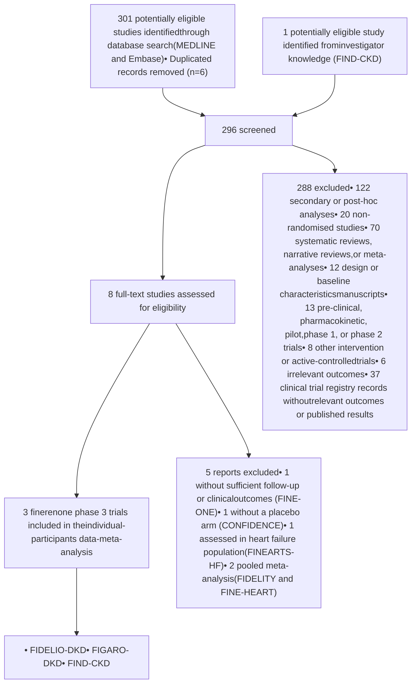

# THE LANCET

## Supplementary appendix

This appendix formed part of the original submission and has been peer reviewed. We post it as supplied by the authors.

Supplement to: Neuen BL, Heerspink HJL, Perkovic V, et al. Efficacy and safety of finerenone in patients with chronic kidney disease: an individual participant data pooled analysis (INFINITY). *Lancet* 2026; published online June 5. https://doi.org/10.1016/S0140-6736(26)01009-301009-3).

# Appendix 1

## Table of Contents

Investigators by country and region .......................................................................................... 2
Supplemental Tables .............................................................................................................. 17
**Table S1: Study design of finerenone phase 3 clinical trials in people with CKD and type 2 diabetes, and non-diabetic CKD** ...................................................................................... 17
**Table S2: Search strategy** ............................................................................................... 19
**Table S3: Harmonisation of key outcome measures and their assessment across trials** ..... 20
**Table S4: Baseline characteristics by individual trial**....................................................... 21
**Table S5: Time to event analyses for components of the primary outcome**....................... 22
**Table S6: Treatment-emergent adverse events by treatment arm in participants with and without diabetes**.............................................................................................................. 23
**Table S7: Numbers needed to treat and numbers needed to harm analysis overall and by diabetes status** ................................................................................................................ 24
Supplemental Figures ............................................................................................................ 25
**Figure S1: Study selection** ............................................................................................... 25
**Figure S2: Risk of bias assessment** .................................................................................. 26
**Figure S3: Distribution of eGFR and UACR at baseline by trial**...................................... 27
**Figure S4: Composite kidney outcomes including ≥40% and ≥50% eGFR decline** ........... 28
**Figure S5: CV efficacy outcomes**..................................................................................... 29
**Figure S6: Forest plot showing main outcomes in FIDELITY, FIND-CKD and INFINITY** ....................................................................................................................................... 30
**Figure S7: Effect of finerenone on the composite kidney outcome across all pre-specified subgroups**....................................................................................................................... 31
**Figure S8: Effect of finerenone on the composite cardiovascular outcome across all pre-specified subgroups**......................................................................................................... 32
**Figure S9: Serious hyperkalaemia and acute kidney injury requiring hospitalisation by diabetes status (safety analysis set)** .................................................................................. 33
References ........................................................................................................................... 34

# Investigators by country and region

## FIDELIO-DKD

**Argentina:** Augusto Vallejos (national lead), Diego Aizenberg, Inés Bartolacci, Diego Besada, Julio Bittar, Mariano Chahin, Alicia Elbert, Elizabeth Gelersztein, Alberto Liberman, Laura Maffei, Federico Pérez Manghi, Hugo Sanabria, Gloria Viñes, Alfredo Wassermann

**Australia:** Richard MacIsaac (national lead), Walter Abhayaratna, Shamasunder Acharya, Elif Ekinci, Darren Lee, Peak Mann Mah, Craig Nelson, David Packham, Alexia Pape, Simon Roger, Hugo Stephenson, Michael Suranyi, Gary Wittert, Elizabeth Vale

**Austria:** Guntram Schernthaner (national lead), Martin Clodi, Christoph Ebenbichler, Evelyn Fliesser-Görzer, Ursula Hanusch, Michael Krebs, Karl Lhotta, Bernhard Ludvik, Gert Mayer, Peter Neudorfer, Bernhard Paulweber, Rudolf Prager, Wolfgang Preiß, Friedrich Prischl, Gerit-Holger Schernthaner, Harald Sourij, Martin Wiesholzer

**Belgium:** Pieter Gillard (national lead), Peter Doubel, Wendy Engelen, Jean-Michel Hougardy, Jean-Marie Krzesinski, Bart Maes, Marijn Speeckaert, Koen Stas, Luc van Gaal, Hilde Vanbelleghem

**Brazil:** Maria Eugenia F. Canziani (national lead), Daniela Antunes, Roberto Botelho, Claudia Brito, Luis Canani, Maria Cerqueira, Rogerio de Paula, Freddy Eliaschewitz, Carlos Eduardo Figueiredo, Adriana Forti, Miguel Hissa, Maurilo Leite Jr, Emerson Lima, Irene Noronha, Bruno Paolino, Nathalia Paschoalin, Raphael Paschoalin, Roberto Pecoits Filho, Marcio Pereira, Evandro Portes, Dalton Precoma, Rosangela Rea, Miguel Riella, Joao Eduardo Salles, Eduardo Vasconcellos, Sergio Vencio

**Bulgaria:** Theodora Temelkova Kurktschiev (national lead), Emiliya Apostolova, Radostina Boshnyashka, Ghassan Farah, Dimitar Georgiev, Valentina Gushterova, Neli Klyuchkova, Mariya Lucheva, Petya Manova, Dotska Minkova, Boyan Nonchev, Mariyana Pichmanova, Zhulieta Prakova, Rangel Rangelov, Rosen Rashkov, Pavel Stanchev, Bilyana Stoyanovska-Elencheva, Zhivko Tagarev, Svetla Vasileva, Mariana Yoncheva-Mihaylova

**Canada:** Ellen Burgess and Sheldon Tobe (national leads), Paul Barre, Brian Carlson, James Conway, Serge Cournoyer, Richard Dumas, Sameh Fikry, Richard Goluch, Pavel Hamet, Randolph Hart, Sam Henein, Joanne Liutkus, Francois Madore, Valdemar Martinho, Giuseppe Mazza, Philip McFarlane, Dennis O’ Keefe, Sean Peterson, Daniel Schwartz, Daniel Shu, Andrew Steele, Guy Tellier, Karthik Tennankore, George Tsoukas, Richard Tytus, Louise Vitou, Michael Walsh, Stanley Weisnagel, Igor Wilderman, Jean-Francois Yale

**Chile:** Fernando González (national lead), Jorge Cobos, Juan Godoy, Sergio Lobos, Juan Carlos Palma, Juan Carlos Prieto, Eliana Reyes, Carmen Romero, Victor Saavedra, Mario Vega

**China:** Zhi-Hong Liu (national lead), Ruifang Bu, Hanqing Cai, Nan Chen, Qinkai Chen, Dejun Chen, Jinluo Cheng, Youping Dong, Junwu Dong, Tianjun Guan, Chuanming Hao, Wen Huang, Fangfang Jiang, Minxiang Lei, Ling Li, Zhonghe Li, Xuemei Li, Jingmei Li, Yan Li, Xinling Liang, Bo Liang, Fang Liu, Yinghong Liu, Yuantao Liu, Gang Long, Guoyuan Lu, Weiping Lu, Yibing Lu, Ping Luo, Jianhua Ma, Zhaohui Mo, Jianying Niu, Ai Peng, Jiansong Shen, Feixia Shen, Bingyin Shi, Qing Su, Zhuxing Sun, Shuifu Tang, Nanwei Tong, Hao Wang, Xinjun Wang, Lihua Wang, Guixia Wang, Jianqin Wang, Yangang Wang, Li Wang, Jiali Wei, Tianfeng Wu, Chaoqing Wu, Changying Xing, Fei Xiong, Xudong Xu, Ning Xu, Tiekun Yan, Jinkui Yang, Aiping Yin, Longyi Zeng, Hao Zhang, Yanlin Zhang, Ying Zhang, Wenjing Zhao, Zhiquan Zhao, Hongguang Zheng, Ling Zhong, Dalong Zhu, Yongze Zhuang

**Colombia:** Andrés Ángelo Cadena Bonfanti and Carlos Francisco Jaramillo (national leads), Clara Arango, Sandra Barrera, Nelly Beltrán López, Diego Benitez, Guillermo Blanco, Julian Coronel, Carlos Cure, Carlos Durán, Alexander González, Gustavo Guzmán, Eric Hernández, Jaime Ibarra, Nicolás Jaramillo, William Kattah, Dora Molina, Gregorio Sánchez, Mónica Terront, Freddy Trujillo, Miguel Urina, Ruben Vargas, Iván Villegas, Hernán Yupanqui

**Czech Republic:** Martin Prazny (national lead), Dino Alferi, Michal Brada, Jiri Brezina, Petr Bucek, Tomas Edelsberger, Drahomira Gulakova, Jitka Hasalova Zapletalova, Olga Hola, Lucie Hornova, Jana Houdova, Helena Hrmova, David Karasek, Sarka Kopecka, Richard Kovar, Eva Krcova, Jiri Kuchar, Vlasta Kutejova,

Hana Lubanda, Ivo Matyasek, Magdalena Mokrejsova, Libor Okenka, Jiri Pumprla, Pavel Tomanek

**Denmark:** Peter Rossing (national lead), Jesper Bech, Jens Faber, Gunnar Gislason, Jørgen Hangaard, Grzegorz Jaroslaw Pacyk, Claus Juhl, Thure Krarup, Morten Lindhardt, Sten Madsbad, Joan Nielsen, Ulrik Pedersen-Bjergaard, Per Poulsen, Ole Rasmussen, Karoline Schousboe

**Finland:** Jorma Strand (national lead), Mikko Honkasalo, , Kari Humaloja, Kristiina Kananen, Ilkka Kantola, Arvo Koistinen, Pirkko Korsoff, Jorma Lahtela, Sakari Nieminen, Tuomo Nieminen, Karita Sadeharju, Sakari Sulosaari

**France:** Michel Marre (national lead), Bertrand Cariou, François Chantrel, Sylvaine Clavel, Christian Combe, Jean-Pierre Fauvel, Karim Gallouj, Didier Gouet, Bruno Guerci, Dominique Guerrot, Maryvonne Hourmant, Alexandre Klein, Christophe Mariat, Rafik Mesbah, Yannick Le Meur, Arnaud Monier, Olivier Moranne, Pierre Serusclat, Benoit Vendrely, Bruno Verges, Philippe Zaoui

**Germany:** Roland Schmieder and Christoph Wanner (national leads), Christoph Axthelm, Andreas Bergmann, Andreas L. Birkenfeld, Hermann Braun, Klaus Busch, Christel Contzen, Stefan Degenhardt, Karl Derwahl, Thomas Giebel, Andreas Hagenow, Hermann Haller, Christoph Hasslacher, Thomas Horacek, Wolfgang Jungmair, Christof Kloos, Thorsten Koch, Thilo Krüger, Anja Mühlfeld, Joachim Müller, Andreas Pfützner, Frank Pistrosch, Ludger Rose, Lars Rump, Volker Schettler, Ingolf Schiefke, Heike Schlichthaar, Bernd Schröppel, Thomas Schürholz, Helena Sigal, Lutz Stemler, Georg Strack, Heidrun Täschner, Nicole Toursarkissian, Diethelm Tschöpe, Achim Ulmer, Markus van der Giet, Bernhard R. Winkelmann

**Greece:** Pantelis A. Sarafidis (national lead), Ioannis Boletis, Erifili Hatziagelaki, Ioannis Ioannidis, Theodora Kounadi, Ioanna Makriniotou, Dorothea Papadopoulou, Aikaterini Papagianni, Ploumis Passadakis, Ioannis Stefanidis

**Hong Kong:** Juliana Chan (regional lead), Tai Pang Ip, Paul Lee, On Yan Andrea Luk, Angela Wang, Vincent Yeung

**Hungary:** László Rosivall (national lead), Dora Bajcsi, Peter Danos, Eleonora Harcsa, Szilvia Kazup, Katalin Keltai, Robert Kirschner, Julianna Kiss, Laszlo Kovacs, Beata Lamboy, Botond Literati-Nagy, Margit Mileder, Laszlo Nagy, Ebrahim Noori, Gabor Nyirati, Gizella Petro, Karoly Schneider, Albert Szocs, Szilard Vasas, Krisztina Wudi, Zsolt Zilahi, Marianna Zsom

**Ireland:** Joseph Eustace (national lead), John Holian, Donal Reddan, Yvonne O’ Meara

**Israel:** Ehud Grossman and Yoram Yagil (national leads), Rosane Abramof Ness, Faiad Adawi, Zaher Armaly, Shaul Atar, Sydney Ben Chetrit, Noa Berar Yanay, Gil Chernin, Mahmud Darawsha, Shai Efrati, Mazen Elias, Evgeny Farber, Mariela Glandt, Majdi Halabi, Khaled Khazim, Idit Liberty, Ofri Mosenzon, Assy Nimer, Doron Schwartz, Julio Wainstein, Robert Zukermann

**Italy:** Giuseppe Remuzzi (national lead), Angelo Avogaro, Giovanni Giorgio Battaglia, Enzo Bonora, Carlo Antonio Bossi, Paolo Calabrò, Franco Luigi Cavalot, Roberto Cimino, Mario Gennaro Cozzolino, Enrico Fiaccadori, Paolo Fiorina, Carlo Bruno Giorda, Maria Cristina Gregorini, Gaetano La Manna, Davide Carlo Maggi, Antonello Pani, Norberto Perico, PierMarco Piatti, Antonio Pisani, Paola Ponzani, Gennaro Santorelli, Domenico Santoro, Giancarlo Tonolo, Roberto Trevisan, Anna Maria Veronelli

**Japan:** Daisuke Koya and Takashi Wada (national leads), Hideo Araki, Osamu Ebisui, Naruhiro Fujita, Ryuichi Furuya, Yoshiyuki Hamamoto, Masahiro Hatazaki, Terumasa Hayashi, Takayuki Higashi, Yoshihide Hirohata, Shuji Horinouchi, Masayuki Inagaki, Masao Ishii, Tamayo Ishiko, Hideaki Jinnouchi, Hidetoshi Kanai, Daisuke Kanda, Hideo Kanehara, Masayuki Kashima, Kiyoe Kato, Takeshi Katsuki, Katsunori Kawamitsu, Satsuki Kawasaki, Fumi Kikuchi, Hidetoshi Kikuchi, Kunihisa Kobayashi, Junko Koide, Miyuki Kubota, Yoshiro Kusano, Hajime Maeda, Sunao Matsubayashi, Kazunari Matsumoto, Yasuto Matsuo, Naoki Matsuoka, Hiroaki Miyaoka, Satoshi Murao, Mikihiro Nakayama, Jun Nakazawa, Takashi Nomiyama, Masayuki Noritake, Takayuki Ogiwara, Hiroshi Ohashi, Hideki Okamoto, Takeshi Osonoi, Nobuhiro Sasaki, Taiji Sekigami, Taro Shibasaki, Hirotaka Shibata, Junji Shinoda, Hiroshi Sobajima, Kazuya Sugitatsu, Toshiyuki Sugiura, Toru Sugiyama, Daisuke Suzuki, Hiroyuki Suzuki, Masaaki Suzuki, Asami Takeda, Asami Tanaka, Seiichi Tanaka, Izumi Tsunematsu, Makoto Ujihara, Daishiro Yamada, Masayo Yamada, Kazuo Yamagata, Ken Yamakawa, Fumiko Yamakawa, Yoshimitsu Yamasaki, Yuko Yambe, Taihei Yanagida, Hidekatsu Yanai, Tetsuyuki

Yasuda

**Lithuania:** Dovile Kriauciuniene, Jurate Lasiene, Antanas Navickas, Lina Radzeviciene, Egle Urbanaviciene, Gediminas Urbonas, Audrone Velaviciene

**Malaysia:** Rohana Abd Ghani, Nor Azizah Aziz, Li Yuan Lee, Chek Loong Loh, Norhaliza Mohd Ali, Nurain Mohd Noor, Nik Nur Fatnoon Nik Ahmad, Jeyakantha Ratnasingam, Wan Hasnul Halimi Bin Wan Hasan, Wan Mohd Izani Wan Mohamed

**Mexico:** Magdalena Madero Rovalo (national lead), Sandro Avila Pardo, Miriam Bastidas Adrian, Alfredo Chew Wong, Jorge Escobedo de la Peña, Guillermo Fanghänel Salmón, Guillermo González Gálvez, Ramiro Gutiérrez Ochoa, Saúl Irizar Santana, Gustavo Méndez Machado, Luis Nevarez Ruiz, Denisse Ramos Ibarra, Gabriel Ramos López, Leobardo Sauque Reyna, Gustavo Solache Ortiz, Rafael Valdez Ortiz, Juan Villagordoa Mesa

**Netherlands:** Ron Gansevoort and Adriaan Kooy (national leads), R.C. Bakker, J.N.M. Barendregt, A.H. Boonstra, Willem Bos, C.B. Brouwer, M. van Buren, Marielle Krekels, Ruud J.M. van Leendert, Louis A.G. Lieverse, P.T. Luik, E. Lars Penne, Peter Smak Gregoor, Liffert Vogt

**New Zealand:** John Baker, Veronica Crawford, Rick Cutfield, Peter Dunn, Jeremy Krebs, Kingsley Nirmalaraj, Russell Scott, Nine Smuts

**Norway:** Trine Finnes (national lead), Erik Eriksen, Hans Høivik, Thomas Karlsson, Peter Scott Munk, Maria Radtke, Knut Risberg, Jan Rocke, Leidulv Solnør, Aud-Eldrid Stenehjem, Anne-Beathe Tafjord

**Philippines:** Froilan De Leon (national lead), Glenda Pamugas, Araceli Panelo, Ronald Perez, Maribel Tanque, Louie Tirador, Michael Villa

**Poland:** Janusz Gumprecht (national lead), Patrycja Butrymowicz, Kazimierz Ciechanowski, Grazyna Cieslik, Edward Franek, Michal Hoffmann, Jolanta Krzykowska, Ilona Kurnatowska, Katarzyna Landa, Adam Madrzejewski, Katarzyna Madziarska, Stanislaw Mazur, Piotr Napora, Michal Nowicki, Anna Ocicka-Kozakiewicz, Barbara Rewerska, Teresa Rusicka, Jan Ruxer, Ewa Skokowska, Andrzej Stankiewicz, Tomasz Stompor, Agnieszka Tiuryn-Petrulewicz, Katarzyna Wasilewska, Bogna Wierusz-Wysocka, Renata Wnetrzak-Michalska

**Portugal:** Fernando Teixeira e Costa (national lead), Edgar Almeida, Rosa Ballesteros, Carlos Barreto, Idalina Beirao, Rita Birne, Cesar Esteves, Jose Guia, Susana Heitor, Olinda Marques, Pedro Melo, Fernando Nolasco, Amalia Pereira, Cristina Roque, Francisco Rosario, Gil Silva, Ana Silva, Ana Vila Lobos

**Puerto Rico:** Gregorio Cortes-Maisonet, Amaury Roman-Miranda

**Romania:** Adrian Albota, Cornelia Bala, Hortensia Barbonta, Elena Caceaune, Doina Catrinoui, Ciprian Constantin, Adriana Dumitrescu, Nicoleta Mindrescu, Cristina Mistodie, Gabriela Negrisanu, Adriana Onaca, Silvia Paveliu, Ella Pintilei, Lavinia Pop, Amorin Popa, Alexandrina Popescu, Gabriela Radulian, Iosif Szilagyi, Liana Turcu, Georgeta Vacaru, Adrian Vlad

**Russia:** Alexander Dreval (national lead), Mikhail Antsiferov, Mikhail Arkhipov, Andrey Babkin, Olga Barbarash, Vitaliy Baranov, Elena Chernyavskaya, Arkadiy Demko, Anton Edin, Polina Ermakova, Valentin Fadeev, Albert Galyavich, Leyla Gaysina, Ivan Gordeev, Irina Ipatko, Marina Kalashnikova, Yuriy Khalimov, Vadim Klimontov, Zhanna Kobalava, Elena Kosmacheva, Natalya Koziolova, Lyudmila Kvitkova, Sergey Levashov, Roman Libis, Vyacheslav Marasaev, Natalia Malykh, Vladimir Martynenko, Sofya Malyutina, Imad Merai, Ashot Mkrtumyan, Galina Nechaeva, Nina Petunina, Shamil Palyutin, Leonid Pimenov, Elena Rechkova, Tatyana Rodionova, Oksana Rymar, Ruslan Sardinov, Olga Semenova, Alexander Sherenkov, Oleg Solovev, Elena Smolyarchuk, Leonid Strongin, Olga Ukhanova, Nadezhda Verlan, Natalya Vorokhobina, Davyd Yakhontov, Sergey Yakushin, Elena Zakharova, Alsu Zalevskaya, Olga Zanozina, Elena Zhdanova, Larisa Zhukova, Tatyana Zykova

**Singapore:** Anantharaman Vathsala (national lead), Chee Fang Sum, Sufi Muhummad Suhail, Ru San Tan, Edmund Wong

**Slovakia:** Jana Babikova, Ingrid Buganova, Andrej Dzupina, Zuzana Ochodnicka, Dalibor Sosovec, Denisa Spodniakova

**South Africa:** Aslam Amod (national lead), Fayzal Ahmed, Sindeep Bhana, Larry Distiller, Dirkie Jansen van Rensburg, Mukesh Joshi, Shaifali Joshi, Deepak Lakha, Essack Mitha, Gracjan Podgorski, Naresh Ranjith, Brian Rayner, Paul Rheeder, Mohamed Sarvan, Mary Seeber, Heidi Siebert, Mohammed Tayob, Julien Trokis, Dorothea Urbach, Louis van Zyl

**South Korea:** Sin Gon Kim and Byung Wan Lee (national leads), Bum-Soon Choi, Moon Gi Choi, ChoonHee Chung, YouCheol Hwang, ChongHwa Kim, InJoo Kim, JaeHyeon Kim, SungGyun Kim, Tae Hee Kim, WooJe Lee, Kang Wook Lee, Kook-Hwan Oh, Ji Eun Oh, Yun Kyu Oh, Dong-Jin Oh, Junbeom Park, Seok Joon Shin, Su-Ah Sung, Jae Myung Yu

**Spain:** Julio Pascual Santos (national lead), Irene Agraz, Francisco Javier Ampudia, Hanane Bouarich, Francesca Calero, Cristina Castro, Secundino Cigarrán Guldris, Josep Cruzado Garrit, Fernando de Álvaro, Josep Galcerán, Olga González Albarrán, Julio Hernández Jaras, Meritxell Ibernón, Francisco Martínez Deben, Mª Dolores Martínez Esteban, José María Pascual Izuel, Judith Martins, Juan Mediavilla, Alfredo Michán, Esteban Poch, Manuel Polaina Rusillo, Carlos Sánchez Juan, Rafael Santamaría Olmo, José Julián Segura de la Morena, Alfonso Soto, Maribel Troya

**Sweden:** Bengt-Olov Tengmark (national lead), Annette Bruchfeld, Dan Curiac, Ken Eliasson, Malin Frank, Gregor Guron, Olof Hellberg, Margareta Hellgren, Hans Larnefeldt, Carl-Johan Lindholm, Magnus Löndahl, Erik Rein-Hedin, Inga Soveri, Jonas Spaak

**Switzerland:** Michel Burnier (national lead), Daniel Ackermann, Stefan Bilz, Christian Forster, Stefan Kalbermatter, Andreas Kistler, Antoinette Pechère-Bertschi, Bernd Schultes

**Taiwan:** Chien-Te Lee (regional lead), Chiz-Tzung Chang, Cheng-Chieh Hung, Ju-Ying Jiang, Shuei-Liong Lin, Der-Cherng Tarng, Shih-Te Tu, Mai-Szu Wu, Ming-Ju Wu

**Thailand:** Sukit Yamwong (national lead), Chaicharn Deerochanawong, Chagriya Kitiyakara, Vuddhidej Ophascharoensuk, Chatlert Pongchaiyakul, Bancha Satirapoj

**Turkey:** Ramazan Sari (national lead), Necmi Eren, Ibrahim Gul, Okan Gulel, Ismail Kocyigit, Abdulbaki Kumbasar, Idris Sahin, Burak Sayin, Talat Tavli, Sedat Ustundag, Yavuz Yenicerioglu

**Ukraine:** Borys Mankovsky (national lead), Iryna Bondarets, Volodymyr Botsyurko, Viktoriia Chernikova, Oleksandra Donets, Ivan Fushtey, Mariia Grachova, Anna Isayeva, Dmytro Kogut, Julia Komisarenko, Nonna Kravchun, Kateryna Malyar, Liliya Martynyuk, Vitaliy Maslyanko, Halyna Myshanych, Larysa Pererva, Nataliia Pertseva, Oleksandr Serhiyenko, Ivan Smirnov, Liubov Sokolova, Vasyl Stryzhak, Maryna Vlasenko

**United Kingdom:** Kieran McCafferty (national lead), Ahmad AbouSaleh, Jonathan Barratt, Cuong Dang, Hassan Kahal, Adam Kirk, Anne Kilvert, Sui Phi Kon, Dipesh Patel, Sam Rice, Arutchelvam Vijayaraman, Yuk-ki Wong, Martin Gibson, Mona Wahba, Reza Zaidi

**United States:** Sharon Adler, Linda Fried, Robert Toto and Mark Williams (national leads), Idalia Acosta, Atoya Adams, Dilawar Ajani, Slamat Ali, Radica Alicic, Amer Al-Karadsheh, Sreedhara Alla, D. Allison, Nabil Andrawis, Ahmed Arif, Ahmed Awad, Masoud Azizad, Michael Bahrami, Shweta Bansal, Steven Barag, Ahmad Barakzoy, Mark Barney, Joshua Barzilay, Khalid Bashir, Jose Bautista, Srinivasan Beddhu, Diogo Belo, Sabrina Benjamin, Ramin Berenji, Anuj Bhargava, Jose Birriel, Stephen Brietzke, Frank Brosius, Osvaldo Brusco, Anna Burgner, Robert Busch, Rafael Canadas, Maria Caramori, Jose Cardona, Christopher Case, Humberto Cruz, Ramprasad Dandillaya, Dalia Dawoud, Zia Din, Bradley Dixon, Ankur Doshi, James Drakakis, Mahfouz El Shahawy, Ashraf El Meanawy, Mohammed El-Shahawy, John Evans, George Fadda, Umar Farooq, Roland Fernando, Raymond Fink, Brian First, David Fitz-Patrick, John Flack, Patrick Fluck, Leon Fogelfeld, Vivian Fonseca, Juan Frias, Claude Galphin, Luis Garcia-Mayol, Gary Goldstein, Edgar Gonzalez, Francisco Gonzalez-Abreu, Ashwini Gore, David Grant, Violet Habwe, Maxine Hamilton, Jamal Hammoud, Stuart Handelsman, Israel Hartman, Glenn Heigerick, Andrew Henry, German Hernandez, Carlos Hernandez-Cassis, Carlos Herrera, Joachim Hertel, Wenyu Huang, Rogelio Iglesias, Ali Iranmanesh, Timothy Jackson, Mahendra Jain, Kenneth Jamerson, Karen Johnson, Eric Judd, Joshua Kaplan, Zeid Kayali, Bobby Khan, Muhammad Khan, Sourabh Kharait, M. Sue Kirkman, Nelson Kopyt, Wayne Kotzker, Csaba Kovesdy, Camil Kreit, Arvind

Krishna, Saeed Kronfli, Keung Lee, Derek LeJeune, Brenda Lemus, Carlos Leon-Forero, Douglas Linfert, Henry Lora, Alexander Lurie, Geetha Maddukuri, Alexander Magno, Louis Maletz, Sreedhar Mandayam, Mariana Markell, Ronald Mayfield, Caroline Mbogua, Dierdre McMullen, Carl Meisner, Stephen Minton, Bharat Mocherla, Rajesh Mohandas, Manuel Montero, Moustafa Moustafa, Salil Nadkarni, Samer Nakhle, Jesus Navarro, Nilda Neyra, Romanita Nica, Philip Nicol, Paul Norwood, Visal Numrungroad, Richard O’ Donovan, A. Odugbesan, Jorge Paoli-Bruno, Samir Parikh, Rakesh Patel, Aldo Peixoto, Pablo Pergola, Alan Perlman, Karlton Pettis, Roberto Pisoni, Mirela Ponduchi, Jorge Posada, Sharma Prabhakar, Jai Radhakrishnan, Mahboob Rahman, Rupesh Raina, Anjay Rastogi, Efrain Reisin, Marc Rendell, David Robertson, Michael Rocco, Hugo Romeu, Sylvia Rosas, Jack Rosenfeld, Dennis Ross, Jeffrey Rothman, Lance Rudolph, Yusuf Ruhullah, Gary Ruoff, Jeffrey Ryu, Mandeep Sahani, Ramin Sam, Garfield Samuels, William Sanchez, Vladimir Santos, Scott Satko, Sanjeev Saxena, David Scott, Gilberto Seco, Melvin Seek, Harvey Serota, Tariq Shafi, Nauman Shahid, Michael Shanik, Santosh Sharma, Arjun Sinha, James Smelser, Mark Smith, Kyaw Soe, Richard Solomon, Eugene Soroka, Joseph Soufer, Bruce Spinowitz, Leslie Spry, Rosa Suarez, Bala Subramanian, Harold Szerlip, Aparna Tamirisa, Stephen Thomson, Tuan-Huy Tran, Richard Treger, Gretel Trullenque, Thomas Turk, Guillermo Umpierrez, Daniel Urbach, Martin Valdes, Shujauddin Valika, Damaris Vega, Peter Weissman, Adam Whaley-Connell, Jonathan Winston, Jonathan Wise, Alan Wynne, Steven Zeig

**Vietnam**: Tran Quang Khanh (national lead), Phuong Chu, Lam Van Hoang, Nguyen Thi Phi Nga, Pham Nguyen Son, Lan Phuong Tran.

# FIGARO-DKD

**Argentina**: Augusto Vallejos (national lead), Diego Aizenberg, Inés Bartolacci, Diego Besada, Julio Bittar, Mariano Chahin, Alicia Elbert, Elizabeth Gelersztein, Alberto Liberman, Laura Maffei, Federico Pérez Manghi, Hugo Sanabria, Gloria Viñes, and Alfredo Wassermann.

**Australia**: Richard MacIsaac (national lead), Walter Abhayaratna, Peter Colman, David Colquhoun, Elif Ekinci, Chris Ellis, Kim Joshua, , Peak Mann, Craig Nelson, David Packham, Alexia Pape, Eugenia Pedagogos, Paul Regal, Simon Roger, Hugo Stephenson, Michael Suranyi, Duncan Topliss, James Vandeleur, Johan Verjans, Gary Wittert, and Katie-Jane Wynne.

**Austria**: Guntram Schernthaner (national lead), Martin Clodi, Heinz Drexel, Christoph Ebenbichler, Evelyn Fliesser-Görzer, Ursula Hanusch, Bernhard Ludvik, Gert Mayer, Peter Neudorfer, Rainer Oberbauer, Bernhard Paulweber, Rudolf Prager, Friedrich Prischl, Gerit-Holger Schernthaner, Hans-Robert Schönherr, and Harald Sourij.

**Belgium**: Pieter Gillard (national lead), Peter Doubel, Francis Duyck, Jean-Michel Hougardy, André Scheen, Marijn Speeckaert, Luc van Gaal, and Hilde Vanbelleghem.

**Brazil**: Maria Eugenia F. Canziani (national lead), Daniela Antunes, Marcelo Bacci, Roberto Botelho, Claudia Brito, Luis Canani, , Maria Cerqueira, Rogerio de Paula, Freddy Eliaschewitz, Carlos Eduardo Figueiredo, Adriana Forti, Miguel Hissa, Maurilo Leite Jr, Lilia Maia, Irene Noronha, Bruno Paolino, Roberto Pecoits Filho, Marcio Pereira, Evandro Portes, Dalton Precoma, Rosangela Rea, Miguel Riella, Joao Eduardo Salles, Eduardo Vasconcellos, Sergio Vencio, and Aline Villacorta.

**Bulgaria**: Theodora Temelkova-Kurktschiev (national lead), Radostina Boshnyashka, Ghassan Farah, Dimitar Georgiev, Valentina Gushterova, Neli Klyuchkova, Mariya Lucheva, Petya Manova, Angel Marinchev, Dotska Minkova, Mariya Miteva, Boyan Nonchev, Mariyana Pichmanova, Zhulieta Prakova, Rangel Rangelov, Rosen Rashkov, Pavel Stanchev, Bilyana Stoyanovska-Elencheva, Zhivko Tagarev, Svetla Vasileva, and Mariana Yoncheva-Mihaylova.

**Canada**: Ellen Burgess and Sheldon Tobe (national lead), Brian Carlson, James Conway, Serge Cournoyer, Richard Dumas, Fadia El Boreky, Sameh Fikry, Richard Goluch, Pavel Hamet, Randolph Hart, Sam Henein, Alan Kelly, Lawrence Leiter, Joanne Liutkus, Francois Madore, Valdemar Martinho, Giuseppe Mazza, Philip McFarlane, Dennis O’Keefe, Sean Peterson, Daniel Schwartz, Daniel Shu, Andrew Steele, Ivor Teitelbaum, Guy Tellier, Karthik Tennankore, George Tsoukas, Richard Tytus, Louise Vitou, Michael Walsh, Stanley Weisnagel, Igor Wilderman, and Jean-Francois Yale.

**Chile**: Fernando González (national lead), Jorge Cobos, Marcelo Medina, Juan Carlos Prieto Dominguez, Eliana Reyes, Carmen Romero, Victor Saavedra, and Paola Varleta.

**China:** Zhi-Hong Liu (national lead), Ruifang Bu, Hanqing Cai, Nan Chen, Qinkai Chen, Dejun Chen, Jinluo Cheng, Junwu Dong, Youping Dong, Yuming Du, Yi Fang, Tianjun Guan, Weiying Guo, Chuanming Hao, Fangfang Jiang, Sheng Jiang, Jian Kuang, Minxiang Lei, Dongmei Li, Hongmei Li, Jingmei Li, Ling Li, Yan Li, Yinan Li, Yuxiu Li, Zhonghe Li, Fang Liu, Jian Liu, Yinghong Liu, Yu Liu, Yuantao Liu, Gang Long, Guoyuan Lu, Weiping Lu, Yibing Lu, Jianhua Ma, Heng Miao, Zhaohui Mo, Jianying Niu, Ai Peng, Wen Peng, Feixia Shen, Jiansong Shen, Bingyin Shi, Qing Su, Zhuxing Sun, Shuifu Tang, Nanwei Tong, Guixia Wang, Hao Wang, Jianqin Wang, Li Wang, Lihua Wang, Xinjun Wang, Jiali Wei, Chaoqing Wu, Tianfeng Wu, Changying Xing, Fei Xiong, Mingtong Xu, Ning Xu, Xudong Xu, Jinkui Yang, Aiping Yin, Longyi Zeng, Hao Zhang, Yanlin Zhang, Ying Zhang, Zhiquan Zhao, Hongguang Zheng, Ling Zhong, Liyong Zhong, Dalong Zhu, and Jun Zhu.

**Colombia:** Andrés Ángelo Cadena Bonfanti and Carlos Francisco Jaramillo (national lead), Clara Arango, Edgar Arcos, Gustavo Aroca, Sandra Barrera, Germán Barreto, Nelly Beltrán López, Diego Benitez, Andres Bermudez, Guillermo Blanco, Rodrigo Botero, Tatiana Cárdenas, Julian Coronel, Carlos Cure, Carlos Durán, Wilmer Figueroa, Luis García, Gustavo Guzmán, Eric Hernández, Jaime Ibarra, Mónica Jaramillo, Nicolás Jaramillo, William Kattah, Manuel Liévano, Mónica López, Dora Molina, Ricardo Rosero, Gregorio Sánchez, Mónica Terront, Pedro Trillos, Freddy Trujillo, Miguel Urina, Iván Villegas, and Hernán Yupanqui.

**Czech Republic:** Martin Prazny (national lead), Dino Alferi, Michal Brada, Petr Bucek, Tomas Edelsberger, Drahomira Gulakova, Jitka Hasalova Zapletalova, Olga Hola, Lucie Hornova, Jana Houdova, Helena Hrmova, David Karasek, Sarka Kopecka, Richard Kovar, Eva Krcova, Jiri Kuchar, Vlasta Kutejova, Hana Lubanda, Ivo Matyasek, Magdalena Mokrejsova, Libor Okenka, Jiri Pumprla, and Pavel Tomanek.

**Denmark:** Peter Rossing (national lead), Ulla Andersen, Alin Andries, Jesper Bech, Jens Faber, Gunnar Gislason, Jeppe Gram, Jørgen Hangaard, Claus Juhl, Thure Krarup, Thomas Lauridsen, Morten Lindhardt, Sten Madsbad, Joan Nielsen, Torben Østergaard, Grzegorz Pacyk, Erling Pedersen, Ulrik Pedersen-Bjergaard, Per Poulsen, Ole Rasmussen, Karoline Schousboe, and Birger Thorsteinsson.

**Finland:** Jorma Strand (national lead), Päivi Flöjt, Mikko Honkasalo, Kari Humaloja, Kristiina Kananen, Ilkka Kantola, Arvo Koistinen, Pirkko Korsoff, Jorma Lahtela, Sakari Nieminen, Karita Sadeharju, and Sakari Sulosaari.

**France:** Michel Marre (national lead), Bertrand Cariou, François Chantrel, Sylvaine Clavel, Jean-Pierre Fauvel, Karim Gallouj, Bruno Guerci, Dominique Guerrot, Alexandre Klein, Yannick Le Meur, Rafik Mesbah, Arnaud Monier, Olivier Moranne, Ronan Roussel, Pierre Serusclat, Bruno Verges, and Philippe Zaoui.

**Germany:** Roland Schmieder and Christoph Wanner (national leads), Christoph Axthelm, Andreas Bergmann, Andreas L. Birkenfeld, Hermann Braun, Klaus Busch, Christel Contzen, Stefan Degenhardt, Karl Derwahl, Thomas Giebel, Andreas Hagenow, Hermann Haller, Christoph Hasslacher, Thomas Horacek, Wolfgang Jungmair, Christof Kloos, Thorsten Koch, Annemone Koechel, Thilo Krüger, Joachim Müller, Andreas Pfützner, Andrea Rinke, Ludger Rose, Lars Rump, Volker Schettler, Ingolf Schiefke, Heike Schlichthaar, Norbert Schöll, Kristin Schubert, Thomas Schürholz, Helena Sigal, Lutz Stemler, Georg Strack, Heidrun Täschner, Nicole Toursarkissian, Diethelm Tschöpe, Achim Ulmer, Markus van der Giet, and Bernhard R. Winkelmann.

**Greece:** Pantelis A. Sarafidis (national lead), Ioannis Boletis, George Dimitriadis, Erifili Hatziagelaki, Christos Iatrou, Ioannis Ioannidis, Theodora Kounadi, Ioanna Makriniotou, Dorothea Papadopoulou, Aikaterini Papagianni, Ploumis Passadakis, George Piaditis, and Ioannis Stefanidis.

**Hong Kong:** Juliana Chan (regional lead), Paul Lee, Ronald Ma, Tai Pang Ip, Wing Sun Chow, and Vincent Yeung.

**Hungary:** László Rosivall (national lead), Dora Bajcsi, Peter Danos, Eleonora Harcsa, Akos Kalina, Szilvia Kazup, Katalin Keltai, Robert Kirschner, Julianna Kiss, Laszlo Kovacs, Beata Lamboy, Botond Literati-Nagy, Laszlo Nagy, Ebrahim Noori, Gabor Nyirati, Gizella Petro, Karoly Schneider, Judit Simon, Albert Szocs, Szilard Vasas, Krisztina Wudi, Zsolt Zilahi, and Marianna Zsom.

**Ireland:** Joseph Eustace (national lead), John Holian, and Donal Reddan.

**Israel:** Ehud Grossman and Yoram Yagil (national leads), Rosane Abramof Ness, Faiad Adawi, Zaher Armaly, Shaul Atar, Amir Bashkin, Sydney Ben Chetrit, Gil Chernin, Mahmud Darawsha, Shai Efrati, Mazen Elias, Evgeny Farber, Mariela Glandt, Majdi Halabi, Ilana Harman-Boehm, Idit Liberty, Oscar Minuchin, Ofri Mosenzon, Farid Nakhoul, Assy Nimer, Doron Schwartz, Julio Wainstein, and Robert Zukermann.

**Italy:** Giuseppe Remuzzi (national lead), Aneliy Ilieva Parvanova, Carlo Bruno Giorda, Enzo Bonora, Paolo Calabrò, Davide Carlo Maggi, Roberto Cimino, Salvatore David, Michele Emdin, Antonio Ettore Pontiroli, Enrico Fiaccadori, Paolo Fiorina, Giovanni Giorgio Battaglia, Maria Cristina Gregorini, Gaetano La Manna, Giorgio Luciano Viviani, Franco Luigi Cavalot, Roberta Manti, Anna Maria Veronelli, Giancarla Meregalli, Antonello Pani, Norberto Perico, PierMarco Piatti, Antonio Pisani, Paola Ponzani, Gennaro Santorelli, Domenico Santoro, Renzo Scanziani, Ugo Teatini, Maurizio Tiziano Bevilacqua, Giancarlo Tonolo, and Roberto Trevisan.

**Japan:** Daisuke Koya and Takashi Wada (national leads), Hideo Araki, Yukihiro Bando, Osamu Ebisui, Naruhiro Fujita, Hirotaka Fukasawa, Ryuichi Furuya, Yoshiyuki Hamamoto, Akihiro Hamasaki, Kotaro Hasegawa, Masahiro Hatazaki, Terumasa Hayashi, Masayuki Hayashi, Nobuyoshi Higa, Takayuki Higashi, Yoshihide Hirohata, Shuji Horinouchi, Ayumu Hoshi, Hirofumi Imoto, Akemi Inagaki, Masayuki Inagaki, Daijo Inaguma, Toshihiko Inoue, Masao Ishii, Tamayo Ishiko, Motohide Isono, Hideaki Jinnouchi, Hidetoshi Kanai, Daisuke Kanda, Hideo Kanehara, Masayuki Kashima, Yuko Kataoka, Shigehiro Katayama, Kiyoe Kato, Takeshi Katsuki, Katsunori Kawamitsu, Daiji Kawanami, Satsuki Kawasaki, Fumi Kikuchi, Hidetoshi Kikuchi, Rui Kishimoto, Kunihisa Kobayashi, Junko Koide, Rieko Komi, Miyuki Kubota, Genpei Kuriya, Takeshi Kurose, Yoshiro Kusano, Hajime Maeda, Sunao Matsubayashi, Kazunari Matsumoto, Naoya Matsumura, Yasuto Matsuo, Naoki Matsuoka, Hiroaki Miyaoka, Satoshi Miyata, Takeshi Morita, Isao Murakami, Satoshi Murao, Udai Nakamura, Mikihiro Nakayama, Jun Nakazawa, Sakae Nohara, Takashi Nomiyama, Masayuki Noritake, Yoshiaki Oda, Takayuki Ogiwara, Hiroshi Ohashi, Hideki Okamoto, Shinichi Okino, Takeshi Osonoi, Nobuhiro Sasaki, Yoshitaka Sayo, Taiji Sekigami, Taro Shibasaki, Hirotaka Shibata, Tatsushi Shimoyama, Junji Shinoda, Hiroshi Sobajima, Kazuya Sugitatsu, Toshiyuki Sugiura, Toru Sugiyama, Daisuke Suzuki, Masaaki Suzuki, Asami Takeda, Asami Tanaka, Seiichi Tanaka, Izumi Tsunematsu, Yasuo Ueda, Soichi Uekihara, Makoto Ujihara, Ken Yajima, Daishiro Yamada, Masayo Yamada, Kazuo Yamagata, Fumiko Yamakawa, Ken Yamakawa, Yoshimitsu Yamasaki, Yuko Yambe, Taihei Yanagida, Hidekatsu Yanai, Toshihiko Yanase, and Tetsuyuki Yasuda.

**Lithuania:** Dovile Kriauciuniene, Jurate Lasiene, Antanas Navickas, Lina Radzeviciene, Egle Urbanaviciene, Gediminas Urbonas, and Audrone Velaviciene.

**Malaysia:** Norhaliza Mohd Ali, Nor Azizah Aziz, Nik Nur Fatnoon Nik Ahmad, Wan Hasnul, Rizmy Najme Khir, Li Yuan Lee, Chek Loong Loh, Masni Mohamad, Jeyakantha Ratnasingam, Tong Boon Alexander Tan, and Wan Mohd Izani Wan Mohamed.

**Mexico:** Luis Alejandro Nevarez Ruiz (national lead), Melchor Alpizar Salazar, Sandro Avila Pardo, Miriam Bastidas Adrian, Alfredo Chew Wong, Jorge Escobedo de la Peña, Guillermo Fanghänel Salmón, Pedro García Hernández, José González , Guillermo González Gálvez, Ramiro Gutiérrez Ochoa, José Lazcano Soto, Magdalena Madero Rovalo, Gustavo Méndez Machado, Luis Nevarez Ruiz, Gabriel Ramos López, Arturo Saldaña Mendoza, Sergio Irizar Santana, Leobardo Sauque Reyna, Gustavo Solache Ortiz, Rafael Valdez Ortiz, Elvira González Vilchis, and Juan Villagordoa Mesa.

**Netherlands:** Ron Gansevoort and Adriaan Kooy (national leads), Rene Bakker, Jos Barendregt, Arnold Boonstra, Catherine Brouwer, Marielle Krekels, Aloysius Lieverse, Peter Luik, Lars Penne, Bert-Jan van den Born, Marjolijn van Buren, and Ruud van Leendert.

**New Zealand:** John Baker, Veronica Crawford, Rick Cutfield, Peter Dunn, Jeremy Krebs, Kingsley Nirmalaraj, Russell Scott, Nine Smuts, and Janet Titchener.

**Norway:** Trine Finnes (national lead), Emil Asprusten, Erik Eriksen, Robert Hagemeier, Hans Høivik, Kjetil Høye, Thomas Karlsson, Peter Scott Munk, Knut Risberg, Jan Rocke, Hilde Selsås, Leidulv Solnør, Frode Thorup, and Cecilie Wium.

**Philippines:** Froilan De Leon (national lead), Albert Bautista, Elizabeth Catindig, Carlo Manalo, Roberto Mirasol, Glenda Pamugas, Maribel Tanque, and Louie Tirador.

**Poland:** Janusz Gumprecht (national lead), Patrycja Butrymowicz, Kazimierz Ciechanowski, Grazyna Cieslik, Edward Franek, Michal Hoffmann, Krystyna Jedynasty, Jolanta Krzykowska, Ilona Kurnatowska, Katarzyna Landa, Adam Madrzejewski, Katarzyna Madziarska, Stanislaw Mazur, Piotr Napora, Michal Nowicki, Anna Ocicka-Kozakiewicz, Barbara Rewerska, Teresa Rusicka, Jan Ruxer, Izabela Sein Anand, Ewa Skokowska, Andrzej Stankiewicz, Agnieszka Tiuryn-Petrulewicz, Katarzyna Wasilewska, Bogna Wierusz-Wysocka, and Renata Wnetrzak-Michalska.

**Portugal:** Fernando Teixeira e Costa (national lead), Edgar Almeida, Ana Rita Alves, Rosa Ballesteros, Carlos Barreto, Ilidio Brandao, Rui Carvalho, Joao Coelho, Cesar Esteves, Jose Guia, Susana Heitor, Ana Lourenco, Pedro Matos, Pedro Melo, Fernando Nolasco, Amalia Pereira, Cristina Roque, Vanisa Rosario, Francisco Rosario, Joao Sergio Neves, Gil Silva, Ana Silva, and Ana Vila Lobos.

**Puerto Rico:** Yudit Brito-Peguero, Gildred Colon-Vega, Gregorio Cortes-Maisonet, Gregorio Cortes-Maisonet, and Amaury Roman-Miranda.

**Romania:** Adrian Albota, Cornelia Bala, Hortensia Barbonta, Elena Caceaune, Ciprian Constantin, Adriana Dumitrescu, Adriana Filimon, Nicoleta Mindrescu, Cristina Mistodie, Gabriela Negrisanu, Adriana Onaca, Silvia Paveliu, Ella Pintilei, Lavinia Pop, Amorin Popa, Alexandrina Popescu, Iosif Szilagyi, Liana Turcu, Georgeta Vacaru, Ioan Veresiu, and Adrian Vlad

**Russia:** Alexander Dreval (national lead), Mikhail Antsiferov, Yulia Argunova, Mikhail Arkhipov, Andrey Babkin, Vitaliy Baranov, Olga Barbarash, Elena Chernyavskaya, Arkadiy Demko, Anton Edin, Polina Ermakova, Albert Galyavich, Leyla Gaysina, Ivan Gordeev, Irina Ipatko, Marina Kalashnikova, Yuriy Khalimov, Vadim Klimontov, Zhanna Kobalava, Elena Kosmacheva, Natalya Koziolova, Lyudmila Kvitkova, Sergey Levashov, Roman Libis, Natalia Malykh, Sofya Malyutina, Vyacheslav Marasaev, Vyacheslav Mareev, Vladimir Martynenko, Imad Meray, Ashot Mkrtumyan, Galina Nechaeva, Konstantin Nikolaev, Shamil Palyutin, Nina Petunina, Leonid Pimenov, Elena Rechkova, Tatyana Rodionova, Oksana Rymar, Ruslan Sardinov, Olga Semenova, Alexander Sherenkov, Elena Smolyarchuk, Oleg Solovev, Leonid Strongin, Olga Ukhanova, Nadezhda Verlan, Svetlana Villevalde, Natalya Vorokhobina, Davyd Yakhontov, Elena Zakharova, Alsu Zalevskaya, Olga Zanozina, Elena Zhdanova, Larisa Zhukova, and Tatyana Zykova.

**Singapore:** Anantharaman Vathsala (national lead), Chee Fang Sum, Yong Mong Bee, and Ru San Tan.

**Slovakia:** Jana Babikova, Ingrid Buganova, Andrej Dzupina, Peter Minarik, Zuzana Ochodnicka, Dalibor Sosovec, and Denisa Spodniakova.

**South Africa:** Aslam Amod (national lead), Fayzal Ahmed, Sindeep Bhana, Larry Distiller, Shaifali Joshi, Mukesh Joshi, Deepak Lakha, Essack Mitha, Gracjan Podgorski, Brian Rayner, Mohamed Sarvan, Mary Seeber, Heidi Siebert, Mohammed Tayob, Julien Trokis, Dorothea Urbach, Dirkie Jansen van Rensburg, and Louis van Zyl.

**South Korea:** Sin Gon Kim and Byung Wan Lee (national leads), ChoonHee Chung, HyeSoo Chung, YouCheol Hwang, Ji Hye Huh, JunGoo Kang, ChulSik Kim, HyeSoon Kim, InJoo Kim, JaeHyeon Kim, NamHoon Kim, WooJe Lee, Soo Lim, Young Min Cho, Jae Myung Yu, and Cheol Young Park

**Spain:** Julio Pascual Santos (national lead), Hanane Bouarich, Francesca Calero, Cristina Castro, Fernando Cereto Castro, Secundino Cigarrán Guldris, Josep Cruzado Garrit, Pablo Gómez Fernández, Laura Fuentes Sánchez, Josep Galcerán, Olga González Albarrán, Mercedes González Moya, Julio Hernández, Domingo Hernández Marrero, Meritxell Ibernón, José María Pascual Izuel, Francisco Martínez Debén, Judith Martins, Juan Mediavilla, Alfredo Michán, Gonzalo Piedrola Maroto, Esteban Poch, Manuel Polaina Rusillo, Josep Redón, Carlos Sánchez Juan, Rafael Santamaría Olmo, José Julián Segura de la Morena, Daniel Seron, Alfonso Soto González, and Maribel Troya.

**Sweden:** Bengt-Olov Tengmark (national lead), Dan Curiac, Ken Eliasson, Malin Frank, Gregor Guron, Olof Hellberg, Margareta Hellgren, Hans Larnefeldt, Cornelia Lif-Tiberg, Carl-Johan Lindholm, Magnus Löndahl, Johan Månflod, Han Nguyen, Erik Rein-Hedin, Inga Soveri, and Jonas Spaak.

**Switzerland:** Michel Burnier (national lead), Stefan Bilz, Markus Laimer, Antoinette Pechère-Bertschi, Gottfried Rudofsky, Bernd Schultes, Christopher Strey, and Gregoire Wuerzner.

**Taiwan:** Chien-Te Lee (regional lead), Chiz-Tzung Chang, Lee-Ming Chuang, Cheng-Chieh Hung, Ju-Ying Jiang, Der-Cherng Tarng, Shih-Te Tu, Mai-Szu Wu, and Ming-Ju Wu.

**Thailand:** Sukit Yamwong (national lead), Chaicharn Deerochanawong, Natapong Kosachunhanan, Chatlert Pongchaiyakul, Bancha Satirapoj, and Piyamitr Sritara.

**Turkey:** Ramazan Sari (national lead), Badak, Murat Cayli, Necmi Eren, Ibrahim Gul, Ismail Kocyigit, Abdulbaki Kumbasar, Aytekin Oguz, Oner Ozdogan, Idris Sahin, Ibrahim Sari, Talat Tavli, Ahmet Temizhan, Mustafa Tigen, Ugur Turk, Yavuz Yenicerioglu, Huseyin Yilmaz, and Mehmet Yilmaz.

**Ukraine:** Borys Mankovsky (national lead), Iryna Bondarets, Volodymyr Botsyurko, Viktoriia Chernikova, Oleksandra Donets, Ivan Fushtey, Mariia Grachova, Ganna Isayeva, Dmytro Kogut, Julia Komisarenko, Nonna Kravchun, Oleksandr Larin, Kateryna Malyar, Liliya Martynyuk, Vitaliy Maslyanko, Halyna Myshanych, Larysa Pererva, Nataliia Pertseva, Oleksandr Serhiyenko, Ivan Smirnov, Liubov Sokolova, and Maryna Vlasenko.

**United Kingdom:** Kieran McCafferty (national lead), Rudy Bilous, Cuong Dang, Andrew Johnson, Hassan Kahal, Dhanya Kalathil, Anne Kilvert, Christina Kyriakidou, Amit Mathew, Rasha Mukhtar, Imrozia Munsoor, Sui Phi Kon, Anton Poterajlo, Sam Rice, Pauline Swift, Arutchelvam Vijayaraman, and Yuk-ki Wong.

**United States:** Sharon Adler, Linda Fried, Robert Toto, and Mark Williams (national leads), Emaad Abdel-Rahman, Edel Abreu, Idalia Acosta, Atoya Adams, Dilawar Ajani, Slamat Ali, Radica Alicic, Amer Al-Karadsheh, Sreedhara Alla, Dale Allison, Nabil Andrawis, Ahmed Arif, Ahmed Awad, Alaa Awad, Masoud Azizad, Nader Bahri, Shweta Bansal, Steven Barag, Mark Barney, Khalid Bashir, Jose Bautista, Srinivasan Beddhu, Sabrina Benjamin, Ramin Berenji, John Bertsch, Anuj Bhargava, Jose Birriel, David Bleich, Jonathan Bornfreund, Harjeet Brar, Susan Brian, Stephen Brietzke, Cynthia Brinson, Humberto Bruschetta, Osvaldo Brusco, Anna Burgner, Robert Busch, Rafael Canadas, Maria Caramori, Jose Cardona, Jose Carpio, Christopher Case, Steven Cohen, John Cosby, Humberto Cruz, Ramprasad Dandillaya, Dalia Dawoud, Soni Dhanireddy, Jorge Diaz, Zia Din, Bradley Dixon, Ankur Doshi, Fredrick Dunn, Mahfouz El Shahawy, Mohammed El-Shahawy, Sabitha Eppanapally, John Evans, George Fadda, Umar Farooq, Joseph Fayad, Roland Fernando, Brian First, David Fitz-Patrick, John Flack, Patrick Fluck, Leon Fogelfeld, Vivian Fonseca, Juan Frias, Claude Galphin, Luis Garcia-Mayol, Archana Goel, Gary Goldstein, Edgar Gonzalez, Francisco Gonzalez-Abreu, Ashwini Gore, Kanakadurga Govindaraju, David Grant, Stephen Halpern, Maxine Hamilton, Jamal Hammoud, Stuart Handelsman, Israel Hartman, Glenn Heigerick, German Hernandez, Carlos Hernandez-Cassis, Carlos Herrera, Ali Iranmanesh, Timothy Jackson, Mahendra Jain, Kenneth Jamerson, Karen Johnson, Audrey Jones, Zeid Kayali, William Kaye, Bobby Khan, Muhammad Khan, Sourabh Kharait, Sue Kirkman, Herbert Knight, Stanley Koch, Nandini Kohli, Nelson Kopyt, Gary Korff, Wayne Kotzker, Csaba Kovesdy, Camil Kreit, Arvind Krishna, Guido Lastra, Keung Lee, Brenda Lemus, Sam Lerman, Douglas Linfert, Jorge Loredo, Dragana Lovre, Alexander Lurie, Geetha Maddukuri, Alexander Magno, Louis Maletz, Mustafa Mandviwala, Mariana Markell, Earl Martin, Ronald Mayfield, Caroline Mbogua, Dierdre McMullen, Carl Meisner, Jill Meyer, Bharat Mocherla, Manuel Montero, Moustafa Moustafa, John Murray, Salil Nadkarni, Samer Nakhle, Jesus Navarro, Nilda Neyra, Romanita Nica, Philip Nicol, Paul Norwood, Visal Numrungroad, Richard O'Donovan, Adeniyi Odugbesan, David Oliver, Suzanne Oparil, Jorge Paoli-Bruno, Rajesh Patel, Rakesh Patel, Aldo Peixoto, Jesus Penabad, Isabel Pereira, Pablo Pergola, Karlton Pettis, Roberto Pisoni, Mirela Ponduchi, Larry Popeil, Jorge Posada, Gonzalo Quesada, Kodangudi Ramanathan, Luis Ramos-Gonez, Mandana Rastegar, Anjay Rastogi, Padmashri Rastogi, Efrain Reisin, Marc Rendell, Michael Rocco, Juan Rondon, Sylvia Rosas, Dennis Ross, Jeffrey Rothman, Prabir Roy-Chaudhury, Lance Rudolph, Yusuf Ruhullah, Gary Ruoff, Jeffrey Ryu, Mandeep Sahani, Garfield Samuels, William Sanchez, Sanjeev Saxena, David Scott, Gilberto Seco, Harvey Serota, Nauman Shahid, Michael Shanik, Santosh Sharma, Arjun Sinha, James Smelser, Mark Smith, David Smith, Kyaw Soe, Richard Solomon, Eugene Soroka, Joseph Soufer, Rosa Suarez, Bala Subramanian, Harold Szerlip, Aparna Tamirisa, Stephen Thomson, Soheila Torabi, Tuan-Huy Tran, Richard Treger, Gretel Trullenque, Thomas Turk, Guillermo Umpierrez, Martin Valdes, Shujauddin Valika, Damaris Vega, Peter Weissman, Adam Whaley-Connell, Don Williamson, Jonathan Winston, Jonathan Wise, Catherine Womack, Hala Yamout, Michael Yuryev, and Steven Zeig.

**Vietnam:** Tran Quang Khanh (national lead), Lam Van Hoang, Thuy Khuong Le, Boi Ngoc Nguyen, Pham Nguyen Son, Thao Nguyen, Nguyen Minh Nui, Tran Quang Nam, Lan Phuong Tran, and Kim Chi Tran.

**FIND-CKD**
**National lead investigator coordinator:** Panteleimon (Pantelis) Sarafidis

**Argentina:** Rafael Maldonado (national lead), Paola Aguerre, Paula Arenas, Mariano Arriola, Claudia Emilce Baccaro, Maria Bevilacqua, Julio Bittar, Dafne Brodschi, Julia Caceres, Gina Campestri, Maria Cecilia Cantero, Santiago Cardona, Florencia Casan, Evelin Cassini, Gustavo Catalano, Mariano Chahin, Natalia Cluigt, Ana Florencia Comes, Pamela Delgado, Maria Paula Dionisi, Silvina Dominguez, Rocio Fernandez, Elizabeth Gelersztein, Sandra Giacometti, Diego Andres Mohr Gosparini, Fernando Pedro Guerlloy, Fernando Halac, Miguel Angel Hominal, Cecilia Igarzabal, Veronica Lacoste, Micaela Leis, Pablo Martinez, Virginia Rama, Lucia Rodriguez, Silvia Rodriguez, Luciana Rovegno, Benjamin Saenz, Maria Victoria Sobredo, Matias Suarez, Patricia Varela, Guido Villalobo, Sernia Virginia, Diego Waserman, Daniela Magali Zaccaro, Javier Zaidman

**Australia:** David Packham (national lead), Sunil Badve, Melissa Cheetham, Jenny Chen, Kathryn Ducharlet, Dov Degen, Yusuf Eqbal, Adam Flavell, Celine Foote, Nicholas Gray, Carmel Hawley, Peter Hollett, Jane Holt, Louis Huang, Nicole Isbel, Dev Jegatheesan, Rathika Krishnasamy, Christina Lai, Cathie Lane, Darren Lee, Kumaradevan Mahadevan, George Mangos, Euan Noble, Eugenia Pedagogos, Mona Razavian, Angus Ritchie, Matthew Roberts, Kate Robson, Shaundeep Sen, Amanda Wang, Jane Waugh, Muh Geot Wong, Lucy Wynter

**Belgium:** Marijn Speeckaert (national lead), Bert Bammens, Kathleen Claes, Marc Decupere, Katrien De Vusser, Bernard Dubois, Peter Doubel, Pieter Evenepoel, Michel Jadoul, Francois Jouret, Laura Labriola, Bart Maes, Thomas Malfait, Gert Meeus, Bjorn Meijers, Maarten Naesens, Olivier Schockaert, Wim Van Biesen, Amaryllis Van Craenenbroeck, Elliott Van Regemorter, An Vanacker, Liesbeth Viaene

**Bulgaria:** Svetla Stamova (national lead), Gencho Arabadzhiev, Lachezar Atanasov, Stela Bilcheva, Christo Dimitrov, Irena Dimitrova, Ivan Georgiev, Ivan Gerchev, Lyubomir Hristov, Veselin Hristozov, Stefan Ilchev, Georgi Ivanov, Yordanka Ivanova, Boyka Ivanova-Terzieva, Kostadin Kichukov, Neli Koleva, Georgi Lichev, Ginka Marinova-Racheva, Georgi Mazhdrakov, Ismed Mehmedov, Lora Nikolova, Iliev Rumen, Plamen Pelov, Rositsa Petrova, Blagovest Stoimenov, Galina Stoyanova, Velina Stoyanova, Vladislava Todorova, Vasil Tsenov, Albena Vasileva, Daniela Vasileva, Liliya Vasileva-Boyadzhieva, Tsvetelina Vutova, Tundzhay Yuztyurk, Vladimir Zhelev

**China:** Xiangmei Chen (national lead), Yelixiati Adelibieke, Jianxiang Bai, Weijing Bian, Kedan Cai, Yuan Cai, Jingyuan Cao, Lingxiong Chai, Suolinge Chahan, Xuejing Chang, Hong Cheng, Jinxiu Cheng, Bo Chen, Chaosheng Chen, Cheng Chen, Jia Chen, Lianhua Chen, Long Chen, Menghua Chen, Qingping Chen, Qinkai Chen, Ruixue Chen, Weidong Chen, Xing Chen, Xinghua Chen, Yihua Chen, Caixia Cui, Shuang Cui, Yingchun Cui, Xiaokai Ding, Xiaoqiang Ding, Junwu Dong, Liping Dong, Xiangnan Dong, Juan Du, Xingguo Du, Weifeng Fan, Ming Fang, Xiaonan Feng, Yingzhou Geng, Wenyu Gong, Yingli Gu, Yuzhen Guan, Liming Guo, Ling Guo, Qiaoyan Guo, Tingting Guo, Ziwei Guo, Sailaiajimu Guzailinuer, Dapeng Hao, Yaning Hao, Qin He, Weiming He, Xiaoquan He, Yani He, Xianghua Hou, Haiyun Hu, Jijia Hu, Ping Hu, Weiping Hu, Yanping Hu, Chengwen Huang, Qianyin Huang, Shengling Huang, Wenjing Huang, Gengru Jiang, Chonggao Jia, Yonghong JIan, Li Jin, Bing Li, Hua Li, Jianfei Li, Jiefeng Li, Jing Li, Li Li, Lu Li, Minxia Li, Peilin Li, Peng Li, Qing Li, Shenheng Li, Wei Li, Wenge Li, Yinan Li, Youqi Li, Yuehong Li, Zengyan Li, Hongqing Liang, Wei Liang, Yaojun Liang, Hongli Lin, Kexuan Lin, Yongqiang Lin, Bicheng Liu, Chunxiao Liu, Cuilan Liu, Dan Liu, Fang Liu, Fanna Liu, Feng Liu, Guangyi Liu, Hongyan Liu, Hua Liu, Lei Liu, Longhui Liu, Qiong Liu, Shengjun Liu, Siyi Liu, Yu Liu, Zhifen Liu, Gang Long, Haibo Long, Yinhua Long, Bingpeng Lu, Wanhong Lu, Xuehong Lu, Congwei Luo, Ping Luo, Qun Luo, Xia Lv, Yinqiu Lv, Xue Ma, Xiaoyan Meng, Li Ni, Lin Ning, Dan Niu, Jianying Niu, Xing Pan, Yan Pan, Fenfen Peng, Chunmei Qin, Haiao Qin, Wenxian Qiu, Weidong Ren, Zhilong Ren, Zhakeer Rexidan, Weifeng Shang, Sinan Shao, Shujun Shi, Xuan Shi, Yanling Shi, Yongjun Shi, Baolin Su, Bofeng Su, Ke Su, Wenxue Sun, Xuejuan Sun, Yanbei Sun, Shuifu Tang, Xun Tang, Yingqian Tang, Yufeng Tang, Yuyan Tang, Qianru Tao, Ming Tian, Haitao Tu, Yan Tu, Jingfang Wan, Baoan Wang, Caili Wang, Dao Wang, Deguang Wang, Fang Wang, Fengmei Wang, Fengyun Wang, Hong Wang, Jialin Wang, Jianqin Wang, Kaiyue Wang, Lailiang Wang, Linlin Wang, Rui Wang, Ruifeng Wang, Shuyun Wang, Xiaoling Wang, Xuerong Wang, Ya Wang, Ying Wang, Yu Wang, Zengsi Wang, Zhigang Wang, Honglan Wei, Xiansen Wei, Zhifeng Wei, Zhongping Wei, Chaoqing Wu, Guangfu Wu, Guanmin Wu, Min Wu, Qing Wu, Shukun Wu, Xueping Wu, Yang Wu, Yuou Xia, Qijing Xian, Xiaoyan Xiao, Fei Xiong, Li Xiang, Boyang Xu, Feng Xu, Huiying Xu, Jia Xu, Junfu Xu, Lingcang Xu, Qianqian Xu, Xudong Xu, Yan Xu, Xiaotong Xie, Bing Yan, Jin Yan, Rui Yan, Aicheng Yang, Dingping Yang, Jie Yang, Min Yang, Xiangdong Yang, Yan Yang, Yansong Yang, Qi Yao, Nan Ye, Xiaohan You, Chuanqi Yu, Jinbo Yu, Manshu Yu, Tianyu Yu, Xiaoyang Yu, Ying Yu, Yi Yu, Jun Yuan, Li Zeng, Rong Zeng, Chong Zhang, En Zhang, Han Zhang, Huidi Zhang, Ji Zhang, Jianna Zhang, Jiong Zhang, Jingjing Zhang, Jun Zhang, Li Zhang, Mengyu Zhang, Min Zhang, Xiaobo Zhang, Xiaoyan Zhang, Yanmin Zhang, Jing Zhao, Yuancheng Zhao, Zhirui Zhao, Le Zheng, Min Zheng, Qingfa Zheng, Ying Zheng, Yu Zhong, Fangfang Zhou, Hua Zhou, Weidong Zhou, Xiaoling Zhou,

11

Yan Zhou, Haoshen Zhu, Ya Zhuge, Li Zhuo, Chunbo Zou, Guming Zou, Jun Zou, Yun Zou, Yurong Zou

**Czech Republic:** Martin Prazny (national lead), Petr Bucek, Karolina Chadimova, Petra Divacka, Lucie Fantova, Marika Goluchova, Lucie Hornova, Martin Lukac, Maria Majernikova, Jiri Matuska, Helena Mrlianova, Jitka Pecirkova, Jitka Rehorova, Jan Senitko, Jan Skrha, Sarka Svobodova, Svetlana Vankova, Marek Weiss, Jan Wirth

**Denmark:** Mads Hornum (national lead), Jesper Bech, Iain Bressendorf, Peter Clausen, Stine Louise Høyer Finsen, Sabina Chaudhary Hauge, Ditte Hansen, Gitte Rye Hinrichs, Claus Bogh Juhl, Dea Kofod, Morten Lindhardt, Ebba Elisabeth Mannheimer, Frank Holden Mose, Line Aaes Mortensen, Karin Brochner Ostergaard, Ida Maria Hjelm Soerensen, Marie Abildgaard Tolstrup

**Greece:** Evangelos Papachristou (national lead), Atalla Alexandros, Maria-Eleni Alexandrou, Dimitrios Apostolakis, Karmen Armetzioiou, Gerasimos Bamichas, Christos Bantis, Marianna Bakou, Ioannis Boletis, Margarita Bora, Adamantia Bratsiakou, Aglaia Chalkia, Kleio Eleftheria Dermitzaki, Chrysostomos Dimitriadis, Eleni Drosataki, Anila Duni, Melani Erotokritou, Stylianos Fragkidis, Michael Garoufis, Panagiotis Giamalis, Dimitrios Goumenos, Chariklia Gouva, Athanasia Kapota, Achillefs Karras, Georgios Alexandros Kavvadias, Theodora Kouloukourgiotou, Parthena Kyriklidou, Anna Loli, Aikaterini Lysitska, Ioannis Mallioras, Eleni Manou, Smaragdi Marinaki, Efstathios Mitsopoulos, Anna Mountzourogeorgou, Alexandra Ntemka, Evangelia Ntounousi, Dorothea Papadopoulou, Aikaterini Papagianni, Michalis Papapanagiotou, Marios Papasotiriou, Stella Paschou, Panagiotis Pateinakis, Ioannis Petrakis, Dimitrios Petras, Panteleimon (Pantelis) Sarafidis, Chrysanthi Skalioti, Maria Smyrli, Georgios Spanos, Maria Stangou, Konstantinos Stylianou, Maria Panagiota Theodorakopoulou, Ioanna Theodorou, Maria Triantafyllidou, Ioannis Tsouchnikas, Kalliopi Vallianou, Efstathios Xagas

**Hong Kong:** Sydney Chi Wai Tang (regional lead), Anthony Ting Pong Chan, Gary Chi Wang Chan, Au Cheuk, Samuel Ka Shun Fung, Lorraine Pui Yuen Kwan, Kit Ming Lee, William Lee, Victor Li, Davina Ngoi Wah Lie, Sing Leung Lui, Jack Kit Chung Ng, Cheuk Chun Szeto, Arthur Ho Cheung Tang, Hon Lok Tang, Jeffrey Tsun Wai Wu, Jessica Man Ka Yeung

**Hungary:** Laszlo Kovacs (national lead), Gabriella Bencze, Hocine Boulellou, Dora Csaplaros, Szilvia Csitneki, Paula Endredy, Robert Kirschner, Tibor Kovacs, Aniko Nemeth, Tamas Szelestei, Tamas Szalay, Istvan Wittmann, Peter Zilahi, Zsolt Zilahi

**India:** Sanjay Agarwal (national lead), Susanne Nicholas (diversity lead), Nagesh Aghor, Alan Almeida, Venkatesh Arumugam, Subbiah Arunkumar, Gagan Deep Chhabra, Ayan Dey, Kunal Gandhi, Natarajan Gopalakrishnan, Noble Gracious, Avinash Ignatius, Saurabh Khiste, Dinesh Khullar, Aparna Kodre, VR Krishnakumar, Tanuj Moses Lamech, Siddharth Mavani, Atanu Pal, Rajendra Pandey, Sakthirajan Ramanathan, Manisha Sahay, Rakesh Sahay, Patil Sandesh, Mayank Shah, Rakesh Shinde, Rasika Sirsat, Devika SL, Bagchi Soumita, Jadhav Swapnil, Dineshkumar Thanigachalam, Akshay V

**Israel:** Benaya Rozen-Zvi (national lead), Nabil Abu-Amer, Wafiq Amon, Ashraf Badran, Daphna Bar-Nur, Anna Basok, Orit Kliuk-Ben Bassat, Illia Beberashvili, Pazit Beckerman, Sydney Ben Chetrit, Keren Cohen-Hagai, Naomi Ben Dor, Ray Biton, Gil Chernin, Ismail El Sayed, Evgeny Farber, Raed Gantus, Anam Hanut, Michael Hausmann, Yosef Haviv, Yuval Horwich, George Jeiris, Ze'ev Katzir, Raisa Kazarsky, Yael Kenig, Irina Kenis, Avital Angel Korman, Etty (Esther) Kruzel-Davila, Olga Lesya Kukuy, Larissa Lebedev, Adi Leiba, Ronen Levi-Varadi, Nomy Levin-Iaina, Anna Mikhlin, Sharon Mini-Goldberger, Valeria Morduhovich, Naomi Nacasch, Chen Oren, Husman Qasim, Ilan Rahmani Tzvi Ran, Vladimir Rapoport, Michal Raz, Irena Rubinchik, Marina Sapojnikov, Tomer Scheib, Doron Schwartz, Mahran Shalaata, Pavel Sheinberg, Marina Tchircov, Olga Vdovich, Marina Vorobiov, Alexander Wechsler, Yoram Yagil, Teuta Zeitun

**Italy:** Roberto Minutolo (national lead), Valeria Aiello, Tino Paolo Ambrosino, Rocco Baccaro, Graziana Battini, Giada Bigatti, Francesca Giovanna Boni, Serena Bruno, Irene Capelli, Gianni Cappelli, Francesca Maria Ida Carminati, Roberto Cimino, Irene Colombini, Francesco Cosa, Eleonora Cristini, Erica Daina, Marco Delsante, Gabriele Donati, Ciro Esposito, Vittoria Esposito, Enrico Fiaccadori, Annachiara Ferrari, Aldo Franculli, Stefania Giberti, Barbara Gidaro, Ilaria Ida Giordano, Giuseppe Grandaliano, Maria Cristina Gregorini, Carlo Maria Guastoni, Francesca Guglielmi, Aneliya Parvanova Ilieva, Gaetano La Manna, Sarah Lerario, Maria Elena Liberti, Raul Mancini, Antonio Marino, Carlo Minicucci, Benedetta Morda, Niccolo Morisi, Elisa Olivo, Chiara Paccagnella, Maria Chiara Pacchiarini, Andrea Palladini, Rodolfo Fernando Rivera, Laura Rimoldi, Gennaro Santorelli, Renato Savino, Roberta Scarmignan, Anna Scrivo, Giuseppe Sileno, Enrico

Tinti, Matias Trillini, Anna Vella

**Japan:** Masaomi Nangaku (national lead), Eriko Abe, Keisuke Abe, Kenichiro Abe, Masanori Abe, Taisei Abe, Shohei Adachi, Shinji Ako, Hiroaki Amano, Morimasa Amemiya, Daiki Aomura, Kunii Ayana, Kengo Azushima, Kenji Baba, Seishiro Baba, Ayako Ban, Yuki Beppu, Kyoji Chiba, Rieko China, Ichikawa Daisuke, Masayuki Ebihara, Yu Eto, Fumika Fujii, Mako Fujii, Naohiko Fujii, Tetsuro Fujii, Yusuke Fujii, Miho Fujimura, Kiichiro Fujisaki, Mikoto Fujishiro, Masako Fujita, Yoshiro Fujita, Masafumi Fukagawa, Kei Fukami, Yusuke Fukao, Daichi Fukaya, Yoshinobu Fuke, Hiromitsu Fukuda, Natsuki Fukuda, Shungo Fukuda, Yuriko Fukuda, Kanako Fukuhara, Yuichiro Fukuhara, Kento Fukumitsu, Akihiro Fukuoka, Rika Furuta, Fumihiko Furuya, Tomohito Gohda, Kento Goto, Shunsuke Goto, Ryota Haga, Junichiro Hagita, Takayuki Hamano, Satoshi Hamanoue, Tomoya Hamashoji, Akinori Hara, Kenji Harada, Makoto Harada, Koji Hashimoto, Takuto Hayakawa, Masato Hayashi, Seiichiro Hemmi, Yuji Hidaka, Fujii Hideki, Nishida Hidenori, Nishida Hidenori, Rieko Higashide, Shinichi Higuchi, Toshiyuki Hirai, Akira Hirano, Sae Hirata, Hitomi Hirose, Tatsuki Hirose, Hiroto Hiyamuta, Ryoko Honda, Keisuke Horikoshi, Shu Horikoshi, Taro Hoshino, Fumitaka Ihara, Hiroki Ikai, Eri Ikeda, Megumi Ikeda, Yoichiro Ikeda, Kaho Ikeshita, Atsuhiro Imono, Kou Imoto, Motoki Inoue, Natsumi Inoue, Tsutomu Inoue, Keita Inui, Shinichiro Irie, Kohei Ishiga, Tomomi Ishihara, Masao Ishii, Masao Ishii, Toshihisa Ishii, Masanori Ishizaka, Toshinori Ishizuka, Rina Isohata, Akiko Itano, Seiji Itano, Daisuke Ito, Kenji Ito, Sadatoshi Ito, Yuki Ito, Yuto Ito, Ryohei Iwabuchi, Tsukasa Iwakura, Tamio Iwamoto, Keita Iwasaki, Masako Iwasaki, Yasunori Iwata, Manabu Kado, Hiroyuki Kadoya, Eriko Kajimoto, Mayuri Kambayashi, Yuji Kamijo, Ayaka Kamio, Daisuke Kanai, Genta Kanai, Hidetoshi Kanai, Tomohiko Kanaoka, Takayuki Kanbe, Eiichiro Kanda, Hidetoshi Kaneoka, Takuya Kanno, Yoshihiko Kanno, Chika Kano, Rika Kasahara, Rina Kasai, Naoki Kashihara, Naoki Kashihara, Takahisa Kasugai, Arisa Kato, Miku Kato, Kyogo Kawada, Yuki Kawai, Masato Kawakami, Keiko Kawasaki, Takaaki Kawata, Okamoto Kazuhiro, Kengo Kidokoro, Masao Kihara, Satoru Kimura, Shunta Kimura, Yuta Kimura, Sho Kinguchi, Seiji Kishi, Yukari Kishima, Kiyoki Kitagawa, Maki Kitai, Shinji Kitajima, Shunsuke Kitamura, Hiroki Kobayashi, Midori Kobayashi, Ryu Kobayashi, Taiga Kobayashi, Takashi Kobayashi, Tatsuya Kobayashi, Hirokazu Koda, Tatsumi Kodama, Kaori Kohatsu, Shigehisa Koide, Gakuou Koizumi, Masahiro Koizumi, Maiko Kokubu, Waka Kokuryo, Hirotaka Komaba, Shiro Komiya, Megumi Kondo, Tatsuo Kondo, Makiko Konishi, Keiji Kono, Takeo Koshida, Hitoshi Kotake, Yoshiaki Kozaki, Motoyasu Kurahashi, Fumiko Kuwahara, Mingfeng Lee, Yoshitaka Maeda, Masayuki Maiguma, Murakoshi Maki, Yuichiro Makita, Yuko Makita, Yamamoto Marumi, Takashi Maruyama, Akihiro Masaki, Kosuke Masutani, Daisuke Matsui, Masaru Matsui, Noriaki Matsui, Hidenobu Matsumoto, Keiichiro Matsumoto, Hana Matsuoka, Hiroki Matsuoka, Yuki Matsuura, Imari Mimura, Taichiro Minami, Tomomi Minamisawa, Taro Misaki, Soichiro Misegawa, Yoei Miyabe, Taro Miyagawa, Kanyu Miyamoto, Yoshitaka Miyaoka, Hitoshi Miyasato, Takanori Miyazaki, Rinsaku Miyazawa, Masashi Mizuno, Masashi Mizuno, Masato Mizuta, Anri Mori, Daisuke Mori, Katsuo Mori, Rieko Morita, Ryutaro Morita, Takahito Moriyama, Yukari Murai, Miho Murashima, Yusuke Murata, Takanori Muta, Masahiro Muto, Yuna Muto, Miho Nagai, Yoshiro Nagano, Ai Nagasawa, Fumika Nagase, Koya Nagase, Ai Nagashima, Hajime Nagasu, Katsuyuki Nagatoya, Masahiro Nakagaki, Saeko Nakagawa, Shiori Nakagawa, Yosuke Nakagawa, Yusuke Nakamata, Megumi Nakamura, Yoshihiro Nakamura, Yuki Nakamura, Yutaka Nakano, Satsuki Nakashita, Junichiro Nakata, Izaya Nakaya, Maiko Nakayama, Yuki Nakayama, Ayaka Nambu, Yuta Namiki, Yuki Naruse, Hiroko Nawata, Masuyuki Nawata, Yoshihito Nihei, Takayuki Nimura, Hiroshi Nishi, Shinichi Nishi, Marina Nishikawa, Takahiko Nobuoka, Ayumi Noda, Keita Noda, Hiroki Nomi, Ayumu Nomizu, Akihiro Nomura, Naohiro Nosho, Arisa Nozaki, Shintaro Ochiai, Aiko Oda, Riku Oda, Tomomi Ogasa, Akihiro Ogawa, Hidetaka Oguma, Hisayuki Ogura, Yoshitatsu Ohara, Atsuki Ohashi, Kohji Ohki, Kohei Ohori, Hirokazu Okada, Eimei Okamoto, Hirofumi Okamoto, Kazuhiro Okamura, Masahiro Okamura, Nozomi Okamura, Go Okanishi, Jun Okita, Kie Okoshi, Ayako Okuno, Minamo Ono, Sumihisa Ono, Kiyomi Osako, Keiichi Osano, Jin Oshikawa, Megumi Oshima, Tadashi Oshita, Jun Ota, Yoshito Otomo, Tomoyuki Otsuka, Junji Oyama, Shingo Ozaki, Moe Ozawa, Toshikazu Ozeki, Kitaoka Reo, Tetsuro Rikihisa, Mizuho Saeki, Midori Saito, Rina Saito, Suguru Saito, Takahiro Saito, Sanae Saka, Norihiko Sakai, Kazuo Sakamoto, Tsutomu Sakurada, Sho Sasaki, Tamaki Sasaki, Yasunori Sasaki, Yuya Sasatsuki, Junichi Sato, Koichi Sato, Koji Sato, Yoshiki Sato, Yuichi Sato, Yuichiro Sawada, Shoji Sawaki, Yumika Seki, Yugo Shibagaki, Maki Shibata, Motoko Shimada, Yuji Shimada, Sho Shimamoto, Norisuke Shimamura, Hideaki Shimizu, Mao Shimizu, Masatoshi Shimizu, Miho Shimizu, Yoshitaka Shimizu, Sayuri Shirai, Yoshida Shun, Keisuke Soeda, Jun Soma, Wataru Sone, Yusuke Sonezaki, Mari Sotozawa, Hiroshi Suga, Mai Sugahara, Ayaka Sugimachi, Michihisa Sugita, Yusuke Sumitani, Hiroshi Suwa, Yumi Suwa, Hitoshi Suzuki, Satoshi Suzuki, Yusuke Suzuki, Kazuhiro Tada, Yuka Tadanawa, Genri Tagami, Takashi Taguchi, Miyuki Takagi, Hisatsugu Takahara, Kazuya Takahashi, Koji Takahashi, Jun Takami, Hiroyuki Takashima, Taisuke Takatsuka, Yuri Takeda, Miyoshi Takeuchi, Riku Takeuchi, Masaaki Takizawa, Naoho Takizawa, Shinjiro Tamai, Yoshihiko Tamayama, Koichi Tamura, Misumi Tamura, Yasuhisa Tamura, Shin Tanaka, Shohei Tanaka, Tetsuhiro Tanaka, Yuki Tanaka, Yohei Taniguchi, Haruna Tanoue, Kosuke Tansho, Rie Tatsugawa, Ryoma Tatsumoto,

Ritsukou Tei, Yumi Tobari, Masayoshi Toda, Takayuki Toda, Maho Tokuchi, Saori Tomita, Tatsuya Tomonari, Koji Tomori, Kano Toshiki, Tomoyuki Toya, Yoshiyuki Toya, Tadashi Toyama, Mariko Toyoda, Kazuki Toyota, Koki Tsubota, Shunichiro Tsukamoto, Hideo Tsushima, Kohei Uchimura, Eiko Ueda, Seiji Ueda, Shun Ueda, Reina Umeno, Yukako Umezawa, Shingo Urate, Masafumi Wada, Takashi Wada, Takehiko Wada, Yoshihisa Wada, Hiromichi Wakui, Naoko Waseda, Mizuki Watada, Kentaro Watanabe, Shiika Watanabe, Tsuyoshi Watanabe, Yuki Watanabe, Yusuke Watanabe, Haruka Yabuta, Aiko Yamada, Koshi Yamada, Shigehiro Yamada, Yosuke Yamada, Kosuke Yamaka, Eriko Yamamoto, Koichiro Yamamoto, Mari Yamamoto, Masako Yamamoto, Toshiya Yamamoto, Yuta Yamamura, Takahiro Yamanaka, Masatomo Yamane, Satoshi Yamane, Ayaka Yamanishi, Yu Yamanouchi, Atsushi Yamauchi, Ryo Yasuhara, Tetsuhiko Yasuno, Masahiko Yazawa, Masakazu Yoda, Yuki Yokoyama, Sayoko Yonemoto, Hiroki Yoshida, Yoshinori Yoshida, Shiori Yoshimura, Masabumi Yoshino, Yuri Yoshitake, Takahiro Yuasa, Jun Yuto

**Malaysia**: Wan Ahmad Hafiz Wan Md Adnan (national lead), Nur Nadzifah Hanim Zainal Abidin, Mohd Kamil Ahmad, Nuzaimin Hadafi Ahmad, Norzawati Ali, Wan Ahmad Syahril Rozli Wan Ali, Kavitha Appava, Azrini Abdul Aziz, Alia Zubaidah Bahtar, Sunita Bavanandam, Chee Eng Chan, Meng Lee Chang, Chang Chuan Chew, Chia Ling Chew, Chee Loong Chong, Sarah Qian Rou Choo, WenJet Choong, Loo Han Chuan, Sun Quan Ee, Fareeza Hawani Muhamad Fawzi, Zher Lin Go, Subasni Govindan, Siti Hafizah Mohammad Ismail, Muhamad Ali Sk Abdul Kader, Huan Yean Kang, Nurnadiah Kamarudin, Sujesthra Rao Krishnamurthy, Kesavathy Krishnan, Aik Kheng Lee, Kai Quan Lee, Li Yuan Lee, Sue Ann Lee, Yee Yan Lee, Kah Weng Liew, Xue Meng Lim, Chek Loong Loh, Yik Kian Looi, Jer Ming Low, Doo Yee Mah, Sadanah Aqashiah Datuk Mazlan, Wan Hazlina Wan Mohamad, Tze Jian Ng, Fariz Safhan Mohamad Nor, Hidayatil Alimi Keya Nordin, Nurul Zaynah Nordin, Sharifah Nursamihah Syed Abd Rahman, Sridhar Ramanaidu, Hajar Ahmad Rosdi, Ahmad Akashah Mohamed Shariff, Siew Wai Shuit, Nur Shahadah Abdul Shukor, Devamalar Simatherai, Anandprakash Sivapirakasam, Chan Hoong Song, Chyi Shyang Tan, Esther Zhao Zhi Tan, Min Hui Tan, Nee Hooi Tan, Meng Kang Tee, Kah Mean Thong, Kung Ung Tiong, Jeevika Vinathan, Mohamad Zaimi Abdul Wahab, Chun Mun Wong, Eddie Fook Sem Wong, Hin Seng Wong, Joon Mun Wong, Albert Hing (Wong), Rosnawati Yahya, Suryati Yakob, Joel Guan Hui Yap, Seow Yeing Yee, Kig Tsuew Yong, Muslihah Zainon, Wan Mohd Khairul Wan Zainudin

**Mexico**: Alfredo Chew Wong (national lead), Stephanie Giselle Montoya Azpeitia, Edmundo Alfredo Bayram, Carlos Chavez del Bosque, Rosa Luna Ceballos, Yesica Lozano Gonzalez, Alejandra Gutierrez, Georgina Llamas Guitierrez, Marcos Jaime Lara, Gilmer Alfredo Ruvalcaba Lopez, Marilyn Gonzalez Maldonado, Lila Gonzalez Morgado, Cutzi Nirvana Vidales Moctezuma, Juan Nava, Elizabeth Pacheco, Sandro Fabricio Avila Pardo, Jorge Echeverri Rico, Luis Gerardo González Salas, Alejandro Cornejo Sanchez, Sergio Irizar Santana, Thamara Tellez, Jorge Valente, Mariana Contreras Varela

**Portugal**: Rita Birne (national lead), Ana Alves, Rui Barata, Sara Barreto, Patricia Branco, Andreia Carnevale, Fernando Teixeira e Costa, Joana Silva Costa, Juliana Damas, Diogo Domingos, Rachele Escoli, Sara Fernandes, Anibal Ferreira, Francisco Ferrer, Cátia Figueiredo, Ana Rita Martins, Catarina Marouco, Carla Nicolau, Fernando Nolasco, Tiago Pereira, Gonçalo Pimenta, Filipa Rodrigues, Maria Roxo, Joana Silva, Maria Pilar Simoes, Helena Vidal

**Russia**: Vladimir Dobronravov (national lead), Tatyana Abissova, Natalia Antropenko, Mikhail Batiushin, Olga Blagoveschenskaya, Nikolay Bondarenko, Natalia Bronovitskaya, Elena Chernyavskaya, Maria Danilova, Tatyana Elenskaya, Sergey Eshmakov, Andrey Ezhov, Olga Filatova, Natalia Glotova, Anna Karunnaya, Denis Kilin, Anastasiya Kupyanskaya, Olga Kuznetsova, Lyudmila Kvitkova, Ekaterina Levitskaya, Natalia Odintsova, Marina Orlova, Leonid Pimenov, Aleksandra Razina, Tatyana Rodionova, Tatiana Savelieva, Irina Shashneva, Anna Solovieva, Elena Streltsova, Natalia Tagintseva, Maksim Vasiliev, Nastasya Yur, Igor Zadvorny, Elena Zhdanova

**Singapore**: See Cheng Yeo (national lead), Gek Cher Chan, Horng Ruey Chua, Yan Ting Chua, Yi Da, Loke Ealing, John Hsu, Zheng Xi Kog, Jia Liang Kwek, Eunice Shi Min Lim, Allen Liu, Irene Mok, Clara Ngoh, Xi Yan Ooi, Stella Xiao Jun Poh, Hersharan Kaur Sran, Sufi Muhummad Suhail, Ngiap Chuan Tan, Jimmy Teo, Wanting Weng, Cindy Wong, Emmett Wong

**South Korea**: JungNam An, Tae Hyun Ban, JinJoo Cha, Ajin Cho, Bum-Soon Choi, Dae Eun Choi, SangHun Eum, Young Rok Ham, Byoung-Geun Han, Kum Hyun Han, Sang Youb Han, Seung Seok Han, Hyuk Huh, Hye Ryoun Jang, Jun Seok Jeon, Hye Yun Jeong, Chan-Young Jung, Su Woong Jung, Young Sun Kang, YounKyung Kee, Byung Soo Kim, Da Won Kim, Do Hyoung Kim, HyungWoo Kim, Jaeseok Kim, JwaKyung Kim, SungGyun Kim, Tae Gyoung Kim, Yang Gyun Kim, Yeong Hoon Kim, Yong Chul Kim, Yunmi Kim,

14

Hajeong Lee, HyungSeok Lee Jangwook Lee, Jeonghwan Lee, Joo Eun Lee, JungEun Lee, Jung Pyo Lee, Junyoung Lee, Kang Wook Lee, Sang Ho Lee, So Young Lee, YeonHee Lee, Yu Ho Lee, Young Ki Lee, Ju-Young Moon, Ki-Ryang Na, Ji Eun Oh, Hayne Park, Jae-yoon Park, Jung Tak Park, DongHo Shin, Seok Joon Shin, Sungjoon Shin, Christine Silvain, YoungRim Song, Dong-Ho Yang, Jaewon Yang, Hye Eun Yoon, So Jung Youn

**Spain:** María Soler Romero (national lead), Irene Agraz, Enrique Garrigos Almerich, Ana Lorenzo Almorós, Fernanda Arrojo Alonso, Juan Carlos Primo Alvarez, Ines Rama Arias, Emma Calatayud Aristoy, Maria Azancot, Ariel Tango Barrera, Clara Barrios, , Monica Bolufer, Hanane Bouarich, , Iris Viejo Boyano, Daniel Useros Branas, Cristina Gilabert Brotons, Boris Gonzales Candia, Luis Enrique Pérez Casares, Belen Vizcaino Castillo, Cristina Castro, Genoveva Lopez Castellanos, Lopez Luis Carlos, Elena Gimenez Civera, Josep Maria Cruzado, Beatriz Del Hoyo Cuenda, Luis D'Marco, Francisco Martínez Debén, Sara Nunez Delgado, Ana Peris Domingo, Juliana Bordignon Draibe, Luis Manzano Espinosa, Loreto Fernandez, Maria Peris Fernandez, Francesc Moncho Frances, Florencio Garcia, Sheila Bermejo García, Luis Gerardo d´Marco Gascon, Rocio Gimena, Nayara Panizo Gonzalez, Secundino Cigarrán Guldris, Eduardo Hernandez, Julio Hernandez Jaras, Marc Patricio Liebana, Alberto Cozar Llisto, Pau Llacer, Marina Lopez Martinez, Javier Mancha, Patricia Martinez, Enrique Morales, Jose Julian Segura de la Morena, Eva Márquez Mosquera, Mercedes Gonzalez Moya, Maria Jesus Puchades Montesa, Elena Vivo Orti, Raul Antonio Ruiz Ortega, Anna Oliveras, Xavier Fulladosa Oliveras, Jessy Korina PeñaEsparragoza, Maria Perez, Jonay Pantoja Perez, Pablo Bouza Piñeiro, Esteban Perez Pison, Almudena Juez del Pozo, Veronica Escudero Quesada, Maria Quero Ramos, Natalia Ramos, Juan Carlos Leon Roman, Eva Rodríguez, Jose Gorriz Teruel, Nestor Toapanta, Carmen Ramos Tomas, Marta Contreras Sanchez, Laia Sans, Miguel Hueso Val, Susanna Vázquez

**Taiwan:** Chien-Te Lee (regional lead), Chiz-Tzung Chang, David Ray Chang, Fan-Chi Chang, Ming-Yang Chang, Yun-Lun Chang, Cheng-Han Chao, Chieh-Kai Chan, Chang-Chiang Chen, Cheng-Hsu Chen, Hsi-Hsien Chen, Kuan-Hsing Chen, Te-Chuan Chen, Yi-Ting Chen, Hui-Teng Cheng, Chih-Kang Chiang, Wen-Chih Chiang, Ting-Yu Chiou, Che-Yi Chou, Ping-Fang Chiu, Yen-Ling Chiu, Yao-Peng Hsieh, Hsiang-Hao Hsu, Tao-Min Huang, Cheng-Chieh Hung, Chang-Cheng Jiang, Ju-Ying Jiang, Shu-Woei Ju, Chih-Chin Kao, Huey-Liang Kuo, Chun-Fu Lai, Tai-Shuan Lai, Cheng-Chia Lee, Wen-Chin Lee, Lung-Chih Li, Shih-Yi Lin, Shuei-Liong Lin, Yen-Chung Lin, Yu-Sen Peng, Kai-Hsiang Shu, Chun-Chieh Tsai, Shang-Feng Tsai, I-Kuan Wang, Jie-Sian Wang, Chia-Lin Wu, Chun-Yi Wu, Ming-Ju Wu, Vin-Cent Wu, Chung-Wei Yang, Huang-Yu Yang, Ju-Yeh Yang, Shao-Yu Yang, Ya-Fei Yang, Yu Yang, Wei-Shun Yang, Tung-Min Yu

**United Kingdom:** Kieran McCafferty (national lead), Kate Bramham, Jiehan Chong, Thomas Cornish, Tim Doulton, Christopher Farmer, Siân Griffin, Charles Hall, Arif Khwaja, Ming Leung, James Moriarty, Thomas Pickett, Selva Saminathan, Sapna Shah, Nileshkumar Shah, Adhm Al Shami, Adam Shardlow, Priscilla Smith, Martin Wilkie, Alexa Wonnacott

**United States:** Pablo Pergola (national lead), Utkirbek Abdumomiov, Irfan Agha, Oltjon Albajrami, Mohammed Aldahan, Israa Algantrani, Radica Alicic, Sreedhara Alla, Cristina Almanza, Tareq Al-tuhaifi, Sanjiv Anand, Audrey C Anatalio, Farid Arman, Mohamed Atta, Ahmed Awad, Syed Nabil Babar, Shweta Bansal, Leonora Bantugan, Arnold Barz, Amanda Basford, Jennifer Lynn Bates, Srinivasan Beddhu, Ramin Berenji, Nitin Bhasin, Michael Bien, Terrence Bjordahl, Kimathi Blackwood, Eunice Bortequate, Jamie Bruneau, Nakeydia Bryant, Winifred Bryant, Anita Kaye Buckle, Gina Nicole Buerkle, Anna Burgner, Jose Burgos, Jenna Camacho, Kathryn Campbell, Delaney Castrilla, Iris Castro-Revoredo, Usha Challa, Alex Chang, Emily Chang, Lazaro Cherem, Wen-Yuan Chiang, Jaclyn Chittum, Michel Chonchol, Monzurul Chowdhury, Cynthia Christiano, Cheng Chu, John Clark, Subha Clarke, Sharon Collins, Tammy Conger, Jeffrey Connaire, Roger W. Coomer, Hunter Coore, Paul Crawford, Yeona DaCosta-Auld, Neera Dahl, Monaj Das, Amanda Davis, Yassinia Deleon, Matthew Diamond, John Manllo Dieck, Bradley Dixon, Mirela Dobre, Neville Dossabhoy, David Drew, Carlos Duran-Martinez, Sadaf Elahi, Victor Espinoza, Eric Fels, Pam Fish, Frederick Fleszler, Natalie Freking, Adam Frome, Claudio Gallego, Philip Garavaglia, Baldemar Garcia, Isabel Garcia, Ray Goshtaseb, Edward Gould, Michael E Grant, Rachel Gromala, Aditi Gupta, Melissa Hall, Sally Howard Ham, Salina Hamby, Ivanna J. Hanna, Stephanie Hanzl, Aaron K Harlacher, Mohamed Hassanein, John Havill, Kendra Hendon, John Herion, German Hernandez, Destini Highsmith, Adam Horeish, Nic Hristea, Irma Leticia Hudson, Tori Hunkapiller, Shahid Hussain, Roulan Abu Hweij, Thaer Idrees, Ruth Indahyung, Lesley Inker, Srinivasa Iskapallim, Jared Jaffe, Diana I Jalal, Aamir Jamal, Daphne Jean-Louis, Chyrese Savaughn Jenkins, Anna Jovanovich, Kartik Kalra, Mohammad Kamgar, Sheru Kansal, Marwan Omar Kaskas, Jessica Kendrick, April Kennedy, Shatha Khaleel, Naseeruddin A. Khan, Eric Kirk, Nelson Kopyt, Wayne Kotzker, Lary Kupor, Matthew P Law, Irene Leal, Brian Lee, Ryan M Lustig, Kristin Lyman, Carol Mack, Gajendra Maharjan, Sergio Trevino Manllo, Roberto Manllo-Karim, Linda Mayerson, Natalie McCall, Ellen McCarthy, Clark McClurkin,

Ali Mehdi, Ramon Mendez, Joseph Meouchy, Jill Meyer, Deanna Michaud, Ahmadshah Mirkhel, Mojtaba Moghadam, Deanna Mondero, Robert Moore, Guillermo Morell, Amy Mottl, Jany Moussa, Ronnie K Moussa, Moustafa Moustafa, Michael J Mudry, Rama Nadella, Ojas Naik, Sumithra Naila, Georges Nakhoul, Tareq Nassar, Lavinia Negrea, George Newman, Johnny Nguyen, Niloofar Nobakht, Yoshitsugu Obi, Naima Ogletree, Marilyn Olsen, Kristina Ortiz, Jonathan G. Owen, Amanda Pacheco, Aparna Padiyar, Sagar Panse, Bryan Paredes, Jenna Partola, Benya Paueksakon, Michelle Peevy, Ninfa Nereida Perez, Eric Pierson, Nishigandha Pradhan, Richard Pratley, Linda Preysner, Paul Pronovost, Cheryl Pysher, Michael Quadrini, Rebecca Quillman, Diane Rabideau, Mahboob Rahman, Sina Raissi, Ronald Ralph, Arash Rashidi, Anjay Rastogi, Keyann Reaves, Malia Reed, Matthew Reed, Lanita Reid, Kay Reiner, Shannon Reynolds, Debra Rhodes, Heather Richmond, Syed Arif Ali Rizvi, Abid Rizvi, Amna Rizvi, Derrick Robinson, Jesslyn Roesch, Anna Marie Romo, Bridget P Ross, Dennis Ross, Megha Salani, Mohamad Sandid, Nagaraju Sarabu, Mrinalini Sarkar, Darren Schmidt, Anna Schutt, Tariq Shafi, Levi Short, Khalid Shumburo, Mohammed Sika, Kareen Simpson, Man Kit Michael Siu, McKinley Slayton, Cristy Smith, Mark Smith, Michael Smith, Koushal Solanki, Joseph Soufer, David Speer, John Sperati, Tracy Spinola, Ewanda Swoopes, John Taliercio, Rochelle Tanner, Rosemerry Tasin, Schawana Thaxton, Tina Thethi, George Thomas, Shari Tillman, Maria Clarissa Yasmin Ong Tio, Jonathan Tolins, Jeffrey Turner, Katherine Tuttle, Suneel M. Udani, Kausik Umanath, Guillermo Umpierrez, Amanda Valliant, Javier Vasallo, Ronald Vigo-Vigo, Amy Wagner, Melissa Walsh, Gregory Wang, Daniel Weiner, Catherine Wells, Karen Matulonis Williams, Barbara Williamson, Kathryn Wilt, Christopher Wong, Jennifer Woodward, Phyllis Worthington, Zachary Yablon, Oscar Yee, Andrew Yue, Raja Issa Zabaneh, Syed Zaidi, Jana S. Zbinden

# Supplemental Tables

Table S1: Study design of finerenone phase 3 clinical trials in people with CKD and type 2 diabetes, and non-diabetic CKD

<table>
  <thead>
    <tr>
        <th> </th>
        <th>FIDELIO-DKD1</th>
        <th>FIGARO-DKD2</th>
        <th>FIDELITY3</th>
        <th>FIND-CKD4,5</th>
    </tr>
  </thead>
  <tbody>
    <tr>
        <td>Study design</td>
        <td colspan="2">Randomised, double-blind, placebo-controlled, event-driven, multicentre trial</td>
        <td>Prespecified pooled analysis of FIDELIO-DKD and FIGARO-DKD</td>
        <td>Randomized, double-blind, placebo-controlled, parallel-group trial</td>
    </tr>
    <tr>
        <td>Intervention</td>
        <td colspan="4">Randomised 1:1 to receive finerenone* (10 mg or 20 mg) od, or placebo</td>
    </tr>
    <tr>
        <td>Number of participants</td>
        <td>5734</td>
        <td>7437</td>
        <td>13 026</td>
        <td>1584</td>
    </tr>
    <tr>
        <td rowspan="2">Key inclusion criteria</td>
        <td>T2D and CKD (UACR 30–&lt;300 mg/g and eGFR 25–&lt;60 mL/min per 1·73 m², or UACR 300–5000 mg/g and eGFR 25–&lt;75 mL/min per 1·73 m²)</td>
        <td>T2D and CKD (UACR 30–&lt;300 mg/g and eGFR 25–90 mL/min per 1·73 m², or UACR 300–5000 mg/g and eGFR ≥60 mL/min per 1·73 m²)</td>
        <td>T2D and CKD (UACR 30–&lt;300 mg/g and eGFR 25–90 mL/min per 1·73 m², or UACR 300–5000 mg/g and eGFR ≥25 mL/min per 1·73 m²)</td>
        <td>CKD (UACR ≥200–&lt;500 mg/g and eGFR ≥25–&lt;60 mL/min per 1·73 m², or UACR ≥500–≤3500 mg/g and eGFR ≥25–&lt;90 mL/min per 1·73 m²)</td>
    </tr>
    <tr>
        <td colspan="4">Aged ≥18 years Optimized RAS blockade Serum potassium levels ≤4·8 mmol/L</td>
    </tr>
    <tr>
        <td>Key exclusion criteria</td>
        <td colspan="3">Non-diabetic CKD HbA1c &gt;12% at screening HFrEF with NYHA Class II–IV Uncontrolled arterial hypertension† Recent CV event Dialysis for acute kidney failure Kidney transplant</td>
        <td>T1D or T2D HbA1c ≥6·5% Symptomatic HFrEF with class 1A indication for MRAs SBP ≥160 or DBP ≥100 mm Hg Autosomal dominant or autosomal recessive polycystic kidney disease Lupus nephritis or ANCA-associated vasculitis or any other kidney disease requiring immunosuppressive therapy within 6 months prior to screening</td>
    </tr>
    <tr>
        <td>Median follow-up</td>
        <td>2·6 years</td>
        <td>3·4 years</td>
        <td>3·0 years</td>
        <td>3·0 years</td>
    </tr>
    <tr>
        <td>Primary outcomes</td>
        <td>Composite kidney outcome: Time to kidney failure‡, sustained ≥40% decrease in eGFR from baseline over ≥4 weeks, or kidney death</td>
        <td>Composite CV outcome: Time to CV death, non-fatal MI, non-fatal stroke, or HHF</td>
        <td>Composite CV outcome: Time to CV death, non-fatal MI, non-fatal stroke or HHF  Composite kidney outcome: Time to kidney failure‡, sustained ≥57% decrease in eGFR from baseline over ≥4 weeks, or kidney death</td>
        <td>Total eGFR slope: Mean annual rate of change in eGFR from baseline to month 32</td>
    </tr>
    <tr>
        <td>Secondary outcomes</td>
        <td>Composite CV outcome: Time to CV death, non-fatal MI, non-fatal stroke or HHF</td>
        <td>Composite kidney outcome: Time to kidney failure‡, sustained ≥40% decrease in eGFR from baseline over ≥4 weeks, or kidney death</td>
        <td>Composite kidney outcome: Time to kidney failure‡, sustained ≥40% decrease in eGFR from baseline over ≥4 weeks, or kidney death  Time to all-cause mortality, time to all-cause hospitalization and change in UACR from baseline to month 4</td>
        <td>Composite kidney-CV outcomes: Time to kidney failure‡, sustained ≥57% decrease in eGFR from baseline, HHF or CV death  Composite kidney outcome: Time to kidney failure‡, sustained ≥57% decrease in eGFR from baseline  Composite CV outcome: HHF or CV death</td>
    </tr>
  </tbody>
</table>

17

<table>
  <thead>
    <tr>
        <th>Registry information</th>
        <th>NCT02540993</th>
        <th>NCT02545049</th>
        <th>Pooled analysis of NCT02540993 and NCT02545049</th>
        <th>NCT05047263</th>
    </tr>
  </thead>
</table>

\*Patients with eGFR ≥25−<60 mL/min per 1·73 m² received a lower dose of finerenone 10 mg od and patients with eGFR ≥60 ml/min per 1·73 m² received the higher dose of 20 mg od. Finerenone was up- or down-titrated based on a patient’s potassium and eGFR levels; †Mean sitting SBP ≥170 mm Hg or mean sitting DBP ≥110 mm Hg at the run-in visit, or mean sitting SBP ≥160 mm Hg or mean sitting DBP ≥100 mm Hg at the screening visit; ‡Kidney failure was defined as ESKD or an eGFR <15 mL/min per 1·73 m². ESKD was defined as initiation of dialysis (for ≥90 days in FIDELIO-DKD and FIGARO-DKD; for ≥30 days in FIND-CKD) or kidney transplantation.

ANCA=anti-neutrophil cytoplasmic antibody. CKD=chronic kidney disease. CV=cardiovascular. DBP=diastolic blood pressure. eGFR=estimated glomerular filtration rate. ESKD=end-stage kidney disease. HbA1c=glycated haemoglobin. HFrEF=heart failure with reduced ejection fraction. HHF=hospitalisation for heart failure. MI=myocardial infarction. MRA=mineralocorticoid receptor antagonist. NYHA=New York Heart Association. od=once daily. RAS=renin-angiotensin system. SBP=systolic blood pressure. T1D=type 1 diabetes. T2D=type 2 diabetes. UACR=urinary albumin-to-creatinine ratio.

**Table S2: Search strategy**

***EMBASE via Ovid***

1. finerenone.mp.

2. exp randomized controlled trial/ OR randomized controlled trial.pt. OR random*.ti,ab.

3. 1 AND 2

***MEDLINE via Pubmed***

1. (finerenone[Title/Abstract] OR finerenone[All Fields])

2. AND (Randomized Controlled Trial[Publication Type])

# Table S3: Harmonisation of key outcome measures and their assessment across trials

<table>
  <thead>
    <tr>
        <th>Data element</th>
        <th>Harmonisation strategy</th>
    </tr>
  </thead>
  <tbody>
    <tr>
        <td><strong>Baseline characteristics</strong></td>
        <td>For FIDELIO-DKD and FIGARO-DKD, SGLT2 inhibitor use was defined by the presence of pre-specified WHO-DD drug record numbers in participants with concomitant medications ongoing at baseline. For FIND-CKD, SGLT2 inhibitor use is defined via the stratification factor baseline SGLT2 inhibitor use (N/Y).</td>
    </tr>
    <tr>
        <td><strong>Efficacy endpoint: Composite kidney outcome</strong></td>
        <td>The primary endpoint in FIDELIO-DKD was time to first onset of kidney failure, sustained ≥40% decrease in eGFR from baseline over ≥4 weeks, or death from kidney causes; this was a secondary endpoint in FIGARO-DKD. Data are available from these trials for calculation of this endpoint with a sustained eGFR decrease of ≥57% instead of ≥40%, as demonstrated in the FIDELITY analysis, where this was the main kidney composite outcome. In FIND-CKD, one of the key secondary endpoints was a composite of kidney failure or sustained ≥57% decrease in eGFR from baseline. Kidney failure was defined as ESKD or a sustained decrease in eGFR to less than 15 mL/min per 1·73 m². ESKD was defined as initiation of dialysis (for ≥90 days in FIDELIO-DKD and FIGARO-DKD; for ≥30 days in FIND-CKD) or kidney transplantation. Kidney outcomes were adjudicated by independent clinical events committees in FIGARO-DKD and FIDELIO-DKD, but not in FIND-CKD. The INFINITY composite kidney outcome was a sustained ≥57% decline in eGFR or kidney failure. Additional analyses included two kidney composite outcomes in which sustained ≥40 and ≥50% declines in eGFR were substituted for a ≥57% decline as a component of the composite kidney outcome. Kidney failure alone was also assessed.</td>
    </tr>
    <tr>
        <td><strong>Efficacy endpoint: Composite CV outcome</strong></td>
        <td>The composite CV outcome in both FIDELIO-DKD (where it was a secondary endpoint) and FIGARO-DKD (where it was a primary endpoint) was time to CV death (including undetermined death), non-fatal MI, non-fatal stroke, or HHF. In FIND-CKD, a composite CV outcome was included as a key secondary endpoint and was defined as HHF or CV death (excluding undetermined death). CV outcomes were adjudicated in FIDELIO-DKD and FIGARO-DKD but not in FIND-CKD. In INFINITY, the main cardiovascular composite outcome was HHF or CV death (excluding undetermined death). Additional CV outcomes included: (1) new-onset atrial fibrillation; (2) a composite of non-fatal MI, non-fatal stroke, HHF, or CV death (excluding undetermined death); (3) HHF; (4) all-cause hospitalisation; (5) CV death (excluding undetermined death); and (6) all-cause death.</td>
    </tr>
    <tr>
        <td><strong>Efficacy endpoint: Composite kidney–CV outcome</strong></td>
        <td>FIDELIO-DKD and FIGARO-DKD included key composite CV and kidney outcomes (defined above). FIND-CKD specified a composite kidney-CV outcome of kidney failure sustained ≥57% decrease in eGFR from baseline, HHF, or CV death (excluding undetermined death). The INFINITY composite kidney–CV outcome was time to kidney failure, sustained ≥57% decrease in eGFR from baseline over ≥4 weeks, HHF or CV death (excluding undetermined death), in line with FIND-CKD.</td>
    </tr>
    <tr>
        <td><strong>Stratification factors for efficacy models</strong></td>
        <td>In the FIDELIO-DKD and FIGARO-DKD trials, stratified Cox models have been applied with stratification factors history of CV disease (FIGARO-DKD only), region, eGFR category at screening, and type of albuminuria at screening fitted. Subgroups were investigated based on hazard ratios which were calculated separately for each subgroup category. Interaction p-values were generated based on stratified Cox models including the subgroup covariate and the respective interaction with treatment using a Wald test. In INFINITY, stratified Cox models were applied with stratification factors study, baseline SGLT2 inhibitor (N/Y) and UACR at screening (≤1000 mg/g vs &gt;1000 mg/g). Subgroups (including study) were investigated using stratified Cox models across subgroup categories. Interaction p-values were generated based on stratified Cox models including subgroup covariate and the respective interaction with treatment using a Wald test.</td>
    </tr>
    <tr>
        <td><strong>eGFR</strong></td>
        <td>CKD-EPI 2009 equation (race-adjusted) was applied in all three trials and in INFINITY.</td>
    </tr>
    <tr>
        <td><strong>Estimand strategy</strong></td>
        <td>In all three trials and in INFINITY, the treatment policy strategy was applied to account for the intercurrent event treatment discontinuation and the while alive strategy for the intercurrent event of (non-CV) death.</td>
    </tr>
    <tr>
        <td><strong>Adverse events</strong></td>
        <td>In FIDELIO-DKD, FIGARO-DKD, and FIND-CKD, adverse events that started or worsened after the first dose of study intervention up to 3 days after any temporary or permanent interruption of study intervention were considered as treatment-emergent.</td>
    </tr>
  </tbody>
</table>

CKD=chronic kidney disease. CV=cardiovascular. eGFR=estimated glomerular filtration rate. HHF=hospitalisation for heart failure. MI=myocardial infarction. SGLT2=sodium-glucose cotransporter 2.

Table S4: Baseline characteristics by individual trial

<table>
  <thead>
    <tr>
      <th>Characteristic</th>
      <th>FIDELIO-DKD
(N=5662)</th>
      <th>FIGARO-DKD
(N=7328)</th>
      <th>FIND-CKD
(N=1584)</th>
    </tr>
  </thead>
  <tbody>
    <tr>
      <td>Age, years</td>
      <td>65·6 (9·1)</td>
      <td>64·2 (9·8)</td>
      <td>54·7 (14·3)</td>
    </tr>
    <tr>
      <td colspan="4">Sex</td>
    </tr>
    <tr>
      <td>Female</td>
      <td>1688 (29·8%)</td>
      <td>2244 (30·6%)</td>
      <td>535 (33·8%)</td>
    </tr>
    <tr>
      <td>Male</td>
      <td>3974 (70·2%)</td>
      <td>5084 (69·4%)</td>
      <td>1049 (66·2%)</td>
    </tr>
    <tr>
      <td colspan="4">Race</td>
    </tr>
    <tr>
      <td>White</td>
      <td>3592 (63·4%)</td>
      <td>5277 (72·0%)</td>
      <td>648 (40·9%)</td>
    </tr>
    <tr>
      <td>Black</td>
      <td>262 (4·6%)</td>
      <td>258 (3·5%)</td>
      <td>37 (2·3%)</td>
    </tr>
    <tr>
      <td>Asian</td>
      <td>1430 (25·3%)</td>
      <td>1430 (19·5%)</td>
      <td>868 (54·8%)</td>
    </tr>
    <tr>
      <td>Other*</td>
      <td>378 (6·7%)</td>
      <td>363 (5·0%)</td>
      <td>31 (2·0%)</td>
    </tr>
    <tr>
      <td colspan="4">Region</td>
    </tr>
    <tr>
      <td>North America</td>
      <td>942 (16·6%)</td>
      <td>1107 (15·1%)</td>
      <td>132 (8·3%)</td>
    </tr>
    <tr>
      <td>Latin America</td>
      <td>593 (10·5%)</td>
      <td>841 (11·5%)</td>
      <td>73 (4·6%)</td>
    </tr>
    <tr>
      <td>Europe, Australia, and Israel</td>
      <td>2673 (47·2%)</td>
      <td>3869 (52·8%)</td>
      <td>535 (33·8%)</td>
    </tr>
    <tr>
      <td>Asia</td>
      <td>1317 (23·3%)</td>
      <td>1323 (18·1%)</td>
      <td>844 (53·3%)</td>
    </tr>
    <tr>
      <td>Others</td>
      <td>137 (2·4%)</td>
      <td>188 (2·6%)</td>
      <td>0 (0)</td>
    </tr>
    <tr>
      <td>eGFR, mL/min per 1·73 m2</td>
      <td>44·4 (12·6)</td>
      <td>67·8 (21·7)</td>
      <td>46·7 (16·1)</td>
    </tr>
    <tr>
      <td colspan="4">eGFR category, mL/min per 1·73 m2</td>
    </tr>
    <tr>
      <td>&lt;45</td>
      <td>3108 (54·9%)</td>
      <td>1278 (17·4%)</td>
      <td>844 (53·3%)</td>
    </tr>
    <tr>
      <td>45–&lt;60</td>
      <td>1896 (33·5%)</td>
      <td>1530 (20·9%)</td>
      <td>423 (26·7%)</td>
    </tr>
    <tr>
      <td>≥60</td>
      <td>656 (11·6%)</td>
      <td>4519 (61·7%)</td>
      <td>317 (20·0%)</td>
    </tr>
    <tr>
      <td>UACR, mg/g</td>
      <td>852·6 (446·2, 1636·5)</td>
      <td>308·7 (108·2, 740·8)</td>
      <td>818·9 (577·4, 1244·0)</td>
    </tr>
    <tr>
      <td colspan="4">UACR category, mg/g</td>
    </tr>
    <tr>
      <td>&lt;300</td>
      <td>705 (12·5%)</td>
      <td>3606 (49·2%)</td>
      <td>62 (3·9%)</td>
    </tr>
    <tr>
      <td>300–≤1000</td>
      <td>2477 (43·7%)</td>
      <td>2394 (32·7%)</td>
      <td>930 (58·7%)</td>
    </tr>
    <tr>
      <td>>1000</td>
      <td>2477 (43·7%)</td>
      <td>1326 (18·1%)</td>
      <td>592 (37·4%)</td>
    </tr>
    <tr>
      <td>BMI, kg/m2</td>
      <td>31·1 (6·0)</td>
      <td>31·5 (6·0)</td>
      <td>27·6 (5·6)</td>
    </tr>
    <tr>
      <td>Mean systolic blood pressure, mm Hg</td>
      <td>138·1 (14·4)</td>
      <td>135·8 (14·0)</td>
      <td>129·5 (14·1)</td>
    </tr>
    <tr>
      <td>HbA1c, %</td>
      <td>7·7 (1·3)</td>
      <td>7·7 (1·4)</td>
      <td>5·5 (0·4)</td>
    </tr>
    <tr>
      <td>Potassium, mmol/L</td>
      <td>4·4 (0·5)</td>
      <td>4·3 (0·4)</td>
      <td>4·5 (0·4)</td>
    </tr>
    <tr>
      <td colspan="4">History of cardiovascular disease</td>
    </tr>
    <tr>
      <td>Atherosclerotic cardiovascular 
disease</td>
      <td>2599 (45·9%)</td>
      <td>3329 (45·4%)</td>
      <td>195 (12·3%)</td>
    </tr>
    <tr>
      <td>Atrial fibrillation or atrial flutter</td>
      <td>461 (8·1%)</td>
      <td>643 (8·8%)</td>
      <td>61 (3·9%)</td>
    </tr>
    <tr>
      <td>Heart failure</td>
      <td>436 (7·7%)</td>
      <td>571 (7·8%)</td>
      <td>35 (2·2%)</td>
    </tr>
    <tr>
      <td colspan="4">Concomitant medications</td>
    </tr>
    <tr>
      <td>Angiotensin-converting enzyme 
inhibitors</td>
      <td>1940 (34·3%)</td>
      <td>3136 (42·8%)</td>
      <td>435 (27·5%)</td>
    </tr>
    <tr>
      <td>Angiotensin receptor blockers</td>
      <td>3715 (65·6%)</td>
      <td>4189 (57·2%)</td>
      <td>1145 (72·3%)</td>
    </tr>
    <tr>
      <td>SGLT2 inhibitors</td>
      <td>258 (4·6%)</td>
      <td>614 (8·4%)</td>
      <td>270 (17·0%)</td>
    </tr>
    <tr>
      <td>Statins</td>
      <td>4208 (74·3%)</td>
      <td>5179 (70·7%)</td>
      <td>873 (55·1%)</td>
    </tr>
  </tbody>
</table>

Data are reported as n (%), mean (SD), or median (IQR).

\*American Indian or Alaska native, Hawaiian or other Pacific Islander, or not reported or multiple.

BMI=body mass index. eGFR=estimated glomerular filtration rate. FSGS=focal segmental glomerulosclerosis.

HbA1c=glycated haemoglobin. IgAN=immunoglobulin A nephropathy. IQR=interquartile range.

SGLT2=sodium-glucose transport 2. SD=standard deviation. UACR=urinary albumin-to-creatinine ratio.

**Table S5: Time to event analyses for components of the primary outcome**

<table>
  <thead>
    <tr>
        <th rowspan="2"> </th>
        <th colspan="2">Finerenone (N=7291)</th>
        <th colspan="2">Placebo (N=7283)</th>
        <th rowspan="2">HR (95% CI)</th>
        <th rowspan="2">p value</th>
    </tr>
    <tr>
        <th>n (%)</th>
        <th>n/1000 PY</th>
        <th>n (%)</th>
        <th>n/1000 PY</th>
    </tr>
  </thead>
  <tbody>
    <tr>
        <td>Initiation of chronic dialysis or kidney transplantation</td>
        <td>189 (2·6)</td>
        <td>8·5</td>
        <td>240 (3·3)</td>
        <td>10·9</td>
        <td>0·77 (0·64, 0·94)</td>
        <td>0.0089</td>
    </tr>
    <tr>
        <td>Sustained eGFR &lt;15 mL/min/1·73 m²</td>
        <td>283 (3·9)</td>
        <td>13·7</td>
        <td>334 (4·6)</td>
        <td>16·2</td>
        <td>0·83 (0·71, 0·97)</td>
        <td>0·022</td>
    </tr>
    <tr>
        <td>Sustained ≥57% decrease in eGFR from baseline</td>
        <td>331 (4·5)</td>
        <td>16·0</td>
        <td>459 (6·3)</td>
        <td>22·4</td>
        <td>0·71 (0·61, 0·81)</td>
        <td>&lt;0·0001</td>
    </tr>
  </tbody>
</table>

Shown are the components of the main composite kidney outcome, assessed in time-to-event analyses.
CI=confidence interval. eGFR=estimated glomerular filtration rate. PY=patient-years.

**Table S6: Treatment-emergent adverse events by treatment arm in participants with and without diabetes**

<table>
  <thead>
    <tr>
      <th></th>
      <th colspan="2">With T2D</th>
      <th colspan="2">Without diabetes</th>
    </tr>
  </thead>
  <tbody>
    <tr>
      <td></td>
      <td>Finerenone
(N=6489)</td>
      <td>Placebo
(N=6474)</td>
      <td>Finerenone
(N=793)</td>
      <td>Placebo
(N=791)</td>
    </tr>
    <tr>
      <td>Any TEAE</td>
      <td>5582 (86·0%)</td>
      <td>5592 (86·4%)</td>
      <td>542 (68·3%)</td>
      <td>517 (65·4%)</td>
    </tr>
    <tr>
      <td>Leading to permanent 
discontinuation of study 
drug</td>
      <td>414 (6·4%)</td>
      <td>350 (5·4%)</td>
      <td>17 (2·1%)</td>
      <td>23 (2·9%)</td>
    </tr>
    <tr>
      <td>Any TESAE</td>
      <td>2054 (31·7%)</td>
      <td>2181 (33·7%)</td>
      <td>166 (20·9%)</td>
      <td>168 (21·2%)</td>
    </tr>
    <tr>
      <td>Leading to permanent 
discontinuation of study 
drug</td>
      <td>145 (2·2%)</td>
      <td>154 (2·4%)</td>
      <td>1 (0·1%)</td>
      <td>8 (1·0%)</td>
    </tr>
    <tr>
      <td>Hypotension</td>
      <td>282 (4·3%)</td>
      <td>177 (2·7%)</td>
      <td>42 (5·3%)</td>
      <td>30 (3·8%)</td>
    </tr>
    <tr>
      <td>Acute kidney injury</td>
      <td>220 (3·4%)</td>
      <td>234 (3·6%)</td>
      <td>23 (2·9%)</td>
      <td>25 (3·2%)</td>
    </tr>
    <tr>
      <td>Serious acute kidney injury 
requiring hospitalisation</td>
      <td>85 (1·3%)</td>
      <td>86 (1·3%)</td>
      <td>9 (1·1%)</td>
      <td>8 (1·0%)</td>
    </tr>
    <tr>
      <td>Any treatment-emergent 
hyperkalaemia*</td>
      <td>908 (14·0%)</td>
      <td>448 (6·9%)</td>
      <td>135 (17·0%)</td>
      <td>105 (13·3%)</td>
    </tr>
    <tr>
      <td>Leading to permanent 
discontinuation of study drug</td>
      <td>110 (1·7%)</td>
      <td>38 (0·6%)</td>
      <td>12 (1·5%)</td>
      <td>1 (0·1%)</td>
    </tr>
    <tr>
      <td>Any treatment-emergent 
hyperkalaemia SAE</td>
      <td>69 (1·1%)</td>
      <td>16 (0.2%)</td>
      <td>8 (1·0%)</td>
      <td>5 (0·6%)</td>
    </tr>
    <tr>
      <td>Requiring hospitalisation</td>
      <td>61 (0·9%)</td>
      <td>10 (0·2%)</td>
      <td>7 (0·9%)</td>
      <td>5 (0·6%)</td>
    </tr>
    <tr>
      <td>Life-threatening</td>
      <td>4 (&lt;0·1%)</td>
      <td>5 (&lt;0·1%)</td>
      <td>1 (0·1%)</td>
      <td>0 (0%)</td>
    </tr>
    <tr>
      <td>With fatal outcome</td>
      <td>0 (0%)</td>
      <td>0 (0%)</td>
      <td>0 (0%)</td>
      <td>0 (0%)</td>
    </tr>
    <tr>
      <td>Any treatment emergent 
hypokalaemia</td>
      <td>70 (1·1%)</td>
      <td>149 (2·3%)</td>
      <td>4 (0·5%)</td>
      <td>16 (2·0%)</td>
    </tr>
    <tr>
      <td>Any treatment-emergent 
hypokalaemia SAE</td>
      <td>3 (&lt;0·1%)</td>
      <td>11 (0·2%)</td>
      <td>0</td>
      <td>0</td>
    </tr>
    <tr>
      <td>Requiring hospitalisation</td>
      <td>2 (&lt;0·1%)</td>
      <td>11 (0·2%)</td>
      <td>0</td>
      <td>0</td>
    </tr>
    <tr>
      <td colspan="5">Potassium level (treatment emergent period)</td>
    </tr>
    <tr>
      <td>&lt;3·5 mmol/L</td>
      <td>240/6343 (3·8%)</td>
      <td>529/6318 (8·4%)</td>
      <td>16/780 (2·1%)</td>
      <td>35/783 (4·5%)</td>
    </tr>
    <tr>
      <td>>5·5 mmol/L</td>
      <td>1072/ 6381 (16·8%)</td>
      <td>470/ 6355 (7·4%)</td>
      <td>146/776 (18·8%)</td>
      <td>95/776 (12·2%)</td>
    </tr>
    <tr>
      <td>>6·0 mmol/L</td>
      <td>211/ 6418 (3·3%)</td>
      <td>80/ 6398 (1·3%)</td>
      <td>34/786 (4·3%)</td>
      <td>18/784 (2·3%)</td>
    </tr>
  </tbody>
</table>

Data are reported as n (%) or n/N (%).

\*Investigator-reported hyperkalaemia including MedDRA terms “Hyperkalaemia” and “Blood potassium increased”.

AE=adverse event. SAE=serious adverse event. T2D=type 2 diabetes. TEAE=treatment-emergent adverse event. TESAE=treatment-emergent serious adverse event.

# Table S7: Numbers needed to treat and numbers needed to harm analysis overall and by diabetes status

<table>
  <thead>
    <tr>
        <th> </th>
        <th>Placebo population event rate per 1000 PY</th>
        <th>HR</th>
        <th>Population</th>
        <th>NNT/NNH</th>
    </tr>
  </thead>
  <tbody>
    <tr>
        <td rowspan="3">Composite kidney-CV outcome*</td>
        <td>49·6</td>
        <td rowspan="3">0·77</td>
        <td>Overall</td>
        <td>29·2</td>
    </tr>
    <tr>
        <td>48·4</td>
        <td>Diabetic</td>
        <td>29·9</td>
    </tr>
    <tr>
        <td>58·3</td>
        <td>Non-diabetic</td>
        <td>24·9</td>
    </tr>
    <tr>
        <td rowspan="3">Composite kidney outcome†</td>
        <td>28·8</td>
        <td rowspan="3">0·76</td>
        <td>Overall</td>
        <td>48·2</td>
    </tr>
    <tr>
        <td>25·6</td>
        <td>Diabetic</td>
        <td>54·3</td>
    </tr>
    <tr>
        <td>54·2</td>
        <td>Non-diabetic</td>
        <td>25·6</td>
    </tr>
    <tr>
        <td rowspan="3">Composite CV outcome‡</td>
        <td>23·9</td>
        <td rowspan="3">0·80</td>
        <td>Overall</td>
        <td>69·7</td>
    </tr>
    <tr>
        <td>26·2</td>
        <td>Diabetic</td>
        <td>63·6</td>
    </tr>
    <tr>
        <td>6·4</td>
        <td>Non-diabetic</td>
        <td>260·4</td>
    </tr>
    <tr>
        <td rowspan="3">All-cause death</td>
        <td>28·8</td>
        <td rowspan="3">0·88</td>
        <td>Overall</td>
        <td>96·5</td>
    </tr>
    <tr>
        <td>31·1</td>
        <td>Diabetic</td>
        <td>89·3</td>
    </tr>
    <tr>
        <td>11·1</td>
        <td>Non-diabetic</td>
        <td>250·3</td>
    </tr>
    <tr>
        <td rowspan="3">Hyperkalaemia requiring hospitalisation</td>
        <td>0·8</td>
        <td>4·64</td>
        <td>Overall</td>
        <td>–114·5</td>
    </tr>
    <tr>
        <td>0·6</td>
        <td>6·21</td>
        <td>Diabetic</td>
        <td>–106·6</td>
    </tr>
    <tr>
        <td>2·2</td>
        <td>1·48</td>
        <td>Non-diabetic</td>
        <td>–315·7</td>
    </tr>
    <tr>
        <td rowspan="3">AKI requiring hospitalisation</td>
        <td>4·9</td>
        <td rowspan="3">1·01</td>
        <td>Overall</td>
        <td>··</td>
    </tr>
    <tr>
        <td>5·1</td>
        <td>Diabetic</td>
        <td>··</td>
    </tr>
    <tr>
        <td>3·6</td>
        <td>Non-diabetic</td>
        <td>··</td>
    </tr>
  </tbody>
</table>

Negative values indicate NNH. Placebo population event rates are the numbers of events per 1000 PY in the placebo groups of all trials in the relevant subpopulation. For outcomes in which no heterogeneity by diabetes status was observed, the overall relative treatment effect was applied to baseline event rates in the placebo arm. When evidence of interaction by diabetes status was present, diabetes-specific relative treatment effects were applied to the corresponding placebo event rates within each subgroup. Numbers needed to treat/harm not calculated for AKI since no effect was observed on this outcome. \*The composite kidney outcome†, or heart failure hospitalisation or cardiovascular death. †Sustained ≥57% decline in eGFR relative to baseline or kidney failure. Kidney failure was defined as sustained eGFR <15 mL/min/1·73 m² or initiation of chronic dialysis or kidney transplantation. ‡Heart failure hospitalisation or cardiovascular death. Cardiovascular death in this analysis excluded deaths classified as undetermined. AKI=acute kidney injury. CV=cardiovascular. eGFR=estimated glomerular filtration rate. HR=hazard ratio. NNH=number needed to harm. NNT=number needed to treat. PY=patient-years. UACR=urinary albumin-to-creatinine ratio.

# Supplemental Figures

## Figure S1: Study selection

25

# Figure S2: Risk of bias assessment

<table>
  <thead>
    <tr>
        <th>Trial</th>
        <th>Intervention</th>
        <th>Comparator</th>
        <th>Randomisation process</th>
        <th>Deviations from the intended interventions</th>
        <th>Missing outcome data</th>
        <th>Measurement of the outcome</th>
        <th>Selection of the reported result</th>
        <th>Overall assessment</th>
    </tr>
  </thead>
  <tbody>
    <tr>
        <td>FIDELIO-DKD</td>
        <td>Finerenone</td>
        <td>Placebo</td>
        <td>+</td>
        <td>+</td>
        <td>+</td>
        <td>+</td>
        <td>+</td>
        <td>+</td>
    </tr>
    <tr>
        <td>FIGARO-DKD</td>
        <td>Finerenone</td>
        <td>Placebo</td>
        <td>+</td>
        <td>+</td>
        <td>+</td>
        <td>+</td>
        <td>+</td>
        <td>+</td>
    </tr>
    <tr>
        <td>FIND-CKD</td>
        <td>Finerenone</td>
        <td>Placebo</td>
        <td>+</td>
        <td>+</td>
        <td>+</td>
        <td>+</td>
        <td>+</td>
        <td>+</td>
    </tr>
  </tbody>
</table>

Risk of bias of included trials as assessed using the Cochrane Risk of Bias 2 (ROB2) tool applied to the primary outcome of included trial.

**Key:**

<table>
  <tbody>
    <tr>
        <td>+</td>
        <td>Low risk of bias</td>
    </tr>
    <tr>
        <td>!</td>
        <td>Some concerns</td>
    </tr>
    <tr>
        <td>-</td>
        <td>High risk of bias</td>
    </tr>
  </tbody>
</table>

26

**Figure S3: Distribution of eGFR and UACR at baseline by trial**

### A
<table>
  <thead>
    <tr>
        <th>Baseline eGFR (mL/min/1.73 m²)</th>
        <th>FIDELIO-DKD</th>
        <th>FIGARO-DKD</th>
        <th>FIND-CKD</th>
    </tr>
  </thead>
  <tbody>
    <tr>
        <td>25</td>
        <td>20</td>
        <td>0</td>
        <td>0</td>
    </tr>
    <tr>
        <td>30</td>
        <td>50</td>
        <td>0</td>
        <td>50</td>
    </tr>
    <tr>
        <td>35</td>
        <td>280</td>
        <td>0</td>
        <td>100</td>
    </tr>
    <tr>
        <td>40</td>
        <td>590</td>
        <td>200</td>
        <td>200</td>
    </tr>
    <tr>
        <td>45</td>
        <td>640</td>
        <td>250</td>
        <td>180</td>
    </tr>
    <tr>
        <td>50</td>
        <td>720</td>
        <td>300</td>
        <td>170</td>
    </tr>
    <tr>
        <td>55</td>
        <td>670</td>
        <td>350</td>
        <td>160</td>
    </tr>
    <tr>
        <td>60</td>
        <td>650</td>
        <td>400</td>
        <td>140</td>
    </tr>
    <tr>
        <td>65</td>
        <td>580</td>
        <td>410</td>
        <td>130</td>
    </tr>
    <tr>
        <td>70</td>
        <td>470</td>
        <td>420</td>
        <td>120</td>
    </tr>
    <tr>
        <td>75</td>
        <td>230</td>
        <td>470</td>
        <td>90</td>
    </tr>
    <tr>
        <td>80</td>
        <td>180</td>
        <td>490</td>
        <td>60</td>
    </tr>
    <tr>
        <td>85</td>
        <td>100</td>
        <td>470</td>
        <td>40</td>
    </tr>
    <tr>
        <td>90</td>
        <td>70</td>
        <td>490</td>
        <td>30</td>
    </tr>
    <tr>
        <td>95</td>
        <td>40</td>
        <td>410</td>
        <td>20</td>
    </tr>
    <tr>
        <td>100</td>
        <td>30</td>
        <td>400</td>
        <td>10</td>
    </tr>
    <tr>
        <td>105</td>
        <td>20</td>
        <td>410</td>
        <td>5</td>
    </tr>
    <tr>
        <td>110</td>
        <td>10</td>
        <td>330</td>
        <td>0</td>
    </tr>
    <tr>
        <td>115</td>
        <td>5</td>
        <td>320</td>
        <td>0</td>
    </tr>
    <tr>
        <td>120</td>
        <td>0</td>
        <td>260</td>
        <td>0</td>
    </tr>
    <tr>
        <td>125</td>
        <td>0</td>
        <td>180</td>
        <td>0</td>
    </tr>
    <tr>
        <td>130</td>
        <td>0</td>
        <td>90</td>
        <td>0</td>
    </tr>
    <tr>
        <td>135</td>
        <td>0</td>
        <td>60</td>
        <td>0</td>
    </tr>
    <tr>
        <td>140</td>
        <td>0</td>
        <td>30</td>
        <td>0</td>
    </tr>
    <tr>
        <td>145</td>
        <td>0</td>
        <td>15</td>
        <td>0</td>
    </tr>
    <tr>
        <td>150</td>
        <td>0</td>
        <td>5</td>
        <td>0</td>
    </tr>
  </tbody>
</table>

### B
<table>
  <thead>
    <tr>
        <th>Baseline UACR (mg/g, log scale)</th>
        <th>FIDELIO-DKD</th>
        <th>FIGARO-DKD</th>
        <th>FIND-CKD</th>
    </tr>
  </thead>
  <tbody>
    <tr>
        <td>30</td>
        <td>0</td>
        <td>20</td>
        <td>0</td>
    </tr>
    <tr>
        <td>40</td>
        <td>0</td>
        <td>50</td>
        <td>0</td>
    </tr>
    <tr>
        <td>50</td>
        <td>0</td>
        <td>120</td>
        <td>0</td>
    </tr>
    <tr>
        <td>70</td>
        <td>0</td>
        <td>220</td>
        <td>0</td>
    </tr>
    <tr>
        <td>100</td>
        <td>0</td>
        <td>350</td>
        <td>0</td>
    </tr>
    <tr>
        <td>150</td>
        <td>20</td>
        <td>410</td>
        <td>0</td>
    </tr>
    <tr>
        <td>200</td>
        <td>50</td>
        <td>440</td>
        <td>0</td>
    </tr>
    <tr>
        <td>250</td>
        <td>80</td>
        <td>470</td>
        <td>0</td>
    </tr>
    <tr>
        <td>300</td>
        <td>100</td>
        <td>510</td>
        <td>20</td>
    </tr>
    <tr>
        <td>400</td>
        <td>130</td>
        <td>550</td>
        <td>50</td>
    </tr>
    <tr>
        <td>500</td>
        <td>280</td>
        <td>610</td>
        <td>100</td>
    </tr>
    <tr>
        <td>700</td>
        <td>680</td>
        <td>640</td>
        <td>200</td>
    </tr>
    <tr>
        <td>1000</td>
        <td>700</td>
        <td>570</td>
        <td>350</td>
    </tr>
    <tr>
        <td>1500</td>
        <td>680</td>
        <td>430</td>
        <td>300</td>
    </tr>
    <tr>
        <td>2000</td>
        <td>640</td>
        <td>380</td>
        <td>180</td>
    </tr>
    <tr>
        <td>3000</td>
        <td>500</td>
        <td>150</td>
        <td>120</td>
    </tr>
    <tr>
        <td>4000</td>
        <td>420</td>
        <td>110</td>
        <td>80</td>
    </tr>
    <tr>
        <td>5000</td>
        <td>250</td>
        <td>60</td>
        <td>40</td>
    </tr>
    <tr>
        <td>7000</td>
        <td>80</td>
        <td>20</td>
        <td>10</td>
    </tr>
    <tr>
        <td>10000</td>
        <td>20</td>
        <td>5</td>
        <td>0</td>
    </tr>
  </tbody>
</table>

Legend: FIDELIO-DKD (blue), FIGARO-DKD (orange), FIND-CKD (red)

Histograms showing distribution of eGFR (A) and UACR (B) by trial at baseline.
eGFR=estimated glomerular filtration rate. UACR=urinary albumin-to-creatinine ratio.

# Figure S4: Composite kidney outcomes including ≥40% and ≥50% eGFR decline

<table>
  <thead>
    <tr>
        <th rowspan="2">Outcome</th>
        <th colspan="2">Finerenone</th>
        <th colspan="2">Placebo</th>
        <th rowspan="2">Hazard ratio (95% CI)</th>
        <th rowspan="2">p value</th>
    </tr>
    <tr>
        <th>n/N (%)</th>
        <th>n/1000 PY</th>
        <th>n/N (%)</th>
        <th>n/1000 PY</th>
    </tr>
  </thead>
  <tbody>
    <tr>
        <td>Composite kidney outcome (≥40% eGFR decline)*</td>
        <td>1016/7291 (13·9)</td>
        <td>50·9</td>
        <td>1200/7238 (16·5)</td>
        <td>60·6</td>
        <td>0·82 (0·75, 0·89)</td>
        <td>&lt;0·0001</td>
    </tr>
    <tr>
        <td>Composite kidney outcome (≥50% eGFR decline)†</td>
        <td>579/7291 (7·9)</td>
        <td>28·3</td>
        <td>745/7283 (10·2)</td>
        <td>36·7</td>
        <td>0·76 (0·68, 0·84)</td>
        <td>&lt;0·0001</td>
    </tr>
  </tbody>
</table>

Shown are prespecified kidney outcomes, assessed in time-to-event analyses.
\*Composite of kidney failure and sustained eGFR decline ≥40% relative to baseline.
†Composite of kidney failure and sustained eGFR decline ≥50% relative to baseline.
CI=confidence interval. eGFR=estimated glomerular filtration rate. PY=patient-years.

# Figure S5: CV efficacy outcomes

<table>
  <thead>
    <tr>
        <th rowspan="2">Outcomes according to baseline subgroups</th>
        <th colspan="2">Finerenone</th>
        <th colspan="2">Placebo</th>
        <th rowspan="2"> </th>
        <th rowspan="2">Hazard ratio (95% CI)</th>
        <th rowspan="2">p value</th>
    </tr>
    <tr>
        <th>n/N (%)</th>
        <th>n/1000 PY</th>
        <th>n/N (%)</th>
        <th>n/1000 PY</th>
    </tr>
  </thead>
  <tbody>
    <tr>
        <td colspan="8"><strong>Main outcomes</strong></td>
    </tr>
    <tr>
        <td>Composite CV outcome*</td>
        <td>420/7291 (5·8)</td>
        <td>19·1</td>
        <td>520/7283 (7·1)</td>
        <td>23·9</td>
        <td> </td>
        <td>0·80 (0·70, 0·91)</td>
        <td>0·0006</td>
    </tr>
    <tr>
        <td colspan="8"><strong>Other CV outcomes</strong></td>
    </tr>
    <tr>
        <td>New onset-atrial fibrillation</td>
        <td>223/6697 (3·3)</td>
        <td>11·0</td>
        <td>255/6712 (3·8)</td>
        <td>12·6</td>
        <td> </td>
        <td>0·87 (0·73, 1·04)</td>
        <td>0·13</td>
    </tr>
    <tr>
        <td>Nonfatal MI, nonfatal stroke, HHF or CV death</td>
        <td>740/7291 (10·1)</td>
        <td>34·5</td>
        <td>838/7283 (11·5)</td>
        <td>39·6</td>
        <td> </td>
        <td>0·87 (0·79, 0·96)</td>
        <td>0·0058</td>
    </tr>
    <tr>
        <td>All-cause hospitalisation</td>
        <td>3067/7291 (42·1)</td>
        <td>180·2</td>
        <td>3148/7283 (43·2)</td>
        <td>187·3</td>
        <td> </td>
        <td>0·96 (0·92, 1·01)</td>
        <td>0·13</td>
    </tr>
  </tbody>
</table>

> 0.3 1.0 4.0
> ←—————|—————→
> Favours finerenone | Favours placebo

Shown are the prespecified CV efficacy outcomes, assessed in time-to-event analyses.

\*The main composite cardiovascular outcome events were heart failure hospitalisation or cardiovascular death. Cardiovascular death in this analysis excluded deaths classified as undetermined.

CI=confidence interval. CV=cardiovascular. HHF=hospitalisation for heart failure. MI=myocardial infarction. PY=patient-years.

29

# Figure S6: Forest plot showing main outcomes in FIDELITY, FIND-CKD and INFINITY

<table>
  <thead>
    <tr>
        <th> </th>
        <th colspan="2">Finerenone</th>
        <th colspan="2">Placebo</th>
        <th rowspan="2">Hazard ratio (95% CI)</th>
        <th rowspan="2">Pinteraction</th>
    </tr>
    <tr>
        <th> </th>
        <th>n/N</th>
        <th>n/1000 PY</th>
        <th>n/N</th>
        <th>n/1000 PY</th>
    </tr>
    <tr>
        <th colspan="6">Composite kidney outcome*</th>
        <th>0·98</th>
    </tr>
  </thead>
  <tbody>
    <tr>
        <td>FIDELIO-DKD</td>
        <td>248/2824 (8·8)</td>
        <td>36·0</td>
        <td>325/2838 (11·5)</td>
        <td>47·3</td>
        <td>0·76 (0·64, 0·89)</td>
        <td> </td>
    </tr>
    <tr>
        <td>FIGARO-DKD</td>
        <td>108/3674 (2·9)</td>
        <td>9·5</td>
        <td>139/3654 (3·8)</td>
        <td>12·3</td>
        <td>0·76 (0·59, 0·98)</td>
        <td> </td>
    </tr>
    <tr>
        <td>FIND-CKD</td>
        <td>104/793 (13·1)</td>
        <td>44·2</td>
        <td>125/791 (15·8)</td>
        <td>54·2</td>
        <td>0·78 (0·60, 1·01)</td>
        <td> </td>
    </tr>
    <tr>
        <td>INFINITY</td>
        <td>460/7291 (6·3)</td>
        <td>22·3</td>
        <td>589/7283 (8·1)</td>
        <td>28·8</td>
        <td>0·76 (0·68, 0·86)</td>
        <td> </td>
    </tr>
    <tr>
        <th colspan="6">Kidney failure†</th>
        <th>0·73</th>
    </tr>
    <tr>
        <td>FIDELIO-DKD</td>
        <td>205/2824 (7·3)</td>
        <td>29·6</td>
        <td>235/2838 (8·3)</td>
        <td>33·9</td>
        <td>0·87 (0·72, 1·05)</td>
        <td> </td>
    </tr>
    <tr>
        <td>FIGARO-DKD</td>
        <td>46/3674 (1·3)</td>
        <td>4·0</td>
        <td>62/3654 (1·7)</td>
        <td>5·5</td>
        <td>0·74 (0·51, 1·08)</td>
        <td> </td>
    </tr>
    <tr>
        <td>FIND-CKD</td>
        <td>95/793 (12·0)</td>
        <td>40·2</td>
        <td>102/791 (12·9)</td>
        <td>44·0</td>
        <td>0·88 (0·67, 1·17)</td>
        <td> </td>
    </tr>
    <tr>
        <td>INFINITY</td>
        <td>346/7291 (4·7)</td>
        <td>16·7</td>
        <td>399/7283 (5·5)</td>
        <td>19·4</td>
        <td>0·85 (0·74, 0·99)</td>
        <td> </td>
    </tr>
    <tr>
        <th colspan="6">Composite kidney-CV outcome‡</th>
        <th>0·999</th>
    </tr>
    <tr>
        <td>FIDELIO-DKD</td>
        <td>391/2824 (13·8)</td>
        <td>57·7</td>
        <td>498/2838 (17·5)</td>
        <td>74·1</td>
        <td>0·77 (0·68, 0·88)</td>
        <td> </td>
    </tr>
    <tr>
        <td>FIGARO-DKD</td>
        <td>285/3674 (7·8)</td>
        <td>25·4</td>
        <td>365/3654 (10·0)</td>
        <td>32·9</td>
        <td>0·77 (0·66, 0·90)</td>
        <td> </td>
    </tr>
    <tr>
        <td>FIND-CKD</td>
        <td>110/793 (13·9)</td>
        <td>46·9</td>
        <td>134/791 (16·9)</td>
        <td>58·3</td>
        <td>0·77 (0·60, 0·99)</td>
        <td> </td>
    </tr>
    <tr>
        <td>INFINITY</td>
        <td>786/7291 (10·8)</td>
        <td>38·6</td>
        <td>997/7283 (13·7)</td>
        <td>49·6</td>
        <td>0·77 (0·70, 0·85)</td>
        <td> </td>
    </tr>
    <tr>
        <th colspan="6">Composite CV outcome§</th>
        <th>0·40</th>
    </tr>
    <tr>
        <td>FIDELIO-DKD</td>
        <td>201/2824 (7·1)</td>
        <td>27·4</td>
        <td>229/2838 (8·1)</td>
        <td>31·3</td>
        <td>0·87 (0·72, 1·06)</td>
        <td> </td>
    </tr>
    <tr>
        <td>FIGARO-DKD</td>
        <td>209/3674 (5·7)</td>
        <td>17·2</td>
        <td>275/3654 (7·5)</td>
        <td>23·0</td>
        <td>0·75 (0·63, 0·90)</td>
        <td> </td>
    </tr>
    <tr>
        <td>FIND-CKD</td>
        <td>10/793 (1·3)</td>
        <td>3·9</td>
        <td>16/791 (2·0)</td>
        <td>6·4</td>
        <td>0·60 (0·27, 1·33)</td>
        <td> </td>
    </tr>
    <tr>
        <td>INFINITY</td>
        <td>420/7291 (5·8)</td>
        <td>19·1</td>
        <td>520/7283 (7·1)</td>
        <td>23·9</td>
        <td>0·80 (0·70, 0·91)</td>
        <td> </td>
    </tr>
  </tbody>
</table>

Analyses conducted based on stratified Cox models fitted across subgroup categories, including covariates treatment, subgroup, and the respective interaction. Heterogeneity between subgroups was assessed via the interaction p value. Hazard ratios may not match those reported previously for the individual studies due to differences in stratification.

\*The composite kidney outcome was sustained ≥57% decline in estimated glomerular filtration rate relative to baseline or kidney failure.

†Kidney failure was defined as sustained eGFR <15 mL/min/1·73 m2 or initiation of chronic dialysis or kidney transplantation.

‡Comprises the composite kidney outcome\*, or heart failure hospitalisation or cardiovascular death.

§Heart failure hospitalisation or cardiovascular death.

CI=confidence interval. CV=cardiovascular. PY=patient-years.

# Figure S7: Effect of finerenone on the composite kidney outcome across all pre-specified subgroups

<table>
  <thead>
    <tr>
        <th rowspan="2">Outcomes according to baseline subgroups</th>
        <th colspan="2">Finerenone</th>
        <th colspan="2">Placebo</th>
        <th rowspan="2">Hazard ratio (95% CI)</th>
        <th rowspan="2">Pinteraction</th>
    </tr>
    <tr>
        <th>n/N (%)</th>
        <th>n/1000 PY</th>
        <th>n/N (%)</th>
        <th>n/1000 PY</th>
    </tr>
  </thead>
  <tbody>
    <tr>
        <td>Overall</td>
        <td>460/7291 (6·3)</td>
        <td>22·3</td>
        <td>589/7283 (8·1)</td>
        <td>28·8</td>
        <td>0·76 (0·68, 0·86)</td>
        <td> </td>
    </tr>
    <tr>
        <td>Age</td>
        <td> </td>
        <td> </td>
        <td> </td>
        <td> </td>
        <td> </td>
        <td>0·97</td>
    </tr>
    <tr>
        <td>&lt;65</td>
        <td>281/3512 (8·0)</td>
        <td>28·3</td>
        <td>362/3487 (10·4)</td>
        <td>36·6</td>
        <td>0·76 (0·65, 0·89)</td>
        <td> </td>
    </tr>
    <tr>
        <td>≥65</td>
        <td>179/3779 (4·7)</td>
        <td>16·7</td>
        <td>227/3796 (6·0)</td>
        <td>21·5</td>
        <td>0·77 (0·63, 0·93)</td>
        <td> </td>
    </tr>
    <tr>
        <td>Sex</td>
        <td> </td>
        <td> </td>
        <td> </td>
        <td> </td>
        <td> </td>
        <td>0·87</td>
    </tr>
    <tr>
        <td>Male</td>
        <td>327/4981 (6·6)</td>
        <td>23·0</td>
        <td>426/5126 (8·3)</td>
        <td>29·5</td>
        <td>0·77 (0·67, 0·89)</td>
        <td> </td>
    </tr>
    <tr>
        <td>Female</td>
        <td>133/2310 (5·8)</td>
        <td>20·8</td>
        <td>163/2157 (7·6)</td>
        <td>27·2</td>
        <td>0·75 (0·60, 0·95)</td>
        <td> </td>
    </tr>
    <tr>
        <td>Geographic region</td>
        <td> </td>
        <td> </td>
        <td> </td>
        <td> </td>
        <td> </td>
        <td>0·12</td>
    </tr>
    <tr>
        <td>North America</td>
        <td>78/1096 (7·1)</td>
        <td>26·3</td>
        <td>91/1085 (8·4)</td>
        <td>30·5</td>
        <td>0·87 (0·64, 1·17)</td>
        <td> </td>
    </tr>
    <tr>
        <td>Asia</td>
        <td>170/1750 (9·7)</td>
        <td>32·9</td>
        <td>234/1734 (13·5)</td>
        <td>46·6</td>
        <td>0·70 (0·57, 0·85)</td>
        <td> </td>
    </tr>
    <tr>
        <td>Europe, Israel, and Australia</td>
        <td>144/3527 (4·1)</td>
        <td>14·1</td>
        <td>203/3550 (5·7)</td>
        <td>19·9</td>
        <td>0·70 (0·56, 0·87)</td>
        <td> </td>
    </tr>
    <tr>
        <td>Latin America</td>
        <td>56/753 (7·4)</td>
        <td>31·0</td>
        <td>52/754 (6·9)</td>
        <td>29·0</td>
        <td>1·02 (0·70, 1·49)</td>
        <td> </td>
    </tr>
    <tr>
        <td>Other</td>
        <td>12/165 (7·3)</td>
        <td>26·9</td>
        <td>9/160 (5·6)</td>
        <td>20·6</td>
        <td>1·62 (0·68, 3·84)</td>
        <td> </td>
    </tr>
    <tr>
        <td>BMI (kg/m²)</td>
        <td> </td>
        <td> </td>
        <td> </td>
        <td> </td>
        <td> </td>
        <td>0·021</td>
    </tr>
    <tr>
        <td>&lt;30 kg/m²</td>
        <td>243/3496 (7·0)</td>
        <td>24·5</td>
        <td>357/3558 (10·0)</td>
        <td>35·9</td>
        <td>0·68 (0·57, 0·80)</td>
        <td> </td>
    </tr>
    <tr>
        <td>≥30 kg/m²</td>
        <td>215/3772 (5·7)</td>
        <td>20·2</td>
        <td>230/3710 (6·2)</td>
        <td>22·0</td>
        <td>0·90 (0·75, 1·09)</td>
        <td> </td>
    </tr>
    <tr>
        <td>SBP (mmHg)</td>
        <td> </td>
        <td> </td>
        <td> </td>
        <td> </td>
        <td> </td>
        <td>0·54</td>
    </tr>
    <tr>
        <td>&lt;130 mm Hg</td>
        <td>117/2369 (4·9)</td>
        <td>17·1</td>
        <td>149/2376 (6·3)</td>
        <td>21·8</td>
        <td>0·77 (0·61, 0·98)</td>
        <td> </td>
    </tr>
    <tr>
        <td>130-&lt;160 mm Hg</td>
        <td>316/4661 (6·8)</td>
        <td>24·1</td>
        <td>398/4638 (8·6)</td>
        <td>30·8</td>
        <td>0·78 (0·67, 0·90)</td>
        <td> </td>
    </tr>
    <tr>
        <td>≥160 mm Hg</td>
        <td>26/259 (10·0)</td>
        <td>39·0</td>
        <td>42/267 (15·7)</td>
        <td>62·6</td>
        <td>0·58 (0·36, 0·95)</td>
        <td> </td>
    </tr>
    <tr>
        <td>HbA1c(%)</td>
        <td> </td>
        <td> </td>
        <td> </td>
        <td> </td>
        <td> </td>
        <td>0·69</td>
    </tr>
    <tr>
        <td>≤7·5%</td>
        <td>287/4093 (7·0)</td>
        <td>24·4</td>
        <td>377/4186 (9·0)</td>
        <td>31·7</td>
        <td>0·75 (0·64, 0·87)</td>
        <td> </td>
    </tr>
    <tr>
        <td>&gt;7·5%</td>
        <td>172/3186 (5·4)</td>
        <td>19·5</td>
        <td>211/3086 (6·8)</td>
        <td>24·7</td>
        <td>0·79 (0·64, 0·96)</td>
        <td> </td>
    </tr>
    <tr>
        <td>eGFR (mL/min/1·73 m²)</td>
        <td> </td>
        <td> </td>
        <td> </td>
        <td> </td>
        <td> </td>
        <td>0·16</td>
    </tr>
    <tr>
        <td>&lt;45</td>
        <td>293/2617 (11·2)</td>
        <td>42·8</td>
        <td>349/2613 (13·4)</td>
        <td>51·5</td>
        <td>0·85 (0·73, 0·99)</td>
        <td> </td>
    </tr>
    <tr>
        <td>45-&lt;60</td>
        <td>71/1918 (3·7)</td>
        <td>13·2</td>
        <td>104/1931 (5·4)</td>
        <td>19·3</td>
        <td>0·67 (0·49, 0·90)</td>
        <td> </td>
    </tr>
    <tr>
        <td>≥60</td>
        <td>96/2755 (3·5)</td>
        <td>11·5</td>
        <td>136/2737 (5·0)</td>
        <td>16·4</td>
        <td>0·67 (0·51, 0·87)</td>
        <td> </td>
    </tr>
    <tr>
        <td>UACR - mg/g</td>
        <td> </td>
        <td> </td>
        <td> </td>
        <td> </td>
        <td> </td>
        <td>0·24</td>
    </tr>
    <tr>
        <td>&lt;300</td>
        <td>40/2218 (1·8)</td>
        <td>5·6</td>
        <td>43/2155 (2·0)</td>
        <td>6·3</td>
        <td>0·88 (0·57, 1·35)</td>
        <td> </td>
    </tr>
    <tr>
        <td>300-≤1000</td>
        <td>93/2884 (3·2)</td>
        <td>11·6</td>
        <td>146/2917 (5·0)</td>
        <td>17·9</td>
        <td>0·63 (0·49, 0·82)</td>
        <td> </td>
    </tr>
    <tr>
        <td>&gt;1000</td>
        <td>327/2187 (15·0)</td>
        <td>60·1</td>
        <td>400/2208 (18·1)</td>
        <td>73·7</td>
        <td>0·81 (0·70, 0·93)</td>
        <td> </td>
    </tr>
    <tr>
        <td>KDIGO risk category</td>
        <td> </td>
        <td> </td>
        <td> </td>
        <td> </td>
        <td> </td>
        <td>0·86*</td>
    </tr>
    <tr>
        <td>Low</td>
        <td>1/34 (2·9)</td>
        <td>7·9</td>
        <td>0/30 (0)</td>
        <td>0</td>
        <td> </td>
        <td> </td>
    </tr>
    <tr>
        <td>Moderate</td>
        <td>7/686 (1·0)</td>
        <td>2·9</td>
        <td>8/628 (1·3)</td>
        <td>3·7</td>
        <td>0·77 (0·28, 2·13)</td>
        <td> </td>
    </tr>
    <tr>
        <td>High</td>
        <td>98/2798 (3·5)</td>
        <td>11·8</td>
        <td>140/2878 (4·9)</td>
        <td>16·4</td>
        <td>0·67 (0·52, 0·87)</td>
        <td> </td>
    </tr>
    <tr>
        <td>Very high</td>
        <td>354/3771 (9·4)</td>
        <td>36·1</td>
        <td>441/3743 (11·8)</td>
        <td>45·6</td>
        <td>0·80 (0·70, 0·92)</td>
        <td> </td>
    </tr>
    <tr>
        <td>History of atherosclerotic CVD</td>
        <td> </td>
        <td> </td>
        <td> </td>
        <td> </td>
        <td> </td>
        <td>1·0</td>
    </tr>
    <tr>
        <td>Yes</td>
        <td>153/3063 (5·0)</td>
        <td>18·6</td>
        <td>202/3060 (6·6)</td>
        <td>24·7</td>
        <td>0·76 (0·62, 0·94)</td>
        <td> </td>
    </tr>
    <tr>
        <td>No</td>
        <td>307/4228 (7·3)</td>
        <td>24·8</td>
        <td>387/4223 (9·2)</td>
        <td>31·5</td>
        <td>0·76 (0·66, 0·89)</td>
        <td> </td>
    </tr>
    <tr>
        <td>History of HF</td>
        <td> </td>
        <td> </td>
        <td> </td>
        <td> </td>
        <td> </td>
        <td>0·75</td>
    </tr>
    <tr>
        <td>Yes</td>
        <td>28/501 (5·6)</td>
        <td>22·0</td>
        <td>40/541 (7·4)</td>
        <td>28·6</td>
        <td>0·82 (0·51, 1·34)</td>
        <td> </td>
    </tr>
    <tr>
        <td>No</td>
        <td>432/6790 (6·4)</td>
        <td>22·3</td>
        <td>549/6742 (8·1)</td>
        <td>28·8</td>
        <td>0·76 (0·67, 0·86)</td>
        <td> </td>
    </tr>
    <tr>
        <td>SGLT2 inhibitor use</td>
        <td> </td>
        <td> </td>
        <td> </td>
        <td> </td>
        <td> </td>
        <td>0·99</td>
    </tr>
    <tr>
        <td>Yes</td>
        <td>30/570 (5·3)</td>
        <td>18·3</td>
        <td>39/572 (6·8)</td>
        <td>24·3</td>
        <td>0·77 (0·48, 1·23)</td>
        <td> </td>
    </tr>
    <tr>
        <td>No</td>
        <td>430/6721 (6·4)</td>
        <td>22·7</td>
        <td>550/6711 (8·2)</td>
        <td>29·2</td>
        <td>0·77 (0·68, 0·87)</td>
        <td> </td>
    </tr>
    <tr>
        <td>History of diabetes</td>
        <td> </td>
        <td> </td>
        <td> </td>
        <td> </td>
        <td> </td>
        <td>0·86</td>
    </tr>
    <tr>
        <td>Yes</td>
        <td>356/6498 (5·5)</td>
        <td>19·5</td>
        <td>464/6492 (7·1)</td>
        <td>25·6</td>
        <td>0·76 (0·66, 0·87)</td>
        <td> </td>
    </tr>
    <tr>
        <td>No</td>
        <td>104/793 (13·1)</td>
        <td>44·2</td>
        <td>125/791 (15·8)</td>
        <td>54·2</td>
        <td>0·78 (0·60, 1·01)</td>
        <td> </td>
    </tr>
    <tr>
        <td>CKD aetiology</td>
        <td> </td>
        <td> </td>
        <td> </td>
        <td> </td>
        <td> </td>
        <td>0·77</td>
    </tr>
    <tr>
        <td>Diabetes</td>
        <td>356/6498 (5·5)</td>
        <td>19·5</td>
        <td>464/6492 (7·1)</td>
        <td>25·6</td>
        <td>0·76 (0·66, 0·87)</td>
        <td> </td>
    </tr>
    <tr>
        <td>Glomerulonephritis</td>
        <td>63/446 (14·1)</td>
        <td>47·6</td>
        <td>75/457 (16·4)</td>
        <td>56·2</td>
        <td>0·81 (0·58, 1·14)</td>
        <td> </td>
    </tr>
    <tr>
        <td>Hypertension</td>
        <td>24/234 (10·3)</td>
        <td>34·3</td>
        <td>36/225 (16·0)</td>
        <td>55·4</td>
        <td>0·62 (0·37, 1·05)</td>
        <td> </td>
    </tr>
    <tr>
        <td>Other</td>
        <td>3/29 (10·3)</td>
        <td>34·1</td>
        <td>1/24 (4·2)</td>
        <td>14·7</td>
        <td>1·90 (0·20, 18·22)</td>
        <td> </td>
    </tr>
    <tr>
        <td>Unknown</td>
        <td>14/84 (16·7)</td>
        <td>57·7</td>
        <td>13/85 (15·3)</td>
        <td>51·1</td>
        <td>1·00 (0·47, 2·13)</td>
        <td> </td>
    </tr>
  </tbody>
</table>
<table>
    <tr>
        <th>0.1</th>
        <th>0.3</th>
        <th>1.0</th>
        <th>4.0</th>
    </tr>
    <tr>
        <td></td>
        <td>Favours finerenone</td>
        <td>Favours placebo</td>
        <td></td>
    </tr>
</table>

Analyses conducted based on stratified Cox models fitted across subgroup categories, including covariates treatment, subgroup, and the respective interaction. Heterogeneity between subgroups was assessed via the interaction p value.

BMI=body mass index. CI=confidence interval. CKD=chronic kidney disease. CVD=cardiovascular disease. eGFR=estimated glomerular filtration rate. GN=glomerulonephritis. HbA1c=glycated haemoglobin. HF=heart failure. HR=hazard ratio. KDIGO= Kidney Disease Improving Global Outcomes. PY=patient-years. SBP=systolic blood pressure. SGLT2=sodium–glucose co-transporter-2. UACR=urinary albumin-to-creatinine ratio.

31

# Figure S8: Effect of finerenone on the composite cardiovascular outcome across all pre-specified subgroups

<table>
  <thead>
    <tr>
        <th rowspan="2">Outcomes according to baseline subgroups</th>
        <th colspan="2">Finerenone</th>
        <th colspan="2">Placebo</th>
        <th rowspan="2">Hazard ratio (95% CI)</th>
        <th rowspan="2">Pinteraction</th>
    </tr>
    <tr>
        <th>n/N (%)</th>
        <th>n/1000 PY</th>
        <th>n/N (%)</th>
        <th>n/1000 PY</th>
    </tr>
  </thead>
  <tbody>
    <tr>
        <td>Overall</td>
        <td>420/7291 (5·8)</td>
        <td>19·1</td>
        <td>520/7283 (7·1)</td>
        <td>23·9</td>
        <td>0·80 (0·70, 0·91)</td>
        <td> </td>
    </tr>
    <tr>
        <td>Age</td>
        <td> </td>
        <td> </td>
        <td> </td>
        <td> </td>
        <td> </td>
        <td>0·27</td>
    </tr>
    <tr>
        <td>&lt;65</td>
        <td>153/3512 (4·4)</td>
        <td>14·4</td>
        <td>173/3487 (5·0)</td>
        <td>16·4</td>
        <td>0·88 (0·71, 1·09)</td>
        <td> </td>
    </tr>
    <tr>
        <td>≥65</td>
        <td>267/3779 (7·1)</td>
        <td>23·5</td>
        <td>347/3796 (9·1)</td>
        <td>31·0</td>
        <td>0·76 (0·64, 0·89)</td>
        <td> </td>
    </tr>
    <tr>
        <td>Sex</td>
        <td> </td>
        <td> </td>
        <td> </td>
        <td> </td>
        <td> </td>
        <td>0·056</td>
    </tr>
    <tr>
        <td>Male</td>
        <td>270/4981 (5·4)</td>
        <td>17·8</td>
        <td>373/5126 (7·3)</td>
        <td>24·3</td>
        <td>0·73 (0·63, 0·86)</td>
        <td> </td>
    </tr>
    <tr>
        <td>Female</td>
        <td>150/2310 (6·5)</td>
        <td>22·0</td>
        <td>147/2157 (6·8)</td>
        <td>22·9</td>
        <td>0·96 (0·76, 1·20)</td>
        <td> </td>
    </tr>
    <tr>
        <td>Geographic region</td>
        <td> </td>
        <td> </td>
        <td> </td>
        <td> </td>
        <td> </td>
        <td>0·45</td>
    </tr>
    <tr>
        <td>North America</td>
        <td>89/1096 (8·1)</td>
        <td>26·9</td>
        <td>100/1085 (9·2)</td>
        <td>30·2</td>
        <td>0·90 (0·68, 1·20)</td>
        <td> </td>
    </tr>
    <tr>
        <td>Asia</td>
        <td>41/1750 (2·3)</td>
        <td>7·5</td>
        <td>61/1734 (3·5)</td>
        <td>11·3</td>
        <td>0·67 (0·45, 0·99)</td>
        <td> </td>
    </tr>
    <tr>
        <td>Europe, Australia, and Israel</td>
        <td>241/3527 (6·8)</td>
        <td>22·4</td>
        <td>293/3550 (8·3)</td>
        <td>27·5</td>
        <td>0·81 (0·68, 0·96)</td>
        <td> </td>
    </tr>
    <tr>
        <td>Latin America</td>
        <td>34/753 (4·5)</td>
        <td>17·4</td>
        <td>53/754 (7·0)</td>
        <td>27·5</td>
        <td>0·63 (0·41, 0·97)</td>
        <td> </td>
    </tr>
    <tr>
        <td>Other</td>
        <td>15/165 (9·1)</td>
        <td>32·8</td>
        <td>13/160 (8·1)</td>
        <td>28·8</td>
        <td>1·16 (0·55, 2·45)</td>
        <td> </td>
    </tr>
    <tr>
        <td>BMI (kg/m²)</td>
        <td> </td>
        <td> </td>
        <td> </td>
        <td> </td>
        <td> </td>
        <td>0·56</td>
    </tr>
    <tr>
        <td>&lt;30 kg/m²</td>
        <td>153/3496 (4·4)</td>
        <td>14·4</td>
        <td>202/3558 (5·7)</td>
        <td>18·9</td>
        <td>0·76 (0·61, 0·94)</td>
        <td> </td>
    </tr>
    <tr>
        <td>≥30 kg/m²</td>
        <td>266/3772 (7·1)</td>
        <td>23·5</td>
        <td>318/3710 (8·6)</td>
        <td>28·8</td>
        <td>0·82 (0·70, 0·97)</td>
        <td> </td>
    </tr>
    <tr>
        <td>SBP (mmHg)</td>
        <td> </td>
        <td> </td>
        <td> </td>
        <td> </td>
        <td> </td>
        <td>0·26</td>
    </tr>
    <tr>
        <td>&lt;130 mm Hg</td>
        <td>112/2369 (4·7)</td>
        <td>15·5</td>
        <td>125/2376 (5·3)</td>
        <td>17·2</td>
        <td>0·89 (0·69, 1·15)</td>
        <td> </td>
    </tr>
    <tr>
        <td>130-&lt;160 mm Hg</td>
        <td>284/4661 (6·1)</td>
        <td>20·3</td>
        <td>374/4638 (8·1)</td>
        <td>27·2</td>
        <td>0·75 (0·64, 0·87)</td>
        <td> </td>
    </tr>
    <tr>
        <td>≥160 mm Hg</td>
        <td>23/259 (8·9)</td>
        <td>31·7</td>
        <td>21/267 (7·9)</td>
        <td>28·1</td>
        <td>1·12 (0·62, 2·03)</td>
        <td> </td>
    </tr>
    <tr>
        <td>HbA1c (%)</td>
        <td> </td>
        <td> </td>
        <td> </td>
        <td> </td>
        <td> </td>
        <td>0·22</td>
    </tr>
    <tr>
        <td>≤7.5%</td>
        <td>212/4093 (5·2)</td>
        <td>16·9</td>
        <td>251/4186 (6·0)</td>
        <td>19·7</td>
        <td>0·86 (0·72, 1·03)</td>
        <td> </td>
    </tr>
    <tr>
        <td>&gt;7.5%</td>
        <td>206/3186 (6·5)</td>
        <td>21·8</td>
        <td>269/3086 (8·7)</td>
        <td>29·8</td>
        <td>0·73 (0·61, 0·88)</td>
        <td> </td>
    </tr>
    <tr>
        <td>eGFR (mL/min/1·73 m²)</td>
        <td> </td>
        <td> </td>
        <td> </td>
        <td> </td>
        <td> </td>
        <td>0·026</td>
    </tr>
    <tr>
        <td>&lt;45</td>
        <td>193/2617 (7·4)</td>
        <td>26·2</td>
        <td>198/2613 (7·6)</td>
        <td>26·9</td>
        <td>0·99 (0·81, 1·20)</td>
        <td> </td>
    </tr>
    <tr>
        <td>45-&lt;60</td>
        <td>94/1918 (4·9)</td>
        <td>16·5</td>
        <td>137/1931 (7·1)</td>
        <td>24·1</td>
        <td>0·67 (0·52, 0·88)</td>
        <td> </td>
    </tr>
    <tr>
        <td>≥60</td>
        <td>133/2755 (4·8)</td>
        <td>14·9</td>
        <td>185/2737 (6·8)</td>
        <td>21·2</td>
        <td>0·70 (0·56, 0·87)</td>
        <td> </td>
    </tr>
    <tr>
        <td>UACR - mg/g</td>
        <td> </td>
        <td> </td>
        <td> </td>
        <td> </td>
        <td> </td>
        <td>0·71</td>
    </tr>
    <tr>
        <td>&lt;300</td>
        <td>120/2218 (5·4)</td>
        <td>15·9</td>
        <td>157/2155 (7·3)</td>
        <td>21·6</td>
        <td>0·74 (0·58, 0·94)</td>
        <td> </td>
    </tr>
    <tr>
        <td>300-≤1000</td>
        <td>135/2884 (4·7)</td>
        <td>16·0</td>
        <td>165/2917 (5·7)</td>
        <td>19·3</td>
        <td>0·82 (0·65, 1·03)</td>
        <td> </td>
    </tr>
    <tr>
        <td>&gt;1000</td>
        <td>165/2187 (7·5)</td>
        <td>27·4</td>
        <td>198/2208 (9·0)</td>
        <td>33·3</td>
        <td>0·84 (0·68, 1·03)</td>
        <td> </td>
    </tr>
    <tr>
        <td>KDIGO risk category</td>
        <td> </td>
        <td> </td>
        <td> </td>
        <td> </td>
        <td> </td>
        <td>0·029*</td>
    </tr>
    <tr>
        <td>Low</td>
        <td>2/34 (5·9)</td>
        <td>14·7</td>
        <td>0/30 (0)</td>
        <td>..</td>
        <td> </td>
        <td> </td>
    </tr>
    <tr>
        <td>Moderate</td>
        <td>23/686 (3·4)</td>
        <td>9·1</td>
        <td>48/628 (7·6)</td>
        <td>21·2</td>
        <td>0·43 (0·26, 0·70)</td>
        <td> </td>
    </tr>
    <tr>
        <td>High</td>
        <td>142/2798 (5·1)</td>
        <td>16·1</td>
        <td>193/2878 (6·7)</td>
        <td>21·5</td>
        <td>0·75 (0·60, 0·93)</td>
        <td> </td>
    </tr>
    <tr>
        <td>Very high</td>
        <td>253/3771 (6·7)</td>
        <td>24·0</td>
        <td>279/3743 (7·5)</td>
        <td>26·8</td>
        <td>0·90 (0·76, 1·06)</td>
        <td> </td>
    </tr>
    <tr>
        <td>History of atherosclerotic CVD</td>
        <td> </td>
        <td> </td>
        <td> </td>
        <td> </td>
        <td> </td>
        <td>0·73</td>
    </tr>
    <tr>
        <td>Yes</td>
        <td>269/3063 (8·8)</td>
        <td>30·9</td>
        <td>337/3060 (11·0)</td>
        <td>39·4</td>
        <td>0·78 (0·67, 0·92)</td>
        <td> </td>
    </tr>
    <tr>
        <td>No</td>
        <td>151/4228 (3·6)</td>
        <td>11·4</td>
        <td>183/4223 (4·3)</td>
        <td>13·8</td>
        <td>0·82 (0·66, 1·02)</td>
        <td> </td>
    </tr>
    <tr>
        <td>History of HF</td>
        <td> </td>
        <td> </td>
        <td> </td>
        <td> </td>
        <td> </td>
        <td>0·39</td>
    </tr>
    <tr>
        <td>Yes</td>
        <td>79/501 (15·8)</td>
        <td>58·9</td>
        <td>114/541 (21·1)</td>
        <td>81·7</td>
        <td>0·72 (0·54, 0·96)</td>
        <td> </td>
    </tr>
    <tr>
        <td>No</td>
        <td>341/6790 (5·0)</td>
        <td>16·5</td>
        <td>406/6742 (6·0)</td>
        <td>19·9</td>
        <td>0·83 (0·72, 0·96)</td>
        <td> </td>
    </tr>
    <tr>
        <td>SGLT2 inhibitor use</td>
        <td> </td>
        <td> </td>
        <td> </td>
        <td> </td>
        <td> </td>
        <td>0·17</td>
    </tr>
    <tr>
        <td>Yes</td>
        <td>17/570 (3·0)</td>
        <td>9·7</td>
        <td>31/572 (5·4)</td>
        <td>18·2</td>
        <td>0·54 (0·30, 0·97)</td>
        <td> </td>
    </tr>
    <tr>
        <td>No</td>
        <td>403/6721 (6·0)</td>
        <td>19·9</td>
        <td>489/6711 (7·3)</td>
        <td>24·4</td>
        <td>0·82 (0·72, 0·93)</td>
        <td> </td>
    </tr>
    <tr>
        <td>History of diabetes</td>
        <td> </td>
        <td> </td>
        <td> </td>
        <td> </td>
        <td> </td>
        <td>0·48</td>
    </tr>
    <tr>
        <td>Yes</td>
        <td>410/6498 (6·3)</td>
        <td>21·1</td>
        <td>504/6492 (7·8)</td>
        <td>26·2</td>
        <td>0·81 (0·71, 0·92)</td>
        <td> </td>
    </tr>
    <tr>
        <td>No</td>
        <td>10/793 (1·3)</td>
        <td>3·9</td>
        <td>16/791 (2·0)</td>
        <td>6·4</td>
        <td>0·60 (0·27, 1·33)</td>
        <td> </td>
    </tr>
    <tr>
        <td>CKD aetiology</td>
        <td> </td>
        <td> </td>
        <td> </td>
        <td> </td>
        <td> </td>
        <td>0·76</td>
    </tr>
    <tr>
        <td>Diabetes</td>
        <td>410/6498 (6·3)</td>
        <td>21·1</td>
        <td>504/6492 (7·8)</td>
        <td>26·2</td>
        <td>0·81 (0·71, 0·92)</td>
        <td> </td>
    </tr>
    <tr>
        <td>Glomerulonephritis</td>
        <td>3/446 (0·7)</td>
        <td>2·1</td>
        <td>9/457 (2·0)</td>
        <td>6·2</td>
        <td>0·32 (0·09, 1·19)</td>
        <td> </td>
    </tr>
    <tr>
        <td>Hypertension</td>
        <td>6/234 (2·6)</td>
        <td>8·0</td>
        <td>7/225 (3·1)</td>
        <td>9·9</td>
        <td>0·85 (0·29, 2·53)</td>
        <td> </td>
    </tr>
    <tr>
        <td>Other</td>
        <td>0/29 (0)</td>
        <td>0</td>
        <td>0/24 (0)</td>
        <td> </td>
        <td> </td>
        <td> </td>
    </tr>
    <tr>
        <td>Unknown</td>
        <td>1/84 (1·2)</td>
        <td>3·7</td>
        <td>0/85 (0)</td>
        <td> </td>
        <td> </td>
        <td> </td>
    </tr>
  </tbody>
</table>

0.1 0.3 1.0 4.0
Favours finerenone Favours placebo

Analyses conducted based on stratified Cox models fitted across subgroup categories, including covariates treatment, subgroup, and the respective interaction. Heterogeneity between subgroups was assessed via the interaction p-value. \*An unstratified model using Firth's penalized likelihood approach was applied due to zero cell counts and/or convergence issues.

BMI=body mass index. CI=confidence interval. CKD=chronic kidney disease. CVD=cardiovascular disease. eGFR=estimated glomerular filtration rate. GN=glomerulonephritis. HbA1c=glycated haemoglobin. HF=heart failure. HR=hazard ratio. KDIGO= Kidney Disease Improving Global Outcomes. PY=patient-years. SBP=systolic blood pressure. SGLT2=sodium–glucose co-transporter-2. UACR=urinary albumin-to-creatinine ratio.

**Figure S9: Serious hyperkalaemia and acute kidney injury requiring hospitalisation by diabetes status (safety analysis set)**

<table>
  <thead>
    <tr>
        <th rowspan="2">Serious outcome requiring hospitalisation</th>
        <th colspan="2">Finerenone</th>
        <th colspan="2">Placebo</th>
        <th rowspan="2">Hazard ratio (95% CI)</th>
        <th rowspan="2">Pinteraction</th>
    </tr>
    <tr>
        <th>n/N (%)</th>
        <th>n/1000 PY</th>
        <th>n/N (%)</th>
        <th>n/1000 PY</th>
    </tr>
  </thead>
  <tbody>
    <tr>
        <td colspan="7"><strong>Hyperkalaemia</strong></td>
    </tr>
    <tr>
        <td>Overall</td>
        <td>68/7282 (0·9)</td>
        <td>3·6</td>
        <td>15/7265 (0·2)</td>
        <td>0·8</td>
        <td>4·64 (2·66, 8·12)</td>
        <td> </td>
    </tr>
    <tr>
        <td colspan="7">History of diabetes</td>
    </tr>
    <tr>
        <td>Yes</td>
        <td>61/6489 (0·9)</td>
        <td>3·7</td>
        <td>10/6474 (0·2)</td>
        <td>0·6</td>
        <td>6·21 (3·18, 12·12)</td>
        <td>0·034</td>
    </tr>
    <tr>
        <td>No</td>
        <td>7/793 (0·9)</td>
        <td>3·2</td>
        <td>5/791 (0·6)</td>
        <td>2·2</td>
        <td>1·48 (0·47, 4·67)</td>
        <td> </td>
    </tr>
    <tr>
        <td colspan="7"><strong>Acute kidney injury</strong></td>
    </tr>
    <tr>
        <td>Overall</td>
        <td>94/7282 (1·3)</td>
        <td>5·0</td>
        <td>94/7265 (1·3)</td>
        <td>4·9</td>
        <td>1·01 (0·76, 1·34)</td>
        <td> </td>
    </tr>
    <tr>
        <td colspan="7">History of diabetes</td>
    </tr>
    <tr>
        <td>Yes</td>
        <td>85/6489 (1·3)</td>
        <td>5·1</td>
        <td>86/6474 (1·3)</td>
        <td>5·1</td>
        <td>1·00 (0·74, 1·34)</td>
        <td>0·77</td>
    </tr>
    <tr>
        <td>No</td>
        <td>9/793 (1·1)</td>
        <td>4·1</td>
        <td>8/791 (1·0)</td>
        <td>3·6</td>
        <td>1·16 (0·45, 3·01)</td>
        <td> </td>
    </tr>
  </tbody>
</table>

Analyses conducted based on stratified Cox models fitted using the stratification factors UACR at screening (≤1000 mg/g, >1000 mg/g), SGLT2 inhibitor use at baseline (yes/no) and trial. Stratified Cox models were fitted across subgroup categories, including covariates treatment, subgroup, and the respective interaction. Heterogeneity between diabetes history subgroups was assessed via the interaction p-value.

CI=confidence interval. eGFR=estimated glomerular filtration rate. PY=patient-years. SGLT2=sodium–glucose co-transporter-2. UACR=urinary albumin-to-creatinine ratio.

# References

1. Bakris GL, Agarwal R, Anker SD, et al. Effect of finerenone on chronic kidney disease outcomes in type 2 diabetes. *N Engl J Med* 2020; **383**: 2219–29.

2. Pitt B, Filippatos G, Agarwal R, et al. Cardiovascular events with finerenone in kidney disease and type 2 diabetes. *N Engl J Med* 2021; **385**: 2252–63.

3. Agarwal R, Filippatos G, Pitt B, et al. Cardiovascular and kidney outcomes with finerenone in patients with type 2 diabetes and chronic kidney disease: the FIDELITY pooled analysis. *Eur Heart J* 2022; **43**: 474–84.

4. Heerspink HJL, Agarwal R, Bakris GL, et al. Design and baseline characteristics of the finerenone, in addition to standard of care, on the progression of kidney disease in patients with non-diabetic chronic kidney disease (FIND-CKD) randomized trial. *Nephrol Dial Transplant* 2025; **40**: 308–19.

5. Heerspink H. [PLACEHOLDER FOR FIND-CKD PRIMARY PAPER]. 2026; doi.