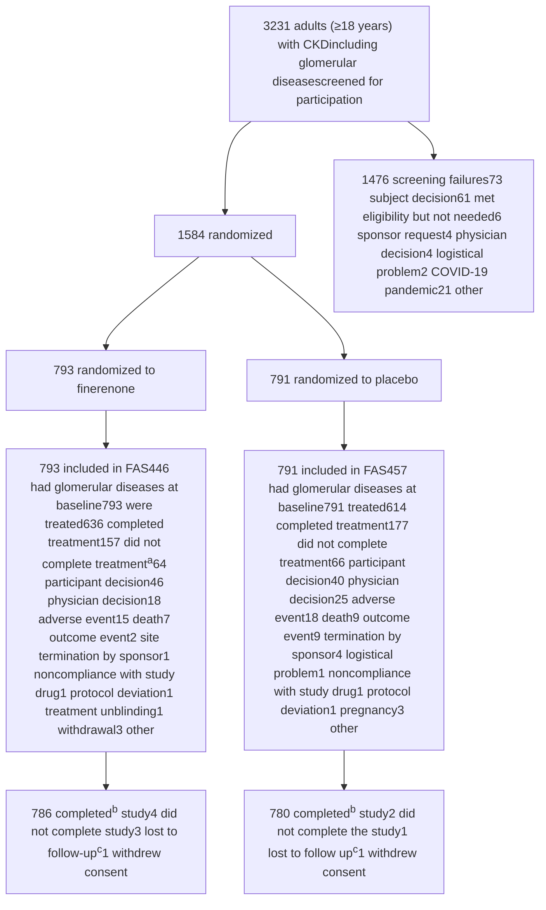

# Supplemental Online Content

Neuen BL, Perkovic V, Agarwal R; FIND-CKD Investigators. Finerenone in patients with chronic kidney disease due to glomerular diseases: a randomized clinical trial. *JAMA*. Online June 5, 2026. doi: 10.1001/jama.2026.9923

FIND-CKD Committees .................................................................................................................................. 2
Steering Committee ...................................................................................................................................... 2
Data Monitoring Committee .......................................................................................................................... 2
Collaborators ................................................................................................................................................ 2
Investigators by Country and Region ............................................................................................................. 3
Sponsor Study Team.................................................................................................................................... 10
Supplementary Methods .............................................................................................................................. 11
Dose Titration in FIND-CKD ......................................................................................................................... 11
Statistical Analysis........................................................................................................................................ 11
Imputation of Intercurrent Events ................................................................................................................. 11
eTables ........................................................................................................................................................ 12
eTable 1. FIND-CKD Full Inclusion and Exclusion Criteria........................................................................... 12
eTable 2. Demographic and Clinical Characteristics of the Overall FIND-CKD Population and Participants With Glomerular Diseases at Baseline ........................................................................................................ 14
eTable 3. Total eGFR Slope at 32 Months According to Baseline Albuminuria............................................ 15
eTable 4. Summary of Participants With Glomerular Diseases With Treatment-Emergent AEs .................. 16
Supplementary Figures ................................................................................................................................ 17
eFigure 1. CONSORT Diagram (Full FIND-CKD Population) ....................................................................... 17
eFigure 2. Subgroup Analysis According to Glomerular Disease Etiology (Confirmed with Biopsy) for (A) Change in eGFR From Baseline to Month 32 (Total Slope), (B) Change in eGFR From Month 3 to End of Treatment (Chronic Slope), (C) Change in UACR From Baseline to Month 12 ............................................ 18
eFigure 3. Subgroup Analysis According to SGLT2i Use at Baseline for A) Change in eGFR From Baseline to Month 32 (Total Slope), (B) Change in eGFR From Month 3 to End of Treatment (Chronic Slope), (C) Change in UACR From Baseline to Month 12 .............................................................................................. 19
eFigure 4. Change in eGFR From Baseline to Month 3 (Acute Slope) According to Glomerular Disease Etiology ........................................................................................................................................................ 20
eFigure 5. Change in UPCR From Baseline to Month 12 According to Glomerular Disease Etiology .......... 21
eFigure 6. Subgroup Analysis for Kidney Failure or ≥40% Decline in eGFR by Glomerular Disease Subtype in the Biopsy Cohort ..................................................................................................................................... 22
eFigure7. Subgroup Analysis for Kidney Failure or ≥40% Decline in eGFR by SGLT2i Use at Baseline ..... 23

This supplemental material has been provided by the authors to give readers additional information about their work.

© 2026 American Medical Association. All rights reserved, including those for text and data mining, AI training, and similar technologies.

# FIND-CKD Committees

## Steering Committee

Hiddo J.L. Heerspink, Ph.D. (University of New South Wales, Sydney, New South Wales, Australia and University of Groningen, Groningen, the Netherlands), Brendon L. Neuen, M.B., B.S., Ph.D. (University of New South Wales and Royal North Shore Hospital, Sydney, New South Wales, Australia), Rajiv Agarwal, M.D. (Richard L. Roudebush VA Medical Center and Indiana University School of Medicine, Indianapolis, Indiana, USA), David Z.I. Cherney, M.D., Ph.D. (Toronto General Hospital and University of Toronto, Toronto, Ontario, Canada), Carolyn S.P. Lam, M.B., B.S., Ph.D. (National Heart Centre Singapore and Duke-National University of Singapore Medical School, Singapore), Katherine R. Tuttle, M.D. (Providence Inland Northwest Health and University of Washington School of Medicine, Spokane, Washington, USA), Christoph Wanner, M.D. (University of Würzburg, Würzburg, Germany), Vlado Perkovic, M.B., B.S., Ph.D. (University of New South Wales, Sydney, New South Wales, Australia). The authors would also like to acknowledge the late George L. Bakris, esteemed FIND-CKD steering committee member, who passed away in June 2024.

## Data Monitoring Committee

Glenn M. Chertow, M.D., M.P.H. (Stanford University, Stanford, California, USA), Murray Epstein, M.D., F.A.S.N, F.A.C.P. (University of Miami, Miami, Florida, USA), Tim Friede, Ph.D. (University Medical Center Göttingen, Göttingen, Germany), Adeera Levin, M.D., (University of British Colombia and Providence Health Care/St Paul’s Hospital, Vancouver, British Colombia, Canada), Johannes F.E. Mann, M.D. (Friedrich Alexander University of Erlangen-Nürnberg, Erlangen and Nürnberg, Germany and Munich General Hospitals, Munich, Germany).

## Collaborators

American Association for Kidney Patients

J. David Smeijer, M.D., and Niels Jongs, Ph.D., University Medical Center Groningen, Groningen, the Netherlands.

© 2026 American Medical Association. All rights reserved, including those for text and data mining, AI training, and similar technologies.

# Investigators by Country and Region

**National lead investigator coordinator:** Panteleimon (Pantelis) Sarafidis

**Argentina:** Rafael Maldonado (national lead), Paola Aguerre, Paula Arenas, Mariano Arriola, Claudia Emilce Baccaro, Maria Bevilacqua, Julio Bittar, Dafne Brodschi, Julia Caceres, Gina Campestri, Maria Cecilia Cantero, Santiago Cardona, Florencia Casan, Evelin Cassini, Gustavo Catalano, Mariano Chahin, Natalia Cluigt, Ana Florencia Comes, Pamela Delgado, Maria Paula Dionisi, Silvina Dominguez, Rocio Fernandez, Elizabeth Gelersztein, Sandra Giacometti, Diego Andres Mohr Gosparini, Fernando Pedro Guerlloy, Fernando Halac, Miguel Angel Hominal, Cecilia Igarzabal, Veronica Lacoste, Micaela Leis, Pablo Martinez, Virginia Rama, Lucia Rodriguez, Silvia Rodriguez, Luciana Rovegno, Benjamin Saenz, Maria Victoria Sobredo, Matias Suarez, Patricia Varela, Guido Villalobo, Sernia Virginia, Diego Waserman, Daniela Magali Zaccaro, Javier Zaidman

**Australia:** David Packham (national lead), Sunil Badve, Melissa Cheetham, Jenny Chen, Kathryn Ducharlet, Dov Degen, Yusuf Eqbal, Adam Flavell, Celine Foote, Nicholas Gray, Carmel Hawley, Peter Hollett, Jane Holt, Louis Huang, Nicole Isbel, Dev Jegatheesan, Rathika Krishnasamy, Christina Lai, Cathie Lane, Darren Lee, Kumaradevan Mahadevan, George Mangos, Euan Noble, Eugenia Pedagogos, Mona Razavian, Angus Ritchie, Matthew Roberts, Kate Robson, Shaundeep Sen, Amanda Wang, Jane Waugh, Muh Geot Wong, Lucy Wynter

**Belgium:** Marijn Speeckaert (national lead), Bert Bammens, Kathleen Claes, Marc Decupere, Katrien De Vusser, Bernard Dubois, Peter Doubel, Pieter Evenepoel, Michel Jadoul, Francois Jouret, Laura Labriola, Bart Maes, Thomas Malfait, Gert Meeus, Bjorn Meijers, Maarten Naesens, Olivier Schockaert, Wim Van Biesen, Amaryllis Van Craenenbroeck, Elliott Van Regemorter, An Vanacker, Liesbeth Viaene

**Bulgaria:** Svetla Stamova (national lead), Gencho Arabadzhiev, Lachezar Atanasov, Stela Bilcheva, Christo Dimitrov, Irena Dimitrova, Ivan Georgiev, Ivan Gerchev, Lyubomir Hristov, Veselin Hristozov, Stefan Ilchev, Georgi Ivanov, Yordanka Ivanova, Boyka Ivanova-Terzieva, Kostadin Kichukov, Neli Koleva, Georgi Lichev, Ginka Marinova-Racheva, Georgi Mazhdrakov, Ismed Mehmedov, Lora Nikolova, Iliev Rumen, Plamen Pelov, Rositsa Petrova, Blagovest Stoimenov, Galina Stoyanova, Velina Stoyanova, Vladislava Todorova, Vasil Tsenov, Albena Vasileva, Daniela Vasileva, Liliya Vasileva-Boyadzhieva, Tsvetelina Vutova, Tundzhay Yuztyurk, Vladimir Zhelev

**China:**
Xiangmei Chen (national lead), Yelixiati Adelibieke, Jianxiang Bai, Weijing Bian, Kedan Cai, Yuan Cai, Jingyuan Cao, Lingxiong Chai, Suolinge Chahan, Xuejing Chang, Hong Cheng, Jinxiu Cheng, Bo Chen, Chaosheng Chen, Cheng Chen, Jia Chen, Lianhua Chen, Long Chen, Menghua Chen, Qingping Chen, Qinkai Chen, Ruixue Chen, Weidong Chen, Xing Chen, Xinghua Chen, Yihua Chen, Caixia Cui, Shuang Cui, Yingchun Cui, Xiaokai Ding, Xiaoqiang Ding, Junwu Dong, Liping Dong, Xiangnan Dong, Juan Du, Xingguo Du, Weifeng Fan, Ming Fang, Xiaonan Feng, Yingzhou Geng, Wenyu Gong, Yingli Gu, Yuzhen Guan, Liming Guo, Ling Guo, Qiaoyan Guo, Tingting Guo, Ziwei Guo, Sailaiajimu Guzailinuer, Dapeng Hao, Yaning Hao, Qin He, Weiming He, Xiaoquan He, Yani He, Xianghua Hou, Haiyun Hu, Jijia Hu, Ping Hu, Weiping Hu, Yanping Hu, Chengwen Huang, Qianyin Huang, Shengling Huang, Wenjing Huang, Gengru Jiang, Chonggao Jia, Yonghong JIan, Li Jin, Bing Li, Hua Li, Jianfei Li, Jiefeng Li, Jing Li, Li Li, Lu Li, Minxia Li, Peilin Li, Peng Li, Qing Li, Shenheng Li, Wei Li, Wenge Li, Yinan Li, Youqi Li, Yuehong Li, Zengyan Li, Hongqing Liang, Wei Liang, Yaojun Liang, Hongli Lin, Kexuan Lin, Yongqiang Lin, Bicheng Liu, Chunxiao Liu, Cuilan Liu, Dan Liu, Fang Liu, Fanna Liu, Feng Liu, Guangyi Liu, Hongyan Liu, Hua Liu, Lei Liu, Longhui Liu, Qiong Liu, Shengjun Liu, Siyi Liu, Yu Liu, Zhifen Liu, Gang Long, Haibo Long, Yinhua Long, Bingpeng Lu, Wanhong Lu, Xuehong Lu, Congwei Luo, Ping Luo, Qun Luo, Xia Lv, Yinqiu Lv, Xue Ma, Xiaoyan Meng, Li Ni, Lin Ning, Dan Niu, Jianying Niu, Xing Pan, Yan

© 2026 American Medical Association. All rights reserved, including those for text and data mining, AI training, and similar technologies.

Pan, Fenfen Peng, Chunmei Qin, Haiao Qin, Wenxian Qiu, Weidong Ren, Zhilong Ren, Zhakeer Rexidan, Weifeng Shang, Sinan Shao, Shujun Shi, Xuan Shi, Yanling Shi, Yongjun Shi, Baolin Su, Bofeng Su, Ke Su, Wenxue Sun, Xuejuan Sun, Yanbei Sun, Shuifu Tang, Xun Tang, Yingqian Tang, Yufeng Tang, Yuyan Tang, Qianru Tao, Ming Tian, Haitao Tu, Yan Tu, Jingfang Wan, Baoan Wang, Caili Wang, Dao Wang, Deguang Wang, Fang Wang, Fengmei Wang, Fengyun Wang, Hong Wang, Jialin Wang, Jianqin Wang, Kaiyue Wang, Lailiang Wang, Linlin Wang, Rui Wang, Ruifeng Wang, Shuyun Wang, Xiaoling Wang, Xuerong Wang, Ya Wang, Ying Wang, Yu Wang, Zengsi Wang, Zhigang Wang, Honglan Wei, Xiansen Wei, Zhifeng Wei, Zhongping Wei, Chaoqing Wu, Guangfu Wu, Guanmin Wu, Min Wu, Qing Wu, Shukun Wu, Xueping Wu, Yang Wu, Yuou Xia, Qijing Xian, Xiaoyan Xiao, Fei Xiong, Li Xiang, Boyang Xu, Feng Xu, Huiying Xu, Jia Xu, Junfu Xu, Lingcang Xu, Qianqian Xu, Xudong Xu, Yan Xu, Xiaotong Xie, Bing Yan, Jin Yan, Rui Yan, Aicheng Yang, Dingping Yang, Jie Yang, Min Yang, Xiangdong Yang, Yan Yang, Yansong Yang, Qi Yao, Nan Ye, Xiaohan You, Chuanqi Yu, Jinbo Yu, Manshu Yu, Tianyu Yu, Xiaoyang Yu, Ying Yu, Yi Yu, Jun Yuan, Li Zeng, Rong Zeng, Chong Zhang, En Zhang, Han Zhang, Huidi Zhang, Ji Zhang, Jianna Zhang, Jiong Zhang, Jingjing Zhang, Jun Zhang, Li Zhang, Mengyu Zhang, Min Zhang, Xiaobo Zhang, Xiaoyan Zhang, Yanmin Zhang, Jing Zhao, Yuancheng Zhao, Zhirui Zhao, Le Zheng, Min Zheng, Qingfa Zheng, Ying Zheng, Yu Zhong, Fangfang Zhou, Hua Zhou, Weidong Zhou, Xiaoling Zhou, Yan Zhou, Haoshen Zhu, Ya Zhuge, Li Zhuo, Chunbo Zou, Guming Zou, Jun Zou, Yun Zou, Yurong Zou

**Czech Republic:** Martin Prazny (national lead), Petr Bucek, Karolina Chadimova, Petra Divacka, Lucie Fantova, Marika Goluchova, Lucie Hornova, Martin Lukac, Maria Majernikova, Jiri Matuska, Helena Mrlianova, Jitka Pecirkova, Jitka Rehorova, Jan Senitko, Jan Skrha, Sarka Svobodova, Svetlana Vankova, Marek Weiss, Jan Wirth

**Denmark:** Mads Hornum (national lead), Jesper Bech, Iain Bressendorf, Peter Clausen, Stine Louise Høyer Finsen, Sabina Chaudhary Hauge, Ditte Hansen, Gitte Rye Hinrichs, Claus Bogh Juhl, Dea Kofod, Morten Lindhardt, Ebba Elisabeth Mannheimer, Frank Holden Mose, Line Aaes Mortensen, Karin Brochner Ostergaard, Ida Maria Hjelm Soerensen, Marie Abildgaard Tolstrup

**Greece:** Evangelos Papachristou (national lead), Atalla Alexandros, Maria-Eleni Alexandrou, Dimitrios Apostolakis, Karmen Armetzioiou, Gerasimos Bamichas, Christos Bantis, Marianna Bakou, Ioannis Boletis, Margarita Bora, Adamantia Bratsiakou, Aglaia Chalkia, Kleio Eleftheria Dermitzaki, Chrysostomos Dimitriadis, Eleni Drosataki, Anila Duni, Melani Erotokritou, Stylianos Fragkidis, Michael Garoufis, Panagiotis Giamalis, Dimitrios Goumenos, Chariklia Gouva, Athanasia Kapota, Achillefs Karras, Georgios Alexandros Kavvadias, Theodora Kouloukourgiotou, Parthena Kyriklidou, Anna Loli, Aikaterini Lysitska, Ioannis Mallioras, Eleni Manou, Smaragdi Marinaki, Efstathios Mitsopoulos, Anna Mountzourogeorgou, Alexandra Ntemka, Evangelia Ntounousi, Dorothea Papadopoulou, Aikaterini Papagianni, Michalis Papapanagiotou, Marios Papasotiriou, Stella Paschou, Panagiotis Pateinakis, Ioannis Petrakis, Dimitrios Petras, Panteleimon (Pantelis) Sarafidis, Chrysanthi Skalioti, Maria Smyrli, Georgios Spanos, Maria Stangou, Konstantinos Stylianou, Maria Panagiota Theodorakopoulou, Ioanna Theodorou, Maria Triantafyllidou, Ioannis Tsouchnikas, Kalliopi Vallianou, Efstathios Xagas

**Hong Kong:** Sydney Chi Wai Tang (regional lead), Anthony Ting Pong Chan, Gary Chi Wang Chan, Au Cheuk, Samuel Ka Shun Fung, Lorraine Pui Yuen Kwan, Kit Ming Lee, William Lee, Victor Li, Davina Ngoi Wah Lie, Sing Leung Lui, Jack Kit Chung Ng, Cheuk Chun Szeto, Arthur Ho Cheung Tang, Hon Lok Tang, Jeffrey Tsun Wai Wu, Jessica Man Ka Yeung

**Hungary:** Laszlo Kovacs (national lead), Gabriella Bencze, Hocine Boulellou, Dora Csaplaros, Szilvia Csitneki, Paula Endredy, Robert Kirschner, Tibor Kovacs, Aniko Nemeth, Tamas Szelestei, Tamas Szalay, Istvan Wittmann, Peter Zilahi, Zsolt Zilahi

© 2026 American Medical Association. All rights reserved, including those for text and data mining, AI training, and similar technologies.

**India:** Sanjay Agarwal (national lead), Susanne Nicholas (diversity lead), Nagesh Aghor, Alan Almeida, Venkatesh Arumugam, Subbiah Arunkumar, Gagan Deep Chhabra, Ayan Dey, Kunal Gandhi, Natarajan Gopalakrishnan, Noble Gracious, Avinash Ignatius, Saurabh Khiste, Dinesh Khullar, Aparna Kodre, VR Krishnakumar, Tanuj Moses Lamech, Siddharth Mavani, Atanu Pal, Rajendra Pandey, Sakthirajan Ramanathan, Manisha Sahay, Rakesh Sahay, Patil Sandesh, Mayank Shah, Rakesh Shinde, Rasika Sirsat, Devika SL, Bagchi Soumita, Jadhav Swapnil, Dineshkumar Thanigachalam, Akshay V

**Israel:** Benaya Rozen-Zvi (national lead), Nabil Abu-Amer, Wafiq Amon, Ashraf Badran, Daphna Bar-Nur, Anna Basok, Orit Kliuk-Ben Bassat, Illia Beberashvili, Pazit Beckerman, Sydney Ben Chetrit, Keren Cohen-Hagai, Naomi Ben Dor, Ray Biton, Gil Chernin, Ismail El Sayed, Evgeny Farber, Raed Gantus, Anam Hanut, Michael Hausmann, Yosef Haviv, Yuval Horwich, George Jeiris, Ze'ev Katzir, Raisa Kazarsky, Yael Kenig, Irina Kenis, Avital Angel Korman, Etty (Esther) Kruzel-Davila, Olga Lesya Kukuy, Larissa Lebedev, Adi Leiba, Ronen Levi-Varadi, Nomy Levin-Iaina, Anna Mikhlin, Sharon Mini-Goldberger, Valeria Morduhovich, Naomi Nacasch, Chen Oren, Husman Qasim, Ilan Rahmani Tzvi Ran, Vladimir Rapoport, Michal Raz, Irena Rubinchik, Marina Sapojnikov, Tomer Scheib, Doron Schwartz, Mahran Shalaata, Pavel Sheinberg, Marina Tchircov, Olga Vdovich, Marina Vorobiov, Alexander Wechsler, Yoram Yagil, Teuta Zeitun

**Italy:** Roberto Minutolo (national lead), Valeria Aiello, Tino Paolo Ambrosino, Rocco Baccaro, Graziana Battini, Giada Bigatti, Francesca Giovanna Boni, Serena Bruno, Irene Capelli, Gianni Cappelli, Francesca Maria Ida Carminati, Roberto Cimino, Irene Colombini, Francesco Cosa, Eleonora Cristini, Erica Daina, Marco Delsante, Gabriele Donati, Ciro Esposito, Vittoria Esposito, Enrico Fiaccadori, Annachiara Ferrari, Aldo Franculli, Stefania Giberti, Barbara Gidaro, Ilaria Ida Giordano, Giuseppe Grandaliano, Maria Cristina Gregorini, Carlo Maria Guastoni, Francesca Guglielmi, Aneliya Parvanova Ilieva, Gaetano La Manna, Sarah Lerario, Maria Elena Liberti, Raul Mancini, Antonio Marino, Carlo Minicucci, Benedetta Morda, Niccolo Morisi, Elisa Olivo, Chiara Paccagnella, Maria Chiara Pacchiarini, Andrea Palladini, Rodolfo Fernando Rivera, Laura Rimoldi, Gennaro Santorelli, Renato Savino, Roberta Scarmignan, Anna Scrivo, Giuseppe Sileno, Enrico Tinti, Matias Trillini, Anna Vella

**Japan:** Masaomi Nangaku (national lead), Eriko Abe, Keisuke Abe, Kenichiro Abe, Masanori Abe, Taisei Abe, Shohei Adachi, Shinji Ako, Hiroaki Amano, Morimasa Amemiya, Daiki Aomura, Kunii Ayana, Kengo Azushima, Kenji Baba, Seishiro Baba, Ayako Ban, Yuki Beppu, Kyoji Chiba, Rieko China, Ichikawa Daisuke, Masayuki Ebihara, Yu Eto, Fumika Fujii, Mako Fujii, Naohiko Fujii, Tetsuro Fujii, Yusuke Fujii, Miho Fujimura, Kiichiro Fujisaki, Mikoto Fujishiro, Masako Fujita, Yoshiro Fujita, Masafumi Fukagawa, Kei Fukami, Yusuke Fukao, Daichi Fukaya, Yoshinobu Fuke, Hiromitsu Fukuda, Natsuki Fukuda, Shungo Fukuda, Yuriko Fukuda, Kanako Fukuhara, Yuichiro Fukuhara, Kento Fukumitsu, Akihiro Fukuoka, Rika Furuta, Fumihiko Furuya, Tomohito Gohda, Kento Goto, Shunsuke Goto, Ryota Haga, Junichiro Hagita, Takayuki Hamano, Satoshi Hamanoue, Tomoya Hamashoji, Akinori Hara, Kenji Harada, Makoto Harada, Koji Hashimoto, Takuto Hayakawa, Masato Hayashi, Seiichiro Hemmi, Yuji Hidaka, Fujii Hideki, Nishida Hidenori, Rieko Higashide, Shinichi Higuchi, Toshiyuki Hirai, Akira Hirano, Sae Hirata, Hitomi Hirose, Tatsuki Hirose, Hiroto Hiyamuta, Ryoko Honda, Keisuke Horikoshi, Shu Horikoshi, Taro Hoshino, Fumitaka Ihara, Hiroki Ikai, Eri Ikeda, Megumi Ikeda, Yoichiro Ikeda, Kaho Ikeshita, Atsuhiro Imono, Kou Imoto, Motoki Inoue, Natsumi Inoue, Tsutomu Inoue, Keita Inui, Shinichiro Irie, Kohei Ishiga, Tomomi Ishihara, Masao Ishii, Toshihisa Ishii, Masanori Ishizaka, Toshinori Ishizuka, Rina Isohata, Akiko Itano, Seiji Itano, Daisuke Ito, Kenji Ito, Sadatoshi Ito, Yuki Ito, Yuto Ito, Ryohei Iwabuchi, Tsukasa Iwakura, Tamio Iwamoto, Keita Iwasaki, Masako Iwasaki, Yasunori Iwata, Manabu Kado, Hiroyuki Kadoya, Eriko Kajimoto, Mayuri Kambayashi, Yuji Kamijo, Ayaka Kamio, Daisuke Kanai, Genta Kanai, Hidetoshi Kanai, Tomohiko Kanaoka, Takayuki Kanbe, Eiichiro Kanda, Hidetoshi Kaneoka, Takuya Kanno, Yoshihiko Kanno, Chika Kano, Rika Kasahara, Rina Kasai, Naoki Kashihara, Takahisa Kasugai, Arisa Kato, Miku Kato, Kyogo Kawada, Yuki Kawai, Masato Kawakami, Keiko Kawasaki, Takaaki Kawata, Okamoto Kazuhiro, Kengo Kidokoro, Masao Kihara, Satoru Kimura, Shunta

© 2026 American Medical Association. All rights reserved, including those for text and data mining, AI training, and similar technologies.

Kimura, Yuta Kimura, Sho Kinguchi, Seiji Kishi, Yukari Kishima, Kiyoki Kitagawa, Maki Kitai, Shinji Kitajima, Shunsuke Kitamura, Hiroki Kobayashi, Midori Kobayashi, Ryu Kobayashi, Taiga Kobayashi, Takashi Kobayashi, Tatsuya Kobayashi, Hirokazu Koda, Tatsumi Kodama, Kaori Kohatsu, Shigehisa Koide, Gakuou Koizumi, Masahiro Koizumi, Maiko Kokubu, Waka Kokuryo, Hirotaka Komaba, Shiro Komiya, Megumi Kondo, Tatsuo Kondo, Makiko Konishi, Keiji Kono, Takeo Koshida, Hitoshi Kotake, Yoshiaki Kozaki, Motoyasu Kurahashi, Fumiko Kuwahara, Mingfeng Lee, Yoshitaka Maeda, Masayuki Maiguma, Murakoshi Maki, Yuichiro Makita, Yuko Makita, Yamamoto Marumi, Takashi Maruyama, Akihiro Masaki, Kosuke Masutani, Daisuke Matsui, Masaru Matsui, Noriaki Matsui, Hidenobu Matsumoto, Keiichiro Matsumoto, Hana Matsuoka, Hiroki Matsuoka, Yuki Matsuura, Imari Mimura, Taichiro Minami, Tomomi Minamisawa, Taro Misaki, Soichiro Misegawa, Yoei Miyabe, Taro Miyagawa, Kanyu Miyamoto, Yoshitaka Miyaoka, Hitoshi Miyasato, Takanori Miyazaki, Rinsaku Miyazawa, Masashi Mizuno, Masato Mizuta, Anri Mori, Daisuke Mori, Katsuo Mori, Rieko Morita, Ryutaro Morita, Takahito Moriyama, Yukari Murai, Miho Murashima, Yusuke Murata, Takanori Muta, Masahiro Muto, Yuna Muto, Miho Nagai, Yoshiro Nagano, Ai Nagasawa, Fumika Nagase, Koya Nagase, Ai Nagashima, Hajime Nagasu, Katsuyuki Nagatoya, Masahiro Nakagaki, Saeko Nakagawa, Shiori Nakagawa, Yosuke Nakagawa, Yusuke Nakamata, Megumi Nakamura, Yoshihiro Nakamura, Yuki Nakamura, Yutaka Nakano, Satsuki Nakashita, Junichiro Nakata, Izaya Nakaya, Maiko Nakayama, Yuki Nakayama, Ayaka Nambu, Yuta Namiki, Yuki Naruse, Hiroko Nawata, Masuyuki Nawata, Yoshihito Nihei, Takayuki Nimura, Hiroshi Nishi, Shinichi Nishi, Marina Nishikawa, Takahiko Nobuoka, Ayumi Noda, Keita Noda, Hiroki Nomi, Ayumu Nomizu, Akihiro Nomura, Naohiro Nosho, Arisa Nozaki, Shintaro Ochiai, Aiko Oda, Riku Oda, Tomomi Ogasa, Akihiro Ogawa, Hidetaka Oguma, Hisayuki Ogura, Yoshitatsu Ohara, Atsuki Ohashi, Kohji Ohki, Kohei Ohori, Hirokazu Okada, Eimei Okamoto, Hirofumi Okamoto, Kazuhiro Okamura, Masahiro Okamura, Nozomi Okamura, Go Okanishi, Jun Okita, Kie Okoshi, Ayako Okuno, Minamo Ono, Sumihisa Ono, Kiyomi Osako, Keiichi Osano, Jin Oshikawa, Megumi Oshima, Tadashi Oshita, Jun Ota, Yoshito Otomo, Tomoyuki Otsuka, Junji Oyama, Shingo Ozaki, Moe Ozawa, Toshikazu Ozeki, Kitaoka Reo, Tetsuro Rikihisa, Mizuho Saeki, Midori Saito, Rina Saito, Suguru Saito, Takahiro Saito, Sanae Saka, Norihiko Sakai, Kazuo Sakamoto, Tsutomu Sakurada, Sho Sasaki, Tamaki Sasaki, Yasunori Sasaki, Yuya Sasatsuki, Junichi Sato, Koichi Sato, Koji Sato, Yoshiki Sato, Yuichi Sato, Yuichiro Sawada, Shoji Sawaki, Yumika Seki, Yugo Shibagaki, Maki Shibata, Motoko Shimada, Yuji Shimada, Sho Shimamoto, Norisuke Shimamura, Hideaki Shimizu, Mao Shimizu, Masatoshi Shimizu, Miho Shimizu, Yoshitaka Shimizu, Sayuri Shirai, Yoshida Shun, Keisuke Soeda, Jun Soma, Wataru Sone, Yusuke Sonezaki, Mari Sotozawa, Hiroshi Suga, Mai Sugahara, Ayaka Sugimachi, Michihisa Sugita, Yusuke Sumitani, Hiroshi Suwa, Yumi Suwa, Hitoshi Suzuki, Satoshi Suzuki, Yusuke Suzuki, Kazuhiro Tada, Yuka Tadanawa, Genri Tagami, Takashi Taguchi, Miyuki Takagi, Hisatsugu Takahara, Kazuya Takahashi, Koji Takahashi, Jun Takami, Hiroyuki Takashima, Taisuke Takatsuka, Yuri Takeda, Miyoshi Takeuchi, Riku Takeuchi, Masaaki Takizawa, Naoho Takizawa, Shinjiro Tamai, Yoshihiko Tamayama, Koichi Tamura, Misumi Tamura, Yasuhisa Tamura, Shin Tanaka, Shohei Tanaka, Tetsuhiro Tanaka, Yuki Tanaka, Yohei Taniguchi, Haruna Tanoue, Kosuke Tansho, Rie Tatsugawa, Ryoma Tatsumoto, Ritsukou Tei, Yumi Tobari, Masayoshi Toda, Takayuki Toda, Maho Tokuchi, Saori Tomita, Tatsuya Tomonari, Koji Tomori, Kano Toshiki, Tomoyuki Toya, Yoshiyuki Toya, Tadashi Toyama, Mariko Toyoda, Kazuki Toyota, Koki Tsubota, Shunichiro Tsukamoto, Hideo Tsushima, Kohei Uchimura, Eiko Ueda, Seiji Ueda, Shun Ueda, Reina Umeno, Yukako Umezawa, Shingo Urate, Masafumi Wada, Takashi Wada, Takehiko Wada, Yoshihisa Wada, Hiromichi Wakui, Naoko Waseda, Mizuki Watada, Kentaro Watanabe, Shiika Watanabe, Tsuyoshi Watanabe, Yuki Watanabe, Yusuke Watanabe, Haruka Yabuta, Aiko Yamada, Koshi Yamada, Shigehiro Yamada, Yosuke Yamada, Kosuke Yamaka, Eriko Yamamoto, Koichiro Yamamoto, Mari Yamamoto, Masako Yamamoto, Toshiya Yamamoto, Yuta Yamamura, Takahiro Yamanaka, Masatomo Yamane, Satoshi Yamane, Ayaka Yamanishi, Yu Yamanouchi, Atsushi Yamauchi, Ryo Yasuhara, Tetsuhiko Yasuno, Masahiko Yazawa, Masakazu Yoda, Yuki Yokoyama, Sayoko Yonemoto, Hiroki Yoshida, Yoshinori Yoshida, Shiori Yoshimura, Masabumi Yoshino, Yuri Yoshitake, Takahiro Yuasa, Jun Yuto

© 2026 American Medical Association. All rights reserved, including those for text and data mining, AI training, and similar technologies.

**Malaysia:** Wan Ahmad Hafiz Wan Md Adnan (national lead), Nur Nadzifah Hanim Zainal Abidin, Mohd Kamil Ahmad, Nuzaimin Hadafi Ahmad, Norzawati Ali, Wan Ahmad Syahril Rozli Wan Ali, Kavitha Appava, Azrini Abdul Aziz, Alia Zubaidah Bahtar, Sunita Bavanandam, Chee Eng Chan, Meng Lee Chang, Chang Chuan Chew, Chia Ling Chew, Chee Loong Chong, Sarah Qian Rou Choo, WenJet Choong, Loo Han Chuan, Sun Quan Ee, Fareeza Hawani Muhamad Fawzi, Zher Lin Go, Subasni Govindan, Siti Hafizah Mohammad Ismail, Muhamad Ali Sk Abdul Kader, Huan Yean Kang, Nurnadiah Kamarudin, Sujesthra Rao Krishnamurthy, Kesavathy Krishnan, Aik Kheng Lee, Kai Quan Lee, Li Yuan Lee, Sue Ann Lee, Yee Yan Lee, Kah Weng Liew, Xue Meng Lim, Chek Loong Loh, Yik Kian Looi, Jer Ming Low, Doo Yee Mah, Sadanah Aqashiah Datuk Mazlan, Wan Hazlina Wan Mohamad, Tze Jian Ng, Fariz Safhan Mohamad Nor, Hidayatil Alimi Keya Nordin, Nurul Zaynah Nordin, Sharifah Nursamihah Syed Abd Rahman, Sridhar Ramanaidu, Hajar Ahmad Rosdi, Ahmad Akashah Mohamed Shariff, Siew Wai Shuit, Nur Shahadah Abdul Shukor, Devamalar Simatherai, Anandprakash Sivapirakasam, Chan Hoong Song, Chyi Shyang Tan, Esther Zhao Zhi Tan, Min Hui Tan, Nee Hooi Tan, Meng Kang Tee, Kah Mean Thong, Kung Ung Tiong, Jeevika Vinathan, Mohamad Zaimi Abdul Wahab, Chun Mun Wong, Eddie Fook Sem Wong, Hin Seng Wong, Joon Mun Wong, Albert Hing (Wong), Rosnawati Yahya, Suryati Yakob, Joel Guan Hui Yap, Seow Yeing Yee, Kig Tsuew Yong, Muslihah Zainon, Wan Mohd Khairul Wan Zainudin

**Mexico:** Alfredo Chew Wong (national lead), Stephanie Giselle Montoya Azpeitia, Edmundo Alfredo Bayram, Carlos Chavez del Bosque, Rosa Luna Ceballos, Yesica Lozano Gonzalez, Alejandra Gutierrez, Georgina Llamas Guitierrez, Marcos Jaime Lara, Gilmer Alfredo Ruvalcaba Lopez, Marilyn Gonzalez Maldonado, Lila Gonzalez Morgado, Cutzi Nirvana Vidales Moctezuma, Juan Nava, Elizabeth Pacheco, Sandro Fabricio Avila Pardo, Jorge Echeverri Rico, Luis Gerardo González Salas, Alejandro Cornejo Sanchez, Sergio Irizar Santana, Thamara Tellez, Jorge Valente, Mariana Contreras Varela

**Portugal:** Rita Birne (national lead), Ana Alves, Rui Barata, Sara Barreto, Patricia Branco, Andreia Carnevale, Fernando Teixeira e Costa, Joana Silva Costa, Juliana Damas, Diogo Domingos, Rachele Escoli, Sara Fernandes, Anibal Ferreira, Francisco Ferrer, Cátia Figueiredo, Ana Rita Martins, Catarina Marouco, Carla Nicolau, Fernando Nolasco, Tiago Pereira, Gonçalo Pimenta, Filipa Rodrigues, Maria Roxo, Joana Silva, Maria Pilar Simoes, Helena Vidal

**Russia:** Vladimir Dobronravov (national lead), Tatyana Abissova, Natalia Antropenko, Mikhail Batiushin, Olga Blagoveschenskaya, Nikolay Bondarenko, Natalia Bronovitskaya, Elena Chernyavskaya, Maria Danilova, Tatyana Elenskaya, Sergey Eshmakov, Andrey Ezhov, Olga Filatova, Natalia Glotova, Anna Karunnaya, Denis Kilin, Anastasiya Kupyanskaya, Olga Kuznetsova, Lyudmila Kvitkova, Ekaterina Levitskaya, Natalia Odintsova, Marina Orlova, Leonid Pimenov, Aleksandra Razina, Tatyana Rodionova, Tatiana Savelieva, Irina Shashneva, Anna Solovieva, Elena Streltsova, Natalia Tagintseva, Maksim Vasiliev, Nastasya Yur, Igor Zadvorny, Elena Zhdanova

**Singapore:** See Cheng Yeo (national lead), Gek Cher Chan, Horng Ruey Chua, Yan Ting Chua, Yi Da, Loke Ealing, John Hsu, Zheng Xi Kog, Jia Liang Kwek, Eunice Shi Min Lim, Allen Liu, Irene Mok, Clara Ngoh, Xi Yan Ooi, Stella Xiao Jun Poh, Hersharan Kaur Sran, Sufi Muhummad Suhail, Ngiap Chuan Tan, Jimmy Teo, Wanting Weng, Cindy Wong, Emmett Wong

**South Korea:** JungNam An, Tae Hyun Ban, JinJoo Cha, Ajin Cho, Bum-Soon Choi, Dae Eun Choi, SangHun Eum, Young Rok Ham, Byoung-Geun Han, Kum Hyun Han, Sang Youb Han, Seung Seok Han, Hyuk Huh, Hye Ryoun Jang, Jun Seok Jeon, Hye Yun Jeong, Chan-Young Jung, Su Woong Jung, Young Sun Kang, YounKyung Kee, Byung Soo Kim, Da Won Kim, Do Hyoung Kim, HyungWoo Kim, Jaeseok Kim, JwaKyung Kim, SungGyun Kim, Tae Gyoung Kim, Yang Gyun Kim, Yeong Hoon Kim, Yong Chul Kim, Yunmi Kim, Hajeong Lee, HyungSeok Lee Jangwook Lee, Jeonghwan Lee, Joo Eun Lee, JungEun Lee, Jung Pyo Lee, Junyoung Lee, Kang Wook Lee, Sang Ho Lee, So Young Lee, YeonHee Lee, Yu Ho Lee, Young Ki Lee, Ju-Young Moon, Ki-Ryang Na, Ji Eun Oh, Hayne Park, Jae-

© 2026 American Medical Association. All rights reserved, including those for text and data mining, AI training, and similar technologies.

yoon Park, Jung Tak Park, DongHo Shin, Seok Joon Shin, Sungjoon Shin, Christine Silvain, YoungRim Song, Dong-Ho Yang, Jaewon Yang, Hye Eun Yoon, So Jung Youn

**Spain:** María Soler Romero (national lead), Irene Agraz, Enrique Garrigos Almerich, Ana Lorenzo Almorós, Fernanda Arrojo Alonso, Juan Carlos Primo Alvarez, Ines Rama Arias, Emma Calatayud Aristoy, Maria Azancot, Ariel Tango Barrera, Clara Barrios, , Monica Bolufer, Hanane Bouarich, , Iris Viejo Boyano, Daniel Useros Branas, Cristina Gilabert Brotons, Boris Gonzales Candia, Luis Enrique Pérez Casares, Belen Vizcaino Castillo, Cristina Castro, Genoveva Lopez Castellanos, Lopez Luis Carlos, Elena Gimenez Civera, Josep Maria Cruzado, Beatriz Del Hoyo Cuenda, Luis D'Marco, Francisco Martínez Debén, Sara Nunez Delgado, Ana Peris Domingo, Juliana Bordignon Draibe, Luis Manzano Espinosa, Loreto Fernandez, Maria Peris Fernandez, Francesc Moncho Frances, Florencio Garcia, Sheila Bermejo García, Luis Gerardo d´Marco Gascon, Rocio Gimena, Nayara Panizo Gonzalez, Secundino Cigarrán Guldris, Eduardo Hernandez, Julio Hernandez Jaras, Marc Patricio Liebana, Alberto Cozar Llisto, Pau Llacer, Marina Lopez Martinez, Javier Mancha, Patricia Martinez, Enrique Morales, Jose Julian Segura de la Morena, Eva Márquez Mosquera, Mercedes Gonzalez Moya, Maria Jesus Puchades Montesa, Elena Vivo Orti, Raul Antonio Ruiz Ortega, Anna Oliveras, Xavier Fulladosa Oliveras, Jessy Korina PeñaEsparragoza, Maria Perez, Jonay Pantoja Perez, Pablo Bouza Piñeiro, Esteban Perez Pison, Almudena Juez del Pozo, Veronica Escudero Quesada, Maria Quero Ramos, Natalia Ramos, Juan Carlos Leon Roman, Eva Rodríguez, Jose Gorriz Teruel, Nestor Toapanta, Carmen Ramos Tomas, Marta Contreras Sanchez, Laia Sans, Miguel Hueso Val, Susanna Vázquez

**Taiwan:** Chien-Te Lee (regional lead), Chiz-Tzung Chang, David Ray Chang, Fan-Chi Chang, Ming-Yang Chang, Yun-Lun Chang, Cheng-Han Chao, Chieh-Kai Chan, Chang-Chiang Chen, Cheng-Hsu Chen, Hsi-Hsien Chen, Kuan-Hsing Chen, Te-Chuan Chen, Yi-Ting Chen, Hui-Teng Cheng, Chih-Kang Chiang, Wen-Chih Chiang, Ting-Yu Chiou, Che-Yi Chou, Ping-Fang Chiu, Yen-Ling Chiu, Yao-Peng Hsieh, Hsiang-Hao Hsu, Tao-Min Huang, Cheng-Chieh Hung, Chang-Cheng Jiang, Ju-Ying Jiang, Shu-Woei Ju, Chih-Chin Kao, Huey-Liang Kuo, Chun-Fu Lai, Tai-Shuan Lai, Cheng-Chia Lee, Wen-Chin Lee, Lung-Chih Li, Shih-Yi Lin, Shuei-Liong Lin, Yen-Chung Lin, Yu-Sen Peng, Kai-Hsiang Shu, Chun-Chieh Tsai, Shang-Feng Tsai, I-Kuan Wang, Jie-Sian Wang, Chia-Lin Wu, Chun-Yi Wu, Ming-Ju Wu, Vin-Cent Wu, Chung-Wei Yang, Huang-Yu Yang, Ju-Yeh Yang, Shao-Yu Yang, Ya-Fei Yang, Yu Yang, Wei-Shun Yang, Tung-Min Yu

**United Kingdom:** Kieran McCafferty (national lead), Kate Bramham, Jiehan Chong, Thomas Cornish, Tim Doulton, Christopher Farmer, Siân Griffin, Charles Hall, Arif Khwaja, Ming Leung, James Moriarty, Thomas Pickett, Selva Saminathan, Sapna Shah, Nileshkumar Shah, Adhm Al Shami, Adam Shardlow, Priscilla Smith, Martin Wilkie, Alexa Wonnacott

**United States:** Pablo Pergola (national lead), Utkirbek Abdumomiov, Irfan Agha, Oltjon Albajrami, Mohammed Aldahan, Israa Algantrani, Radica Alicic, Sreedhara Alla, Cristina Almanza, Tareq Al-tuhaifi, Sanjiv Anand, Audrey C Anatalio, Farid Arman, Mohamed Atta, Ahmed Awad, Syed Nabil Babar, Shweta Bansal, Leonora Bantugan, Arnold Barz, Amanda Basford, Jennifer Lynn Bates, Srinivasan Beddhu, Ramin Berenji, Nitin Bhasin, Michael Bien, Terrence Bjordahl, Kimathi Blackwood, Eunice Bortequate, Jamie Bruneau, Nakeydia Bryant, Winifred Bryant, Anita Kaye Buckle, Gina Nicole Buerkle, Anna Burgner, Jose Burgos, Jenna Camacho, Kathryn Campbell, Delaney Castrilla, Iris Castro-Revoredo, Usha Challa, Alex Chang, Emily Chang, Lazaro Cherem, Wen-Yuan Chiang, Jaclyn Chittum, Michel Chonchol, Monzurul Chowdhury, Cynthia Christiano, Cheng Chu, John Clark, Subha Clarke, Sharon Collins, Tammy Conger, Jeffrey Connaire, Roger W. Coomer, Hunter Coore, Paul Crawford, Yeona DaCosta-Auld, Neera Dahl, Monaj Das, Amanda Davis, Yassinia Deleon, Matthew Diamond, John Manllo Dieck, Bradley Dixon, Mirela Dobre, Neville Dossabhoy, David Drew, Carlos Duran-Martinez, Sadaf Elahi, Victor Espinoza, Eric Fels, Pam Fish, Frederick Fleszler, Natalie Freking, Adam Frome, Claudio Gallego, Philip Garavaglia, Baldemar Garcia, Isabel Garcia, Ray Goshtaseb, Edward

© 2026 American Medical Association. All rights reserved, including those for text and data mining, AI training, and similar technologies.

Gould, Michael E Grant, Rachel Gromala, Aditi Gupta, Melissa Hall, Sally Howard Ham, Salina Hamby, Ivanna J. Hanna, Stephanie Hanzl, Aaron K Harlacher, Mohamed Hassanein, John Havill, Kendra Hendon, John Herion, German Hernandez, Destini Highsmith, Adam Horeish, Nic Hristea, Irma Leticia Hudson, Tori Hunkapiller, Shahid Hussain, Roulan Abu Hweij, Thaer Idrees, Ruth Indahyung, Lesley Inker, Srinivasa Iskapallim, Jared Jaffe, Diana I Jalal, Aamir Jamal, Daphne Jean-Louis, Chyrese Savaughn Jenkins, Anna Jovanovich, Kartik Kalra, Mohammad Kamgar, Sheru Kansal, Marwan Omar Kaskas, Jessica Kendrick, April Kennedy, Shatha Khaleel, Naseeruddin A. Khan, Eric Kirk, Nelson Kopyt, Wayne Kotzker, Lary Kupor, Matthew P Law, Irene Leal, Brian Lee, Ryan M Lustig, Kristin Lyman, Carol Mack, Gajendra Maharjan, Sergio Trevino Manllo, Roberto Manllo-Karim, Linda Mayerson, Natalie McCall, Ellen McCarthy, Clark McClurkin, Ali Mehdi, Ramon Mendez, Joseph Meouchy, Jill Meyer, Deanna Michaud, Ahmadshah Mirkhel, Mojtaba Moghadam, Deanna Mondero, Robert Moore, Guillermo Morell, Amy Mottl, Jany Moussa, Ronnie K Moussa, Moustafa Moustafa, Michael J Mudry, Rama Nadella, Ojas Naik, Sumithra Naila, Georges Nakhoul, Tareq Nassar, Lavinia Negrea, George Newman, Johnny Nguyen, Niloofar Nobakht, Yoshitsugu Obi, Naima Ogletree, Marilyn Olsen, Kristina Ortiz, Jonathan G. Owen, Amanda Pacheco, Aparna Padiyar, Sagar Panse, Bryan Paredes, Jenna Partola, Benya Paueksakon, Michelle Peevy, Ninfa Nereida Perez, Eric Pierson, Nishigandha Pradhan, Richard Pratley, Linda Preysner, Paul Pronovost, Cheryl Pysher, Michael Quadrini, Rebecca Quillman, Diane Rabideau, Mahboob Rahman, Sina Raissi, Ronald Ralph, Arash Rashidi, Anjay Rastogi, Keyann Reaves, Malia Reed, Matthew Reed, Lanita Reid, Kay Reiner, Shannon Reynolds, Debra Rhodes, Heather Richmond, Syed Arif Ali Rizvi, Abid Rizvi, Amna Rizvi, Derrick Robinson, Jesslyn Roesch, Anna Marie Romo, Bridget P Ross, Dennis Ross, Megha Salani, Mohamad Sandid, Nagaraju Sarabu, Mrinalini Sarkar, Darren Schmidt, Anna Schutt, Tariq Shafi, Levi Short, Khalid Shumburo, Mohammed Sika, Kareen Simpson, Man Kit Michael Siu, McKinley Slayton, Cristy Smith, Mark Smith, Michael Smith, Koushal Solanki, Joseph Soufer, David Speer, John Sperati, Tracy Spinola, Ewanda Swoopes, John Taliercio, Rochelle Tanner, Rosemerry Tasin, Schawana Thaxton, Tina Thethi, George Thomas, Shari Tillman, Maria Clarissa Yasmin Ong Tio, Jonathan Tolins, Jeffrey Turner, Katherine Tuttle, Suneel M. Udani, Kausik Umanath, Guillermo Umpierrez, Amanda Valliant, Javier Vasallo, Ronald Vigo-Vigo, Amy Wagner, Melissa Walsh, Gregory Wang, Daniel Weiner, Catherine Wells, Karen Matulonis Williams, Barbara Williamson, Kathryn Wilt, Christopher Wong, Jennifer Woodward, Phyllis Worthington, Zachary Yablon, Oscar Yee, Andrew Yue, Raja Issa Zabaneh, Syed Zaidi, Jana S. Zbinden

© 2026 American Medical Association. All rights reserved, including those for text and data mining, AI training, and similar technologies.

# Sponsor Study Team

**Clinical leads:** Meike Brinker (Germany), Na Li (China)
**Statisticians:** Nicole Rethemeier (Germany), Divan Burger (South Africa), Joerg Pawlitschko (Germany), Katharina Mueller (Germany), Juliana Reis (Spain), Silke Janitza (Germany), James Lay-Flurrie (UK), Patrick Schloemer (Germany), Yoriko De Sanctis (US), Christiane Ahlers (Germany), Silvia Kuhls (Germany), Marta Figueras Balsells (Spain), Charlie Scott (US)
**Statistical analysts:** Aziz Tuemer (Germany), Cosima Klein (Germany), Carola Ellenberger (Germany), Anusha Appana (India), Mayuri Shukla (India), Srikanth Thogari (India), Mahendra Bainaboyina (India), Rajasekhara Annapureddy (India), Natalja Einfuehrer (Germany), Rajesh Neela (India)
**Study physicians:** Paula Vesterinen (Finland), Marina Yael Finkelsztein (Spain), Min Chen (Germany), Jayme Augusto (Brazil), Candelaria Serrano Redonnet (Spain), Cintia Yamaguti (Brazil)
**Safety physicians:** Frank Czekalla (Germany), Jeyaraj Sundaram (Germany), Andrea Horvat-Broecker (Germany)
**Study coordinators:** David Goldsbury (UK), Jean Disney (Ireland), Nicki Beakhouse (UK), Magdalena Kusiak (Poland), Norma Richardson (Norway), Dirk Alta (Netherlands), Tuire Sadeoja (Finland), Jiayin Chen (Singapore), Laurence West (UK), Stefania Collamati (Italy)
**Data managers:** Martin Gregory (UK), Madelaine Lombard (South Africa), Xiayin Zhao (China), Jacobus Buytendach (Germany)

© 2026 American Medical Association. All rights reserved, including those for text and data mining, AI training, and similar technologies.

# eMethods

## Dose Titration in FIND-CKD

Finerenone was initiated at 10 mg once daily in patients with estimated glomerular filtration rate (eGFR) between ≥25 and <60 mL/min/1.73 m² at screening, and at the higher (target) dose of 20 mg once daily in patients with eGFR ≥60 mL/min/1.73 m². Patients who started on the lower 10 mg dose were up-titrated to the target dose from month 1 if serum potassium was ≤4.8 mmol/L and eGFR decrease was less than 30% of the last measured value. Down-titration or interruption of study drug was permitted at any time for safety reasons. Interruption was mandated if serum potassium was >5.5 mmol/L.

## Statistical Analysis

For eGFR slope analysis, in addition to treatment-specific fixed effects (finerenone vs placebo) for the intercept, time from randomization, and time difference relative to the change point, the model included fixed effects for the stratification factors: baseline sodium glucose cotransporter-2 inhibitor (SGLT2i) use (yes/no) and screening urinary albumin to creatinine ratio (UACR; ≤1000 mg/g versus >1000 mg/g). The model also included interactions between these fixed effects and the time components. Random effects for the intercept, acute slope (baseline to month 3), and directional change in slope at the change point (month 3) were included to account for variation in patients' progression rates over time. The unstructured covariance matrix of the random effects was allowed to vary freely between treatments.

For the analysis of UACR and urinary protein-to-creatinine ratio change over time, the model included factors for the treatment group, visit, treatment-by-visit interaction, baseline SGLT2i use, the interaction between SGLT2i use and visit, log-transformed baseline UACR value, and an interaction term between the log-transformed baseline value and visit.

## Imputation of Intercurrent Events

The composite strategy for the intercurrent events dialysis or kidney transplant and death in the main analytical approach for the primary efficacy outcome (total slope at month 32) was implemented with a resampling imputation procedure, using the following prespecified steps: 1) The earliest occurrence of death or dialysis or kidney transplant was identified for each participant; 2) For eGFR assessments expected under the primary estimate within the planned treatment period and those that occur after this time point, the analysis value was treated as missing and imputed using multiple imputation; 3) Imputed values were generated by resampling with replacement from an empirical donor pool of clinically unfavorable eGFR values observed in this study, defined using eGFR derived from the 2009 Chronic Kidney Disease Epidemiology Collaboration (CKD-EPI) creatinine equation. This involved identifying potential donors as participants with dialysis or kidney transplant in the full analysis set. For each potential donor, the last available eGFR measurement prior to the onset of dialysis or kidney transplant (based on either central or local laboratory) was derived. If the value above was 15 mL/min/1.73 m² or less, it was included in the donor pool; otherwise, it was removed. Each missing assessment due to dialysis or kidney transplant and death was drawn with replacement from this donor pool; and 4) 50 completed datasets were generated, analyzed using the prespecified primary model, and combined using Rubin's rules.

© 2026 American Medical Association. All rights reserved, including those for text and data mining, AI training, and similar technologies.

# Supplementary Tables

## eTable 1. FIND-CKD Full Inclusion and Exclusion Criteria

<table>
  <thead>
    <tr>
        <th>Inclusion criteria</th>
        <th>Exclusion criteria</th>
    </tr>
  </thead>
  <tbody>
    <tr>
        <td>≥18 years of age</td>
        <td>Type 1 or 2 diabetes mellitus, or HbA1c ≥ 6.5% (48 mmol/mol)</td>
    </tr>
    <tr>
        <td>Clinical diagnosis of CKD and: * eGFR ≥25–&lt;60 mL/min/1.73 m² and UACR ≥200–&lt;500 mg/ga or * eGFR ≥25–&lt;90 mL/min/1.73 m² and UACR ≥500–≤3500 mg/g * Documentation of albuminuria/proteinuriab in medical records at least 3 months prior to screening</td>
        <td>Systolic blood pressure ≥160 mm Hg or diastolic blood pressure ≥100 mm Hg at screening</td>
    </tr>
    <tr>
        <td>Stable and maximum tolerated labeled dose of an ACEi or ARB for at least 4 weeks prior to screening</td>
        <td>Autosomal dominant or autosomal recessive polycystic kidney disease</td>
    </tr>
    <tr>
        <td>Serum potassium ≤4.8 mmol/L at screening</td>
        <td>Lupus nephritis or ANCA-associated vasculitis or any other primary or secondary kidney disease requiring immunosuppressive therapy within 6 months prior to screening</td>
    </tr>
    <tr>
        <td>Negative pregnancy test at screening and agreement to use adequate contraception among women of childbearing potential</td>
        <td>History of organ transplantation</td>
    </tr>
    <tr>
        <td>Capable of giving signed informed consent</td>
        <td>Acute kidney injury requiring dialysis within 6 months prior to screening</td>
    </tr>
    <tr>
        <td> </td>
        <td>Symptomatic heart failure with reduced ejection fraction with class 1A indication for an MRA</td>
    </tr>
    <tr>
        <td> </td>
        <td>UACR &gt;3500 mg/g at screeningc</td>
    </tr>
    <tr>
        <td> </td>
        <td>Cardiovascular eventd within 3 months prior to screening or elective percutaneous coronary intervention within 1 month prior to screening</td>
    </tr>
    <tr>
        <td> </td>
        <td>Known hypersensitivity to the study treatment (active substance or excipients)</td>
    </tr>
    <tr>
        <td> </td>
        <td>Addison’s disease</td>
    </tr>
    <tr>
        <td> </td>
        <td>Hepatic insufficiency classified as Child-Pugh C</td>
    </tr>
    <tr>
        <td> </td>
        <td>Concomitant therapy with: * Eplerenone, spironolactone, esaxerenone, any renin inhibitor, sacubitril/valsartan combination, or potassium-sparing diuretic that cannot</td>
    </tr>
  </tbody>
</table>

© 2026 American Medical Association. All rights reserved, including those for text and data mining, AI training, and similar technologies.

<table>
  <tbody>
    <tr>
        <td> </td>
        <td>be discontinued at least 4 weeks prior to screening \* Both ACEi and ARB if one of those cannot be discontinued at least 4 weeks prior to screening \* Potent CYP3A4 inhibitors or moderate and potent inducers (to be stopped at least 7 days before randomization)</td>
    </tr>
    <tr>
        <td> </td>
        <td>Prior/concurrent clinical study experience: \* Previous assignment to treatment during this study \* Simultaneous participation in another interventional clinical study or treatment with any investigational medicinal product within 30 days prior to randomization</td>
    </tr>
    <tr>
        <td> </td>
        <td>Other: \* Any other condition or therapy, which would make the participant unsuitable and would not allow participation for the full planned study period (e.g. active malignancy or other condition limiting life expectancy to less than 12 months) \* Any other history, condition, therapy, or uncontrolled intercurrent illness that could in the opinion of the investigator affect compliance with study requirements \* Pregnant or breast-feeding or intention to become pregnant during the study \* Close affiliation with the investigational site; e.g. a close relative of the investigator, dependent person (e.g. employee or student of the investigational site)</td>
    </tr>
  </tbody>
</table>

aCapped at approximately 10% of the total population.

bQuantitative or semiquantitative measurement documented in the medical records.

cOne reassessment was allowed if UACR was >3500 mg/g in one of the three urine samples collected at the screening visit.

dHeart failure decompensation, myocardial infarction, stroke, transient ischemic attack, pulmonary embolism, elective coronary artery bypass grafting.

Abbreviations: ACEi, angiotensin-converting enzyme inhibitor; ANCA, antineutrophilic cytoplasmic autoantibody; ARB, angiotensin receptor blocker; CYP3A4, cytochrome P450 3A4; eGFR, estimated glomerular filtration rate; HbA1c, glycated hemoglobin; MRA, mineralocorticoid receptor antagonist; UACR, urinary albumin-to-creatinine ratio.

© 2026 American Medical Association. All rights reserved, including those for text and data mining, AI training, and similar technologies.

# eTable 2. Demographic and Clinical Characteristics of the Overall FIND-CKD Population and Participants With Glomerular Diseases at Baseline

<table>
  <thead>
    <tr>
        <th>Characteristic</th>
        <th>Overall FIND-CKD population (N = 1584)</th>
        <th>With glomerular diseases (N = 903)</th>
    </tr>
  </thead>
  <tbody>
    <tr>
        <td>Age, y, mean (SD)</td>
        <td>54.7 (14.3)</td>
        <td>51.1 (13.7)</td>
    </tr>
    <tr>
        <td colspan="3">Sex, No. (%)</td>
    </tr>
    <tr>
        <td>Female</td>
        <td>535 (33.8)</td>
        <td>362 (40.1)</td>
    </tr>
    <tr>
        <td>Male</td>
        <td>1049 (66.2)</td>
        <td>541 (59.9)</td>
    </tr>
    <tr>
        <td colspan="3">Race, No. (%)</td>
    </tr>
    <tr>
        <td>White</td>
        <td>648/1578 (41.1)</td>
        <td>314/901 (34.9)</td>
    </tr>
    <tr>
        <td>Black</td>
        <td>37/1578 (2.3)</td>
        <td>13/901 (1.4)</td>
    </tr>
    <tr>
        <td>Asian</td>
        <td>868/1578 (55.0)</td>
        <td>558/901 (61.9)</td>
    </tr>
    <tr>
        <td>Othera</td>
        <td>25/1578 (1.6)</td>
        <td>16/901 (1.8)</td>
    </tr>
    <tr>
        <td colspan="3">Medical history, No. (%)</td>
    </tr>
    <tr>
        <td>Hypertension</td>
        <td>1407 (88.8)</td>
        <td>755 (83.6)</td>
    </tr>
    <tr>
        <td>Atherosclerotic disease</td>
        <td>195 (12.3)</td>
        <td>63 (7.0)</td>
    </tr>
    <tr>
        <td>Heart failure</td>
        <td>35 (2.2)</td>
        <td>10 (1.1)</td>
    </tr>
    <tr>
        <td colspan="3">Primary cause of CKD, No. (%)</td>
    </tr>
    <tr>
        <td>Hypertensive/ischemic nephropathy</td>
        <td>459 (29.0)</td>
        <td>0</td>
    </tr>
    <tr>
        <td>Glomerular disease</td>
        <td>903 (57.0)</td>
        <td>903 (100.0)</td>
    </tr>
    <tr>
        <td>IgA nephropathy</td>
        <td>416 (26.3)</td>
        <td>416 (46.1)</td>
    </tr>
    <tr>
        <td>Focal segmental glomerulosclerosis</td>
        <td>215 (13.6)</td>
        <td>215 (23.8)</td>
    </tr>
    <tr>
        <td>Other chronic glomerular diseasesb</td>
        <td>156 (9.8)</td>
        <td>156 (17.3)</td>
    </tr>
    <tr>
        <td>Membranous nephropathy</td>
        <td>90 (5.7)</td>
        <td>90 (10.0)</td>
    </tr>
    <tr>
        <td>Membranoproliferative glomerulonephritis</td>
        <td>26 (1.6)</td>
        <td>26 (2.9)</td>
    </tr>
    <tr>
        <td>Otherc</td>
        <td>53 (3.3)</td>
        <td>0</td>
    </tr>
    <tr>
        <td>Unknown</td>
        <td>169 (10.7)</td>
        <td>0</td>
    </tr>
    <tr>
        <td>CKD etiology confirmed by biopsy</td>
        <td>N/A</td>
        <td>712 (78.8)</td>
    </tr>
    <tr>
        <td colspan="3">Medication use, No. (%)</td>
    </tr>
    <tr>
        <td>SGLT2i</td>
        <td>270 (17.0)</td>
        <td>190 (21.0)</td>
    </tr>
    <tr>
        <td>Diuretics</td>
        <td>290 (18.3)</td>
        <td>123 (13.6)</td>
    </tr>
    <tr>
        <td colspan="3">Clinical measurements, mean (SD)</td>
    </tr>
    <tr>
        <td>BMI, kg/m²</td>
        <td>27.6 (5.6)</td>
        <td>27.0 (5.5)</td>
    </tr>
    <tr>
        <td>Systolic blood pressure, mm Hg</td>
        <td>129.5 (14.1)</td>
        <td>127.1 (13.8)</td>
    </tr>
    <tr>
        <td colspan="3">Biochemical measurements</td>
    </tr>
    <tr>
        <td>UACR, mg/g, median (q1, q3)</td>
        <td>818.9 (577.4, 1244.0)</td>
        <td>839.6 (587.3, 1255.1)</td>
    </tr>
    <tr>
        <td colspan="3">UACR category, mg/g, No. (%)</td>
    </tr>
    <tr>
        <td>&lt;300</td>
        <td>62 (3.9)</td>
        <td>25 (2.8)</td>
    </tr>
    <tr>
        <td>300-1000</td>
        <td>930 (58.7)</td>
        <td>533 (59.0)</td>
    </tr>
    <tr>
        <td>1000</td>
        <td>592 (37.4)</td>
        <td>345 (38.2)</td>
    </tr>
    <tr>
        <td>eGFR, mL/min/1.73 m², mean (SD)</td>
        <td>46.7 (16.1)</td>
        <td>48.8 (16.7)</td>
    </tr>
    <tr>
        <td colspan="3">eGFR category, mL/min/1.73 m², No. (%)</td>
    </tr>
    <tr>
        <td>&lt;45</td>
        <td>844 (53.3)</td>
        <td>431 (47.7)</td>
    </tr>
    <tr>
        <td>45-&lt;60</td>
        <td>423 (26.7)</td>
        <td>251 (27.8)</td>
    </tr>
    <tr>
        <td>≥60</td>
        <td>317 (20.0)</td>
        <td>221 (24.5)</td>
    </tr>
    <tr>
        <td>UPCR, median (min, max), mg/g</td>
        <td>N/A</td>
        <td>1226.6 (171.0-6313.2)</td>
    </tr>
  </tbody>
</table>

aIncluded American Indian or Alaska native, native Hawaiian or other Pacific islander or multiple. The multiple-race category included participants who reported belonging to more than one racial group.

bIncluded any non-pre-specified terms.

cPrimary cause of CKD not classified as chronic glomerulonephritis and not coded as either “chronic kidney disease” or “nephropathy” based on medical history directory terms.

Abbreviations: BMI, body mass index; CKD chronic kidney disease; CRP, C-reactive protein; eGFR estimated glomerular filtration rate; IgA, immunoglobulin A; SGLT2i, sodium-glucose cotransporter-2 inhibitor; UACR urinary albumin-to-creatinine ratio; UPCR, urinary protein-to-creatinine ratio.

© 2026 American Medical Association. All rights reserved, including those for text and data mining, AI training, and similar technologies.

# eTable 3. Total eGFR Slope at 32 Months According to Baseline Albuminuria in Participants with Glomerular Diseases

<table>
  <thead>
    <tr>
        <th>Outcome</th>
        <th>Finerenone n=446</th>
        <th>Placebo n=457</th>
        <th>Treatment difference</th>
        <th>Pinteraction</th>
    </tr>
    <tr>
        <th> </th>
        <th colspan="3">eGFR slope, mL/min/1.73m²/year (95% CI)</th>
        <th> </th>
    </tr>
  </thead>
  <tbody>
    <tr>
        <td><strong>Overall</strong></td>
        <td>−3.50 (−3.85 to −3.15)</td>
        <td>−4.23 (−4.59 to −3.86)</td>
        <td>0.73 (0.22 to 1.24)</td>
        <td> </td>
    </tr>
    <tr>
        <td colspan="5"><strong>According to baseline UACR</strong></td>
    </tr>
    <tr>
        <td>≤1000 mg/g</td>
        <td>−2.85 (−3.30 to −2.40)</td>
        <td>−3.30 (−3.77 to −2.84)</td>
        <td>0.46 (−0.19 to 1.10)</td>
        <td>0.1834</td>
    </tr>
    <tr>
        <td>1000 mg/g</td>
        <td>−4.53 (−5.09 to −3.97)</td>
        <td>−5.69 (−6.29 to −5.10)</td>
        <td>1.17 (0.34 to 1.99)</td>
        <td> </td>
    </tr>
  </tbody>
</table>

Mean rate of change in eGFR from baseline to month 32 (total slope) calculated using a 2-slope linear spline mixed-effect model. The model included fixed effects for treatment-specific intercept, time from randomization, and time difference relative to the change point (month 3); baseline SGLT2i use; screening UACR category; and interactions of SGLT2i use and UACR with the time components. Random effects are included for the intercept, acute slope, and directional change in slope at the change point. Intercurrent events dialysis or kidney transplant and death were handled via a composite strategy in a multiple imputation approach, by drawing multiple times with replacement from a pool of unfavorable eGFR values, consisting of all eGFR values <15 mL/min/1.73 m² collected as last values before onset dialysis or kidney transplant in the study.

Abbreviations: CI, confidence interval; eGFR, estimated glomerular filtration rate; SGLT2i, sodium-glucose cotransporter-2 inhibitor; UACR, urinary albumin-to-creatinine ratio.

© 2026 American Medical Association. All rights reserved, including those for text and data mining, AI training, and similar technologies.

# eTable 4. Summary of Participants With Glomerular Diseases With Treatment-Emergent AEs

<table>
  <thead>
    <tr>
        <th>AE. No. (%)</th>
        <th>Finerenone (n = 446)</th>
        <th>Placebo (n = 457)</th>
    </tr>
  </thead>
  <tbody>
    <tr>
        <td>Any AE</td>
        <td>306 (68.6)</td>
        <td>300 (65.6)</td>
    </tr>
    <tr>
        <td>Related to study drug</td>
        <td>177 (26.2)</td>
        <td>86 (18.8)</td>
    </tr>
    <tr>
        <td>Leading to permanent discontinuation of study drug</td>
        <td>12 (2.7)</td>
        <td>18 (3.9)</td>
    </tr>
    <tr>
        <td>Any SAE</td>
        <td>87 (19.5)</td>
        <td>98 (21.4)</td>
    </tr>
    <tr>
        <td>Related to study drug</td>
        <td>4 (0.9)</td>
        <td>4 (0.9)</td>
    </tr>
    <tr>
        <td>Leading to permanent discontinuation of study drug</td>
        <td>1 (0.2)</td>
        <td>5 (1.1)</td>
    </tr>
    <tr>
        <td>Leading to hospitalization</td>
        <td>85 (19.1)</td>
        <td>94 (20.6)</td>
    </tr>
    <tr>
        <td>Life-threatening</td>
        <td>2 (0.4)</td>
        <td>5 (1.1)</td>
    </tr>
    <tr>
        <td>Leading to death</td>
        <td>2 (0.4)</td>
        <td>1 (0.2)</td>
    </tr>
    <tr>
        <td>Any hyperkalemia (AESI)a</td>
        <td>73 (16.4)</td>
        <td>70 (15.3)</td>
    </tr>
    <tr>
        <td>Related to study drug</td>
        <td>54 (12.1)</td>
        <td>49 (10.7)</td>
    </tr>
    <tr>
        <td>Leading to permanent discontinuation of study drug</td>
        <td>8 (1.8)</td>
        <td>2 (0.4)</td>
    </tr>
    <tr>
        <td>Any serious hyperkalemia</td>
        <td>4 (0.9)</td>
        <td>4 (0.9)</td>
    </tr>
    <tr>
        <td>Related to study drug</td>
        <td>2 (0.4)</td>
        <td>1 (0.2)</td>
    </tr>
    <tr>
        <td>Leading to hospitalization</td>
        <td>3 (0.7)</td>
        <td>4 (0.9)</td>
    </tr>
    <tr>
        <td>Life-threatening</td>
        <td>1 (0.2)a</td>
        <td>0</td>
    </tr>
    <tr>
        <td>Leading to death</td>
        <td>0</td>
        <td>0</td>
    </tr>
  </tbody>
</table>

aHyperkalemia was an AESI and defined as any investigator-reported AEs with MedDRA codes corresponding to the preferred terms hyperkalemia or blood potassium increased.

Abbreviations: AE, adverse event; AESI, adverse event of special interest; MedDRA, Medical Dictionary for Regulatory Activities; SAE, serious adverse event.

© 2026 American Medical Association. All rights reserved, including those for text and data mining, AI training, and similar technologies.

# Supplementary Figures

## eFigure1. CONSORT Diagram (Full FIND-CKD Population)

At month 32, 494 (81%) participants in the finerenone group were treated with a daily 20 mg dose and in the placebo group, 535 (88%) received matching placebo treatment.

aTwo participants in the finerenone group discontinued treatment for more than one reason.

bParticipants were considered to have completed the study if there was contact with the participant after the end-of-study notification or if the subject died.

cExcluding participants in Russia (n = 3 in the finerenone group, n = 9 in the placebo group; all completed the month 32 visit), who were administratively discontinued from the study and all electronic systems closed in Q1/25 to comply with company policy; no further follow-up was possible.

Abbreviations: CKD, chronic kidney disease; COVID-19, coronavirus 2019; FAS, full analysis set.

Adapted with permission from Heerspink HJL, et al. Finerenone in people with chronic kidney disease. N Engl J Med. Submitted for publication 2026. Copyright Massachusetts Medical Society.

© 2026 American Medical Association. All rights reserved, including those for text and data mining, AI training, and similar technologies.

# eFigure2. Subgroup Analysis According to Glomerular Disease Etiology (Confirmed with Biopsy) for (A) Change in eGFR From Baseline to Month 32 (Total Slope), (B) Change in eGFR From Month 3 to End of Treatment (Chronic Slope), (C) Change in UACR From Baseline to Month 12

A. Change in eGFR from Baseline to Month 32 (total slope) in biopsy-confirmed participants

<table>
  <thead>
    <tr>
        <th rowspan="2">Outcomes according to glomerular disease subgroups</th>
        <th colspan="2">Finerenone</th>
        <th colspan="2">Placebo</th>
        <th rowspan="2">Difference in slopes (95% CI)</th>
        <th rowspan="2">P_interaction</th>
    </tr>
    <tr>
        <th>n</th>
        <th>eGFR slope</th>
        <th>n</th>
        <th>eGFR slope</th>
    </tr>
  </thead>
  <tbody>
    <tr>
        <td>Overall</td>
        <td>363</td>
        <td>-3.54</td>
        <td>349</td>
        <td>-4.43</td>
        <td>0.89 (0.31 to 1.47)</td>
        <td> </td>
    </tr>
    <tr>
        <td><strong>Glomerular disease subgroup</strong></td>
        <td> </td>
        <td> </td>
        <td> </td>
        <td> </td>
        <td> </td>
        <td rowspan="6">0.865</td>
    </tr>
    <tr>
        <td>IgAN</td>
        <td>213</td>
        <td>-3.83</td>
        <td>174</td>
        <td>-4.50</td>
        <td>0.66 (-0.12 to 1.45)</td>
    </tr>
    <tr>
        <td>FSGS</td>
        <td>73</td>
        <td>-3.29</td>
        <td>94</td>
        <td>-4.65</td>
        <td>1.36 (0.16 to 2.56)</td>
    </tr>
    <tr>
        <td>Other glomerular diseases</td>
        <td>27</td>
        <td>-2.90</td>
        <td>30</td>
        <td>-3.88</td>
        <td>0.97 (-1.06 to 3.00)</td>
    </tr>
    <tr>
        <td>Membranous nephropathy</td>
        <td>42</td>
        <td>-2.80</td>
        <td>34</td>
        <td>-4.06</td>
        <td>1.26 (-0.51 to 3.03)</td>
    </tr>
    <tr>
        <td>MPGN</td>
        <td>8</td>
        <td>-4.04</td>
        <td>17</td>
        <td>-4.16</td>
        <td>0.12 (-3.17 to 3.41)</td>
    </tr>
  </tbody>
</table>

-3.5 -2.5 -1.5 -0.5 0.5 1.5 2.5 3.5
Placebo better &larr; &rarr; Finerenone better

B. Change in eGFR from Month 3 to End of Treatment (chronic slope) in biopsy-confirmed participants

<table>
  <thead>
    <tr>
        <th rowspan="2">Outcomes according to glomerular disease subgroups</th>
        <th colspan="2">Finerenone</th>
        <th colspan="2">Placebo</th>
        <th rowspan="2">Difference in slopes (95% CI)</th>
        <th rowspan="2">P_interaction</th>
    </tr>
    <tr>
        <th>n</th>
        <th>eGFR slope</th>
        <th>n</th>
        <th>eGFR slope</th>
    </tr>
  </thead>
  <tbody>
    <tr>
        <td>Overall</td>
        <td>363</td>
        <td>-3.13</td>
        <td>349</td>
        <td>-4.46</td>
        <td>1.33 (0.77 to 1.90)</td>
        <td> </td>
    </tr>
    <tr>
        <td><strong>Glomerular disease subgroup</strong></td>
        <td> </td>
        <td> </td>
        <td> </td>
        <td> </td>
        <td> </td>
        <td rowspan="6">0.794</td>
    </tr>
    <tr>
        <td>IgAN</td>
        <td>213</td>
        <td>-3.35</td>
        <td>174</td>
        <td>-4.54</td>
        <td>1.19 (0.42 to 1.97)</td>
    </tr>
    <tr>
        <td>FSGS</td>
        <td>73</td>
        <td>-3.00</td>
        <td>94</td>
        <td>-4.91</td>
        <td>1.91 (0.72 to 3.09)</td>
    </tr>
    <tr>
        <td>Other glomerular diseases</td>
        <td>27</td>
        <td>-2.47</td>
        <td>30</td>
        <td>-3.37</td>
        <td>0.90 (-1.09 to 2.90)</td>
    </tr>
    <tr>
        <td>Membranous nephropathy</td>
        <td>42</td>
        <td>-2.46</td>
        <td>34</td>
        <td>-3.80</td>
        <td>1.34 (-0.40 to 3.08)</td>
    </tr>
    <tr>
        <td>MPGN</td>
        <td>8</td>
        <td>-4.25</td>
        <td>17</td>
        <td>-4.44</td>
        <td>0.18 (-3.06 to 3.42)</td>
    </tr>
  </tbody>
</table>

-3.5 -2.5 -1.5 -0.5 0.5 1.5 2.5 3.5
Placebo better &larr; &rarr; Finerenone better

C. Change in UACR from Baseline to Month 12 in biopsy-confirmed participants

<table>
  <thead>
    <tr>
        <th rowspan="2">Outcomes according to glomerular disease subgroups</th>
        <th colspan="2">Finerenone</th>
        <th colspan="2">Placebo</th>
        <th rowspan="2">UACR change difference (%; 95% CI)</th>
        <th rowspan="2">P_interaction</th>
    </tr>
    <tr>
        <th>n</th>
        <th>UACR change (%)</th>
        <th>n</th>
        <th>UACR change (%)</th>
    </tr>
  </thead>
  <tbody>
    <tr>
        <td>Overall</td>
        <td>351</td>
        <td>-42</td>
        <td>338</td>
        <td>-4</td>
        <td>-44 (-51 to -37)</td>
        <td> </td>
    </tr>
    <tr>
        <td><strong>Glomerular disease subgroup</strong></td>
        <td> </td>
        <td> </td>
        <td> </td>
        <td> </td>
        <td> </td>
        <td rowspan="6">0.165</td>
    </tr>
    <tr>
        <td>IgAN</td>
        <td>205</td>
        <td>-45</td>
        <td>171</td>
        <td>4</td>
        <td>-47 (-55 to -38)</td>
    </tr>
    <tr>
        <td>FSGS</td>
        <td>71</td>
        <td>-35</td>
        <td>90</td>
        <td>9</td>
        <td>-40 (-53 to -23)</td>
    </tr>
    <tr>
        <td>Other glomerular diseases</td>
        <td>27</td>
        <td>-31</td>
        <td>28</td>
        <td>-7</td>
        <td>-25 (-51 to 14)</td>
    </tr>
    <tr>
        <td>Membranous nephropathy</td>
        <td>40</td>
        <td>-50</td>
        <td>33</td>
        <td>12</td>
        <td>-56 (-69 to -37)</td>
    </tr>
    <tr>
        <td>MPGN</td>
        <td>8</td>
        <td>-20</td>
        <td>16</td>
        <td>-17</td>
        <td>4 (-53 to 95)</td>
    </tr>
  </tbody>
</table>

-80.0 -40.0 0.0 40.0 80.0
Finerenone better &larr; &rarr; Placebo better

(A) Mean rate of change in eGFR from baseline to month 32 (total slope) and (B) from month 3 to end of treatment (chronic slope) calculated using a 2-slope linear spline mixed-effect model. The model included fixed effects for treatment-specific intercept, time from randomization, and time difference relative to the change point (month 3); baseline SGLT2i use; screening UACR category; and interactions of SGLT2i use and UACR with the time components. Random effects are included for the intercept, acute slope, and directional change in slope at the change point. Intercurrent events dialysis or kidney transplant and death were handled via a composite strategy in a multiple imputation approach, by drawing multiple times with replacement from a pool of unfavorable eGFR values, consisting of all eGFR values <15 mL/min/1.73 m² collected as last values before onset of dialysis or kidney transplant in the study. The square represents the estimate of the total slope difference at 32 months; the lower and upper ends of the whiskers indicate the limits of the 95% CI.

(C) UACR analyzed using a mixed model for repeated measures with fixed effects for the following factors: treatment group, visit, treatment by visit interaction, baseline SGLT2i use, and the interaction between SGLT2i use and visit, with the log-transformed baseline UACR value as a covariate and an interaction term between the log-transformed baseline value and visit. The square represents the estimate of the UACR percentage change to placebo from baseline to month 12; the lower and upper ends of the whiskers indicate the limits of the 95% CI.

Abbreviations: CI, confidence interval; eGFR, estimated glomerular filtration rate; FSGS, focal segmental glomerulosclerosis; IgAN, immunoglobulin A nephropathy; MPGN, membranoproliferative glomerulonephritis; SGLT2i, sodium-glucose cotransporter-2 inhibitor; UACR, urinary albumin-to-creatinine ratio.

© 2026 American Medical Association. All rights reserved, including those for text and data mining, AI training, and similar technologies.

# eFigure3. Subgroup Analysis According to SGLT2i Use at Baseline for A) Change in eGFR From Baseline to Month 32 (Total Slope), (B) Change in eGFR From Month 3 to End of Treatment (Chronic Slope), (C) Change in UACR From Baseline to Month 12

A. Change in eGFR from Baseline to Month 32 (total slope)

<table>
  <thead>
    <tr>
        <th rowspan="2">Outcomes according to SGLT2i use</th>
        <th colspan="2">Finerenone</th>
        <th colspan="2">Placebo</th>
        <th rowspan="2">Difference in slopes (95% CI)</th>
        <th rowspan="2">Pinteraction</th>
    </tr>
    <tr>
        <th>n</th>
        <th>eGFR slope</th>
        <th>n</th>
        <th>eGFR slope</th>
    </tr>
  </thead>
  <tbody>
    <tr>
        <td>Overall</td>
        <td>446</td>
        <td>-3.50</td>
        <td>457</td>
        <td>-4.23</td>
        <td>0.73 (0.22 to 1.24)</td>
        <td> </td>
    </tr>
    <tr>
        <td colspan="7">SGLT2i use at baseline</td>
    </tr>
    <tr>
        <td>Yes</td>
        <td>93</td>
        <td>-3.62</td>
        <td>97</td>
        <td>-4.47</td>
        <td>0.85 (-0.27 to 1.97)</td>
        <td rowspan="2">0.813</td>
    </tr>
    <tr>
        <td>No</td>
        <td>353</td>
        <td>-3.45</td>
        <td>360</td>
        <td>-4.15</td>
        <td>0.70 (0.13 to 1.27)</td>
    </tr>
  </tbody>
</table>

Placebo better Finerenone better

B. Change in eGFR from Month 3 to End of Treatment (chronic slope)

<table>
  <thead>
    <tr>
        <th rowspan="2">Outcomes according to SGLT2i use</th>
        <th colspan="2">Finerenone</th>
        <th colspan="2">Placebo</th>
        <th rowspan="2">Difference in slopes (95% CI)</th>
        <th rowspan="2">Pinteraction</th>
    </tr>
    <tr>
        <th>n</th>
        <th>eGFR slope</th>
        <th>n</th>
        <th>eGFR slope</th>
    </tr>
  </thead>
  <tbody>
    <tr>
        <td>Overall</td>
        <td>446</td>
        <td>-3.03</td>
        <td>457</td>
        <td>-4.25</td>
        <td>1.22 (0.72 to 1.73)</td>
        <td> </td>
    </tr>
    <tr>
        <td colspan="7">SGLT2i use at baseline</td>
    </tr>
    <tr>
        <td>Yes</td>
        <td>93</td>
        <td>-3.18</td>
        <td>97</td>
        <td>-4.55</td>
        <td>1.38 (0.25 to 2.50)</td>
        <td rowspan="2">0.765</td>
    </tr>
    <tr>
        <td>No</td>
        <td>353</td>
        <td>-2.97</td>
        <td>360</td>
        <td>-4.16</td>
        <td>1.18 (0.62 to 1.75)</td>
    </tr>
  </tbody>
</table>

Placebo better Finerenone better

C. Change in UACR from Baseline to Month 12

<table>
  <thead>
    <tr>
        <th rowspan="2">Outcomes according to SGLT2i use</th>
        <th colspan="2">Finerenone</th>
        <th colspan="2">Placebo</th>
        <th rowspan="2">UACR change difference (%; 95% CI)</th>
        <th rowspan="2">Pinteraction</th>
    </tr>
    <tr>
        <th>n</th>
        <th>UACR change (%)</th>
        <th>n</th>
        <th>UACR change (%)</th>
    </tr>
  </thead>
  <tbody>
    <tr>
        <td>Overall</td>
        <td>446</td>
        <td>-42</td>
        <td>457</td>
        <td>0</td>
        <td>-42 (-48 to -35)</td>
        <td> </td>
    </tr>
    <tr>
        <td colspan="7">SGLT2i use at baseline</td>
    </tr>
    <tr>
        <td>Yes</td>
        <td>88</td>
        <td>-35</td>
        <td>95</td>
        <td>1</td>
        <td>-36 (-49 to -19)</td>
        <td rowspan="2">0.344</td>
    </tr>
    <tr>
        <td>No</td>
        <td>341</td>
        <td>-43</td>
        <td>347</td>
        <td>0</td>
        <td>-43 (-50 to -36)</td>
    </tr>
  </tbody>
</table>

Finerenone better Placebo better

(A) Mean rate of change in eGFR from baseline to month 32 (total slope) and (B) from month 3 to end of treatment (chronic slope) calculated using a 2-slope linear spline mixed-effect model. The model included fixed effects for treatment-specific intercept, time from randomization, and time difference relative to the change point (month 3); baseline SGLT2i use; screening UACR category; and interactions of SGLT2i use and UACR with the time components. Random effects are included for the intercept, acute slope, and directional change in slope at the change point. Intercurrent events dialysis or kidney transplant and death were handled via a composite strategy in a multiple imputation approach, by drawing multiple times with replacement from a pool of unfavorable eGFR values, consisting of all eGFR values <15 mL/min/1.73 m² collected as last values before onset of dialysis or kidney transplant in the study. The square represents the estimate of the total slope difference at 32 months; the lower and upper ends of the whiskers indicate the limits of the 95% CI.

(C) UACR analyzed using a mixed model for repeated measures with fixed effects for the following factors: treatment group, visit, treatment by visit interaction, baseline SGLT2i use, and the interaction between SGLT2i use and visit, with the log-transformed baseline UACR value as a covariate and an interaction term between the log-transformed baseline value and visit. The square represents the estimate of the UACR percentage change to placebo from baseline to month 12; the lower and upper ends of the whiskers indicate the limits of the 95% CI.

Abbreviations: CI, confidence interval; eGFR, estimated glomerular filtration rate; SGLT2i, sodium-glucose cotransporter-2 inhibitor; UACR, urinary albumin-to-creatinine ratio.

© 2026 American Medical Association. All rights reserved, including those for text and data mining, AI training, and similar technologies.

# eFigure4. Change in eGFR From Baseline to Month 3 (Acute Slope) According to Glomerular Disease Etiology

<table>
  <thead>
    <tr>
        <th rowspan="2">Outcomes according to glomerular disease subgroups</th>
        <th colspan="2">Finerenone</th>
        <th colspan="2">Placebo</th>
        <th rowspan="2">Difference in slopes (95% CI)</th>
        <th rowspan="2">P value for interaction</th>
    </tr>
    <tr>
        <th>n</th>
        <th>eGFR slope</th>
        <th>n</th>
        <th>eGFR slope</th>
    </tr>
  </thead>
  <tbody>
    <tr>
        <td><strong>Overall</strong></td>
        <td><strong>446</strong></td>
        <td><strong>-2.01</strong></td>
        <td><strong>457</strong></td>
        <td><strong>-1.00</strong></td>
        <td><strong>-1.01 (-1.80 to -0.22)</strong></td>
        <td> </td>
    </tr>
    <tr>
        <td colspan="7"><strong>GN subgroup</strong></td>
    </tr>
    <tr>
        <td>IgAN</td>
        <td>226</td>
        <td>-2.11</td>
        <td>190</td>
        <td>-0.92</td>
        <td>-1.19 (-2.37 to -0.02)</td>
        <td> </td>
    </tr>
    <tr>
        <td>FSGS</td>
        <td>98</td>
        <td>-1.74</td>
        <td>117</td>
        <td>-0.79</td>
        <td>-0.96 (-2.59 to 0.67)</td>
        <td> </td>
    </tr>
    <tr>
        <td>Other chronic GNs</td>
        <td>67</td>
        <td>-2.60</td>
        <td>89</td>
        <td>-1.06</td>
        <td>-1.53 (-3.45 to 0.39)</td>
        <td>0.757</td>
    </tr>
    <tr>
        <td>Membranous nephropathy</td>
        <td>47</td>
        <td>-1.57</td>
        <td>43</td>
        <td>-2.05</td>
        <td>0.47 (-2.04 to 2.98)</td>
        <td> </td>
    </tr>
    <tr>
        <td>MPGN</td>
        <td>8</td>
        <td>-0.49</td>
        <td>18</td>
        <td>-0.54</td>
        <td>0.05 (-4.94 to 5.04)</td>
        <td> </td>
    </tr>
  </tbody>
</table>

Annualized mean rate of change in eGFR from randomization to month 3 calculated using a 2-slope linear spline mixed-effect model. The model included fixed effects for treatment-specific intercept, time from randomization and time difference relative to the change point (month 3); baseline SGLT2i use; screening UACR category; and interactions of SGLT2i use and UACR with the time components. Random effects are included for the intercept, acute slope, and directional change in slope at the change point. Intercurrent events dialysis or kidney transplant and death were handled via a composite strategy in a multiple imputation approach, by drawing multiple times with replacement from a pool of unfavorable eGFR values, consisting of all eGFR values <15 mL/min/1.73 m² collected as last values before onset of dialysis or kidney transplant in the study. The bars indicate 95% CI.

Abbreviations: CI, confidence interval; eGFR, estimated glomerular filtration rate; FSGS, focal segmental glomerulosclerosis; IgAN, immunoglobulin A nephropathy; MPGN, membranoproliferative glomerulonephritis; SGLT2i, sodium-glucose cotransporter-2 inhibitor; UACR, urinary albumin-to-creatinine ratio.

© 2026 American Medical Association. All rights reserved, including those for text and data mining, AI training, and similar technologies.

# eFigure5. Change in UPCR From Baseline to Month 12 According to Glomerular Disease Etiology

<table>
  <thead>
    <tr>
        <th rowspan="2">Outcomes according to glomerular disease subgroups</th>
        <th colspan="2">Finerenone</th>
        <th colspan="2">Placebo</th>
        <th rowspan="2">UPCR change difference (%; 95% CI)</th>
        <th rowspan="2">P value for interaction</th>
    </tr>
    <tr>
        <th>n</th>
        <th>UPCR change (%)</th>
        <th>n</th>
        <th>UPCR change (%)</th>
    </tr>
  </thead>
  <tbody>
    <tr>
        <td><strong>Overall</strong></td>
        <td><strong>429</strong></td>
        <td><strong>-54</strong></td>
        <td><strong>437</strong></td>
        <td><strong>6</strong></td>
        <td><strong>-52 (-59 to -43)</strong></td>
        <td> </td>
    </tr>
    <tr>
        <td colspan="7"><strong>Glomerular disease subgroup</strong></td>
    </tr>
    <tr>
        <td><strong>IgAN</strong></td>
        <td>218</td>
        <td>-58</td>
        <td>184</td>
        <td>2</td>
        <td>-58 (-67 to -47)</td>
        <td> </td>
    </tr>
    <tr>
        <td><strong>FSGS</strong></td>
        <td>93</td>
        <td>-49</td>
        <td>111</td>
        <td>-1</td>
        <td>-48 (-63 to -27)</td>
        <td> </td>
    </tr>
    <tr>
        <td><strong>Other glomerular diseases</strong></td>
        <td>65</td>
        <td>-49</td>
        <td>84</td>
        <td>-20</td>
        <td>-37 (-58 to -5)</td>
        <td>0.298</td>
    </tr>
    <tr>
        <td><strong>Membranous nephropathy</strong></td>
        <td>45</td>
        <td>-60</td>
        <td>41</td>
        <td>-15</td>
        <td>-53 (-72 to -21)</td>
        <td> </td>
    </tr>
    <tr>
        <td><strong>MPGN</strong></td>
        <td>8</td>
        <td>-19</td>
        <td>17</td>
        <td>-17</td>
        <td>-2 (-67 to 94)</td>
        <td> </td>
    </tr>
  </tbody>
</table>

Analyzed using a mixed model for repeated measures with fixed effects for the following factors: treatment group, visit, treatment by visit interaction, baseline SGLT2i use, and the interaction between SGLT2i use and visit, with the log-transformed baseline UPCR value as a covariate and an interaction term between the log-transformed baseline value and visit. The bars indicate 95% CI.
Abbreviations: CI, confidence interval; FSGS, focal segmental glomerulosclerosis; IgAN, immunoglobulin A nephropathy; MPGN, membranoproliferative glomerulonephritis; SGLT2i, sodium-glucose cotransporter-2 inhibitor; UPCR, urinary protein-to-creatinine ratio.

© 2026 American Medical Association. All rights reserved, including those for text and data mining, AI training, and similar technologies.

# eFigure6. Subgroup Analysis for Kidney Failure or ≥40% Decline in eGFR by Glomerular Disease Subtype in the Biopsy Cohort

<table>
  <thead>
    <tr>
        <th rowspan="2">Outcomes according to glomerular disease subgroups</th>
        <th colspan="2">Finerenone</th>
        <th colspan="2">Placebo</th>
        <th rowspan="2">HR (95% CI)</th>
        <th rowspan="2">P_interaction</th>
    </tr>
    <tr>
        <th>n/N (%)</th>
        <th>Event/100 patient-years</th>
        <th>n/N (%)</th>
        <th>Event/100 patient-years</th>
    </tr>
  </thead>
  <tbody>
    <tr>
        <td><strong>Overall</strong></td>
        <td><strong>79/363 (21.8)</strong></td>
        <td><strong>7.52</strong></td>
        <td><strong>100/349 (28.7)</strong></td>
        <td><strong>10.31</strong></td>
        <td><strong>0.74 (0.55 to 0.99)</strong></td>
        <td> </td>
    </tr>
    <tr>
        <td colspan="7">Glomerular disease subgroup</td>
    </tr>
    <tr>
        <td>IgAN</td>
        <td>48/213 (22.5)</td>
        <td>7.91</td>
        <td>47/174 (27.0)</td>
        <td>9.80</td>
        <td>0.81 (0.54 to 1.21)</td>
        <td> </td>
    </tr>
    <tr>
        <td>FSGS</td>
        <td>18/73 (24.7)</td>
        <td>8.63</td>
        <td>34/94 (36.2)</td>
        <td>13.11</td>
        <td>0.68 (0.38 to 1.21)</td>
        <td> </td>
    </tr>
    <tr>
        <td>Other glomerular diseases</td>
        <td>5/27 (18.5)</td>
        <td>5.88</td>
        <td>9/30 (30.0)</td>
        <td>10.62</td>
        <td>0.56 (0.18 to 1.72)</td>
        <td>0.956</td>
    </tr>
    <tr>
        <td>Membranous nephropathy</td>
        <td>7/42 (16.7)</td>
        <td>5.67</td>
        <td>7/34 (20.6)</td>
        <td>7.05</td>
        <td>0.87 (0.30 to 2.54)</td>
        <td> </td>
    </tr>
    <tr>
        <td>MPGN</td>
        <td>1/8 (12.5)</td>
        <td>3.82</td>
        <td>3/17 (17.6)</td>
        <td>6.39</td>
        <td>0.54 (0.06 to 5.23)</td>
        <td> </td>
    </tr>
  </tbody>
</table>

Outcomes were assessed in time-to-event analyses, up to 48 months after randomization.

Abbreviations: CI, confidence interval; eGFR, estimated glomerular filtration rate; FSGS, focal segmental glomerulosclerosis; HR, hazard ratio; IgAN, immunoglobulin A nephropathy; MPGN, membranoproliferative glomerulonephritis.

© 2026 American Medical Association. All rights reserved, including those for text and data mining, AI training, and similar technologies.

# eFigure7. Subgroup Analysis for Kidney Failure or ≥40% Decline in eGFR by SGLT2i Use at Baseline

<table>
  <thead>
    <tr>
        <th rowspan="2">Outcomes according to SGLT2i use</th>
        <th colspan="2">Finerenone</th>
        <th colspan="2">Placebo</th>
        <th rowspan="2">HR (95% CI)</th>
        <th rowspan="2">Pinteraction</th>
    </tr>
    <tr>
        <th>n/N (%)</th>
        <th>Event/100 patient-years</th>
        <th>n/N (%)</th>
        <th>Event/100 patient-years</th>
    </tr>
  </thead>
  <tbody>
    <tr>
        <td>Overall</td>
        <td>95/446 (21.3)</td>
        <td>7.42</td>
        <td>123/457 (26.9)</td>
        <td>9.60</td>
        <td>0.74 (0.57, 0.97)</td>
        <td></td>
    </tr>
    <tr>
        <td colspan="7"><strong>SGLT2i use at baseline</strong></td>
    </tr>
    <tr>
        <td>Yes</td>
        <td>19/94 (20.2)</td>
        <td>7.82</td>
        <td>28/96 (29.2)</td>
        <td>11.20</td>
        <td>0.70 (0.38 to 1.26)</td>
        <td rowspan="2">0.863</td>
    </tr>
    <tr>
        <td>No</td>
        <td>76/352 (21.6)</td>
        <td>7.33</td>
        <td>95/361 (26.3)</td>
        <td>9.22</td>
        <td>0.76 (0.56 to 1.03)</td>
    </tr>
  </tbody>
</table>

Outcomes were assessed in time-to-event analyses, up to 48 months after randomization.
Abbreviations: CI, confidence interval; eGFR, estimated glomerular filtration rate; HR, hazard ratio; SGLT2i, sodium-glucose cotransporter-2 inhibitor.

© 2026 American Medical Association. All rights reserved, including those for text and data mining, AI training, and similar technologies.