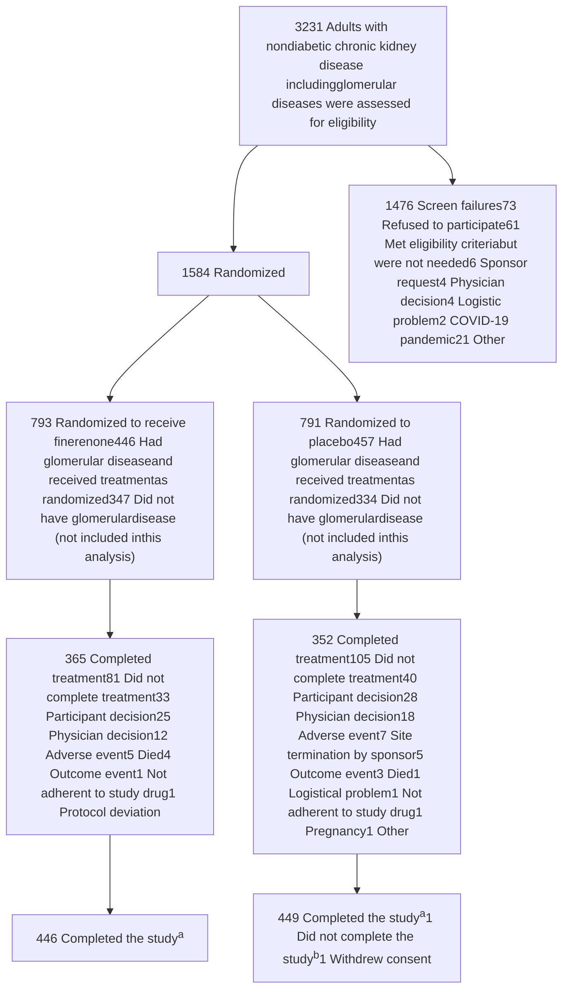

JAMA | Original Investigation

# Finerenone in Patients With Chronic Kidney Disease Due to Glomerular Diseases

## A Randomized Clinical Trial

Brendon L. Neuen, MBBS, PhD; Vlado Perkovic, MBBS, PhD; Rajiv Agarwal, MD; David Z. I. Cherney, MD, PhD; Carolyn S. P. Lam, MBBS, PhD; Christoph Wanner, MD; Katherine R. Tuttle, MD; Pantelis Sarafidis, MD, MSc, PhD; Jonathan Barratt, PhD; Anna Burgner, MD, MEHP; Xiangmei Chen, MBBS, PhD; Alfredo Chew-Wong, MD; Vladimir A. Dobronravov, MD, PhD, DrSci(Med); Jürgen Floege, MD; Kieran McCafferty, MD; Masaomi Nangaku, MD, PhD; David Packham, MBBS, MD; Evangelos Papachristou, MD, PhD; Pablo E. Pergola, PhD; Marijn M. Speeckaert, MD, PhD; Arunkumar Subbiah, MD, DM; Sydney C. W. Tang, MB, BS, PhD; Shuifu Tang, MD; See Cheng Yeo, MMed; Niels Jongs, PhD; J. David Smeijer, MD; Mario Berger, PhD; Meike Brinker, MD; Rania Dayoub, PhD; Jay Elliott, PhD; Na Li, MD, PhD; Katharina Mueller, MSc; Nicole Rethemeier, MSc; Marina Yael Finkelsztein, MD; Hiddo J. L. Heerspink, PhD; for the FIND-CKD Investigators

+ Visual Abstract

+ Research Summary

+ Supplemental content

**IMPORTANCE** Glomerular diseases are a leading cause of chronic kidney disease (CKD) and kidney failure. Finerenone, a nonsteroidal mineralocorticoid receptor antagonist, reduces the risk of kidney function loss in CKD, but its effects in individuals with CKD due to glomerular diseases are uncertain.

**OBJECTIVES** To evaluate the efficacy and safety of finerenone in patients with glomerular diseases.

**DESIGN, SETTING, AND PARTICIPANTS** Prespecified exploratory subgroup analysis of a phase 3, randomized, double-blind, placebo-controlled trial conducted across 24 countries and regions, focusing on participants with an investigator-reported glomerular disease diagnosis. The overall trial enrolled adults with nondiabetic CKD and an estimated glomerular filtration rate (eGFR) of either (1) at least 25 to less than 60 mL/min/1.73 m² and urinary albumin to creatinine ratio of at least 200 mg/g to less than 500 mg/g or (2) an eGFR of at least 25 to less than 90 mL/min/1.73 m² and urinary albumin to creatinine ratio of at least 500 mg/g to less than 3500 mg/g.

**INTERVENTION** Finerenone 10 mg or 20 mg taken orally once daily (n = 446) vs matching placebo (n = 457).

**MAIN OUTCOMES AND MEASURES** Annualized rate of eGFR decline (total eGFR slope) from baseline to month 32 (primary outcome of the main trial); percent change in albuminuria to 12 months; and a composite outcome of kidney failure or sustained 40% or more decline in eGFR (prespecified exploratory outcomes).

**RESULTS** Of 1584 participants, 903 (57.0%) had investigator-reported glomerular disease, including 416 (46.1%) with immunoglobulin A nephropathy, 215 (23.8%) with focal segmental glomerulosclerosis, and 90 (10.0%) with membranous nephropathy. Participants with glomerular disease (mean [SD] age, 51.1 [13.6] years; 362 female [40.1%]; 558 Asian [61.9%]) had a mean eGFR of 48.8 mL/min/1.73 m² and median urinary albumin to creatinine ratio of 839.6 mg/g. The total eGFR slope up to 32 months was −3.50 mL/min/1.73 m² per year with finerenone and −4.23 mL/min/1.73 m² per year with placebo (0.73 mL/min/1.73 m² per year difference; 95% CI, 0.22-1.24). Finerenone reduced albuminuria at month 12 by 42% (95% CI, 35%-48%) and lowered the risk of kidney failure or 40% or more eGFR decline (7.42 vs 9.60 events per 100 patient-years; hazard ratio, 0.74; 95% CI, 0.57-0.97).

**CONCLUSIONS AND RELEVANCE** In this exploratory analysis, treatment with finerenone slowed kidney function decline, reduced albuminuria, and lowered the risk of kidney failure or substantial loss of kidney function in patients with glomerular diseases. These findings suggest an important role for finerenone in preserving kidney function in this population.

**TRIAL REGISTRATION** ClinicalTrials.gov Identifier: NCT05047263

**Author Affiliations:** Author affiliations are listed at the end of this article.

**Group Information:** The FIND-CKD Investigators are listed in Supplement 3.

**Corresponding Author:** Brendon L. Neuen, MBBS, MSc, PhD, The George Institute for Global Health, Health Translation Hub, Level 8, 55 Botany Rd, Randwick NSW 2031, Australia (bneuen@georgeinstitute.org.au).

JAMA. doi:10.1001/jama.2026.9923
Published online June 5, 2026.

**G**lomerular diseases are among the leading causes of chronic kidney disease (CKD) and kidney failure worldwide.1 They comprise a heterogeneous group of disorders, many of which have an immunologic basis, yet share maladaptive processes that drive disease progression, irrespective of underlying etiology.2 Accordingly, therapies that target these shared mechanisms, including renin–angiotensin system (RAS) inhibition and sodium-glucose cotransporter 2 (SGLT2) inhibitors, are recommended by current guidelines and form the foundation of care for patients with glomerular diseases, alongside disease-specific treatments where indicated.3,4

Overactivation of the mineralocorticoid receptor represents another common pathway of disease progression across nearly all causes of kidney disease, including glomerular diseases.5,6 Mineralocorticoid receptor overactivation promotes sodium retention and activates proinflammatory and profibrotic pathways, leading to structural damage and irreversible decline in kidney function.7 Finerenone, a nonsteroidal mineralocorticoid receptor antagonist, reduces the risk of kidney function loss in patients with CKD associated with type 2 diabetes and is indicated for use in this population.8,9

The efficacy and safety of finerenone in patients with CKD without diabetes was demonstrated in the FIND-CKD trial,10 which enrolled 1584 individuals with a broad spectrum of nondiabetic causes of CKD. Approximately 60% of these individuals had an underlying glomerular disease. However, detailed data on the efficacy and safety of finerenone specifically in patients with glomerular diseases are lacking.

To address this gap, we conducted a prespecified analysis of the FIND-CKD trial to evaluate the efficacy and safety of finerenone in participants with glomerular diseases, including analyses by glomerular disease subtype.

# Methods

## Study Design and Patients

This was a prespecified, exploratory analysis of FIND-CKD, a phase 3, global, multicenter, randomized, double-blind, placebo-controlled trial involving adults with nondiabetic CKD across 24 countries and regions. The prespecified data analysis plan was designed by the academic steering committee and Bayer, the study sponsor. Details of the trial design have been published10,11; the trial protocol is available in Supplement 1. The trial was approved by regulatory authorities as well as ethics committees at each center. Written informed consent was obtained from all participants. An independent data monitoring committee performed safety monitoring throughout the trial. The trial was designed, conducted, and reported in accordance with the Consolidated Standards of Reporting Trials (CONSORT) guidelines, and this prespecified exploratory subgroup analysis is also reported in alignment with these standards.

Eligible trial participants were at least 18 years of age with a clinical diagnosis of CKD—defined as either (1) an estimated glomerular filtration rate (eGFR) of at least 25 to less than 60 mL/min/1.73 m² and urinary albumin to creatinine ratio of

## Key Points

**Question** What is the effect of finerenone in patients with chronic kidney disease due to glomerular diseases?

**Findings** In this prespecified exploratory analysis of a randomized clinical trial that enrolled 903 participants with glomerular diseases, finerenone, compared with placebo, slowed kidney function decline (difference in eGFR slope decline, 0.73 mL/min/1.73 m² per year), reduced albuminuria, and lowered the risk of kidney failure or sustained loss of kidney function, with consistent effects across glomerular disease subtypes.

**Meaning** Finerenone may have an important role in preserving kidney function in patients with glomerular diseases.

at least 200 mg/g to less than 500 mg/g or (2) eGFR of at least 25 to less than 90 mL/min/1.73 m² and urinary albumin to creatinine ratio of at least 500 mg/g to 3500 mg/g—who were taking a stable and maximum tolerated dose of an angiotensin-converting enzyme inhibitor or angiotensin receptor blocker for 4 or more weeks before enrollment into the trial and had a serum potassium level of 4.8 mmol/L or less at screening (Figure 1).

Individuals with underlying glomerular diseases were eligible to participate, provided they had not received systemic immunosuppressive therapy for kidney disease within 6 months prior to screening and did not have lupus nephritis or antineutrophilic cytoplasmic autoantibody–associated vasculitis. These conditions were excluded because kidney disease progression in these settings is primarily driven by active immunologic injury and characterized by a relapsing and remitting course, which is less likely to be modified by finerenone. Other exclusion criteria included diagnosis of type 1 or 2 diabetes, glycated hemoglobin levels of 6.5% or higher, polycystic kidney disease, and a clinical diagnosis of symptomatic heart failure with reduced ejection fraction (full eligibility criteria are shown in eTable 1 in Supplement 2). Sex and race were reported by the participants based on fixed categories (Table 1).

## Categorization of Kidney Disease Etiology

Etiology of CKD was a prespecified subgroup that was categorized based on investigator-reported diagnoses, which therefore constituted the primary analytic approach. CKD etiology was assigned based on prior clinical and laboratory information, including kidney biopsy when performed as part of routine care.

The present analysis focuses on participants with glomerular diseases including prespecified glomerular disease subtypes. These included immunoglobulin A (IgA) nephropathy, focal segmental glomerulosclerosis, membranous nephropathy, membranoproliferative glomerulonephritis, and other glomerular diseases.

Approximately one-fifth of participants with reported glomerular diseases did not have a kidney biopsy performed or available, reflecting variations in biopsy practice

across countries and regions. Consequently, we also conducted additional analyses restricted to biopsy-confirmed cases.

## Randomization and Study Procedures

Patients were randomized 1:1 to receive once-daily oral finerenone (10 mg or 20 mg) or matching placebo, in a blinded fashion, on top of their stable and maximum tolerated dose of a RAS inhibitor. Randomization was stratified by screening urinary albumin to creatinine ratio (≤1000 mg/g vs >1000 mg/g) and baseline SGLT2 inhibitor use (yes/no), but not CKD etiology, and was implemented using a block design with a fixed block size of 6. Starting dose of finerenone was based on the eGFR level at the screening visit: 10 mg for eGFR less than 60 mL/min/1.73 m² and 20 mg for 60 or more mL/min/1.73 m². Finerenone up- or down-titration was based on potassium and eGFR levels. Details on dose titration are shown in the eMethods section of Supplement 2.

After randomization, study visits were scheduled at baseline, months 1 and 3 and then every 3 months during the first year, followed by a 4-month visit schedule until the end of the study. The minimum treatment duration for each patient was 32 months. During the study, participants were allowed to modify background treatment for CKD, including initiating disease-specific therapies for glomerular diseases, based on investigator judgement.

## Outcomes

The primary outcome was total eGFR slope, defined as mean annual rate of change in eGFR from baseline to month 32. Other eGFR-based outcomes included acute eGFR slope (change from baseline to month 3), chronic eGFR slope (mean annual rate of change from month 3 to end of treatment). As prespecified, eGFR was calculated based on the 2009 Chronic Kidney Disease Epidemiology Collaboration equation.

In addition to eGFR slope, we assessed effects on the prespecified exploratory outcomes of change in urinary protein to creatinine ratio and urinary protein to creatinine ratio from baseline to 12 months in participants with glomerular diseases and by glomerular disease subtype.

Given that the overall trial was not powered for time-to-event outcomes, we primarily focused on the prespecified exploratory composite outcome of kidney failure or sustained decline in eGFR of 40% or more, the clinical end point for which there was the greatest number of events, to optimize the detection of a treatment effect in participants with glomerular diseases. Kidney failure was defined as chronic dialysis for 30 days or more, kidney transplant, or sustained eGFR of less than 15 mL/min/1.73 m². Additionally, we reported results for all other prespecified secondary or exploratory time-to-event outcomes in participants with glomerular diseases, including a kidney-cardiovascular composite of a sustained decline in eGFR of 57% or more, kidney failure, hospitalization for heart failure, or death due to cardiovascular disease; kidney failure or sustained eGFR decline of 57% or more; and hospitalization for heart failure or cardiovascular death.

Safety outcomes were adverse and serious adverse events that emerged or worsened after the first dose of treat-

## Figure 1. Flow Diagram of Participants Through the FIND-CKD Trial

aParticipants were considered to have completed the study if there was contact with the participant after the end-of-study notification or if they died.

bSeven participants in the placebo group were excluded even though they had completed the month 32 visit because they were administratively discontinued from the study and all electronic systems closed in the first quarter of 2025 to comply with the policy set forth by the funder; thus, no further follow-up was possible.

ment and up to 3 days after any temporary or permanent interruption. Prespecified safety analyses included the incidences of treatment-emergent adverse events and serious treatment-emergent adverse events; the adverse event of special interest was hyperkalemia. Serious hyperkalemia and hyperkalemia leading to permanent discontinuation of study treatment were also evaluated. For prespecified adverse event–based analyses, incidences and incidence proportions were reported.

## Statistical Analysis

The trial was powered to detect a between-group difference of 0.7 mL/min/1.73 m² per year in eGFR. This effect size was informed by the magnitude of the treatment effect observed with finerenone in the prior Finerenone in Reducing Kidney Failure and Disease Progression in Diabetic Kidney Disease (FIDELIO-DKD) trial8 involving patients with type 2 diabetes

# Table. Demographic and Clinical Characteristics of Participants With Glomerular Disease at Baseline

<table>
  <thead>
    <tr>
        <th>Characteristic</th>
        <th>Finerenone (n = 446)</th>
        <th>Placebo (n = 457)</th>
    </tr>
  </thead>
  <tbody>
    <tr>
        <td>Age, mean (SD), y</td>
        <td>50.5 (13.7)</td>
        <td>51.7 (13.6)</td>
    </tr>
    <tr>
        <td colspan="3">Sex, No. (%)</td>
    </tr>
    <tr>
        <td>Female</td>
        <td>190 (42.6)</td>
        <td>172 (37.6)</td>
    </tr>
    <tr>
        <td>Male</td>
        <td>256 (57.4)</td>
        <td>285 (62.4)</td>
    </tr>
    <tr>
        <td colspan="3">Race, No. (%)a</td>
    </tr>
    <tr>
        <td>Asian</td>
        <td>289 (64.8)</td>
        <td>269/455 (59.1)</td>
    </tr>
    <tr>
        <td>Black</td>
        <td>7 (1.6)</td>
        <td>6/455 (1.3)</td>
    </tr>
    <tr>
        <td>White</td>
        <td>140 (31.4)</td>
        <td>174/455 (38.2)</td>
    </tr>
    <tr>
        <td>Otherb</td>
        <td>10 (2.2)</td>
        <td>6/455 (1.3)</td>
    </tr>
    <tr>
        <td colspan="3">Medical history, No. (%)</td>
    </tr>
    <tr>
        <td>Hypertension</td>
        <td>369 (82.7)</td>
        <td>386 (84.5)</td>
    </tr>
    <tr>
        <td>Atherosclerotic disease</td>
        <td>28 (6.3)</td>
        <td>35 (7.7)</td>
    </tr>
    <tr>
        <td>Heart failure</td>
        <td>4 (0.9)</td>
        <td>6 (1.3)</td>
    </tr>
    <tr>
        <td colspan="3">Medication use, No. (%)</td>
    </tr>
    <tr>
        <td>SGLT2 inhibitors</td>
        <td>93 (20.9)</td>
        <td>97 (21.2)</td>
    </tr>
    <tr>
        <td>Diuretics</td>
        <td>60 (13.5)</td>
        <td>63 (13.8)</td>
    </tr>
    <tr>
        <td colspan="3">CKD etiology, No. (%)</td>
    </tr>
    <tr>
        <td>IgA nephropathy</td>
        <td>226 (50.7)</td>
        <td>190 (41.6)</td>
    </tr>
    <tr>
        <td>Focal segmental glomerulosclerosis</td>
        <td>98 (22.0)</td>
        <td>117 (25.6)</td>
    </tr>
    <tr>
        <td>Other chronic glomerular diseasec</td>
        <td>67 (15.0)</td>
        <td>89 (19.5)</td>
    </tr>
    <tr>
        <td>Membranous nephropathy</td>
        <td>47 (10.5)</td>
        <td>43 (9.4)</td>
    </tr>
    <tr>
        <td>Membranoproliferative glomerulonephritis</td>
        <td>8 (1.8)</td>
        <td>18 (3.9)</td>
    </tr>
    <tr>
        <td>CKD etiology confirmed by biopsy</td>
        <td>363 (81.4)</td>
        <td>349 (76.4)</td>
    </tr>
    <tr>
        <td colspan="3">Clinical measurements, mean (SD)</td>
    </tr>
    <tr>
        <td>BMI</td>
        <td>27.1 (5.4)</td>
        <td>26.8 (5.6)</td>
    </tr>
    <tr>
        <td>Systolic blood pressure, mm Hg</td>
        <td>127.6 (14.0)</td>
        <td>126.6 (13.7)</td>
    </tr>
    <tr>
        <td>Biochemical measurements</td>
        <td> </td>
        <td> </td>
    </tr>
    <tr>
        <td>Urinary albumin to creatinine ratio</td>
        <td> </td>
        <td> </td>
    </tr>
    <tr>
        <td>Median (IQR), mg/g</td>
        <td>872.4 (585.7-1275.0)</td>
        <td>812.8 (591.2-1238.6)</td>
    </tr>
    <tr>
        <td colspan="3">Urinary albumin to creatinine category, No. (%)</td>
    </tr>
    <tr>
        <td>&lt;300</td>
        <td>18 (4.0)</td>
        <td>7 (1.5)</td>
    </tr>
    <tr>
        <td>300-1000</td>
        <td>249 (55.8)</td>
        <td>284 (62.1)</td>
    </tr>
    <tr>
        <td>1000</td>
        <td>179 (40.1)</td>
        <td>166 (36.3)</td>
    </tr>
    <tr>
        <td colspan="3">eGFR, mL/min/1.73 m²</td>
    </tr>
    <tr>
        <td>Mean (SD)</td>
        <td>49.0 (17.0)</td>
        <td>48.6 (16.4)</td>
    </tr>
    <tr>
        <td colspan="3">Category, No. (%)</td>
    </tr>
    <tr>
        <td>&lt;45</td>
        <td>211 (47.3)</td>
        <td>220 (48.1)</td>
    </tr>
    <tr>
        <td>45-&lt;60</td>
        <td>120 (26.9)</td>
        <td>131 (28.7)</td>
    </tr>
    <tr>
        <td>≥60</td>
        <td>115 (25.8)</td>
        <td>106 (23.2)</td>
    </tr>
    <tr>
        <td>Urinary protein to creatinine ratio, median (IQR), mg/g</td>
        <td>1280.8 (850.6-1912.4)</td>
        <td>1192.3 (855.9-1832.4)</td>
    </tr>
  </tbody>
</table>

Abbreviations: BMI, body mass index, calculated as weight in kilograms divided by height in meters squared; CKD, chronic kidney disease; eGFR, estimated glomerular filtration rate; IgA, immunoglobulin A; SGLT2, sodium-glucose cotransporter 2.

a Participant race was self-reported.

b Included American Indian or Alaska Native, Native Hawaiian or Other Pacific Islander, or multiple. The multiple-race category included participants who reported belonging to more than 1 racial group.

c Included any nonprespecified terms.

and CKD. Analyses from the CKD Epidemiology Clinical Trials Consortium have demonstrated that reductions in eGFR slope of this magnitude are strongly associated with clinically meaningful reductions in clinical kidney end points.1,2 Full details of the power calculation and underlying assumptions are provided in the published study protocol.

Efficacy analyses were conducted in the full analysis set, comprising all randomized patients with CKD due to a glomerular disease in their medical history.

eGFR slope was analyzed based on a random-coefficient 2-slope linear-spline mixed-effects model, in which a fixed prespecified knot at month 3 distinguished between the

acute and chronic eGFR slopes. In addition to treatment-specific fixed effects (finerenone vs placebo) for the intercept, time from randomization, and time difference relative to the change point, the model included fixed effects for the following stratification factors: baseline SGLT2 inhibitor use (yes/no) and screening urinary albumin to creatinine ratio (≤1000 mg/g vs >1000 mg/g). The model also included interactions between these fixed effects and the time components. Random effects for the intercept, acute slope (baseline to month 3), and directional change in slope at the change point (month 3) were included to account for variation in patients’ progression rates over time. The unstructured

covariance matrix of the random effects was allowed to vary freely between treatments. Intercurrent events, specifically dialysis, kidney transplant, and death, were handled via a composite strategy in a multiple imputation approach, by drawing multiple times with replacement from a pool of unfavorable eGFR values, consisting of all eGFR values less than 15 mL/min/1.73 m² collected as last values before onset of dialysis or kidney transplant in the study. Further details are described in the eMethods section of Supplement 2. Permanent treatment discontinuation or extended interruption of treatment and initiation of disease-specific therapies for glomerular diseases were handled with a treatment policy strategy, and eGFR values after these intercurrent events were included in the analysis.

The prespecified exploratory outcomes of urinary albumin to creatinine ratio and urinary protein to creatinine ratio change over time were investigated based on the logarithms of the ratios of urinary albumin to creatinine ratio and urinary protein to creatinine ratio to baseline at month 12 using a mixed model with repeated measures; covariates are described in the eMethods section of Supplement 2.

Time-to-event outcomes were analyzed using stratified Cox proportional hazards models and stratified log-rank tests fitted using the stratification factors from randomization. Cumulative incidence plots based on Aalen-Johansen estimates accounting for competing risks (noncardiovascular death or all-cause death, as appropriate) were created by treatment group.

Efficacy outcomes were analyzed according to glomerular disease subtype and SGLT2 inhibitor use, with *P* values for interaction based on likelihood ratio tests comparing models with and without the relevant interaction terms.

Safety analyses were performed in the safety analysis set, defined as all randomized patients who took at least 1 dose of study drug and with a diagnosis of glomerular disease in their medical history.

Given that the exploratory nature of these analyses, *P* values are descriptive rather than formal tests of prespecified hypotheses and no adjustment was made for multiplicity. All *P* values were 2-sided, with a nominal significance threshold of .05. Analyses were performed using R software, version 4.4 (R Foundation for Statistical Computing).

# Results

Of 1584 randomized participants, 903 (57.0%) had a glomerular disease, of whom 712 (78.8%) had undergone a kidney biopsy prior to enrollment (eFigure 1 in Supplement 2). Of the 903 participants with investigator-reported glomerular diseases, 416 (46.1%) had IgA nephrology, 215 (23.8%) had focal segmental glomerulosclerosis, 90 (10.0%) had membranous nephropathy, 26 (2.9%) had membranoproliferative glomerulonephritis, and 156 (17.3%) had another glomerular disease. The mean (SD) age of participants with glomerular diseases was 51.1 (13.7) years, 362 (40.1%) were female, and 558 (61.9%) were Asian. The mean eGFR was 48.8 mL/min/1.73 m², and median urinary albumin to creatinine ratio was

839.6 mg/g. Participants with glomerular diseases were more likely to be younger, female, and have a higher eGFR than the overall FIND-CKD population (eTable 2 in Supplement 2). Characteristics of participants with glomerular diseases were well balanced across treatment arms (Table). Overall, 895 (99.1%) of participants with glomerular diseases completed the trial (Figure 1), similar to the overall trial population (eFigure 1 in Supplement 2).

Among participants with glomerular diseases, mean total eGFR slope from baseline to month 32 was –3.50 mL/min/1.73 m² per year in the finerenone group and –4.23 mL/min/1.73 m² per year in the placebo group (Figure 2), resulting in a between-group absolute difference of 0.73 mL/min/1.73 m² per year (95% CI, 0.22 to 1.24). This effect was similar in analyses restricted to participants with biopsy-confirmed glomerular diseases (0.89 mL/min/1.73 m² per year, 95% CI, 0.31 to 1.47; eFigure 2 in Supplement 2).

The effect of finerenone on total eGFR slope was consistent regardless of glomerular disease subtypes and baseline use of SGLT2 inhibitors (*P* for interaction = .52 and .81, respectively; Figure 3A and eFigure 3 in Supplement 2). The effect on total eGFR slope was 1.34 mL/min/1.73 m² per year (95% CI, 0.29 to 2.39) in participants with focal segmental glomerulosclerosis and was 0.61 mL/min/1.73 m² per year (95% CI, –0.14 to 1.36) in participants with IgA nephrology. Estimates were less precise for patients with membranous nephropathy (1.37 mL/min/1.73 m² per year, 95% CI, –0.24 to 2.99), membranoproliferative glomerulonephritis (0.29 mL/min/1.73 m² per year, 95% CI, –2.89 to 3.47), and other glomerular diseases (0.06 mL/min/1.73 m² per year, 95% CI, –1.17 to 1.29). Effects were similarly consistent across glomerular disease subtypes in analyses limited to biopsy-proven cases (*P* for interaction = .87; eFigure 2 in Supplement 2). There was also no evidence that the effect differed in participants with a baseline urinary albumin to creatinine ratio that was 1000 mg/g or lower or 1000 mg/g or higher (*P* for interaction = .18; eTable 3 in Supplement 2).

From randomization to month 3 (acute eGFR slope), finerenone led to a modest reduction in eGFR compared with placebo (–1.01 mL/min/1.73 m²; 95% CI, –1.80 to –0.22), an effect that was consistent across glomerular disease subtypes (*P* for interaction = .76; eFigure 4 in Supplement 2). Thereafter, finerenone attenuated chronic eGFR slope by 1.22 mL/min/1.73 m² per year (95% CI, 0.72 to 1.73), with no modification by glomerular disease subtype or SGLT2 inhibitor use at baseline (*P* for interaction = .63 and .76, respectively; Figure 3B and eFigure 3 in Supplement 2). Improvements in chronic eGFR slope were observed in focal segmental glomerulosclerosis (1.87 mL/min/1.73 m² per year; 95% CI, 0.83 to 2.91) and in IgA nephrology (1.17 mL/min/1.73 m² per year; 95% CI, 0.43 to 1.91), with similar but more variable estimates for membranous nephropathy (1.32 mL/min/1.73 m² per year; 95% CI, –0.27 to 2.91), membranoproliferative glomerulonephritis (0.30 mL/min/1.73 m² per year; 95% CI, –2.86 to 3.46), and other glomerular diseases (0.70 mL/min/1.73 m² per year; 95% CI, –0.53 to 1.92). The magnitude of benefit on chronic eGFR slope was similar in analyses limited to biopsy-confirmed cases and consistent across glomerular disease subtypes (1.33 mL/min/1.73 m²

# Figure 2. Line Graph of Change in eGFR Over Time Allocation in Participants With Glomerular Diseases

<table>
  <thead>
    <tr>
        <th>Months since randomization</th>
        <th>Finerenone (mL/min/1.73 m²)</th>
        <th>Placebo (mL/min/1.73 m²)</th>
    </tr>
  </thead>
  <tbody>
    <tr>
        <td>0</td>
        <td>0</td>
        <td>0</td>
    </tr>
    <tr>
        <td>1</td>
        <td>-1.8</td>
        <td>-0.5</td>
    </tr>
    <tr>
        <td>3</td>
        <td>-2.8</td>
        <td>-1.2</td>
    </tr>
    <tr>
        <td>6</td>
        <td>-3.2</td>
        <td>-2.0</td>
    </tr>
    <tr>
        <td>12</td>
        <td>-4.5</td>
        <td>-3.8</td>
    </tr>
    <tr>
        <td>16</td>
        <td>-5.5</td>
        <td>-5.2</td>
    </tr>
    <tr>
        <td>20</td>
        <td>-6.2</td>
        <td>-6.8</td>
    </tr>
    <tr>
        <td>24</td>
        <td>-7.5</td>
        <td>-8.2</td>
    </tr>
    <tr>
        <td>28</td>
        <td>-8.5</td>
        <td>-9.8</td>
    </tr>
    <tr>
        <td>32</td>
        <td>-10.8</td>
        <td>-11.2</td>
    </tr>
    <tr>
        <td>36</td>
        <td>-11.0</td>
        <td>-12.5</td>
    </tr>
    <tr>
        <td>40</td>
        <td>-12.0</td>
        <td>-13.5</td>
    </tr>
  </tbody>
</table>

**No. of observations**
<table>
  <thead>
    <tr>
        <th>Treatment</th>
        <th>0</th>
        <th>1</th>
        <th>3</th>
        <th>6</th>
        <th>12</th>
        <th>16</th>
        <th>20</th>
        <th>24</th>
        <th>28</th>
        <th>32</th>
        <th>36</th>
        <th>40</th>
    </tr>
  </thead>
  <tbody>
    <tr>
        <td>Finerenone</td>
        <td>446</td>
        <td>440</td>
        <td>436</td>
        <td>431</td>
        <td>429</td>
        <td>417</td>
        <td>412</td>
        <td>407</td>
        <td>403</td>
        <td>368</td>
        <td>265</td>
        <td>162</td>
    </tr>
    <tr>
        <td>Placebo</td>
        <td>457</td>
        <td>448</td>
        <td>443</td>
        <td>438</td>
        <td>438</td>
        <td>432</td>
        <td>421</td>
        <td>410</td>
        <td>406</td>
        <td>384</td>
        <td>260</td>
        <td>144</td>
    </tr>
  </tbody>
</table>

**Slope Data Labels:**
*   Finerenone: total eGFR slope mean, -3.50 mL/min/1.73 m² per y (95% CI, -3.85 to -3.15)
*   Placebo: total eGFR slope mean, -4.23 mL/min/1.73 m² per y (-4.60 to -3.86)
*   Between-group absolute difference: 0.73 mL/min/1.73 m² per y (95% CI, 0.22 to 1.24)

The mean change from baseline in the estimated glomerular filtration rate (eGFR) over time was plotted based on a mixed model for repeated measures. The model included fixed effects for treatment group, visit, treatment-by-visit interaction, and the randomization stratification factors (baseline sodium-glucose cotransporter 2 [SGLT2] inhibitor use and urinary albumin to creatinine ratio category at screening) and their interactions with visit. After death, dialysis, or kidney transplant, missing eGFR values were multiply imputed using a worst-case pool. The eGFR slope was analyzed based on a random-coefficient 2-slope linear-spline mixed-effects model, in which a fixed prespecified knot at month 3 distinguished between the acute and chronic eGFR slopes.

The data points indicate least-squares mean change from baseline in eGFR; the whiskers, 95% CIs.

per year; 95% CI, 0.77 to 1.90; $P$ for interaction = .79; eFigure 2 in Supplement 2).

subtypes and by baseline SGLT2 inhibitor use ($P$ for interaction = .93 and .86; Figure 5; eFigure 7 in Supplement 2).

Finerenone reduced the urinary albumin to creatinine ratio from baseline to 12 months by 42% (95% CI, 35% to 48%) among participants with glomerular diseases (Figure 3C). This effect was consistent across glomerular disease subtypes, and by baseline SGLT2 inhibitor use ($P$ for interaction = .16 and .34, respectively; eFigure 3 in Supplement 2). A similar pattern was observed for the effect of finerenone on the urinary protein to creatinine ratio at 12 months (reduction of 52%, 95% CI, 43% to 59%), with consistent effects across subtypes of glomerular diseases ($P$ for interaction = .30; eFigure 5 in Supplement 2).

Finerenone was well tolerated in participants with glomerular diseases, with a safety profile consistent with the overall trial population (eTable 4 in Supplement 2). Among 687 participants who initiated 10 mg of finerenone or matching placebo, 620 (90.2%) were up-titrated to 20 mg and this was similar across treatment arms (87.8% and 92.6% in the finerenone and placebo groups, respectively). Among 216 participants who initiated the 20-mg starting dose, 143 (66.2%) never down-titrated their dose (59.6% and 72.9% in the finerenone and placebo groups, respectively). There was no increased incidence of serious adverse events (19.5% vs 21.4% with finerenone and placebo, respectively), no imbalance in serious investigator-reported hyperkalemia events (0.9% in both treatment arms), and adverse events leading to permanent discontinuation of study drug were uncommon (2.7% vs 3.9% with finerenone and placebo, respectively).

Finerenone compared with placebo reduced the risk of kidney failure or 40% or more decline in eGFR in participants with glomerular diseases by 26% (7.42 vs 9.60 events per 100 patient-years; hazard ratio [HR], 0.74; 95% CI, 0.57 to 0.97; Figure 4). This effect was virtually identical in the analysis restricted to biopsy-confirmed cases (7.52 vs 10.31 events per 100 patient-years; HR, 0.74; 95% CI, 0.55 to 0.99; eFigure 6 in Supplement 2). Although not powered for clinical outcomes, the effects of finerenone on composites of kidney failure, 57% or more decline in eGFR, heart failure hospitalization, or cardiovascular death (4.93 vs 5.87 events per 100 patient-years; HR, 0.81; 95% CI, 0.58 to 1.13), kidney failure or 57% or more decline in eGFR (4.76 vs 5.62 per 100 patient-years; HR, 0.82; 95% CI, 0.58 to 1.15), and heart failure hospitalization or cardiovascular death (0.21 vs 0.62 events per 100 patient-years; HR, 0.32; 95% CI, 0.09 to 1.17) were all directionally consistent in favor of finerenone (Figure 4). Although the number of outcome events was low for specific glomerular diseases, the effect of finerenone on kidney failure or 40% or more decline in eGFR was broadly similar across glomerular disease

## Discussion

In this prespecified analysis of participants with glomerular diseases in the FIND-CKD trial, allocation to finerenone resulted in clinically meaningful improvements in multiple kidney outcomes. Finerenone attenuated the annual rate of kidney function decline up to month 32 by 0.73 mL/min/1.73 m² per year, lowered albuminuria by approximately 40% over 12 months, and reduced the risk of kidney failure or 40% or more decline in eGFR by 26%. Notably, these benefits were consistent irrespective of glomerular disease subtype and SGLT2 inhibitor use, with a similar magnitude of benefit observed for all outcomes in analyses restricted to biopsy-proven cases of

# Figure 3. Dot-and-Whisker Plot of the Subgroup Analysis According to Glomerular Disease Etiology

### A Change in eGFR from baseline to month 32 (total slope)

<table>
  <thead>
    <tr>
        <th rowspan="2"> </th>
        <th colspan="2">Finerenone</th>
        <th colspan="2">Placebo</th>
        <th rowspan="2">Difference in slopes (95% CI), mL/min/1.73 m² per y</th>
        <th rowspan="2">Favors placebo | Favors finerenone</th>
        <th rowspan="2">P value for interaction</th>
    </tr>
    <tr>
        <th>No. of patients</th>
        <th>eGFR slope</th>
        <th>No. of patients</th>
        <th>eGFR slope</th>
    </tr>
  </thead>
  <tbody>
    <tr>
        <td>Overall</td>
        <td>446</td>
        <td>-3.50</td>
        <td>457</td>
        <td>-4.23</td>
        <td>0.73 (0.22 to 1.24)</td>
        <td>0.73</td>
        <td>.52</td>
    </tr>
    <tr>
        <td colspan="8">Glomerular disease subgroup</td>
    </tr>
    <tr>
        <td>IgA nephropathy</td>
        <td>226</td>
        <td>-3.83</td>
        <td>190</td>
        <td>-4.44</td>
        <td>0.61 (-0.14 to 1.36)</td>
        <td>0.61</td>
        <td> </td>
    </tr>
    <tr>
        <td>Focal segmental glomerulosclerosis</td>
        <td>98</td>
        <td>-3.20</td>
        <td>117</td>
        <td>-4.54</td>
        <td>1.34 (0.29 to 2.38)</td>
        <td>1.34</td>
        <td> </td>
    </tr>
    <tr>
        <td>Other glomerular diseases</td>
        <td>67</td>
        <td>-3.44</td>
        <td>89</td>
        <td>-3.50</td>
        <td>0.06 (-1.17 to 1.29)</td>
        <td>0.06</td>
        <td> </td>
    </tr>
    <tr>
        <td>Membranous nephropathy</td>
        <td>47</td>
        <td>-2.54</td>
        <td>43</td>
        <td>-3.92</td>
        <td>1.37 (-0.24 to 2.99)</td>
        <td>1.37</td>
        <td> </td>
    </tr>
    <tr>
        <td>Membranoproliferative glomerulonephritis</td>
        <td>8</td>
        <td>-3.99</td>
        <td>18</td>
        <td>-4.28</td>
        <td>0.29 (-2.89 to 3.47)</td>
        <td>0.29</td>
        <td> </td>
    </tr>
  </tbody>
</table>

### B Change in eGFR from month 3 to end of treatment (chronic slope)

<table>
  <thead>
    <tr>
        <th rowspan="2"> </th>
        <th colspan="2">Finerenone</th>
        <th colspan="2">Placebo</th>
        <th rowspan="2">Difference in slopes (95% CI), mL/min/1.73 m² per y</th>
        <th rowspan="2">Favors placebo | Favors finerenone</th>
        <th rowspan="2">P value for interaction</th>
    </tr>
    <tr>
        <th>No. of patients</th>
        <th>eGFR slope</th>
        <th>No. of patients</th>
        <th>eGFR slope</th>
    </tr>
  </thead>
  <tbody>
    <tr>
        <td>Overall</td>
        <td>446</td>
        <td>-3.03</td>
        <td>457</td>
        <td>-4.25</td>
        <td>1.22 (0.72 to 1.73)</td>
        <td>1.22</td>
        <td>.63</td>
    </tr>
    <tr>
        <td colspan="8">Glomerular disease subgroup</td>
    </tr>
    <tr>
        <td>IgA nephropathy</td>
        <td>226</td>
        <td>3.35</td>
        <td>190</td>
        <td>-4.52</td>
        <td>1.17 (0.43 to 1.91)</td>
        <td>1.17</td>
        <td> </td>
    </tr>
    <tr>
        <td>Focal segmental glomerulosclerosis</td>
        <td>98</td>
        <td>-2.81</td>
        <td>117</td>
        <td>-4.68</td>
        <td>1.87 (0.83 to 2.91)</td>
        <td>1.87</td>
        <td> </td>
    </tr>
    <tr>
        <td>Other glomerular diseases</td>
        <td>67</td>
        <td>-2.72</td>
        <td>89</td>
        <td>-3.42</td>
        <td>0.70 (-0.53 to 1.92)</td>
        <td>0.70</td>
        <td> </td>
    </tr>
    <tr>
        <td>Membranous nephropathy</td>
        <td>47</td>
        <td>-2.15</td>
        <td>43</td>
        <td>-3.47</td>
        <td>1.32 (-0.27 to 2.91)</td>
        <td>1.32</td>
        <td> </td>
    </tr>
    <tr>
        <td>Membranoproliferative glomerulonephritis</td>
        <td>8</td>
        <td>-4.20</td>
        <td>18</td>
        <td>-4.50</td>
        <td>0.30 (-2.86 to 3.46)</td>
        <td>0.30</td>
        <td> </td>
    </tr>
  </tbody>
</table>

### C Change in urinary albumin to creatinine ratio from baseline to month 12

<table>
  <thead>
    <tr>
        <th rowspan="2"> </th>
        <th colspan="2">Finerenone</th>
        <th colspan="2">Placebo</th>
        <th rowspan="2">Percent change difference, % (95% CI)</th>
        <th rowspan="2">Favors finerenone | Favors placebo</th>
        <th rowspan="2">P value for interaction</th>
    </tr>
    <tr>
        <th>No. of patients</th>
        <th>Urinary albumin to creatinine ratio</th>
        <th>No. of patients</th>
        <th>Urinary albumin to creatinine ratio</th>
    </tr>
  </thead>
  <tbody>
    <tr>
        <td>Overall</td>
        <td>429</td>
        <td>-42</td>
        <td>442</td>
        <td>0</td>
        <td>-42 (-48 to -35)</td>
        <td>-42</td>
        <td>.16</td>
    </tr>
    <tr>
        <td colspan="8">Glomerular disease subgroup</td>
    </tr>
    <tr>
        <td>IgA nephropathy</td>
        <td>218</td>
        <td>-45</td>
        <td>187</td>
        <td>4</td>
        <td>-47 (-55 to -38)</td>
        <td>-47</td>
        <td> </td>
    </tr>
    <tr>
        <td>Focal segmental glomerulosclerosis</td>
        <td>93</td>
        <td>-38</td>
        <td>113</td>
        <td>5</td>
        <td>-40 (-52 to -25)</td>
        <td>-40</td>
        <td> </td>
    </tr>
    <tr>
        <td>Other glomerular diseases</td>
        <td>65</td>
        <td>-34</td>
        <td>84</td>
        <td>-10</td>
        <td>-27 (-44 to -4)</td>
        <td>-27</td>
        <td> </td>
    </tr>
    <tr>
        <td>Membranous nephropathy</td>
        <td>45</td>
        <td>-50</td>
        <td>41</td>
        <td>-1</td>
        <td>-49 (-64 to -29)</td>
        <td>-49</td>
        <td> </td>
    </tr>
    <tr>
        <td>Membranoproliferative glomerulonephritis</td>
        <td>8</td>
        <td>-19</td>
        <td>17</td>
        <td>-13</td>
        <td>-7 (-54 to 89)</td>
        <td>-7</td>
        <td> </td>
    </tr>
  </tbody>
</table>

A and B, The mean rates of change in estimated glomerular filtration rate (eGFR) from baseline to month 32 (total slope) and from month 3 to the end of treatment (chronic slope) were calculated using a 2-slope linear spline mixed-effect model. The model included fixed effects for treatment-specific intercept, time from randomization, and time difference relative to the change point (month 3); baseline sodium-glucose cotransporter 2 (SGLT2) inhibitor use; screening urinary albumin to creatinine ratio category; and interactions of SGLT2 inhibitor use and urinary albumin to creatinine ratio with the time components. Random effects are included for the intercept, acute slope, and directional change in slope at the change point. Intercurrent events dialysis, kidney transplant, and death were handled via a composite strategy in a multiple imputation approach, by drawing multiple times with replacement from a pool of unfavorable eGFR values, consisting of all eGFR values less than 15 mL/min/1.73 m² collected as the last values before onset of dialysis or kidney transplant in the study. The squares represent the estimate of the total slope difference at 32 months; the lower and upper ends of the whiskers

indicate the limits of the 95% CIs. A treatment effect on total eGFR slope of 0.75 mL/min/1.73 m² per year is strongly associated with benefit on clinical kidney outcomes.18

C, The urinary albumin to creatinine ratio was analyzed using a mixed model for repeated measures with fixed effects for the following factors: treatment group, visit, treatment by visit interaction, baseline SGLT2 inhibitor use, and the interaction between SGLT2 inhibitor use and visit, with the log-transformed baseline urinary albumin to creatinine ratio value as a covariate and an interaction term between the log-transformed baseline value and visit. The square represents the estimate of the urinary albumin to creatinine ratio percentage change to placebo from baseline to month 12; the lower and upper ends of the whiskers indicate the limits of the 95% CIs. Reductions in albuminuria of more than 30% are considered clinically meaningful and predict benefit on clinical kidney outcomes.19

glomerular diseases. Finerenone was well tolerated, with no increased risk of serious adverse events or serious hyperkale-

mia events in patients receiving optimized RAS inhibitor treatment, with serum potassium levels of 4.8 mmol/L or less and

# Figure 4. Aalen-Johansen Curves of Time to Event Analysis of Key Secondary and Exploratory Efficacy Outcomes in Participants With Glomerular Disease

### A Kidney failure or ≥40% eGFR decline

<table>
  <thead>
    <tr>
        <th>Months since randomization</th>
        <th>Placebo</th>
        <th>Finerenone</th>
    </tr>
  </thead>
  <tbody>
    <tr>
        <td>0</td>
        <td>0</td>
        <td>0</td>
    </tr>
    <tr>
        <td>6</td>
        <td>0.01</td>
        <td>0.01</td>
    </tr>
    <tr>
        <td>12</td>
        <td>0.03</td>
        <td>0.03</td>
    </tr>
    <tr>
        <td>18</td>
        <td>0.07</td>
        <td>0.06</td>
    </tr>
    <tr>
        <td>24</td>
        <td>0.10</td>
        <td>0.09</td>
    </tr>
    <tr>
        <td>30</td>
        <td>0.17</td>
        <td>0.13</td>
    </tr>
    <tr>
        <td>36</td>
        <td>0.26</td>
        <td>0.22</td>
    </tr>
    <tr>
        <td>42</td>
        <td>0.31</td>
        <td>0.24</td>
    </tr>
  </tbody>
</table>
<table>
  <thead>
    <tr>
        <th>No. at risk</th>
        <th>0</th>
        <th>6</th>
        <th>12</th>
        <th>18</th>
        <th>24</th>
        <th>30</th>
        <th>36</th>
        <th>42</th>
    </tr>
  </thead>
  <tbody>
    <tr>
        <td>Placebo</td>
        <td>457</td>
        <td>450</td>
        <td>435</td>
        <td>416</td>
        <td>382</td>
        <td>356</td>
        <td>203</td>
        <td>83</td>
    </tr>
    <tr>
        <td>Finerenone</td>
        <td>446</td>
        <td>434</td>
        <td>419</td>
        <td>403</td>
        <td>373</td>
        <td>364</td>
        <td>227</td>
        <td>101</td>
    </tr>
  </tbody>
</table>

### B Kidney failure, ≥57% eGFR decline, HF hospitalization, or CV death

<table>
  <thead>
    <tr>
        <th>Months since randomization</th>
        <th>Placebo</th>
        <th>Finerenone</th>
    </tr>
  </thead>
  <tbody>
    <tr>
        <td>0</td>
        <td>0</td>
        <td>0</td>
    </tr>
    <tr>
        <td>6</td>
        <td>0.01</td>
        <td>0.01</td>
    </tr>
    <tr>
        <td>12</td>
        <td>0.02</td>
        <td>0.02</td>
    </tr>
    <tr>
        <td>18</td>
        <td>0.04</td>
        <td>0.04</td>
    </tr>
    <tr>
        <td>24</td>
        <td>0.07</td>
        <td>0.06</td>
    </tr>
    <tr>
        <td>30</td>
        <td>0.11</td>
        <td>0.10</td>
    </tr>
    <tr>
        <td>36</td>
        <td>0.15</td>
        <td>0.14</td>
    </tr>
    <tr>
        <td>42</td>
        <td>0.21</td>
        <td>0.16</td>
    </tr>
  </tbody>
</table>
<table>
  <thead>
    <tr>
        <th>No. at risk</th>
        <th>0</th>
        <th>6</th>
        <th>12</th>
        <th>18</th>
        <th>24</th>
        <th>30</th>
        <th>36</th>
        <th>42</th>
    </tr>
  </thead>
  <tbody>
    <tr>
        <td>Placebo</td>
        <td>457</td>
        <td>450</td>
        <td>439</td>
        <td>428</td>
        <td>411</td>
        <td>384</td>
        <td>226</td>
        <td>92</td>
    </tr>
    <tr>
        <td>Finerenone</td>
        <td>446</td>
        <td>437</td>
        <td>423</td>
        <td>411</td>
        <td>397</td>
        <td>383</td>
        <td>243</td>
        <td>110</td>
    </tr>
  </tbody>
</table>

### C Kidney failure or ≥57% eGFR decline

<table>
  <thead>
    <tr>
        <th>Months since randomization</th>
        <th>Placebo</th>
        <th>Finerenone</th>
    </tr>
  </thead>
  <tbody>
    <tr>
        <td>0</td>
        <td>0</td>
        <td>0</td>
    </tr>
    <tr>
        <td>6</td>
        <td>0.01</td>
        <td>0.01</td>
    </tr>
    <tr>
        <td>12</td>
        <td>0.02</td>
        <td>0.02</td>
    </tr>
    <tr>
        <td>18</td>
        <td>0.04</td>
        <td>0.04</td>
    </tr>
    <tr>
        <td>24</td>
        <td>0.06</td>
        <td>0.06</td>
    </tr>
    <tr>
        <td>30</td>
        <td>0.11</td>
        <td>0.09</td>
    </tr>
    <tr>
        <td>36</td>
        <td>0.15</td>
        <td>0.14</td>
    </tr>
    <tr>
        <td>42</td>
        <td>0.20</td>
        <td>0.16</td>
    </tr>
  </tbody>
</table>
<table>
  <thead>
    <tr>
        <th>No. at risk</th>
        <th>0</th>
        <th>6</th>
        <th>12</th>
        <th>18</th>
        <th>24</th>
        <th>30</th>
        <th>36</th>
        <th>42</th>
    </tr>
  </thead>
  <tbody>
    <tr>
        <td>Placebo</td>
        <td>457</td>
        <td>451</td>
        <td>441</td>
        <td>430</td>
        <td>413</td>
        <td>386</td>
        <td>228</td>
        <td>92</td>
    </tr>
    <tr>
        <td>Finerenone</td>
        <td>446</td>
        <td>437</td>
        <td>424</td>
        <td>413</td>
        <td>400</td>
        <td>385</td>
        <td>244</td>
        <td>110</td>
    </tr>
  </tbody>
</table>

### D HF hospitalization or CV death

<table>
  <thead>
    <tr>
        <th>Months since randomization</th>
        <th>Placebo</th>
        <th>Finerenone</th>
    </tr>
  </thead>
  <tbody>
    <tr>
        <td>0</td>
        <td>0</td>
        <td>0</td>
    </tr>
    <tr>
        <td>6</td>
        <td>0.00</td>
        <td>0.00</td>
    </tr>
    <tr>
        <td>12</td>
        <td>0.00</td>
        <td>0.00</td>
    </tr>
    <tr>
        <td>18</td>
        <td>0.01</td>
        <td>0.01</td>
    </tr>
    <tr>
        <td>24</td>
        <td>0.01</td>
        <td>0.01</td>
    </tr>
    <tr>
        <td>30</td>
        <td>0.01</td>
        <td>0.01</td>
    </tr>
    <tr>
        <td>36</td>
        <td>0.02</td>
        <td>0.01</td>
    </tr>
    <tr>
        <td>42</td>
        <td>0.03</td>
        <td>0.01</td>
    </tr>
  </tbody>
</table>
<table>
  <thead>
    <tr>
        <th>No. at risk</th>
        <th>0</th>
        <th>6</th>
        <th>12</th>
        <th>18</th>
        <th>24</th>
        <th>30</th>
        <th>36</th>
        <th>42</th>
    </tr>
  </thead>
  <tbody>
    <tr>
        <td>Placebo</td>
        <td>457</td>
        <td>456</td>
        <td>454</td>
        <td>453</td>
        <td>450</td>
        <td>449</td>
        <td>302</td>
        <td>121</td>
    </tr>
    <tr>
        <td>Finerenone</td>
        <td>446</td>
        <td>445</td>
        <td>444</td>
        <td>442</td>
        <td>440</td>
        <td>439</td>
        <td>295</td>
        <td>130</td>
    </tr>
  </tbody>
</table>

A, Composite of kidney failure or sustained estimated glomerular filtration rate (eGFR) decline of at least 40% from baseline for 4 or more weeks.

B, Composite of a sustained decline of at least 57% in eGFR from baseline over 4 or more weeks, kidney failure (defined as an eGFR <15 mL/min/1.73 m2 confirmed ≥4 weeks after the initial measurement, the need for chronic dialysis for ≥30 days, or kidney transplant), hospitalization for heart failure (HF), or cardiovascular (CV) death.

C, Composite of kidney failure or sustained eGFR decline of at least 57% from baseline for 4 or more weeks.

D, Composite of first hospitalization for HF or CV death.

Cumulative incidence plots were based on Aalen–Johansen estimates accounting for noncardiovascular death or all-cause death as a competing event.

not receiving immunosuppression at baseline. Taken together, these findings suggest that finerenone may have an important role in slowing loss of kidney function for patients with CKD due to glomerular diseases.

These findings are clinically important because glomerular diseases are a leading cause of kidney failure,13 and many glomerular disease subtypes have few specific treatments available.14 Indeed, glomerular disorders are likely underdiagnosed in many countries due to a historically conservative approach to kidney biopsy resulting from concerns about the risk of complications and a lack of specific treatments.15 Many glomerular diseases frequently affect younger adults and have a progressive lifelong course, leading to kidney failure in a large proportion of individuals,16 with substantial personal, societal, and economic impacts.17

The 2021 Kidney Disease Improving Global Outcomes (KDIGO) clinical practice guidelines for the management of glomerular diseases recommend treatment with an angiotensin-converting enzyme inhibitor or angiotensin receptor blocker to control blood pressure, reduce proteinuria, and slow kidney function decline.3 More recently, SGLT2 inhibitors have also been shown to reduce the risk of kidney function loss in patients with glomerular diseases18 and are therefore now recommended in the updated guidelines for IgA nephrology.4 Importantly, the benefits of finerenone on kidney outcomes appear additive to those of RAS blockade because nearly all

# Figure 5. Dot-and-Whisker Plot of Subgroup Analysis for Kidney Failure or 40% or More Decline in Estimated Glomerular Filtration Rate by Glomerular Disease Etiology

<table>
  <thead>
    <tr>
        <th rowspan="2">Outcomes according to glomerular disease subgroups</th>
        <th colspan="2">Finerenone</th>
        <th colspan="2">Placebo</th>
        <th rowspan="2">HR (95% CI)</th>
        <th rowspan="2">Favors finerenone | Favors placebo</th>
        <th rowspan="2">P value for interaction</th>
    </tr>
    <tr>
        <th>No./total (%)</th>
        <th>Event/100 patient-years</th>
        <th>No./total (%)</th>
        <th>Event/100 patient-years</th>
    </tr>
  </thead>
  <tbody>
    <tr>
        <td>Overall</td>
        <td>95/446 (21.3)</td>
        <td>7.42</td>
        <td>123/457 (26.9)</td>
        <td>9.60</td>
        <td>0.74 (0.57-0.97)</td>
        <td>[plot]</td>
        <td>.93</td>
    </tr>
    <tr>
        <td colspan="8">Glomerular disease subgroup</td>
    </tr>
    <tr>
        <td>IgA nephropathy</td>
        <td>52/226 (23.0)</td>
        <td>8.06</td>
        <td>51/190 (26.8)</td>
        <td>9.64</td>
        <td>0.82 (0.56-1.21)</td>
        <td>[plot]</td>
        <td> </td>
    </tr>
    <tr>
        <td>Focal segmental glomerulosclerosis</td>
        <td>21/98 (21.4)</td>
        <td>7.59</td>
        <td>39/117 (33.3)</td>
        <td>12.09</td>
        <td>0.60 (0.35-1.03)</td>
        <td>[plot]</td>
        <td> </td>
    </tr>
    <tr>
        <td>Other glomerular diseases</td>
        <td>14/67 (20.9)</td>
        <td>7.24</td>
        <td>21/89 (23.6)</td>
        <td>8.26</td>
        <td>0.77 (0.38-1.55)</td>
        <td>[plot]</td>
        <td> </td>
    </tr>
    <tr>
        <td>Membranous nephropathy</td>
        <td>7/47 (14.9)</td>
        <td>5.02</td>
        <td>9/43 (20.9)</td>
        <td>7.21</td>
        <td>0.77 (0.28-1.55)</td>
        <td>[plot]</td>
        <td> </td>
    </tr>
    <tr>
        <td>Membranoproliferative glomerulonephritis</td>
        <td>1/8 (12.5)</td>
        <td>3.82</td>
        <td>3/18 (16.7)</td>
        <td>6.00</td>
        <td>0.60 (0.06-5.83)</td>
        <td>[plot]</td>
        <td> </td>
    </tr>
  </tbody>
</table>

Outcomes were assessed in time-to-event analyses, up to 48 months after randomization. The squares represent the hazard ratio (HR) point estimate; the lower and upper ends of the whiskers indicate the limits of the 95% CIs.

IgA indicates immunoglobulin A.

participants in the FIND-CKD trial were receiving RAS inhibitors and the effects of finerenone were not modified by SGLT2 inhibitor use, suggesting a role for combination therapy for various glomerular diseases. Like these other therapies (RAS inhibitors and SGLT2 inhibitors), finerenone causes an acute reduction in eGFR; thus, clear improvements in eGFR trajectories became more apparent over time, underscoring the need for persistent treatment.

The reduction in the composite outcome of kidney failure or 40% or more decline in eGFR with finerenone is entirely in keeping with the observed effects on eGFR slope and albuminuria. Analyses from the CKD Epidemiology Clinical Trials Consortium indicated that, in a randomized trial of similar size to the glomerular disease subgroup in FIND-CKD (≈ 900 participants), an absolute treatment effect on total eGFR slope of 0.75 mL/min/1.73 m2 per year would confer a 99% probability of benefit on clinical kidney outcomes, with an estimated median HR of 0.74—identical to the point estimate observed in this analysis.12 Furthermore, the Consortium’s data from 48 randomized trials indicate that each 30% reduction in albuminuria is associated with an approximately 19% reduction in the risk of major adverse kidney outcomes.19 Collectively, these findings support the interpretation that the observed reduction in the prespecified exploratory composite kidney outcome reflects a true treatment benefit.

IgA nephrology, the most common primary glomerular disease worldwide,20 was the most prevalent subtype represented in FIND-CKD. Over the past 5 years, several therapies for IgA nephrology have received accelerated or full approval from the US Food and Drug Administration. The 416 participants with IgA nephrology included in this analysis represent a cohort comparable in size to many dedicated IgA nephrology trials and with longer follow-up than any prior phase 3 trials involving this population. The observed 47% reduction in the urinary albumin to creatinine ratio at 12 months (and 58% reduction in urinary protein to creatinine ratio) in the IgA nephrology cohort compares favorably with recently approved therapies. The accompanying benefits on eGFR slope and com-

posite kidney outcomes, which were consistent with other glomerular diseases, support a clinically meaningful effect in this population.

The results may be particularly important for individuals with focal segmental glomerulosclerosis, a frequent but often poorly defined condition for which no treatments have shown clear benefits in slowing eGFR decline. In the DUPLEX trial,21 the largest completed phase 3 trial in focal segmental glomerulosclerosis, no clear effect on eGFR decline was demonstrated with the dual endothelin angiotensin receptor antagonist, sparsentan. In the current trial, the magnitude of effect with finerenone on eGFR slope in participants with focal segmental glomerulosclerosis was nominally statistically significant and at least as large compared with participants with non–focal segmental glomerulosclerosis diseases. Both primary and secondary focal segmental glomerulosclerosis were included. Although this may increase heterogeneity in pathophysiology, prognosis, and treatment response, it may also increase the generalizability of our findings, given the challenges in determining the underlying cause of focal segmental glomerulosclerosis in routine practice. It is worth noting that the mineralocorticoid receptor is expressed on podocytes—the primary site of injury in focal segmental glomerulosclerosis—and experimental data suggested that mineralocorticoid receptor blockade attenuates podocyte injury and glomerulosclerosis.22 Further work is needed to better understand the role of mineralocorticoid receptor antagonism in focal segmental glomerulosclerosis.

## Limitations

This study has several limitations. First, this was an exploratory subgroup analysis; however, the consistency of benefit on eGFR, albuminuria and clinical end points are noteworthy. Second, approximately one-fifth of participants with an investigator-reported diagnosis of glomerular disease did not have a kidney biopsy performed or available; however, treatment effects were materially unchanged in analyses restricted to biopsy-proven cases. Third, when available,

<footer>

jama.com

(Reprinted)

JAMA Published online June 5, 2026

E9

© 2026 American Medical Association. All rights reserved, including those for text and data mining, AI training, and similar technologies.

Downloaded from jamanetwork.com by Universite de Liege user on 06/27/2026
</footer>

kidney biopsy specimens were historical rather than having been performed at study entry, limiting the ability to assess the impact of biopsy characteristics on the effects of finerenone. Fourth, patients with glomerular diseases treated with immunosuppression were excluded, as were those with lupus nephritis and antineutrophil cytoplasmic antibody–associated vasculitis; thus, the effects of finerenone in these diseases and/or in combination with disease-specific immunologic therapies are unknown. Fifth, the trial was not powered for time-to-event kidney outcomes or eGFR slope analyses in participants with glomerular diseases or by glomerular disease subtype. Nevertheless, this analysis represents one of

the largest and longest randomized evaluations of a kidney-protective therapy in patients with glomerular diseases.

## Conclusions

In this exploratory analysis, among patients with CKD due to glomerular diseases, treatment with finerenone resulted in clinically meaningful improvements in kidney function decline, reductions in albuminuria, and a lower risk of kidney failure or substantial loss of kidney function compared with placebo, with consistent effects across glomerular disease subtypes.

### ARTICLE INFORMATION

**Accepted for Publication:** May 13, 2026.

**Published Online:** June 5, 2026. doi:10.1001/jama.2026.9923

**Author Affiliations:** The George Institute for Global Health, University of New South Wales, Sydney, Australia (Neuen, Heerspink); Department of Renal Medicine, Royal North Shore Hospital, Sydney, New South Wales, Australia (Neuen); University of New South Wales, Sydney, Australia (Perkovic); Division of Nephrology, Richard L. Roudebush VA Medical Center and Indiana University School of Medicine, Indianapolis (Agarwal); Division of Nephrology, University Health Network, Toronto General Hospital, University of Toronto, Toronto, Ontario, Canada (Cherney); National Heart Centre Singapore, Singapore, Singapore (Lam); Duke-National University of Singapore Medical School, Singapore, Singapore (Lam); Department of Clinical Research and Epidemiology, Comprehensive Heart Failure Center, University of Würzburg, Würzburg, Germany (Wanner); Providence Inland Northwest Health, University of Washington School of Medicine, Spokane (Tuttle); First Department of Nephrology, Aristotle University of Thessaloniki, Hippokration Hospital, Thessaloniki, Greece (Sarafidis); Department of Cardiovascular Sciences, University of Leicester and Leicester General Hospital, Leicester, United Kingdom (Barratt); Division of Nephrology and Hypertension, Vanderbilt Health, Nashville, Tennessee (Burgner); Department of Nephrology, Chinese PLA General Hospital, State Key Laboratory of Kidney Diseases, National Clinical Research Center for Kidney and Urological Diseases, Beijing, China (Chen); San Cosme Clinic, Aguascalientes, Mexico (Chew-Wong); Pavlov First Saint Petersburg State Medical University, St Petersburg, Russia (Dobronravov); Division of Nephrology and Rheumatology, Department of Cardiology, RWTH Aachen University Hospital, Aachen, Germany (Floege); Barts Health NHS Trust, London, United Kingdom (McCafferty); Division of Nephrology and Endocrinology, University of Tokyo Graduate School of Medicine, Tokyo, Japan (Nangaku); The Royal Melbourne Hospital, Melbourne, Victoria, Australia (Packham); Department of Nephrology and Kidney Transplantation, University Hospital of Patras, University of Patras, Patras, Greece (Papachristou); Renal Associates, San Antonio, Texas (Pergola); Univeersiteit Gent, Gent, Belgium (Speeckaert); All India Institute of Medical Sciences, New Delhi, India (Subbiah); Division of Nephrology, Department of Medicine, School of Clinical Medicine, University

of Hong Kong, Queen Mary Hospital, Hong Kong, China (S. C. W. Tang); The First Affiliated Hospital of Guangzhou University of Traditional Chinese Medicine (S. Tang); Department of Renal Medicine, Tan Tock Seng Hospital, Singapore, Singapore (Yeo); University of Groningen, University Medical Center Groningen, Groningen, the Netherlands (Jongs, Smeijer); Bayer AG, Pharmaceuticals, Research and Development, Wuppertal, Germany (Berger); Cardiology and Nephrology Clinical Development, Bayer AG, Wuppertal, Germany (Brinker); Global Medical & Evidence CV and Heme, Bayer AG, Berlin, Germany (Dayoub); Children’s University Hospital (KUNO), University Hospital Regensburg, Regensburg, Germany (Dayoub); Vertex Pharmaceuticals, Boston, Massachusetts (Elliott); Bayer Healthcare Company Limited, Beijing, China (Li); Clinical Statistics & Analytics, Research and Development, Bayer AG, Wuppertal, Germany (Mueller, Rethemeier); EuroServices Bayer SL, Barcelona, Spain (Finkelsztein); Department of Clinical Pharmacy and Pharmacology, University of Groningen, University Medical Center Groningen, Groningen, the Netherlands (Heerspink).

**Author Contributions:** Drs Neuen and Heerspink had full access to all of the data in the study and take responsibility for the integrity of the data and the accuracy of the data analysis. Drs Neuen and Perkovic contributed equally to the study and wrote the first draft of the report with input from all authors. Ms Rethemeier and Drs Jongs and Smeijer did the statistical analysis. All authors had full access to all the data in the study and had final responsibility for the decision to submit for publication. Drs Heerspink directly accessed and verified the underlying data reported in the manuscript.

**Concept and design:** Neuen, Perkovic, Agarwal, Cherney, Lam, Nangaku, Pergola, Cheng Yeo, Jong, Berger, Brinker, Elliott, Finkelsztein, Heerspink.
**Acquisition, analysis, or interpretation of data:** Neuen, Perkovic, Wanner, Tuttle, Sarafidis, Barratt, Burgner, Chew-Wong, Chen, Dobronravov, Floege, McCafferty, Nangaku, Packham, Papachristou, Speeckaert, Subbiah, SCW Tang, S Tang, Cheng Yeo, Jongs, Smeijer, Berger, Brinker, Dayoub, Li, Mueller, Rethemeier, Finkelsztein, Lambers Heerspink.
**Drafting of the manuscript:** Neuen, Perkovic, Chen, Pergola, S Tang, Jongs, Berger, Rethemeier, Finkelsztein.

**Critical review of the manuscript for important intellectual content:** Neuen, Perkovic, Agarwal, Cherney, Lam, Wanner, Tuttle, Sarafidis, Barratt, Burgner, Chen, Chew-Wong, Dobronravov, Floege, McCafferty, Nangaku, Packham, Papachristou, Pergola, Speeckaert, Subbiah, SCW Tang, S Tang,

Cheng Yeo, Jongs, Smeijer, Berger, Brinker, Dayoub, Elliott, Li, Mueller, Rethemeier, Finkelsztein, Heerspink.

**Statistical analysis:** Jong, Smeijer, Mueller, Rethemeier, Finkelsztein.

**Obtained funding:** Elliott.

**Administrative, technical, or material support:** Neuen, Perkovic, Barratt, McCafferty, Subbiah, Berger, Brinker, Elliott, Rethemeier.
**Supervision:** Neuen, Perkovic, Agarwal, Cherney, Lam, Wanner, Burgner, Chen, Chew-Wong, Floege, McCafferty, Nangaku, Papachristou, Pergola, Speeckaert, S Tang, Cheng Yeo, Jong, Brinker, Li, Finkelsztein, Heerspink.

**Other - PI clinical trial:** Packham.
**Other - patient recruitment:** SCW Tang.
**Other - clinical expertise:** Lam.
**Other - participated in the FIND-CKD study as Lead of the NLI committee, NLI for Greece and Site PI:** Sarafidis.

**Conflict of Interest Disclosures:** Dr Neuen reported receiving fees for advisory boards, scientific presentations, steering committee roles, travel, and publication support from AstraZeneca, Alexion, Bayer, Boehringer and Ingelheim, Cornerstone Medical Education, CSL-Behring, CSL-Seqirus, the Limbic, Medscape, Menarini, MJH Life Sciences, Proton Intelligence, Novo Nordisk, Otsuka, Sobi, Travere, and Vera Therapeutics. Dr Perkovic reported receiving fees for advisory board, steering committee, or scientific presentation from AbbVie, Amgen, Astellas, AstraZeneca, Bayer, Boehringer Ingelheim, Chinook Therapeutics, CSL Vifor, Gilead, GSK, Janssen, Medimmune, Mitsubishi-Tanabe, Mundipharma, Novartis, Novo Nordisk, Otsuka, and Travere Therapeutics; speaker fees from Janssen; serving on a data and safety monitoring committee for Dimerix; board of directors for George Clinical, Garvan Institute, The George Institute, Victor Chang Cardiac Research Institute, Ingham Institute and Mindgardens Neuroscience Network; and owning stock in George Clinical. Dr Agarwal reported receiving research grants from the US Veterans Administration and personal fees and nonfinancial support from Bayer Healthcare Pharmaceuticals, Akebia Therapeutics, and Boehringer Ingelheim; serving on the data safety and monitoring committees for Chinook, Vera, and Vertex Pharmaceuticals, on adjudication committees of Alnylam and Intercept; and as associate editor of *Nephrology Dialysis Transplantation* and as an author for UpToDate. Dr Cherney reported receiving honoraria from Boehringer Ingelheim-Lilly, Merck, AstraZeneca, Sanofi, Mitsubishi Tanabe, AbbVie, Janssen, Amgen, Bayer,

Finerenone for CKD Due to Glomerular Diseases **Original Investigation** Research

Prometic, BMS, Maze, Gilead, CSL Behring, Otsuka, Novartis, Youngene, Lexicon, Inversago, GSK, Biobridge, Vantage, Altimmune, and Novo Nordisk and operational funding for clinical trials from Boehringer Ingelheim–Lilly, Merck, Janssen, Sanofi, AstraZeneca, CSL Behring, Lexicon, Novo Nordisk, and Bayer. Dr Lam reported being supported by a Clinician Scientist Award from the National Medical Research Council of Singapore; receiving research grants from Novo Nordisk and Roche Diagnostic; serving in advisory, consulting and trial leadership roles for Alnylam Pharma, AnaCardio AB, Applied Therapeutics, AstraZeneca, Bayer, Boehringer Ingelheim, Boston Scientific, Bristol Myers Squibb, Corteria, CPC Clinical Research, Cytokinetics, Eli Lilly, Impulse Dynamics, Intellia Therapeutics, Janssen Research and Development LLC, Klyv Therapeutics, Medscape/WebMD Global LLC, Merck, Novartis, Novo Nordisk, Pfizer, Radcliffe Group, Ribocure, Roche and Us2.ai; having pending patent PCT/SG2016/050217 and having US patent numbers 10,631,828 B1; 10,702,247 B2; 11,301,996 B2; 11,446,009 B2; 11,931,207 B2; 12,001,939; 12,400,762 B2; and being a cofounder and nonexecutive director of Us2.ai. Dr Wanner reported receiving personal fees from Alexion, AstraZeneca, Bayer, Boehringer Ingelheim, CSL-Vifor, Eli Lilly, GSK, MSD, Novo Nordisk, Sanofi, and Vera Therapeutics. Dr Tuttle reported receiving research grants from the National Institute on Minority Health and Health Disparities (NIMHD), National Institute of Diabetes and Digestive and Kidney Diseases (NIDDK), National Heart, Lung, and Blood Institute (NHLBI), National Center for Advancing Translational Sciences (NCATS), National Institutes of Health (NIH) Director’s office, and Centers of Disease Control and Prevention (CDC); receiving investigator-initiated grant support from Travere, Otsuka, Bayer, Doris Duke Charitable Foundation, Benaroya Research Institute, and Breakthrough T1D (formerly the Juvenile Diabetes Research Foundation); consultancy fees from Alnylam, AstraZeneca, Bayer, Boehringer Ingelheim, Eli Lilly, Glaxo Smith Kline, Novo Nordisk, Otsuka, ProKidney, and Roche; speaker fees from Novo Nordisk, Bayer, Boehringer Ingelheim, AstraZeneca, and Travere; being chair of data and safety monitoring boards for the NIDDK and the George Clinical Institute; and being on the data and safety monitoring board for AstraZeneca; serving as chair of the Diabetic Kidney Disease Collaborative and on the program committee of Kidney Week 2025. Dr Sarafidis reported receiving honoraria for serving on the advisory boards of AstraZeneca, Bayer, Boehringer Ingelheim, Value Research, Vantive, TEVA, Specialty Therapeutics, PRO.MED.CS, F. Hoffmann-La Roche, and SOBI; speaker fees from AstraZeneca, Bayer, Genesis Pharma, Boehringer Ingelheim, Winmedica, Vifor Fresenius and Vantive; research support from AstraZeneca, Boehringer Ingelheim, Genesis Pharma, Vianex, and Menarini; and being a member of trial committees for Bayer, CSL Behring and Alnylam–F. Hoffmann-La Roche. Dr Barratt reported receiving consultancy fees from Alexion, Arrowhead, Astellas, Alebund, Alnylam, Alpine, Argenx, BioCryst, Calliditas, Chinook, CSL Vifor, Dimerix, HiBio, Kira, Novartis, Omeros, Otsuka, Q32 Bio, Roche, Sanofi, Takeda, Travere Therapeutics, Vera Therapeutics, and Visterra; research funding from Alexion, Argenx, Calliditas, Chinook, GlaxoSmithKline, Galapagos, Novartis, Omeros, Travere Therapeutics, and Visterra; serving on the advisory or having a leadership role in Kidney

*International, Clinical Journal of the American Society of Nephrology, Glomerular Diseases and Clinical Science*, and the International IgA Nephropathy Network. Dr Burgner reported being the director of the nephrology fellowship program at Vanderbilt University; board member of NephJC and the Tennessee Kidney Foundation; a member of the executive team for NephMadness, and a faculty mentor for the Nephrology Social Media Collective and receiving research funding from AstraZeneca, Bayer, CSL, Goldfinch, ProKidney, and RegenMed.. Dr Dobronravov reported receiving consulting fees from AstraZeneca and Bayer and honoraria for lectures from AstraZeneca, CSL Vifor, Novartis, and Bayer. Dr Floege reported receiving honoraria for lectures and/or consultancy fees from AstraZeneca, Biogen, Boehringer Ingelheim, Calliditas, CSL Vifor, Novartis, Omeros, Otsuka, Roche, Sobi, Stada, Travere, Tymberline, Vera-Therapeutics, and Vertex. Dr McCafferty reported receiving honoraria from AstraZeneca, Bayer, Boehringer Ingelheim, Napp, and CSL Vifor and a grant from AstraZeneca. Dr Nangaku reported receiving research grants from Boehringer Ingelheim, Chugai, Japan Tobacco Inc, Kyowa Kirin, Mitsubishi Tanabe, and Torii; lecture fees from Bayer, Kyowa Kirin, and Mitsubishi Tanabe; serving as president of the Japanese Society of Internal Medicine and the Japanese Society of Nephrology, and as immediate past president of the International Society of Nephrology. Dr Papachristou reported receiving travel support from AstraZeneca, Genesis Pharma, and Faran; consultancy and speaker fees from AstraZeneca, Bayer, Boehringer Ingelheim, Genesis Pharma, SOBI, Value Research, Vantive, and Winmedica. Dr Pergola reported receiving research funding as principal or subinvestigator on multiple clinical trials and consultancy fees from Ardelyx, AstraZeneca, Bayer, Furoscix, GSK, Lilac, Novo Nordisk, Renibus, and Unicycive Therapeutics Inc; having an ownership interest at Unicycive Therapeutics Inc; and having an advisory or leadership role at Ardelyx and Unicycive Therapeutics Inc. Dr Subbiah reported serving as site principal investigator for industry-sponsored studies by AstraZeneca, Bayer, and Novartis, all related funds paid to his institution. Dr S.C.W. Tang reported receiving honoraria for lectures, presentations, speakers bureaus or educational events from AstraZeneca, Boehringer Ingelheim, CSL Vifor, Everest Medicines, GSK, Novartis, Vantive, and Vera Therapeutics; serving on a data safety monitoring board or advisory board for Boehringer Ingelheim, Novartis, and Travere Therapeutics; having been on the executive committee of Kidney Disease Improving Global Outcomes (KDIGO), president of the Asian Pacific Society of Nephrology, and current chair of the publications committee for International Society for Peritoneal Dialysis. Dr Jongs reported receiving travel support from AstraZeneca. Drs Berger, Brinker, and Dayoub and Mss Mueller and Rethemeier reported being employees of Bayer AG, Germany, and having ownership interest in Bayer AG. Dr Elliott reported that his professional activities and perspectives may relate to Vertex-sponsored research development, commercialization of therapies for kidney disease; he is an employee of Vertex Pharmaceuticals and serves as vice president, medical affairs (Nephrology). Dr Li reported being an employee of Bayer AG, China. Ms Mueller reported being an employee of and holding stock in Bayer AG.

Dr Finkelsztein reported being an employee of EuroServices Bayer, SL, Barcelona, Spain, and having ownership interest in Bayer AG. Dr Heerspink reported received honoraria from Bayer for participation in the FINE-ONE clinical trial steering committee paid to his institution, University of Groningen; grants from AstraZeneca, Bayer, Boehringer Ingelheim, Janssen, and Novo Nordisk; consulting fees from AstraZeneca, Alexion, Alnylam, Amgen, Bayer, Boehringer Ingelheim, Biocity Biopharmaceuticals, Dimerix, Eli Lilly, Novo Nordisk, Novartis, Roche, and Travere Therapeutics; speaker fees from AstraZeneca, Bayer, and Novo Nordisk; and travel support from AstraZeneca and Eli Lilly. No other disclosures were reported.

**Funding/Support:** The FIND-CKD randomized controlled trial was funded by Bayer AG.

**Role of the Funder/Sponsor:** Bayer designed the trial with the steering committee, following the principles of the Declaration of Helsinki and the Council for International Organizations of Medical Sciences, as well as the International Conference on Harmonization Guidelines for Good Clinical Practice. Data collected by the investigators were analyzed by the sponsor and independently confirmed by the University Medical Center Groningen. Together with the authors, the sponsor agreed to submit the current manuscript for publication.

**Group Information:** The FIND-CKD Investigators are listed in Supplement 3.

**Meeting Presentation:** This paper was presented at the European Renal Association 63rd Congress; June 5, 2026; Glasgow, Scotland.

**Data Sharing Statement:** See Supplement 4.

**Additional Contributions:** The authors thank all investigators, trial teams, and patients for their participation in the trial, the data monitoring committee for their review and guidance throughout the trial and our collaborators, namely the American Association for Kidney Patients, for their efforts to recruit people with CKD. A full investigator list is available in Supplement 3. The authors would also like to acknowledge the late George L. Bakris, MD, an esteemed FIDELIO-DKD and FIGARO-DKD steering committee member, who passed away in June 2024. He will be remembered for his passion for science and patient care. The authors thank the following for their commitment and support throughout the trial: Nicki Beakhouse, BSc, Frank Czekalla, MD, MSc, Yoriko De Sanctis, MSc, Jean Disney, MSc, David Goldsbury, BSc, Silke Janitza, PhD, Cosima Klein, MSc, Magdalena Kusiak, PhD, James Lay-Flurrie, MSc, Juliana Reis, MSc, Patrick Schloemer, PhD, Aziz Tümer, MSc, Paula Vesterinen, MD, Laurence West, BSc, and Nadine Wolf, PhD, from Bayer (currently or during the conduct of the study); Divan Burger, PhD (Syneos Health, South Africa), Martin Gregory, BSc (PRA Health Sciences, UK), Madelaine Lombard, Ndip (PRA Health Sciences, South Africa), and Joerg Pawlitschko, PhD (ClinStat GmbH, Germany); Glenn Chertow, MD, MPH (Stanford University), Tim Friede, PhD (University Medical Center Göttingen, Göttingen, Germany), Adeera Levin, MD (University of British Colombia and Providence Health Care/St Paul’s Hospital, Vancouver, British Colombia, Canada), Johannes Mann, MD (Friedrich Alexander University of Erlangen-Nürnberg, Erlangen and Nürnberg, Germany and Munich General Hospitals, Munich,

Research Original Investigation | Finerenone for CKD Due to Glomerular Diseases

Germany), and Murray Epstein, MD, FASN, FACP (University of Miami) from the data monitoring committee. Members of the data monitoring committee received compensation for their services, funded by Bayer AG. Medical writing and editorial assistance were provided by Alison McTavish, MSc, and Kaity McCafferty Layte, BSc (Omnicom), funded by Bayer AG. Analyses were performed by the sponsor and independently confirmed at the University Medical Center Groningen (J. David Smeijer, MD and Niels Jongs, PhD) with the use of original data.

## REFERENCES

1. Hu J, Ke R, Teixeira W, et al. Global, regional, and national burden of CKD due to glomerulonephritis from 1990 to 2019: a systematic analysis from the Global Burden of Disease Study 2019. *Clin J Am Soc Nephrol*. 2023;18(1):60-71. doi:10.2215/CJN.0000000000000017

2. Sethi S, De Vriese AS, Fervenza FC. Acute glomerulonephritis. *Lancet*. 2022;399(10335):1646-1663. doi:10.1016/S0140-6736(22)00461-500461-5)

3. Rovin BH, Adler SG, Barratt J, et al. Executive summary of the KDIGO 2021 guideline for the management of glomerular diseases. *Kidney Int*. 2021;100(4):753-779. doi:10.1016/j.kint.2021.05.015

4. Floege J, Barratt J, Cook HT, et al. Executive summary of the KDIGO 2025 clinical practice guideline for the management of immunoglobulin A nephropathy (IgAN) and immunoglobulin A vasculitis (IgAV). *Kidney Int*. 2025;108(4):548-554. doi:10.1016/j.kint.2025.04.003

5. Verma A, Vaidya A, Subudhi S, Waikar SS. Aldosterone in chronic kidney disease and renal outcomes. *Eur Heart J*. 2022;43(38):3781-3791. doi:10.1093/eurheartj/ehac352

6. Kolkhof P, Delbeck M, Kretschmer A, et al. Finerenone, a novel selective nonsteroidal mineralocorticoid receptor antagonist protects from rat cardiorenal injury. *J Cardiovasc Pharmacol*. 2014;64(1):69-78. doi:10.1097/FJC.0000000000000091

7. Agarwal R, Kolkhof P, Bakris G, et al. Steroidal and non-steroidal mineralocorticoid receptor antagonists in cardiorenal medicine. *Eur Heart J*. 2021;42(2):152-161. doi:10.1093/eurheartj/ehaa736

8. Bakris GL, Agarwal R, Anker SD, et al; FIDELIO-DKD Investigators. Effect of finerenone on chronic kidney disease outcomes in type 2 diabetes. *N Engl J Med*. 2020;383(23):2219-2229. doi:10.1056/NEJMoa2025845

9. Pitt B, Filippatos G, Agarwal R, et al; FIGARO-DKD Investigators. Cardiovascular events with finerenone in kidney disease and type 2 diabetes. *N Engl J Med*. 2021;385(24):2252-2263. doi:10.1056/NEJMoa2110956

10. Heerspink HJL, Neuen BL, Agarwal R; FIND-CKD Investigators. Finerenone in chronic kidney disease without diabetes. *N Engl J Med*. Published online June 5, 2026. doi:10.1056/NEJMoa2604625

11. Heerspink HJL, Agarwal R, Bakris GL, et al; FIND-CKD investigators. Design and baseline characteristics of the Finerenone, in addition to standard of care, on the progression of kidney disease in patients with Non-Diabetic Chronic Kidney Disease (FIND-CKD) randomized trial. *Nephrol Dial Transplant*. 2025;40(2):308-319. doi:10.1093/ndt/gfae132

12. Inker LA, Collier W, Greene T, et al; CKD-EPI Clinical Trials Consortium. A meta-analysis of GFR slope as a surrogate endpoint for kidney failure. *Nat Med*. 2023;29(7):1867-1876. doi:10.1038/s41591-023-02418-0

13. GBD 2023 Kidney Failure with Replacement Therapy Collaborators. Global, regional, and national prevalence of kidney failure with replacement therapy and associated aetiologies, 1990-2023: a systematic analysis for the Global Burden of Disease Study 2023. *Lancet Glob Health*. 2025;13(8):e1378-e1395. doi:10.1016/S2214-109X(25)00198-600198-6)

14. Kidney Disease: Improving Global Outcomes (KDIGO) Glomerular Diseases Work Group. KDIGO 2021 clinical practice guideline for the management of glomerular diseases. *Kidney Int*. 2021;100(4S):S1-S276.

15. Ekrikpo U, Obiagwu P, Chika-Onu U, et al. Epidemiology and outcomes of glomerular diseases in low- and middle-income countries. *Semin Nephrol*. 2022;42(5):151316. doi:10.1016/j.semnephrol.2023.151316

16. Floege J, Amann K. Primary glomerulonephritides. *Lancet*. 2016;387(10032):2036-2048. doi:10.1016/S0140-6736(16)00272-500272-5)

17. Wong K, Pitcher D, Braddon F, et al; RaDaR consortium. Effects of rare kidney diseases on kidney failure: a longitudinal analysis of the UK National Registry of Rare Kidney Diseases (RaDaR) cohort. *Lancet*. 2024;403(10433):1279-1289. doi:10.1016/S0140-6736(23)02843-X02843-X)

18. Nuffield Department of Population Health Renal Studies Group and the SGLT2 inhibitor Meta-Analysis Cardio-Renal Trialists’ Consortium. Impact of diabetes on the effects of sodium glucose co-transporter-2 inhibitors on kidney outcomes: collaborative meta-analysis of large placebo-controlled trials. *Lancet*. 2022;400(10365):1788-1801. doi:10.1016/S0140-6736(22)02074-802074-8)

19. Heerspink HJL, Collier WH, Chaudhari J, et al. A meta-analysis of albuminuria as a surrogate endpoint for kidney failure. *Nat Med*. 2026;32(1):281-287. doi:10.1038/s41591-025-04057-z

20. Rovin BH, Barratt J, Cook HT, et al; Kidney Disease: Improving Global Outcomes (KDIGO) IgAN and IgAV Work Group. KDIGO 2025 clinical practice guideline for the management of immunoglobulin A nephropathy (IgAN) and immunoglobulin A vasculitis (IgAV). *Kidney Int*. 2025;108(4S):S1-S71. doi:10.1016/j.kint.2025.04.004

21. Rheault MN, Alpers CE, Barratt J, et al; DUPRO Steering Committee and DUPLEX Investigators. Sparsentan versus irbesartan in focal segmental glomerulosclerosis. *N Engl J Med*. 2023;389(26):2436-2445. doi:10.1056/NEJMoa2308550

22. Lazareth H, Lenoir O, Garo F, et al. Mineralocorticoid receptor inhibition in parietal epithelial cells prevents focal segmental glomerulosclerosis and crescentic glomerulonephritis. *Kidney Int*. 2025;108(6):1057-1072. doi:10.1016/j.kint.2025.07.037